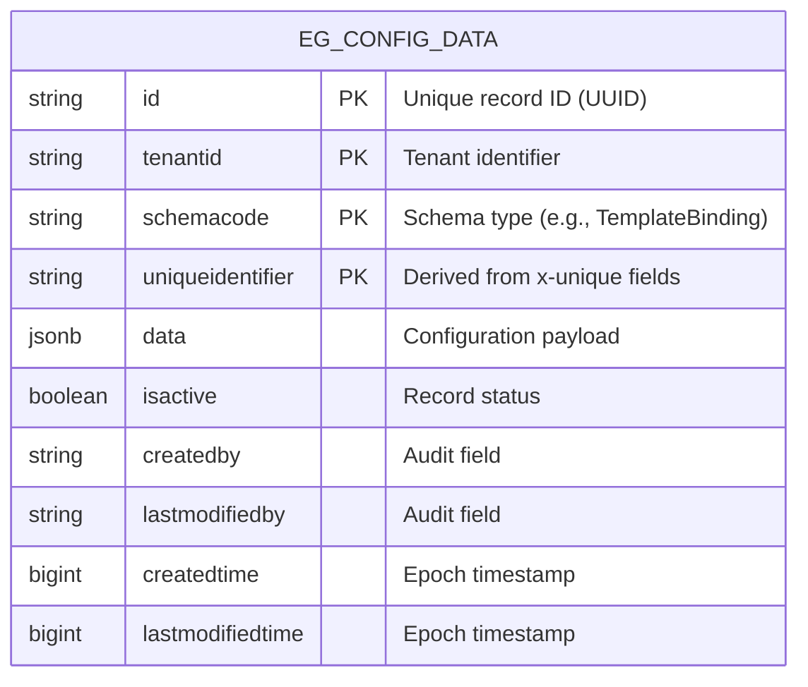
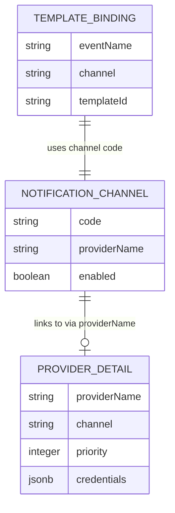

# Config Service (`digit-config-service`)

Manage schema-validated, tenant-scoped configurations for the DIGIT platform.

## Overview

A schema-validated, tenant-scoped configuration store for the DIGIT platform. It manages template bindings, provider credentials, and notification channel toggles used by the WhatsApp notification system.

## Pre-requisites

Before you proceed with the configuration, make sure the following prerequisites are met:

- Java 17
- PostgreSQL 14+
- MDMS v2 Service (running at `localhost:8083` or configured via `MDMS_V2_HOST`)

## Key Functionalities

- **Schema validation** against MDMS v2 schemas before storing data.
- **Tenant fallback resolution** via `_resolve` API (`pg.citya` -> `pg` -> `*`).
- **Field-level encryption** for sensitive fields (e.g., auth tokens) marked with `x-security` in schema.
- **Unique constraint enforcement** via `x-unique` schema fields.
- **Flyway-managed** database migrations.

## Database Diagram

### Physical Data Model
The service uses a single table `eg_config_data` to store various configuration types as JSONB, validated by their respective schemas.



### Conceptual Model
Different configuration types relate to each other to form the notification routing logic.



## Schema Setup

Before creating any configuration data, the respective schemas must be registered in the **MDMS v2 service**. The `digit-config-service` uses these to validate data and enforce constraints.

### 1. NotificationChannel Schema
Toggles notification channels (WHATSAPP, SMS, EMAIL) and links them to providers.

```json
{
  "type": "object",
  "title": "NotificationChannel",
  "$schema": "http://json-schema.org/draft-07/schema#",
  "required": [
    "code",
    "name",
    "enabled"
  ],
  "x-unique": [
    "code"
  ],
  "properties": {
    "code": {
      "type": "string",
      "enum": [
        "WHATSAPP",
        "SMS",
        "EMAIL"
      ],
      "description": "Channel identifier"
    },
    "name": {
      "type": "string",
      "description": "Human-readable channel name"
    },
    "enabled": {
      "type": "boolean",
      "description": "Whether this channel is active for the tenant"
    },
    "providerName": {
      "type": "string",
      "description": "Provider handling this channel (links to ProviderDetail)"
    },
    "priority": {
      "type": "integer",
      "description": "Dispatch priority (lower = higher priority)"
    }
  },
  "additionalProperties": true
}
```

### 2. ProviderDetail Schema
Stores credentials for notification providers (e.g., Twilio).

```json
{
  "type": "object",
  "title": "ProviderDetail",
  "$schema": "http://json-schema.org/draft-07/schema#",
  "required": [
    "providerName",
    "channel",
    "priority"
  ],
  "x-unique": [
    "providerName",
    "channel",
    "priority"
  ],
  "properties": {
    "channel": {
      "type": "string",
      "description": "Communication channel (whatsapp, sms, email)"
    },
    "isActive": {
      "type": "boolean",
      "default": true,
      "description": "Whether this provider is active"
    },
    "priority": {
      "type": "integer",
      "default": 0,
      "description": "Provider priority (lower = higher priority)"
    },
    "novuApiKey": {
      "type": "string",
      "description": "Optional provider-specific Novu API key"
    },
    "credentials": {
      "type": "object",
      "description": "Provider-specific credentials in Novu-compatible format"
    },
    "providerName": {
      "type": "string",
      "description": "Provider name (e.g., twilio, sendgrid, etc.)"
    }
  },
  "x-security": [
    "credentials",
    "novuApiKey"
  ],
  "description": "Schema for provider configurations per tenant and channel"
}
```

### 3. TemplateBinding Schema
Maps domain events to specific templates and locales.

```json
{
  "type": "object",
  "title": "TemplateBinding",
  "$schema": "http://json-schema.org/draft-07/schema#",
  "required": [
    "eventName",
    "channel",
    "templateId",
    "locale"
  ],
  "x-unique": [
    "eventName",
    "channel",
    "locale"
  ],
  "properties": {
    "locale": {
      "type": "string",
      "default": "en_IN",
      "pattern": "^[a-z]{2}_[A-Z]{2}$",
      "description": "Locale code for provider (e.g., en_IN, hi_IN, en_US)"
    },
    "channel": {
      "type": "string",
      "description": "Communication channel (whatsapp, sms, email)"
    },
    "isActive": {
      "type": "boolean",
      "default": true,
      "description": "Whether this template binding is active"
    },
    "eventName": {
      "type": "string",
      "description": "Event name (e.g., COMPLAINTS.WORKFLOW.REJECT)"
    },
    "contentSid": {
      "type": "string",
      "description": "Provider-specific content SID (for Twilio)"
    },
    "novuApiKey": {
      "type": "string",
      "description": "Optional template-specific Novu API key"
    },
    "paramOrder": {
      "type": "array",
      "items": {
        "type": "string"
      },
      "description": "Order of parameters for template"
    },
    "templateId": {
      "type": "string",
      "description": "Template identifier in Novu"
    },
    "requiredVars": {
      "type": "array",
      "items": {
        "type": "string"
      },
      "description": "Required variables for template"
    }
  },
  "x-security": [
    "novuApiKey"
  ],
  "description": "Schema for template bindings per event and channel"
}
```

## API Endpoints

**Base path:** `/config-service/config/v1`

| Endpoint | Method | Description |
|----------|--------|-------------|
| `/_create/{schemaCode}` | POST | Create a new config record |
| `/_update/{schemaCode}` | POST | Update an existing config record |
| `/_search` | POST | Search records with exact tenant match |
| `/_resolve` | POST | Resolve config with tenant hierarchy fallback |

### Resolve Logic (Fallback Mechanism)
The `/_resolve` API implements a hierarchical lookup:
1. **Specific Tenant:** e.g., `pg.citya`
2. **Parent Tenant:** e.g., `pg` (if not found in citya)
3. **Wildcard:** `*` (if not found in parent)

## Setup & Running

### Build & Run
```bash
mvn clean package -DskipTests

java -jar target/digit-config-service-0.1.0-SNAPSHOT.jar \
  --spring.datasource.url=jdbc:postgresql://localhost:5432/configdb \
  --spring.datasource.username=postgres \
  --spring.datasource.password=password
```

## Configuration Properties

| Property | Default | Description |
|----------|---------|-------------|
| `server.servlet.context-path` | `/config-service` | API context path |
| `mdms.v2.host` | `http://localhost:8083` | MDMS v2 service host |
| `encryption.service.enabled` | `false` | Enable/Disable field-level encryption |
| `state.level.tenantid` | `pg` | Tenant ID used for encryption keys |

---
### Helm Chart

Location: [`deploy-as-code/helm/charts/common-services/digit-config-service`](https://github.com/egovernments/DIGIT-DevOps/tree/sandbox-demo/deploy-as-code/helm/charts/common-services/digit-config-service)
---
*For full API details, refer to the [OpenAPI Spec](https://github.com/egovernments/Citizen-Complaint-Resolution-System/blob/develop/docs/Configs_Service/config-service.openapi.yaml).*
