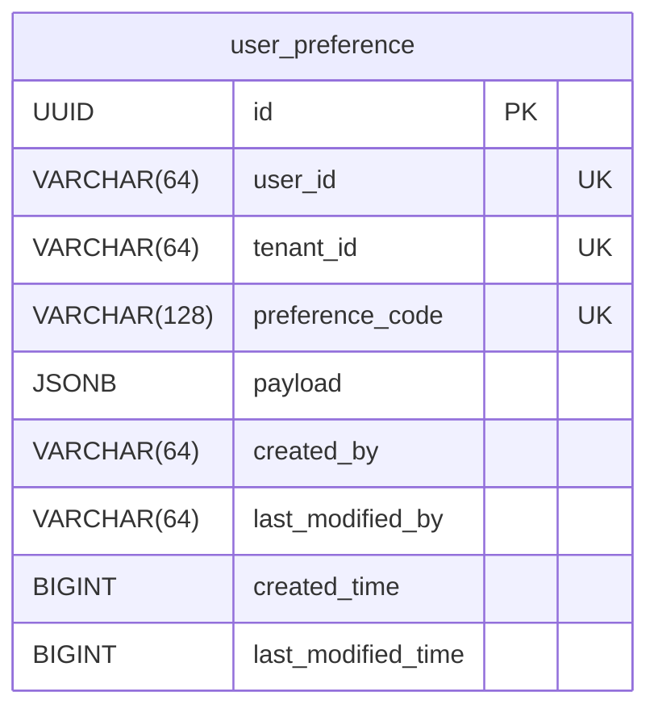

# User Preferences Service (`digit-user-preferences-service`)

Manage per-user notification preferences and consent for the DIGIT platform.

## Overview

A lightweight Go microservice that manages per-user notification preferences and consent for the DIGIT platform. It stores which notification channels a user has opted into, their preferred language, and the scope of their consent.

## Pre-requisites

Before you proceed with the configuration, make sure the following prerequisites are met:

- Go 1.23+
- PostgreSQL 12+

## Key Functionalities

- **Per-channel consent** for WhatsApp, SMS, and Email (GRANTED / REVOKED)
- **Consent scoping** — `GLOBAL` (applies everywhere) or `TENANT`-specific
- **Language preference** — stores user's preferred locale (e.g., `en_IN`, `hi_IN`, `fr_IN`, `pt_IN`)
- **Upsert semantics** — single `_upsert` endpoint handles both create and update
- **JSONB storage** — flexible payload structure, no schema migrations needed for changes
- **Auto-migration** — database table and indexes created automatically on startup

## Database Diagram



**Table:** `user_preference`

| Column | Type | Description |
|--------|------|-------------|
| `id` | UUID | Primary key |
| `user_id` | VARCHAR(64) | User's UUID |
| `tenant_id` | VARCHAR(64) | Tenant context (nullable for global) |
| `preference_code` | VARCHAR(128) | Preference category |
| `payload` | JSONB | Consent and language data |
| `created_by` / `last_modified_by` | VARCHAR(64) | Audit fields |
| `created_time` / `last_modified_time` | BIGINT | Epoch timestamps |

**Unique constraint:** `(user_id, COALESCE(tenant_id, ''), preference_code)`

### Consent Payload Structure

```json
{
  "preferredLanguage": "en_IN",
  "consent": {
    "WHATSAPP": { "status": "GRANTED", "scope": "GLOBAL" },
    "SMS": { "status": "GRANTED", "scope": "TENANT", "tenantId": "pg.citya" },
    "EMAIL": { "status": "REVOKED", "scope": "GLOBAL" }
  }
}
```

| Field | Values | Description |
|-------|--------|-------------|
| `status` | `GRANTED` / `REVOKED` | Whether user has opted in |
| `scope` | `GLOBAL` / `TENANT` | Consent scope |
| `tenantId` | string (optional) | Required when scope is `TENANT` |
| `preferredLanguage` | `en_IN`, `hi_IN`, `fr_IN`, `pt_IN` | User's locale for notifications |

## API Endpoints

**Base path:** `/user-preference/v1`

| Endpoint | Method | Description |
|----------|--------|-------------|
| `/v1/_upsert` | POST | Create or update a preference |
| `/v1/_search` | POST | Search preferences by criteria |
| `/health` | GET | Health check |

### Upsert

```bash
curl -X POST "http://<host>/user-preference/v1/_upsert" \
  -H "Content-Type: application/json" \
  -d '{
    "RequestInfo": {
      "userInfo": { "uuid": "user-uuid", "tenantId": "pg.citya" }
    },
    "preference": {
      "userId": "user-uuid",
      "tenantId": "pg.citya",
      "preferenceCode": "USER_NOTIFICATION_PREFERENCES",
      "payload": {
        "preferredLanguage": "en_IN",
        "consent": {
          "WHATSAPP": { "status": "GRANTED", "scope": "GLOBAL" },
          "SMS": { "status": "REVOKED", "scope": "GLOBAL" },
          "EMAIL": { "status": "REVOKED", "scope": "GLOBAL" }
        }
      }
    }
  }'
```

### Search

```bash
curl -X POST "http://<host>/user-preference/v1/_search" \
  -H "Content-Type: application/json" \
  -d '{
    "RequestInfo": {},
    "criteria": {
      "userId": "user-uuid",
      "tenantId": "pg.citya",
      "preferenceCode": "USER_NOTIFICATION_PREFERENCES"
    }
  }'
```

## How novu-bridge Uses This Service

1. Fetches user's `preferredLanguage` to resolve locale-specific templates
2. Checks `consent.WHATSAPP.status` — if `GRANTED`, notification proceeds; if `REVOKED`, it's skipped
3. Logs skipped notifications as `SKIPPED` in the dispatch log

## Setup

### Running Locally

```bash
# Create database (table auto-created on startup)
createdb user_preferences

# Run
go run cmd/server/main.go
```

Or with Docker:

```bash
docker-compose up -d
```

### Configuration

| Variable | Default | Description |
|----------|---------|-------------|
| `SERVER_PORT` | `8080` | HTTP port |
| `SERVER_CONTEXT_PATH` | `/user-preference` | API context path |
| `DB_HOST` | `localhost` | PostgreSQL host |
| `DB_PORT` | `5432` | PostgreSQL port |
| `DB_USER` | `postgres` | Database user |
| `DB_PASSWORD` | `` | Database password |
| `DB_NAME` | `user_preferences` | Database name |
| `DB_SSL_MODE` | `disable` | SSL mode |

### Helm Chart

Location: [`deploy-as-code/helm/charts/common-services/digit-user-preferences-service`](https://github.com/egovernments/DIGIT-DevOps/tree/sandbox-demo/deploy-as-code/helm/charts/common-services/digit-user-preferences-service)

## Resources

- [OpenAPI Spec](https://github.com/egovernments/Citizen-Complaint-Resolution-System/blob/develop/docs/WhatsApp_Bidirectional/API%20specifications/user-preferences.openapi.yaml)
