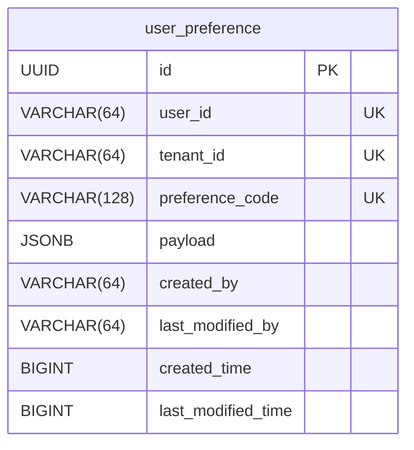

# User Preferences Service (`digit-user-preferences-service`)

Manage per-user notification preferences and consent for the DIGIT platform.

## Overview

A Spring Boot microservice that manages per-user notification preferences and consent for the DIGIT platform. It stores which notification channels a user has opted into, their preferred language, and the scope of their consent.

`novu-bridge` reads this store before every dispatch, so a preference record is what decides whether a citizen actually receives a WhatsApp, SMS or email notification, and in which language.

> **Migrated from Go.** This service was originally implemented in Go (Gin + GORM) and was rewritten in Java to match the rest of the `backend/` stack. The HTTP contract, validation rules, error codes and database schema are unchanged — see [Migration notes](#migration-notes-from-go-to-java).

## Pre-requisites

Before you proceed with the configuration, make sure the following prerequisites are met:

- Java 17
- PostgreSQL 12+

## Key Functionalities

- **Per-channel consent** for WhatsApp, SMS, and Email (GRANTED / REVOKED)
- **Consent scoping** — `GLOBAL` (applies everywhere) or `TENANT`-specific
- **Language preference** — stores the user's preferred locale (e.g., `en_IN`, `hi_IN`, `fr_IN`, `pt_IN`)
- **Upsert semantics** — a single `_upsert` endpoint handles both create and update
- **JSONB storage** — flexible payload structure, so a new preference type needs no migration
- **Flyway-managed** database migrations

## Database Diagram


```mermaid
erDiagram
    user_preference {
        UUID id PK
        VARCHAR(64) user_id "UK"
        VARCHAR(64) tenant_id "UK"
        VARCHAR(128) preference_code "UK"
        JSONB payload
        VARCHAR(64) created_by
        VARCHAR(64) last_modified_by
        BIGINT created_time
        BIGINT last_modified_time
    }
```

**Table:** `user_preference`

| Column | Type | Description |
|--------|------|-------------|
| `id` | UUID | Primary key |
| `user_id` | VARCHAR(64) | User's UUID |
| `tenant_id` | VARCHAR(64) | Tenant context (empty for global) |
| `preference_code` | VARCHAR(128) | Preference category |
| `payload` | JSONB | Consent and language data |
| `created_by` / `last_modified_by` | VARCHAR(64) | Audit fields |
| `created_time` / `last_modified_time` | BIGINT | Epoch timestamps |

**Unique constraint:** `(user_id, COALESCE(tenant_id, ''), preference_code)`

An absent `tenantId` is stored as the empty string, and the constraint coalesces NULL to `''`, so a NULL and an empty tenant are the same "global" key.

### Consent Payload Structure

```json
{
  "preferredLanguage": "en_IN",
  "consent": {
    "WHATSAPP": { "status": "GRANTED", "scope": "GLOBAL" },
    "SMS": { "status": "GRANTED", "scope": "TENANT", "tenantId": "pg.citya" },
    "EMAIL": { "status": "REVOKED", "scope": "GLOBAL" }
  }
}
```

| Field | Values | Description |
|-------|--------|-------------|
| `status` | `GRANTED` / `REVOKED` | Whether the user has opted in |
| `scope` | `GLOBAL` / `TENANT` | Consent scope |
| `tenantId` | string | Required when scope is `TENANT` |
| `preferredLanguage` | `en_IN`, `hi_IN`, `fr_IN`, `pt_IN` | The user's locale for notifications |

The payload is validated only when `preferenceCode` is `USER_NOTIFICATION_PREFERENCES`; any other code stores an arbitrary JSON document unchecked. Either way the document is stored **verbatim** — key casing and extra keys survive a round trip, which matters because consumers read `consent.WHATSAPP` with exact casing.

## API Endpoints

**Base path:** `/user-preference` (`SERVER_CONTEXT_PATH`)

| Endpoint | Method | Description |
|----------|--------|-------------|
| `/user-preference/v1/_upsert` | POST | Create or update a preference |
| `/user-preference/v1/_search` | POST | Search preferences by criteria |
| `/health` | GET | Health check |

`/health` is served at the **container root**, not under the context path. The compose healthcheck, the Kubernetes liveness/readiness probes and both Gatus catalogues all probe `/health`, so the context path is applied per-controller rather than through `server.servlet.context-path`. Actuator stays at its default `/actuator` base path.

### Upsert

```bash
curl -X POST "http://<host>/user-preference/v1/_upsert" \
  -H "Content-Type: application/json" \
  -d '{
    "RequestInfo": {
      "userInfo": { "uuid": "user-uuid", "tenantId": "pg.citya" }
    },
    "preference": {
      "userId": "user-uuid",
      "tenantId": "pg.citya",
      "preferenceCode": "USER_NOTIFICATION_PREFERENCES",
      "payload": {
        "preferredLanguage": "en_IN",
        "consent": {
          "WHATSAPP": { "status": "GRANTED", "scope": "GLOBAL" },
          "SMS": { "status": "REVOKED", "scope": "GLOBAL" },
          "EMAIL": { "status": "REVOKED", "scope": "GLOBAL" }
        }
      }
    }
  }'
```

The record is keyed on `(userId, tenantId, preferenceCode)`. A second call with the same key replaces the payload and moves `lastModifiedBy`/`lastModifiedTime`, keeping the original `id` and creation audit. The payload is **replaced, not merged**.

### Search

```bash
curl -X POST "http://<host>/user-preference/v1/_search" \
  -H "Content-Type: application/json" \
  -d '{
    "RequestInfo": {},
    "criteria": {
      "userId": "user-uuid",
      "tenantId": "pg.citya",
      "preferenceCode": "USER_NOTIFICATION_PREFERENCES"
    }
  }'
```

At least one of `userId`, `tenantId` or `preferenceCode` is required. Results are ordered newest first (`created_time DESC`); `limit` defaults to 10 and is capped at 100.

### Error Responses

Failures return the DIGIT error envelope with a capital-`Errors` list. All validation failures for a request are reported together, and one field can contribute more than one error:

```json
{
  "responseInfo": { "ts": 1707100000000, "status": "failed" },
  "Errors": [
    { "code": "INVALID_PREFERENCE_CODE", "message": "preferenceCode is required" },
    { "code": "INVALID_PREFERENCE_CODE", "message": "preferenceCode must be between 2 and 128 characters" }
  ]
}
```

| Code | Status | Raised when |
|------|--------|-------------|
| `INVALID_JSON` | 400 | The body is missing, truncated or not JSON |
| `INVALID_REQUEST_INFO` | 400 | No `RequestInfo` block |
| `INVALID_REQUEST` | 400 | No `preference` (upsert) or `criteria` (search) |
| `INVALID_USER_ID` | 400 | `userId` missing, or longer than 64 characters |
| `INVALID_TENANT_ID` | 400 | `tenantId` present but not 2–64 characters |
| `INVALID_PREFERENCE_CODE` | 400 | `preferenceCode` missing, or not 2–128 characters |
| `INVALID_PAYLOAD` | 400 | `payload` missing |
| `INVALID_PAYLOAD_FORMAT` | 400 | The payload does not match the `USER_NOTIFICATION_PREFERENCES` shape |
| `INVALID_LANGUAGE` | 400 | `preferredLanguage` outside the supported set |
| `INVALID_CONSENT_STATUS` | 400 | A channel status other than `GRANTED`/`REVOKED` |
| `INVALID_CONSENT_SCOPE` | 400 | A channel scope other than `GLOBAL`/`TENANT` |
| `MISSING_TENANT_ID` | 400 | `TENANT`-scoped consent with no `tenantId` |
| `INVALID_CRITERIA` | 400 | No search criterion supplied |
| `INVALID_LIMIT` / `INVALID_OFFSET` | 400 | Negative paging |
| `INTERNAL_ERROR` | 500 | The database is unreachable or rejected the write |

### Request Envelope Casing

The envelope key is `RequestInfo` per the DIGIT standard, but `requestInfo` is accepted too — the Go implementation matched JSON keys case-insensitively and callers settled on different spellings as a result (`novu-bridge` posts `requestInfo`, the seed scripts post `RequestInfo`). Both are supported, and unknown fields are ignored rather than rejected.

## How novu-bridge Uses This Service

1. Fetches the user's `preferredLanguage` to resolve locale-specific templates
2. Checks `consent.<CHANNEL>.status` — if `GRANTED` the notification proceeds; if `REVOKED`, absent, or unreachable for any reason, it is skipped
3. Logs skipped notifications as `SKIPPED` in the dispatch log

`novu-bridge` also exposes a read-only, allowlist-projected view of this store at `/novu-adapter/v1/preferences` for the configurator's User Preferences screen.

> `NOVU_BRIDGE_PREFERENCE_CHECK_PATH` defaults to `/user-preference/v1/_check` in the compose stack. **That endpoint does not exist** — this service exposes `_upsert` and `_search` only, and never had a `_check`. The gate is consequently disabled (`NOVU_BRIDGE_PREFERENCE_ENABLED=false`) in those deployments. To turn it on, point the check path at `/user-preference/v1/_search`. This is a pre-existing configuration gap carried over unchanged by the migration, not something it introduced.

## Setup

### Build & Run

```bash
mvn clean package
java -jar target/digit-user-preferences-service-*.jar
```

Or with Docker:

```bash
docker-compose up -d
```

### Testing

```bash
# Unit + integration tests (H2 in-memory, no PostgreSQL required)
mvn test

# End-to-end acceptance run against a live instance; exits non-zero on failure
BASE_URL=http://localhost:8080 ./test_apis.sh
```

`mvn test` covers the API surface in-process against H2. `test_apis.sh` is the same contract asserted over real HTTP, and is what to run against a deployment — it also exercises paths H2 cannot, notably the `jsonb` and `uuid` column casts.

### Configuration

The `DB_*` and `SERVER_*` variables are the ones the Helm chart and the compose stack already set, and are honoured unchanged. The Spring-native `SPRING_DATASOURCE_*` forms take precedence where both are present.

| Variable | Default | Description |
|----------|---------|-------------|
| `SERVER_PORT` | `8080` | HTTP port |
| `SERVER_CONTEXT_PATH` | `/user-preference` | API context path (does not move `/health`) |
| `SERVER_READ_TIMEOUT` | `15s` | Tomcat connection timeout |
| `SERVER_WRITE_TIMEOUT` | — | Accepted and ignored: Tomcat exposes no response-write deadline |
| `SERVER_SHUTDOWN_TIMEOUT` | `30s` | Graceful shutdown budget |
| `DB_HOST` | `localhost` | PostgreSQL host |
| `DB_PORT` | `5432` | PostgreSQL port |
| `DB_NAME` | `user_preferences` | Database name |
| `DB_USER` | `postgres` | Database user |
| `DB_PASSWORD` | `` | Database password |
| `DB_SSL_MODE` | `disable` | JDBC `sslmode` |
| `DB_MAX_CONNS` | `25` | Hikari maximum pool size |
| `DB_MIN_CONNS` | `5` | Hikari minimum idle |
| `DB_MAX_CONN_LIFETIME` | `1h` | Hikari max lifetime (`1h`, `30m`, or plain milliseconds) |
| `DB_MAX_CONN_IDLE_TIME` | `30m` | Hikari idle timeout (same formats) |
| `SPRING_DATASOURCE_URL` | derived from `DB_*` | Full JDBC URL, overriding the `DB_*` parts |
| `SPRING_FLYWAY_ENABLED` | `true` | Set `false` where a migration init container owns the schema |
| `SPRING_FLYWAY_TABLE` | `digit_user_preferences_service_schema` | Flyway history table |
| `APP_TIMEZONE` | `UTC` | JVM default timezone |

Deployments share one `egov` database, so the Flyway history table is namespaced per service and the schema is owned by the `digit-user-preferences-service-db` init container (`SPRING_FLYWAY_ENABLED=false` on the app). The embedded Flyway is on by default so a standalone run still creates its own schema.

### Helm Chart

Location: [`devops/deploy-as-code/charts/common-services/digit-user-preferences-service`](../../devops/deploy-as-code/charts/common-services/digit-user-preferences-service)

## Migration notes: from Go to Java

The rewrite is behaviour-preserving. Worth knowing:

- **Schema unchanged.** The same `V20260205120000__create_user_preference.sql` migration is now applied by Flyway instead of GORM's `AutoMigrate`. On a database the Go service created, Flyway baselines the existing schema and the migration's `IF NOT EXISTS` statements add the indexes AutoMigrate never created — including the unique index on `(user_id, COALESCE(tenant_id, ''), preference_code)`. If such a database somehow holds duplicate rows under that key, creating the index will fail and the duplicates must be resolved first.
- **Wire contract unchanged**, down to which keys are omitted: `responseInfo` is lower-camel, the error list is capital-`Errors`, `resMsgId` is never sent, and a zero `offset`/`totalCount` is omitted from `pagination`. `WireContractTest` pins the serialized JSON byte for byte.
- **Pool durations still accept Go spellings.** `DB_MAX_CONN_LIFETIME=1h` would be rejected by Hikari's own millisecond-typed property, so these are bound to `Duration` in `DataSourceConfig`.
- **`userInfo.id` still accepts a number or a string** (`FlexibleStringDeserializer`), as Go's `FlexibleString` did.
- **Strict payload parsing.** Scalar coercion is switched off for the notification payload so `"status": 5` fails as `INVALID_PAYLOAD_FORMAT` rather than being widened to `"5"` and reported as an invalid status. Jackson would otherwise be more permissive than Go here.
- **Routing failures keep their status.** An unknown path is a 404 and a wrong method a 405, wrapped in the DIGIT error envelope. Gin returned a plain-text 404; nothing keys on that body.
- **Dropped as unreachable:** the repository's unused `Delete` helper, the never-thrown `ErrNotFound` (404) branch, a `json.Valid` check on a payload that had already been parsed, and the `sortBy`/`order` pagination fields the shared Go struct carried but nothing ever set (always omitted, so the response is unchanged). The Go service's duplicated page-size clamp — applied in both the service and the repository — is applied once, in the enricher.
- **Identity is still taken from the request body.** `preference.userId` and `criteria.userId` come from the caller, not from the auth token, which the token uuid is used only for audit. That is the Go behaviour, preserved deliberately; closing it is tracked in [`docs/dashboard-rbac-design/50-packs-config-ownership.md`](../../docs/dashboard-rbac-design/50-packs-config-ownership.md) as a gateway/BFF concern, since a change here would alter the contract for every existing caller.

## Resources

- [Novu notifications guide](../../docs/2.12/notifications/README.md)
- Issue [#1982](https://github.com/egovernments/Citizen-Complaint-Resolution-System/issues/1982) — Migrate user-preferences-service to the current platform stack
