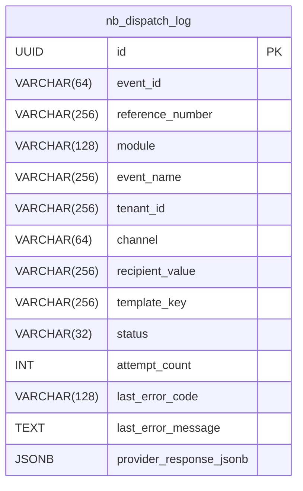

# Novu Bridge (`novu-bridge`)

Manage central notification orchestration for the DIGIT platform.

## Overview

The central notification orchestrator for the DIGIT platform. It consumes domain events from Kafka, checks user consent, resolves the right template and provider from config-service, and triggers Novu (which delivers via Twilio to WhatsApp).

## Pre-requisites

Before you proceed with the configuration, make sure the following prerequisites are met:

- Java 17
- PostgreSQL
- Kafka / Redpanda
- Novu self-hosted (API at port 3000)
- Config Service running
- User Preferences Service running

## Key Functionalities

- **Module-agnostic** — any module publishing domain events to Kafka can trigger notifications
- **Consent-first** — checks user preferences before sending; skips if consent not granted
- **Multi-locale** — resolves templates based on user's preferred language
- **Provider strategy** — Twilio-specific logic via strategy pattern, extensible for new providers
- **Retry + DLQ** — failed events are retried, then moved to dead-letter queue
- **Dispatch audit log** — every event logged with status, errors, and provider response
- **Diagnostic endpoints** — `_validate`, `_dry-run`, `_test-trigger` for debugging

## Database Diagram



## Processing Pipeline

```
 1. Validate event       (eventId, eventName, tenantId, workflow.toState)
 2. Derive context       (audience, recipient mobile, userId, locale)
 3. Resolve locale       (query user-preferences for preferred language)
 4. Check consent        (query user-preferences for WhatsApp consent)
 5. Resolve template     (query config-service _resolve for TemplateBinding)
 6. Resolve provider     (query config-service _search for ProviderDetail)
 7. Validate vars        (ensure all requiredVars present in event data)
 8. Format phone         (add country prefix for WhatsApp)
 9. Build overrides      (contentSid + contentVariables from paramOrder)
10. Trigger Novu         (POST /v1/events/trigger)
11. Persist log          (upsert to nb_dispatch_log)
```

**Table:** `nb_dispatch_log`

| Column | Type | Description |
|--------|------|-------------|
| `id` | UUID | Primary key |
| `event_id` | VARCHAR(64) | Domain event ID |
| `reference_number` | VARCHAR(256) | Business reference (e.g., complaint number) |
| `module` | VARCHAR(128) | Source module (e.g., `Complaints`) |
| `event_name` | VARCHAR(256) | Event name (e.g., `COMPLAINTS.WORKFLOW.APPLY`) |
| `tenant_id` | VARCHAR(256) | Tenant ID |
| `channel` | VARCHAR(64) | Notification channel (`WHATSAPP`) |
| `recipient_value` | VARCHAR(256) | Recipient's mobile number |
| `template_key` | VARCHAR(256) | Novu workflow ID used |
| `status` | VARCHAR(32) | `SENT`, `FAILED`, `SKIPPED`, or `RECEIVED` |
| `attempt_count` | INT | Number of delivery attempts |
| `last_error_code` | VARCHAR(128) | Error code if failed |
| `last_error_message` | TEXT | Error details |
| `provider_response_jsonb` | JSONB | Raw Novu API response |

**Status values:**

| Status | Meaning |
|--------|---------|
| `SENT` | Novu trigger succeeded (201) |
| `FAILED` | Processing error |
| `SKIPPED` | User consent not granted |
| `RECEIVED` | Dry-run mode (no actual send) |

## Domain Event Structure

Any module can trigger notifications by publishing this event to the configured Kafka topic:

```json
{
  "eventId": "unique-uuid",
  "eventType": "DOMAIN_EVENT",
  "eventName": "COMPLAINTS.WORKFLOW.APPLY",
  "tenantId": "pg.citya",
  "module": "Complaints",
  "entityType": "COMPLAINT",
  "entityId": "PG-PGR-2026-03-25-043118",
  "workflow": { "toState": "PENDINGFORASSIGNMENT" },
  "stakeholders": [
    { "mobile": "9123456789", "userId": "user-uuid", "type": "CITIZEN" }
  ],
  "data": {
    "complaintNo": "PG-PGR-2026-03-25-043118",
    "status": "PENDINGFORASSIGNMENT",
    "serviceName": "Burning of garbage",
    "citizenName": "Jane Doe",
    "departmentName": "DEPT_3"
  }
}
```

**Required fields:** `eventId`, `eventName`, `tenantId`, `workflow.toState`, `stakeholders`

The `data` map must include all variables listed in the TemplateBinding's `requiredVars`.

## API Endpoints

**Base path:** `/novu-bridge/novu-adapter/v1/dispatch`

| Endpoint | Method | Description |
|----------|--------|-------------|
| `/_validate` | POST | Full pipeline without sending — checks config, consent, vars |
| `/_dry-run?send=true` | POST | Full pipeline with optional actual send |
| `/_test-trigger` | POST | Direct Novu trigger, bypasses consent and config |

### Test Trigger Example

```bash
curl -X POST "http://<host>/novu-bridge/novu-adapter/v1/dispatch/_test-trigger" \
  -H "Content-Type: application/json" \
  -d '{
    "RequestInfo": {},
    "templateKey": "complaints-workflow-apply",
    "subscriberId": "pg.citya:user-uuid",
    "phone": "whatsapp:+916307817430",
    "payload": { "complaintNo": "TEST-001", "status": "PENDING" },
    "transactionId": "test-001",
    "contentSid": "HX350aa0b139780ea87f554276b1f68d6c",
    "contentVariables": { "1": "Service Name", "2": "TEST-001", "3": "25-Mar-2026" }
  }'
```

## Kafka Topics

| Topic | Purpose |
|-------|---------|
| `complaints.domain.events` (configurable) | Input — domain events to process |
| `novu-bridge.retry` | Retry queue for failed events |
| `novu-bridge.dlq` | Dead-letter queue after all retries exhausted |

## Setup

### Database

Create a database (e.g., `egov`). Flyway auto-creates the `nb_dispatch_log` table.

### Bootstrap Novu

Before starting novu-bridge, bootstrap Novu with the Twilio integration and workflows.

**Step 1:** Ensure Novu self-hosted is running (API at `http://localhost:3000`).

**Step 2:** Get your Novu API key. Register via the API if you haven't already:

```bash
# Register (first time only)
curl -s -X POST http://localhost:3000/v1/auth/register \
  -H "Content-Type: application/json" \
  -d '{
    "firstName": "Admin",
    "lastName": "User",
    "email": "admin@example.com",
    "password": "YourPassword@123",
    "organizationName": "your-org"
  }' | jq .token

# Get API key using the token from above
curl -s http://localhost:3000/v1/environments \
  -H "Authorization: Bearer <token>" | jq '.[].apiKeys'
```

**Step 3:** Edit `.env.novu` with your credentials:

```bash
cd novu-bridge/config
cp .env.novu .env.novu.local
vi .env.novu.local
```

Fill in these required values:

```bash
NOVU_BASE_URL=http://localhost:3000
NOVU_API_KEY=<your-novu-api-key>

TWILIO_ACCOUNT_SID=<your-twilio-account-sid>
TWILIO_AUTH_TOKEN=<your-twilio-auth-token>
TWILIO_WHATSAPP_FROM=whatsapp:+<your-sender-number>
```

Optional — customize workflows to create:

```bash
NOVU_EVENT_WORKFLOWS=COMPLAINTS.WORKFLOW.APPLY,COMPLAINTS.WORKFLOW.ASSIGN,COMPLAINTS.WORKFLOW.RESOLVE,COMPLAINTS.WORKFLOW.REJECT,COMPLAINTS.WORKFLOW.REASSIGN,COMPLAINTS.WORKFLOW.REOPEN,COMPLAINTS.WORKFLOW.RATE
```

**Step 4:** Run the bootstrap script:

```bash
# Requires: curl, jq
NOVU_ENV_FILE=.env.novu.local bash bootstrap-novu-whatsapp.sh
```

**What it creates:**
- Novu environment (`digit-dev`)
- Twilio SMS integration with WhatsApp credentials
- One workflow per event listed in `NOVU_EVENT_WORKFLOWS`

**Step 5:** Verify:

```bash
# Check workflows
curl -s "http://localhost:3000/v2/workflows?limit=100" \
  -H "Authorization: ApiKey $NOVU_API_KEY" | jq '.workflows[].workflowId'

# Check Twilio integration
curl -s "http://localhost:3000/v1/integrations" \
  -H "Authorization: ApiKey $NOVU_API_KEY" | jq '.[] | {identifier, channel, active}'
```

**Updating Twilio credentials later:**

```bash
# Get integration ID
curl -s "http://localhost:3000/v1/integrations" \
  -H "Authorization: ApiKey $NOVU_API_KEY" | jq '.[] | select(.identifier=="twilio-whatsapp") | ._id'

# Update credentials
curl -X PUT "http://localhost:3000/v1/integrations/<integration-id>" \
  -H "Authorization: ApiKey $NOVU_API_KEY" \
  -H "Content-Type: application/json" \
  -d '{
    "credentials": {
      "accountSid": "<new-sid>",
      "token": "<new-token>",
      "from": "whatsapp:+<new-number>"
    }
  }'
```

### Kafka Topics

Create topics if they don't exist:

```bash
rpk topic create complaints.domain.events novu-bridge.retry novu-bridge.dlq --brokers <broker>
```

### Running Locally

```bash
mvn clean package -DskipTests

NOVU_API_KEY=<your-key> java -jar target/novu-bridge-*.jar
```

### Configuration

| Property | Default | Description |
|----------|---------|-------------|
| `server.servlet.context-path` | `/novu-bridge` | API context path |
| `spring.kafka.bootstrap-servers` | `localhost:9092` | Kafka broker |
| `novu.bridge.kafka.input.topic` | `complaints.domain.events` | Input topic |
| `novu.bridge.kafka.retry.topic` | `novu-bridge.retry` | Retry topic |
| `novu.bridge.kafka.dlq.topic` | `novu-bridge.dlq` | DLQ topic |
| `novu.bridge.max.retries` | `3` | Max retries before DLQ |
| `novu.bridge.channel` | `WHATSAPP` | Default channel |
| `novu.bridge.default.locale` | `en_IN` | Fallback locale |
| `novu.bridge.config.host` | `http://digit-config-service.egov:8080` | Config service URL |
| `novu.bridge.preference.host` | `http://digit-user-preferences-service.egov:8080/user-preference` | Preferences service URL |
| `novu.bridge.preference.enabled` | `true` | Enable/disable consent check |
| `novu.base.url` | `http://novu-api.novu:3000` | Novu API URL |
| `novu.api.key` | (env `NOVU_API_KEY`) | Novu API key |
| `spring.datasource.url` | `jdbc:postgresql://localhost:5432/egov` | Database URL |
| `novu.bridge.dispatch.log.enabled` | `true` | Enable dispatch logging |

### Helm Chart

Location: [`deploy-as-code/helm/charts/common-services/novu-bridge`](https://github.com/egovernments/DIGIT-DevOps/tree/sandbox-demo/deploy-as-code/helm/charts/common-services/novu-bridge)

## System Flow

```
                                    ┌──────────────────────┐
                            ┌──────▶│  User Preferences    │
                            │  (1)  │  - Check consent     │
                            │       │  - Get locale        │
                            │       └──────────────────────┘
┌────────────┐   Kafka   ┌──┴───────────┐                    ┌──────────────────────┐
│ Your       │──────────▶│  Novu Bridge  │───────────────────▶│  Config Service      │
│ Module     │  events   │               │  (2)               │  - Resolve template  │
└────────────┘           └───────┬───────┘                    │  - Get provider      │
                                 │                            └──────────────────────┘
                                 │ (3) Trigger
                                 ▼
                           ┌───────────┐   Twilio   ┌───────────┐
                           │   Novu    │───────────▶│ WhatsApp  │
                           │           │            │ User      │
                           └───────────┘            └───────────┘
```

1. **Your Module** publishes a domain event to Kafka
2. **Novu Bridge** checks consent (1), resolves template + provider (2), triggers Novu (3)
3. **Novu** delivers via Twilio to WhatsApp

## Resources

- [OpenAPI Spec](https://github.com/egovernments/Citizen-Complaint-Resolution-System/blob/develop/docs/Novu_Adapter/novu-adapter.openapi.yaml)
- [Novu Bootstrap Script](config/bootstrap-novu-whatsapp.sh)
- [Bootstrap Postman Collection](config/Novu-Bootstrap.postman_collection.json)
