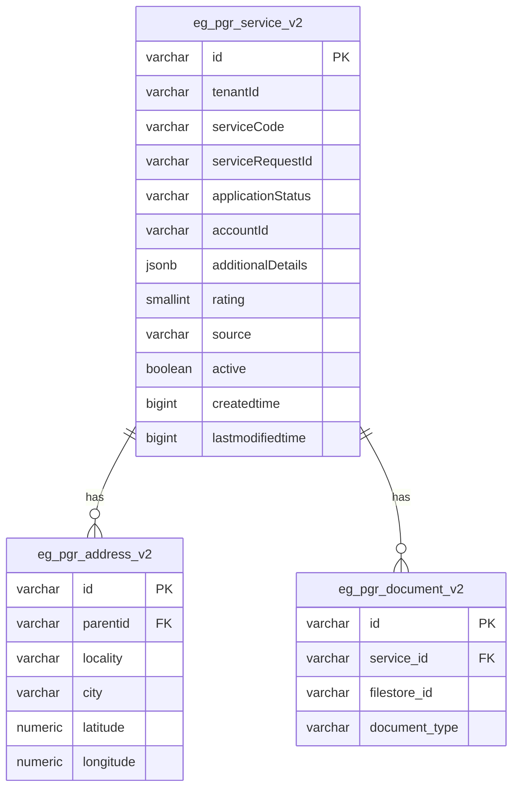

# PGR Service

The PGR (Public Grievance Redressal) service enables citizens to raise, track, and resolve complaints. Employees can assign, reassign, reject, or resolve complaints through a configurable workflow.

> **DIGIT 3.0 Migration in progress** — see [`DIGIT3-MIGRATION.md`](./DIGIT3-MIGRATION.md) for full details of what changed, impact on dependent services, and how to run on the new platform.

---

## Service Overview

- Citizens raise complaints with a service code, description, address, and optional documents
- Complaints move through a workflow: `PENDINGFORASSIGNMENT → PENDINGATLME → RESOLVED / REJECTED`
- Citizens can rate resolved complaints or re-open within a configurable idle window
- Escalation scheduler auto-escalates SLA-breached complaints
- Dashboard and analytics endpoints provide KPI data

---

## API Endpoints

`BasePath`: `/pgr-services/v2`

| Method | Path | Description |
|---|---|---|
| POST | `/request/_create` | Raise a complaint |
| POST | `/request/_update` | Update / transition a complaint |
| POST | `/request/_search` | Search complaints |
| POST | `/request/_plainsearch` | Inter-service plain search |
| POST | `/request/_count` | Count complaints |
| GET | `/dashboard` | Dashboard KPIs |
| POST | `/analytics/_query` | Dynamic analytics |

---

## Service Dependencies

### DIGIT 3.0 (current branch: `pgr-on-digit3`)
- Registry service
- Workflow service
- IdGen service
- Boundary service
- Individual service
- Filestore service
- Redis (cache)
- Keycloak (auth)

### DIGIT 2.x (branch: `develop`)
- egov-idgen, egov-mdms, egov-user, egov-workflow-v2
- egov-hrms, egov-localization, egov-url-shortening
- Kafka + Persister

---

## Data Model

---

## Configurable Properties

| Property | Description | Default |
|---|---|---|
| `pgr.complain.idle.time` | Window (ms) within which citizen can reopen | `864000000` |
| `pgr.default.limit` | Default search page size | `100` |
| `pgr.search.max.limit` | Max records per search | `200` |
| `pgr.escalation.enabled` | Enable/disable escalation scheduler | `true` |
| `pgr.escalation.default.sla.ms` | Default SLA before escalation | `432000000` |
| `pgr.dashboard.refresh.enabled` | Enable/disable MV refresh scheduler | `true` |
| `notification.sms.enabled` | Enable/disable SMS notifications | `true` |
| `complaints.domain.events.enabled` | Enable/disable domain event publishing | `true` |

---

## Further Reading

- [`DIGIT3-MIGRATION.md`](./DIGIT3-MIGRATION.md) — full migration guide (what changed, impact, TODOs)
- [`LOCALSETUP.md`](./LOCALSETUP.md) — how to run locally
- [`CHANGELOG.md`](./CHANGELOG.md) — version history
