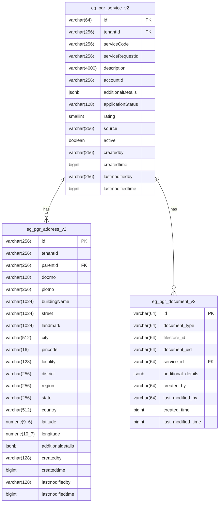

# PGR Service
The objective of this service is to provide a functionality to raise a complaint/grievance by citizen in the system. The progress of complaint/grievance can be tracked by
the citizen and will be updated by notifications whenever the status of the complaint progresses further.
### DB UML Diagram

### Service Dependencies
- egov-user
- egov-localization
- egov-idgen
- mdms-v2
- egov-persister
- egov-notification-sms
- egov-notification-mail
- egov-hrms
- egov-workflow-v2
- egov-url-shortening

### Swagger API Contract
- Please refer to the [Swagger API contarct](https://raw.githubusercontent.com/egovernments/municipal-services/master/docs/pgr-services.yml) for PGR service to understand the structure of APIs and to have visualization of all internal APIs.

## Service Details
**Details of all the entities involved:**

**a) PGREntity:** The top level wrapper object containing the Service and Workflow

**b) Service:** The Service object contains the details of the complaint including the owner of the complaint.

**c) Workflow:** The Workflow object contains the action which is to be performed on the complaint and other associated inforamtion like documents and comments given while performing the action.

**d) Citizen:** The Citizen object is of type(class) User  and contains the info about the person who has filed the complaint or on whose behalf the complaint is filled.

**e) Address:** Captures details of the address of the complaint.

**Notification:**
- Notification is sent to the phone number of the citizen who has been created in the system. This is an SMS notification.

### Configurable properties

| Environment Variables                     | Description                                                                                                                                               | Value                                             |
| ----------------------------------------- | ----------------------------------------------------------------------------------------------------------------------------------------------------------|---------------------------------------------------|
| `pgr.complain.idle.time`                  | The time after which the citizen cannot re-open the complaint.                                                                                            | 864000000                                         |
| `pgr.default.offset`                      | The default offset in any search                                                                                                                          | 0                                                 |
| `pgr.default.limit`                       | The default limit in any search call.                                                                                                                     | 100                                               |
| `pgr.search.max.limit`                    | The maximum number of record returned in any search call                                                                                                  | 200                                               |
| `notification.sms.enabled`                | Switch to enable/disable sms notification                                                                                                                 | true                                              |
| `egov.user.event.notification.enabled`    | Switch to enable/disable event notification                                                                                                               | true                                              |
### API Details

`BasePath` /pgr-services/v2/[API endpoint]

##### Method
**a) Create Complaint `POST /_create` :** API to create/raise a complaint in the system

**b) Update Complaint `POST /_update` :** API to update the details of complaint.(Used primarily to perform actions on the complaint)

**c) Search Complaints `POST /_search` :** API to search the complaints based on certain predefined params. Default offset and limit will be applied on every search call if not provided in the search call

**c) Count Complaints `POST /_search` :** API to return the count of total number of complaints satisfying the given criteria

### Kafka Consumers

- NA

### Kafka Producers

- Following are the Producer topic.
    - **save-pgr-request** :- This topic is used to create new complaint in the system.
    - **update-pgr-request** :- This topic is used to update the existing complaint in the systen.

### note
all master data, localisation data, boundary data, users, employees, workflow config will be update by a service in utilities/default-data-handler which update all these data which is maintained in resource folder.

and all the configs which are required for pgr are maintained in configs folder.