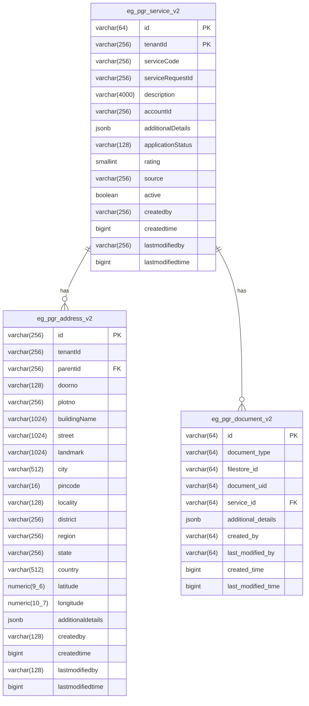

# PGR Service
The objective of this service is to provide a functionality to raise a complaint/grievance by citizen in the system. The progress of complaint/grievance can be tracked by
the citizen and will be updated by notifications whenever the status of the complaint progresses further.
### DB UML Diagram

```mermaid
erDiagram
    eg_pgr_service_v2 {
        varchar(64)  id PK
        varchar(256) tenantId PK
        varchar(256) serviceCode
        varchar(256) serviceRequestId
        varchar(4000) description
        varchar(256) accountId
        jsonb        additionalDetails
        varchar(128) applicationStatus
        smallint     rating
        varchar(256) source
        boolean      active
        varchar(256) createdby
        bigint       createdtime
        varchar(256) lastmodifiedby
        bigint       lastmodifiedtime
    }

    eg_pgr_address_v2 {
        varchar(256) id PK
        varchar(256) tenantId
        varchar(256) parentid FK
        varchar(128) doorno
        varchar(256) plotno
        varchar(1024) buildingName
        varchar(1024) street
        varchar(1024) landmark
        varchar(512) city
        varchar(16)  pincode
        varchar(128) locality
        varchar(256) district
        varchar(256) region
        varchar(256) state
        varchar(512) country
        numeric(9_6) latitude
        numeric(10_7) longitude
        jsonb        additionaldetails
        varchar(128) createdby
        bigint       createdtime
        varchar(128) lastmodifiedby
        bigint       lastmodifiedtime
    }

    eg_pgr_document_v2 {
        varchar(64) id PK
        varchar(64) document_type
        varchar(64) filestore_id
        varchar(64) document_uid
        varchar(64) service_id FK
        jsonb       additional_details
        varchar(64) created_by
        varchar(64) last_modified_by
        bigint      created_time
        bigint      last_modified_time
    }

    eg_pgr_service_v2 ||--o{ eg_pgr_address_v2 : "has"
    eg_pgr_service_v2 ||--o{ eg_pgr_document_v2 : "has"
```

### Service Dependencies
- egov-user
- egov-idgen
- mdms-v2
- egov-persister
- egov-hrms
- egov-workflow-v2
- egov-url-shortening
- novu-bridge (asynchronous, over Kafka — see **Notification** below)

Two dependencies the service no longer has: **egov-localization** and
**digit-user-preferences-service**. Both went to `novu-bridge` with the notification rendering half;
pgr-services publishes localization *codes* and never resolves a message or a recipient's preferred
language itself.

### Swagger API Contract
- Please refer to the [Swagger API contarct](https://raw.githubusercontent.com/egovernments/municipal-services/master/docs/pgr-services.yml) for PGR service to understand the structure of APIs and to have visualization of all internal APIs.

## Service Details
**Details of all the entities involved:**

**a) PGREntity:** The top level wrapper object containing the Service and Workflow

**b) Service:** The Service object contains the details of the complaint including the owner of the complaint.

**c) Workflow:** The Workflow object contains the action which is to be performed on the complaint and other associated inforamtion like documents and comments given while performing the action.

**d) Citizen:** The Citizen object is of type(class) User  and contains the info about the person who has filed the complaint or on whose behalf the complaint is filled.

**e) Address:** Captures details of the address of the complaint.

**Notification:**

pgr-services is a notification **producer** and nothing more. On every workflow transition it
publishes exactly **one thin domain event** to `complaints.domain.events`, and `novu-bridge` decides
the rest: who to tell, on which channels, in which language, what the words are, and how to deliver
them. There is no flag — the routing, recipient-resolution and rendering code was deleted, not
disabled, so which path a deployment is on is a property of the image it runs. Rolling back means
redeploying the previous image; the bridge accepts both kinds forever.

What the producer puts on the event:

| Block | What it carries |
|---|---|
| `eventName` / `ledgerEventName` | `COMPLAINTS.WORKFLOW.<ACTION>.<TOSTATE>` is the config key routing and templates are chosen by; `COMPLAINTS.WORKFLOW.<ACTION>` is the operator-facing label written to every ledger row |
| `transactionSeed` | `<complaintNo>:<action>:<toState>`, which the bridge completes into `…:<subscriberId>:<channel>` — byte-identical to the transaction ids this service used to mint, so a redeploy mid-flight cannot double-send |
| `actors` | the citizen (inline, because the complaint holds the contact it was filed with) and the assignee (uuid only, so the bridge hydrates and no employee phone number reaches Kafka) |
| `data` | the placeholder values that need PGR context: complaint number, date, raw service code and status, comments, rating, citizen name, the shortened download link, the assignee's name |
| `localized` | localization **codes** for the tokens whose words depend on the reader's language — `complaint_type`, `status`, `ulb`, `ao_designation`, and the HRMS × MDMS department/designation pair — resolved by the bridge once per recipient locale |

Two rules in that table are load-bearing and easy to lose: a token the producer cannot fill is
**omitted** rather than blanked (an empty variable is what a provider rejects), and
`download_link` is the one exception — blanked to `""` on a shortener outage, because a message
containing the literal text `{download_link}` must never ship.

The wire format is a published contract:
[`docs/2.12/notifications/contract/thin-event-v1.schema.json`](../../docs/2.12/notifications/contract/thin-event-v1.schema.json)
with worked examples under
[`contract/examples/thin/`](../../docs/2.12/notifications/contract/examples/thin/). For how the whole
subsystem fits together, and for adding a *second* producer module (which needs no notification code
at all), see the
[notifications developer guide](../../docs/2.12/notifications/developer-guide.md).

The producer is pinned from the test side by
`src/test/resources/golden/golden-thin-events.json` — 26 scenarios, one event each, checked both
against the real service and against a mirror of novu-bridge's own executable spec. See that
folder's `README.md` before touching anything in the notification path.

### Configurable properties

| Environment Variables                     | Description                                                                                                                                               | Value                                             |
| ----------------------------------------- | ----------------------------------------------------------------------------------------------------------------------------------------------------------|---------------------------------------------------|
| `pgr.complain.idle.time`                  | **Fallback only.** The reopen window is MDMS `RAINMAKER-PGR.UIConstants.REOPENSLA`, per tenant; this applies only when MDMS has no usable value. Do not set `PGR_COMPLAIN_IDLE_TIME` — see `docs/reopen-window.md`. | 259200000                                         |
| `pgr.default.offset`                      | The default offset in any search                                                                                                                          | 0                                                 |
| `pgr.default.limit`                       | The default limit in any search call.                                                                                                                     | 100                                               |
| `pgr.search.max.limit`                    | The maximum number of record returned in any search call                                                                                                  | 200                                               |
| `notification.sms.enabled`                | Switch to enable/disable sms notification                                                                                                                 | true                                              |
| `egov.user.event.notification.enabled`    | Switch to enable/disable event notification                                                                                                               | true                                              |
| `kafka.topics.complaints.domain.events`   | Topic the thin notification event is published to; `novu-bridge` consumes it and dispatches on the event's `kind`                                          | complaints.domain.events                          |
| `pgr.notification.mdms.cache.ttl.ms`      | Shared MDMS cache window (SLA map, reopen window, department code→name). Named for the notification masters it was introduced for; those are novu-bridge's now | 60000                                          |

Dropped at the thin-event cutover, and safe to remove from any deployment file that still sets them:
`pgr.notification.default.locale`, `pgr.notification.rolepool.page.size`,
`pgr.notification.rolepool.max.pages`, `pgr.notification.locale.per.recipient`,
`pgr.notification.preference.code`, `egov.user.preference.host`,
`egov.user.preference.search.path`.
### API Details

`BasePath` /pgr-services/v2/[API endpoint]

##### Method
**a) Create Complaint `POST /_create` :** API to create/raise a complaint in the system

**b) Update Complaint `POST /_update` :** API to update the details of complaint.(Used primarily to perform actions on the complaint)

**c) Search Complaints `POST /_search` :** API to search the complaints based on certain predefined params. Default offset and limit will be applied on every search call if not provided in the search call

**c) Count Complaints `POST /_search` :** API to return the count of total number of complaints satisfying the given criteria

### Kafka Consumers

- **save-pgr-request / update-pgr-request** (pattern `pgr.kafka.notification.topic.pattern`) :-
  `NotificationConsumer` reads every complaint transition back off its own topics and publishes the
  thin notification event for it.

### Kafka Producers

- Following are the Producer topic.
    - **save-pgr-request** :- This topic is used to create new complaint in the system.
    - **update-pgr-request** :- This topic is used to update the existing complaint in the systen.
    - **complaints.domain.events** :- One thin notification event per workflow transition, consumed
      by `novu-bridge`.

### note
all master data, localisation data, boundary data, users, employees, workflow config will be update by a service in utilities/default-data-handler which update all these data which is maintained in resource folder.

and all the configs which are required for pgr are maintained in configs folder.