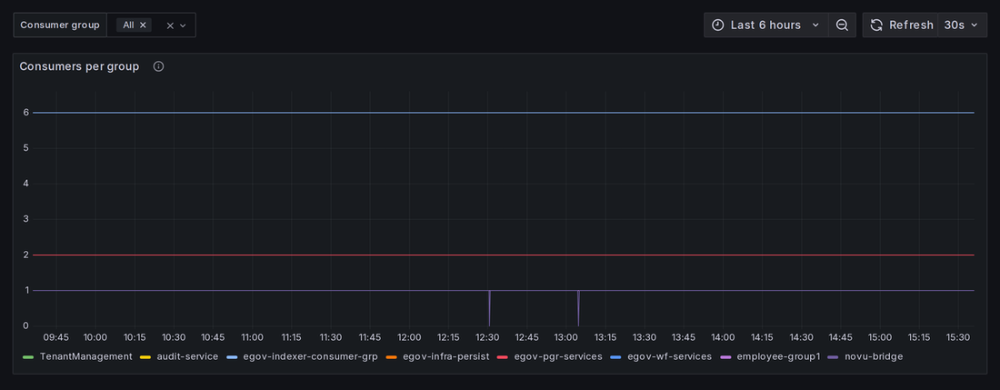
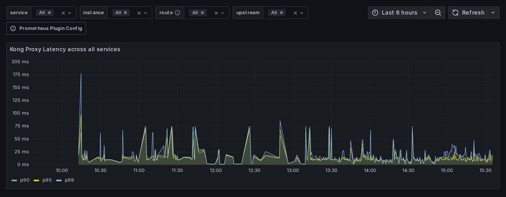
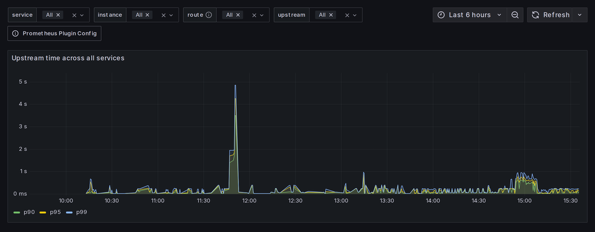

# The Grafana dashboards

What each dashboard shows, which panels to read, and what a reading means.

This page was split out of [reference.md](reference.md) when the deployment grew from four
dashboards to nine. It is the page to have open at a desk; reference.md is the lookup.

← back to **[Operations handbook](README.md)**

---

## Contents

- [First, the words on every screen](#first-the-words-on-every-screen)
- [The nine dashboards, and who reads them](#the-nine-dashboards-and-who-reads-them)
- [Dashboards written for DIGIT](#dashboards-written-for-digit)
  - [DIGIT JVM Services](#digit-jvm-services--grafanaddigit-jvm)
  - [DIGIT — Logs (Loki)](#digit--logs-loki--grafanaddigit-loki-logs)
  - [DIGIT — Traces (Tempo)](#digit--traces-tempo--grafanaddigit-tempo-traces)
  - [DIGIT Kafka Consumer Lag](#digit-kafka-consumer-lag--grafanadkafka-consumer-lag)
  - [DIGIT — PGR Analytics Queries](#digit--pgr-analytics-queries--grafanadpgr-analytics)
- [Dashboards imported from the community](#dashboards-imported-from-the-community)
  - [Node Exporter Full](#node-exporter-full--grafanadnode-exporter-full)
  - [PostgreSQL Database](#postgresql-database--grafanadpostgres-database)
  - [Redpanda (Kafka) Broker](#redpanda-kafka-broker--grafanadredpanda-broker)
  - [Kong API Gateway](#kong-api-gateway--grafanadkong-gateway)
- [If a dashboard is empty](#if-a-dashboard-is-empty)

---

## First, the words on every screen

Grafana is one website showing several collections of data. A few terms recur, and knowing
them makes every dashboard readable:

| Term | What it means |
|---|---|
| **Dashboard** | One page of charts about one subject. Pick it from **Dashboards** in the left menu, or open it by URL |
| **Panel** | One box on that page — a single chart, number or table. Each panel answers one question |
| **Row** | A collapsible heading holding a group of panels. **A collapsed row hides its panels entirely** — click the heading to expand. Several dashboards below ship with most rows collapsed |
| **Time range** | **Top right of every dashboard.** Everything on the page describes the window you choose. **Getting this right matters more than anything else**: if the problem happened at 09:15 and your range is "Last 5 minutes", every panel will look perfectly healthy |
| **Datasource** | Where a panel's numbers come from. Three exist: **Prometheus** (measurements over time), **Loki** (log messages), **Tempo** (request timings) |
| **Variable** | A dropdown across the top that filters the whole page — by service, tenant, consumer group. Leave it at its default until you have a reason not to |
| **Explore** | A left-menu item: a blank page where you pick a datasource and run one query. Used when this handbook gives you a query to paste |
| **Refresh** | Dashboards do not update by themselves unless set to. Use the refresh icon beside the time range if you are watching something live |

**Panel shapes**, because the same data looks different depending on the shape:

| Shape | Looks like | Read it as |
|---|---|---|
| **Stat** | One big number | A total or current value for the whole time range. Fast to read, no detail |
| **Timeseries / graph** | A line graph, time along the bottom | How something changed. One coloured line per service, named in the legend |
| **Table** | Rows and columns | One row per service, several values side by side. Best for comparing |
| **Logs** | Scrolling text lines with timestamps | The actual messages the software wrote |
| **Heatmap** | Coloured grid | Density over time. Rare here; used on one imported dashboard |

**Jargon that appears in the panel names themselves:**

- **JVM** — the Java runtime. Most services here are Java programs, each in its own JVM.
- **Heap** — the memory a Java service is allowed to use for its work, with a fixed ceiling.
  Normal behaviour is for heap use to rise and fall repeatedly.
- **OOM ("out of memory")** — the service needed more than its heap ceiling allowed and
  **crashed**. Not a slowdown; a stop.
- **GC ("garbage collection")** — the JVM periodically clears memory it no longer needs.
  Routine and constant. It only matters when a service spends so much time doing it that it
  has little left for serving requests — then it *looks* frozen while technically alive.
- **Thread** — one unit of work happening inside a service. Many run at once.
- **Trace** — the record of one request as it travelled through several services, with the
  time each step took.
- **Lag** — how far behind a message consumer is. Growing lag means a stuck pipeline.
- **p95 / p99** — "95% of requests were faster than this". A better measure of what users
  feel than an average, which one very slow request can drag around.

---

## The nine dashboards, and who reads them

| Dashboard | Answers | Read it when | Tier |
|---|---|---|---|
| **[DIGIT — Logs (Loki)](#digit--logs-loki--grafanaddigit-loki-logs)** | *What is the actual error?* | Always. The most valuable page on the system | L1 + L2 |
| **[DIGIT JVM Services](#digit-jvm-services--grafanaddigit-jvm)** | *Did something crash, restart or run out of memory?* | Every incident | L1 reads 2 panels; L2 the rest |
| **[Node Exporter Full](#node-exporter-full--grafanadnode-exporter-full)** | *Is the server itself running out of something?* | Anything slow or widespread; **any disk question** | L2 |
| **[PostgreSQL Database](#postgresql-database--grafanadpostgres-database)** | *Is the database the bottleneck?* | "Everything is slow but nothing is down" | L2 |
| **[Kong API Gateway](#kong-api-gateway--grafanadkong-gateway)** | *Is it the gateway, or the service behind it?* | 502 / 504, or one API failing | L2 |
| **[Redpanda (Kafka) Broker](#redpanda-kafka-broker--grafanadredpanda-broker)** | *Is the message broker healthy, and does it have disk?* | Notifications or indexing stalled | L2 |
| **[DIGIT Kafka Consumer Lag](#digit-kafka-consumer-lag--grafanadkafka-consumer-lag)** | *Which pipeline is stuck, and by how much?* | Complaint filed but not in the inbox; no notification | L2 |
| **[DIGIT — Traces (Tempo)](#digit--traces-tempo--grafanaddigit-tempo-traces)** | *Why was this slow, and which step took the time?* | A slowness report, within 24h | L2 (L1 copies a Trace ID) |
| **[DIGIT — PGR Analytics Queries](#digit--pgr-analytics-queries--grafanadpgr-analytics)** | *Why is the supervisor dashboard slow?* | Reports of a slow or empty dashboard | L2 |

> **Not every deployment has all nine.** Which ones carry data depends on this deployment's
> **observability level** and on which optional services it runs — see
> [If a dashboard is empty](#if-a-dashboard-is-empty).

---

## Dashboards written for DIGIT

These five were written for this system, in the same terms this handbook uses. Every panel
on them is meant to be read.

### DIGIT JVM Services — `/grafana/d/digit-jvm/`

**What it is:** the memory and health of the Java services, one line or row per service.

**The question it answers:** *did something crash, restart, or run out of memory — and when?*

**Who uses it:** L1 reads two panels from it (see
[l1-first-response.md](l1-first-response.md)). L2 uses the rest.

| Panel | Shape | What it shows and what the reading means |
|---|---|---|
| **OOM events (current range)** | Stat | A count of out-of-memory errors from the allowlisted JVM applications and migration jobs in your time range. **`0` is the healthy answer.** Above `0` is a real matched event: open the incident panel below, record the service and time, and escalate |
| **Incidents — OOM / heap-space errors (last range)** | Logs | The actual crash messages behind the number above, naming the service. If the stat panel is above zero, copy your evidence from here |
| **Right-sizing snapshot — heap profile per service (heap, MB)** | Table | One row per service: memory in use now, its peak in the last hour, its ceiling. The **headroom** column is the useful one — the percentage of its allowance still free. Low headroom means the service is close to crashing. A capacity judgement, so L2's to act on |
| **Heap used (MB) — by service** | Timeseries | Memory in use over time. A healthy line **rises and falls repeatedly** — that is normal. A line that **drops to zero and climbs again from the bottom** is a service that crashed and restarted at that moment |
| **Heap committed vs used (MB) — by service** | Timeseries | Two lines per service: memory reserved versus actually used. When "used" sits against "committed" for a long time, the service is under real pressure |
| **JVM CPU — recent utilization (ratio)** | Timeseries | Processor per service. **`1.0` is one whole CPU core.** `0.05` is idle chatter. High with no users on the system means stuck in a loop |
| **GC pause time (s/s)** | Timeseries | Seconds per second spent on garbage collection. `0.05` is routine. **Sustained above about `0.2`** means a fifth of its life is spent tidying memory rather than working — users experience this as hanging |
| **Live threads** | Timeseries | How many pieces of work are in flight. Steady is fine. **Climbing and never coming back down** means work is piling up, usually because something it depends on is slow or dead |
| **Loaded classes** | Timeseries | How much program code is loaded. Rarely useful in an incident; it flattens shortly after start-up |

> **Coverage.** The metric panels cover the Java services carrying the OpenTelemetry agent.
> The two OOM panels additionally cover the tracked JVM infrastructure and Flyway migration
> jobs whose only memory-failure signal is in Loki. See
> [reference.md](reference.md#metric-and-log-coverage--what-is-and-isnt-watched) for the
> detailed coverage boundaries.

---

### DIGIT — Logs (Loki) — `/grafana/d/digit-loki-logs/`

**What it is:** the messages the software writes as it runs — the closest thing to the system
explaining what went wrong, in its own words.

**The question it answers:** *what is the actual error?*

**Who uses it:** everyone. Unlike the JVM dashboard it covers **every container**, not just
the Java ones.

**Three controls sit across the top.** You do not need to write a query — set these and read:

| Control | What to do with it |
|---|---|
| **Service** | Which service's messages to show. Leave it as `.+` to see all of them |
| **Level** | How serious a message is. Set it to **`ERROR`** to hide routine chatter. `WARN` is "worth noticing", `INFO` is normal commentary |
| **Search regex** | A free-text filter. Paste a complaint number or user ID here to follow one case across every service that touched it |

| Panel | Shape | What it shows and what the reading means |
|---|---|---|
| **Log lines (current range)** | Stat | How many messages were written in your range. Context only — a large number is not itself a problem |
| **Errors / Exceptions (current range)** | Stat | How many were failures. **The "how bad is it" number.** Compare against a quiet period to judge whether it is unusual |
| **Log volume by service (rate / sec)** | Timeseries | How talkative each service is. **Both directions are signals**: a spike means something started failing repeatedly; a line **dropping to silence** means a service stopped running |
| **Logs** | Logs | The messages themselves, newest at the top. **Scroll to the oldest one in your range and read that first** — the earliest error is the cause, the rest are consequences |

---

### DIGIT — Traces (Tempo) — `/grafana/d/digit-tempo-traces/`

**What it is:** timings for individual requests. A **trace** follows one click — one complaint
submission, say — through every service it touched, and shows how long each step took.

**The question it answers:** *why was this slow, and which step took the time?*

**Who uses it:** mainly L2. L1's involvement is usually to copy a **Trace ID** into the
ticket, which is enormously useful and takes seconds.

| Panel | Shape | What it shows and what the reading means |
|---|---|---|
| **Services with traces (last 30m)** | Stat | How many services are currently reporting timings. A sanity check that trace collection works at all |
| **Recent traces** | Table | The most recent requests. Click any row to open its breakdown |
| **Slow traces — duration > 500ms (last range)** | Table | Requests that took longer than half a second. **The panel to use for a "the system is slow" report.** Click a row to see which service and which database call consumed the time |
| **Error traces (status = error)** | Table | Requests that failed outright rather than merely being slow |
| **Trace by ID** | Trace view | Paste a Trace ID to see one request as a waterfall — each service a bar, its width the time spent |

> **Traces are kept for 24 hours only.** A slowness report raised on Monday about Friday
> cannot be answered from traces. Copy the Trace ID into the ticket the same day.

---

### DIGIT Kafka Consumer Lag — `/grafana/d/kafka-consumer-lag/`

**What it is:** how far behind each background pipeline is.

**The words first.** Complaints, notifications and search indexing do not happen inside the
click that triggers them. The click writes a **message** onto a queue, and a separate service
— a **consumer** — picks it up afterwards and does the work. Consumers are organised into
**consumer groups**, one per job. **Lag** is the number of messages written but not yet
picked up.

**The question it answers:** *a complaint was filed — why hasn't it appeared / notified /
been indexed?*

**Why it matters:** this is the failure that looks like nothing is wrong. Every service is
green, the complaint saved successfully, and it simply never shows up in the inbox. Lag is
the only signal that says so.

**Who uses it:** L2.

| Panel | Shape | What it shows and what the reading means |
|---|---|---|
| **Total lag by consumer group** | Timeseries | Messages waiting, per pipeline, over time. **The shape is what matters, not the number.** Lag that rises and falls is a pipeline keeping up with bursts. Lag that **climbs and never comes back down** is a stuck consumer — that is the finding |
| **Current lag by group** | Stat | The same figure right now, one number per group. Use it to say "`egov-indexer` is 40,000 messages behind" in a report |
| **Lag by topic and partition** | Table | Which specific queue is backed up. A single partition lagging while the others are fine usually means one poisonous message the consumer keeps failing on |
| **Consumers per group** | Timeseries | How many workers are attached to each group. **Dropping to `0` means nothing is processing that queue at all** — the consumer died or lost its connection to the broker |

*One line per pipeline, each sitting at a steady number. The two narrow dips toward the
bottom are a consumer briefly detaching and rejoining — normal. A line that **reaches zero
and stays there** is the failure this panel exists to catch.*

There is a **group** dropdown at the top to focus on one pipeline.

> **This dashboard measures lag at the broker**, by comparing the newest message on each
> queue against the last one each group confirmed. That covers **every** consumer group,
> including services with no Java instrumentation. There is also a *client-side* lag metric
> (`kafka_consumer_records_lag_max`) reported by the instrumented Java services only; it
> agrees with this dashboard where both exist, but it goes blank when a consumer dies —
> which is exactly when you need it. **Prefer this dashboard.**

The usual suspects when lag climbs: `egov-indexer` (complaint not in the inbox),
`egov-persister` (complaint appears to save but never persists), `novu-bridge`
(no notification sent).

---

### DIGIT — PGR Analytics Queries — `/grafana/d/pgr-analytics/`

**What it is:** how long the supervisor dashboard's own database queries take.

**The words first.** The dashboard supervisors look at is built from a set of measurements —
complaints by status, by ward, resolution times. Each one is a **KPI**, and each is a
separate database query identified by a **`kpi_id`**. **Grain** is the time bucket a KPI is
rolled up into — by day, by week, by month; coarser grains scan more rows.

**The question it answers:** *the supervisor dashboard is slow — which measurement is slow,
and for which city?*

**Who uses it:** L2, when a report says the dashboard is slow or times out.

Three dropdowns filter the page: **tenant**, **kpi_id** and **grain**.

| Panel | Shape | What it shows and what the reading means |
|---|---|---|
| **Query duration percentiles** | Timeseries | The p50 / p95 / p99 of all analytics queries. **Watch p95** — if p50 is flat and p95 climbs, most users are fine and a minority wait a long time, which is what generates complaints |
| **p95 duration by KPI** | Timeseries | The same split per measurement. This is the panel that names the culprit |
| **Query rate by KPI** | Timeseries | How often each is run. A slow query that runs rarely matters less than a middling one that runs constantly |
| **Rows scanned per second** | Timeseries | How much data is being read. A rise here with no rise in query rate means the dataset grew — the query did not get worse, the city did |
| **Duration by planner grain** | Timeseries | Duration split by time bucket. Confirms whether the slowness is specific to one grain, which points at the query plan rather than the data |
| **Slowest KPIs by mean duration** | Table | Top 5, ranked. Start here and read the panels above for context |
| **Queries executed (selected range)** | Stat | Volume over the window — context for everything else |
| **Rows scanned (selected range)** | Stat | Total data read over the window |

> **A blank page here is normal on a quiet deployment.** These metrics are only produced when
> somebody actually opens the supervisor dashboard. Widen the time range to 24 hours before
> concluding anything is wrong.

---

## Dashboards imported from the community

The next four were **not** written for DIGIT. They are standard dashboards for Linux hosts,
Postgres, Redpanda and Kong, published by those projects and imported as they are.

That has one consequence worth stating plainly:

> **Most of the panels on these pages are not for you.** They are written for someone tuning
> that specific piece of software, and they use its internal vocabulary. Reading all of them
> is not a goal. Each section below names **the few panels worth opening during an incident**
> and says what the rest is. Ignoring the remainder is the correct use of these pages, not a
> shortcut.

They also behave slightly differently: **most of their panels are inside collapsed rows**,
so the page looks short until you expand one.

---

### Node Exporter Full — `/grafana/d/node-exporter-full/`

**What it is:** the health of the machine everything runs on — processor, memory, and above
all **disk space**.

**The question it answers:** *is the server itself running out of something?*

**Who uses it:** L2.

**The readings that matter** (the rest of this dashboard is network, hardware and kernel
detail you will not need):

| Reading | Concerning when | Why it matters |
|---|---|---|
| **Disk Space Used** | Above **85%** (warning), above **95%** (critical) | **The most common cause of a complete outage.** Postgres refuses writes when the disk fills, so complaints stop saving. Check this first, every time |
| **RAM Used** | Above 90% | The operating system begins killing containers to reclaim memory, usually the largest one, without warning |
| **CPU Busy** | Above 90% sustained | Everything slows; health checks time out and services get killed for being unresponsive |
| **Swap** | Any sustained use | The machine has run out of real memory and is using disk instead. Everything becomes dramatically slower. **Note:** many of these boxes have no swap configured at all, in which case this panel is permanently empty — that is not a fault |
| **Load average** | Higher than the CPU core count, sustained | More work queued than the machine can get through |

> **If this dashboard is completely empty, that is not an incident** — it has two possible
> causes and both are L2's to sort out in a minute. See
> [If a dashboard is empty](#if-a-dashboard-is-empty).

---

### PostgreSQL Database — `/grafana/d/postgres-database/`

**What it is:** the database's own view of itself — sessions, cache, locks, transactions.

**The question it answers:** *is the database the reason everything is slow?*

**Why it matters:** the health dashboard only proves Postgres accepts a connection. It stays
green while the database is deadlocked, out of connections, or reading every query from disk.
This page is where "everything is slow but nothing is down" gets explained.

**Who uses it:** L2.

**The page has around 35 panels in four rows.** Five of them answer almost every question:

| Panel | Row | What the reading means |
|---|---|---|
| **Active sessions** | Database Stats | Queries running right now. Compare against **Max Connections** in the *Settings* row — approaching it means new work will start being refused. A sustained climb with no matching rise in traffic means queries are piling up rather than finishing |
| **Cache Hit Rate** | Database Stats | The share of reads served from memory rather than disk. **Healthy is above ~99%** — a well-fed database rarely touches disk. A drop is the clearest single sign the database has become the bottleneck |
| **Conflicts/Deadlocks** | Database Stats | Transactions killed because they blocked each other. **Should be flat at zero.** Anything non-zero is a real finding and belongs in a report — it names a code-level problem, not a capacity one |
| **Lock tables** | Database Stats | Locks held. A rising, non-draining count means something is holding a transaction open and everything else is queuing behind it |
| **Temp File (Bytes)** | Database Stats | Data spilled to disk because a query would not fit in memory. Sustained non-zero values mean expensive queries — often the analytics ones |

**Also useful, occasionally:** **Idle sessions** (many idle connections that never close is a
leak in a service, not a database fault), and **Checkpoint Stats** (if checkpoints are
constant, write volume is high).

**Everything else on the page** — the *Settings* row, bgwriter buffers, WAL sizing, page-cost
tuning — is for tuning a database, not for diagnosing an incident. Leave it alone.

> This dashboard reads the **database itself** (`postgres-db`), not the pooler in front of it.
> The two are separate on purpose; see the note in
> [reference.md](reference.md#infrastructure--everything-depends-on-these).

---

### Redpanda (Kafka) Broker — `/grafana/d/redpanda-broker/`

**What it is:** the health of the message broker that carries complaints, notifications and
indexing between services.

**The question it answers:** *is the broker itself healthy, and does it have disk?*

**Who uses it:** L2. For "which pipeline is stuck", use
[DIGIT Kafka Consumer Lag](#digit-kafka-consumer-lag--grafanadkafka-consumer-lag) instead —
this page is about the broker, that one is about the consumers.

**The page is large and mostly internal.** Four things are worth reading:

| Panel | Where | What the reading means |
|---|---|---|
| **Nodes Up** | Top of page | How many brokers are running. On a single-server deployment this is `1`. **`0` is a total pipeline outage** — nothing is being carried at all |
| **Disk storage bytes free** | *storage* row (collapsed) | Space left for messages. **The broker stops accepting writes when it fills**, which stops complaints being indexed and notifications being sent. This is a slow-moving number: check it during any disk investigation |
| **Status of low storage space alert** | *storage* row (collapsed) | The broker's own verdict on the line above. **`0` is OK, `1` is low space, `2` is degraded.** The single fastest read on this page |
| **Throughput of Kafka produce/consume requests** | Top of page | Messages moving in and out. A drop to flat zero while the system is in use means the pipeline has stopped |

The produce/consume **latency p95/p99** graphs at the top are worth a glance if the broker is
suspected of being slow rather than stuck.

**Everything else** — the *raft*, *scheduler*, *io_queue*, *memory* and *others* rows — is
Redpanda's internal engine instrumentation, written for the Redpanda project's own engineers.
If you find yourself reading it during an incident, the answer you want is almost certainly
on the consumer-lag dashboard instead.

---

### Kong API Gateway — `/grafana/d/kong-gateway/`

**What it is:** the traffic director every API request passes through, measured at the door.

**The question it answers:** *is the gateway the problem, or the service behind it?*

**Why it matters:** this is the fastest answer to a 502, a 504, or "one screen is slow". Kong
measures both halves of every request separately, so it can tell you which half is at fault
without opening a single log.

**Who uses it:** L2.

**The page is six collapsed rows.** Two of them matter:

**Row *Latencies* — the important one.** It carries two different measurements, and the
distinction is the whole value of this dashboard:

| Panel | What it measures | What it means when it rises |
|---|---|---|
| **Kong Proxy Latency across all services** | Time spent **inside Kong itself** — routing, authentication, plugins | The gateway is the bottleneck. Rare, and a genuine finding. Normally a small number — single-digit to low-tens of milliseconds |
| **Upstream time across all services** | Time Kong spent **waiting for the service behind it** | The service is the bottleneck, not the gateway. This is the usual answer — and it tells you to go and look at that service instead |
| *…per Service* / *…per Route* | The same two splits, broken down | Names the specific API that is slow. Use these once the totals tell you which half to look at |

**What the pair looks like in practice.** Both panels below cover the same six hours on the
same deployment — note the vertical scales, which is the whole point:

The gateway's own work stays in the **tens of milliseconds**. The services behind it spike to
**five seconds**. Same requests, same window, two orders of magnitude apart — so a user
reporting "that screen is slow" is describing the second graph, and there is nothing to fix
in the gateway.

> **Read these two together.** Upstream time high and proxy latency flat means "the gateway
> is fine, the service behind it is slow" — which redirects the whole investigation. Both
> flat while users report slowness means the delay is not in the API layer at all: look at
> the browser, the network, or the front-end.

**Row *Request rate*.** **RPS per route/service by status code** is the panel to open for a
502/504 report — it shows failing responses broken down by which API produced them, so you
learn *which* service is returning errors and how many.

**The other four rows** — Bandwidth, Caching, Upstream health, Nginx connections — are for
capacity planning and Kong tuning. Not incident material.

The **service**, **route** and **upstream** dropdowns at the top filter the page once you
know what you are looking for.

---

## If a dashboard is empty

An empty dashboard is usually a deployment fact, not a fault. Work through these in order.

**1. Check the time range first.** The single most common cause. If your range is "Last 5
minutes" and the deployment is quiet, most panels legitimately have nothing to draw. Widen
to 24 hours before concluding anything.

**2. Is the data source running at all on this deployment?** Deployments choose how much
observability to run, and the choice removes whole components:

| If this deployment runs | You have | You do **not** have |
|---|---|---|
| the **metrics** level | Grafana, Prometheus, host and database metrics — every dashboard on this page except the two below | **Logs (Loki)** and **Traces (Tempo)** |
| the **logs** level | the above, plus **DIGIT — Logs (Loki)** | **Traces (Tempo)** |
| the **traces** level (the default) | everything on this page | — |

If **DIGIT — Logs (Loki)** is unavailable rather than merely empty, that is almost certainly
this and not a fault. Ask L2 which level this deployment runs — and note it on your
[cheat sheet](cheatsheet.md), because the whole of
[Step 4 of the first-response checklist](l1-first-response.md#step-4--what-does-the-log-say)
depends on it. See
[README § How much monitoring this deployment runs](README.md#how-much-monitoring-this-deployment-runs).

**3. Is the feature it measures deployed at all?** Some dashboards measure optional work:

| Dashboard | Blank when |
|---|---|
| **DIGIT Kafka Consumer Lag** | it works on any deployment — but the *groups* listed depend on which consumers run |
| **DIGIT — PGR Analytics Queries** | nobody has opened the supervisor dashboard in your time range |
| **Node Exporter Full** | `node-exporter` is missing or not being scraped — see below |

**4. `Node Exporter Full` specifically has two causes, and they need different fixes.** L2
tells them apart in a minute: run `up` in **Explore → Prometheus**. If `job="node"` is
missing, see
[l2-diagnosis.md § The host itself](l2-diagnosis.md#the-host-itself-cpu-ram-disk) — one cause
is a config reload with no downtime, the other is a redeploy.

**5. If a panel is empty but its neighbours have data**, the metric behind it genuinely has
no value right now. On a quiet deployment that is common and healthy — zero errors, zero
deadlocks, zero lag. An empty error panel is good news.
