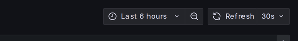

# L1 — first response

**For:** the service desk. The person who takes the call from a clerk, a supervisor or a
citizen.

**Your job in one line:** work the checklist below, resolve it if it's on the
[known-issues list](known-issues.md), and if it isn't, hand L2 a filled-in Part A of the
[incident report](incident-report.md).

**Not your job:** working out *why*. If you find yourself forming a theory about the cause,
that's L2's work — capture what you've found and pass it on.

**This page is only half of L1.** The other half is *requests* rather than faults — creating
a user, adding a department or a complaint type, loading master data. Those are all done
through the product's own admin screens and they are yours, not L2's; the rule is
[**if there is a screen for it, it is L1**](README.md#who-does-what--the-l1--l2-line). This
page covers the fault half.

You do all of this from a web browser. You never touch the server, and **nothing in this
checklist changes anything** — every step is looking, not changing. You cannot break the
system by following this page.

---

## Before you start

### Logins and passwords

**The health dashboard needs no login.** Open the URL and you're in.

**Grafana does need one**, and you should have it *before* your first call rather than
hunting for it during one. You do not use the `admin` login for this — that one belongs to
your **system administrator**, and a new deployment has no other accounts. Grafana does not
let people sign themselves up, so **the administrator creates a Grafana account for each L1
and L2 person**. Ask them for yours, and ask for two specific things:

1. **A named account of your own** — your username, not the shared `admin` login.
2. **The Editor role.** New accounts are created as **Viewer** by default, and a Viewer
   cannot open **Explore** — which [Step 4](#step-4--what-does-the-log-say) needs. If Step 4
   shows you no Explore item in the left menu, this is why: go back and ask for Editor.

Editor cannot add users or change passwords, and nothing in this checklist changes the
system — Grafana only displays data. Steps 3 and 4 below both need the login.

Everything else, ask your **system administrator** for:

| If you need | Ask your system administrator |
|---|---|
| **A Grafana account of your own**, with the **Editor** role | Needed for Steps 3 and 4. Ask before your first call — the admin creates it for you |
| A password prompt appears where you did not expect one | They'll tell you the right URL, or add you to the VPN |
| The **Novu** notification dashboard (to see if a message was sent) | Access is not part of the service desk by default |
| The **SMS / WhatsApp provider console** (to check credit or credentials) | Usually held by whoever owns the provider contract |
| Access to the **server itself** | That is L2's, not yours — you never need it for this checklist |

**Never put a password, API key or token in a ticket**, even if someone asks you to. If you
think a credential is part of the problem, say *which* credential, not what it is.

### The two pages, and what they are

Bookmark these two. **They are the only URLs on this page** — after this, everything is
described as menu clicks, so you don't have to memorise addresses.

| Page | URL | What it is |
|---|---|---|
| **Health dashboard** | `https://<your-domain>/status/` | A page that automatically tries up to 57 parts of the system every 30 seconds and colours each one green or red |
| **Grafana** | `https://<your-domain>/grafana/` | The system's own recordings — memory, errors, logs — shown as charts and lists. **Asks for a login** |

**About Grafana**, because it looks intimidating the first time: it is a *viewer*. It reads
recordings the system already made and draws them on screen. It does not control the
system, and clicking around in it cannot start, stop or change anything. Explore it freely.

### The nine dashboards, and the two that are yours

Grafana's **Dashboards** menu lists nine pages. **This checklist uses two of them**, and the
other seven are L2's. That is not a restriction on you — it is which questions belong to
which tier.

| Dashboard | Used in | Whose |
|---|---|---|
| **DIGIT JVM Services** | [Step 3](#step-3--did-something-crash-or-run-out-of-memory) — two panels only | **Yours** |
| **DIGIT — Logs (Loki)** | [Step 4](#step-4--what-does-the-log-say) | **Yours** |
| Node Exporter Full, PostgreSQL Database, Kong API Gateway, Redpanda (Kafka) Broker, DIGIT Kafka Consumer Lag, DIGIT — Traces (Tempo), DIGIT — PGR Analytics Queries | — | L2's |

The seven answer *why* something is failing — is the database the bottleneck, is it the
gateway or the service behind it, which pipeline is stuck. Reading them correctly needs to
know what normal looks like on this deployment, and
[working out why is not your job](#l1--first-response). Looking at them cannot break
anything, so look if you are curious — just don't put conclusions from them in a ticket.

**One exception worth knowing:** if a caller reports something that sounds like *"everything
is slow"* or you see the words **"no space left on device"** anywhere, say so explicitly in
the handover. Those two point L2 straight at a specific dashboard, and naming the symptom in
those words saves them a step.

What every dashboard shows, if you want to read ahead: **[dashboards.md](dashboards.md)**.

### What you need before your first call

Check you actually have these, and ask L2 for anything missing. Each one is assumed by a
step below.

| You need | Used in | If you don't have it |
|---|---|---|
| The two URLs above, reachable from your desk | Steps 2–4 | Ask L2 — Grafana may sit behind the VPN |
| Your **Grafana account** (Editor role) | Steps 3–4 | Ask your system administrator — they create it. Without it you can do Steps 0–2 and must hand over there |
| To know this deployment's **observability level** | Step 4 | Ask L2. On a `metrics`-level deployment there are no logs to read — see Step 4 |
| A **login of your own** for the system | Step 1 | You cannot confirm scope; say so in the ticket rather than guessing |
| A **second test login**, ideally in a different office | Step 1 | Ask a colleague to try instead, and note whose account was used |
| The **maintenance window**, written on your [cheat sheet](cheatsheet.md) | Step 3 | Ask L2 before reporting restarts |

An admin login to the Configurator or HRMS is **not** assumed anywhere on this page — the
fault checklist is read-only throughout. You should still have one, because the request half
of L1 (creating users, editing master data) is done entirely through those screens, and some
entries in [known-issues.md](known-issues.md) need one too. If you don't have one yet, ask
your system administrator for it; until then, those items are L2's.

← back to **[Operations handbook](README.md)** · one-page version:
**[cheatsheet.md](cheatsheet.md)**

---

## Contents

- [Step 0 — take the details](#step-0--take-the-details)
- [Step 1 — is it just this one person?](#step-1--is-it-just-this-one-person)
- [Step 2 — is everything up?](#step-2--is-everything-up)
- [Step 3 — did something crash or run out of memory?](#step-3--did-something-crash-or-run-out-of-memory)
- [Step 4 — what does the log say?](#step-4--what-does-the-log-say)
- [Step 5 — resolve or escalate](#step-5--resolve-or-escalate)
- [What to capture, always](#what-to-capture-always)

---

## Step 0 — take the details

Ask for these while the caller is still on the line. Going back for them later is the main
reason a ticket stalls.

| Ask | Why it matters |
|---|---|
| **What exactly were you doing?** The screen, the button, the action | Narrows it to one service |
| **What happened instead?** The exact message on screen | Often names the failure outright |
| **When did it start?** Date, time, timezone | Everything downstream is a time-range search |
| **Is it still happening right now?** | Decides whether evidence is still live |
| **Which city / office / login?** | Tenant and role scope |
| **Complaint number**, if there is one | Lets any tier trace it end to end |

If the caller can send a screenshot, ask for one **with the error visible**.

---

## Step 1 — is it just this one person?

Before opening any dashboard, find out whether this is one person's machine or the whole
system. This costs a minute and decides everything that follows.

1. **Open the site yourself, in a private/incognito window**, and try the same action. This
   one test is the important one, and it needs nothing but your own login.
2. If you can, also vary **the account** (a second test login, or ask a colleague in another
   office to try) and **the network** (a phone hotspot).

### What the result means, and what to do

| Result | What it means | Do this |
|---|---|---|
| Works for you, fails for them | Their browser, network or account | Try the browser-side items in [known-issues.md](known-issues.md) |
| Fails for you too | Server-side | Continue to Step 2 |
| You can't test it yourself | Unknown scope | Say so explicitly in the ticket — "could not reproduce, no second account" is information; silence reads as "not checked" |

**If you can reproduce it, capture the failing request while you're there** — it is the
single most useful attachment and the caller cannot get it for you. Press **F12** → the
**Network** tab → repeat the action → click the red row → screenshot the **URL and status
code**. If you cannot reproduce it, skip this; do not talk a caller through developer tools
on the phone.

Skipping this step is the most common way a single stale login turns into a system-wide
alarm.

---

## Step 2 — is everything up?

### What this page is

The **health dashboard** is a page that tries every part of the system — up to 57 checks,
though most deployments run somewhat fewer — every 30 seconds, and shows each result as a
coloured tile. Green means that part answered. Red
means it did not. You don't run anything — the page is already doing it continuously, and
you're reading the latest result.

### How to get there

Open the health dashboard URL from [Before you start](#before-you-start). There is nothing
to click — the tiles are the page.

### What you're looking at

Tiles are grouped by what part of the system they belong to. Scan for **any red tile**, and
note its **exact name and group**.

> **Screenshot anything red immediately, before you do anything else.** This page keeps no
> history — it only knows the last few minutes. If the page reloads or the service recovers,
> the red is gone for good and cannot be recovered by anyone, including L2.

### What each group means

| Group is red | What's affected |
|---|---|
| **Infrastructure** | The database, cache or message queue. Nothing else can work without these — this is the most serious thing on the page |
| **Core Services** | A shared platform service. Expect several unrelated-looking symptoms at once |
| **API Gateway** | The traffic director. Requests can't be routed; users see "502" or a blank screen |
| **Application** | The complaint system itself |
| **Search** | Inbox and search break; filing complaints still works |
| **Notifications** | SMS / email / WhatsApp not going out; everything else fine |
| **Sign-in / identity** | People cannot log in |
| **OTP** | One-time passcodes for login aren't being delivered |
| **MCP** | Integration tooling. No effect on citizens or staff using the system |
| **API Tests** | See below — this one means something different |

### Two things that confuse people

**The API Tests group is not like the others.** Every other group asks a service *"are you
alive?"* — the service replies, the tile goes green. The API Tests group instead makes a
**real request**, the same kind the application makes: searching for a city, generating a
complaint number, fetching a translated message. So it proves the service can actually do
its job, not just that it's running.

That means a **green service tile with a red API Tests tile is not a contradiction** — it
tells you the service is alive but not working, which is usually a data or configuration
problem rather than a crash. Note it and pass it on; it points L2 somewhere quite different.

**PostgreSQL and PgBouncer are listed separately on purpose.** PgBouncer sits in front of the
database. It can keep answering happily while the database behind it is dead. If PgBouncer
is green and PostgreSQL is red, treat it as **Infrastructure red**.

### What to do about it

| What you see | Do this |
|---|---|
| **Any Infrastructure tile red** | **Screenshot it and escalate immediately.** Do not continue the checklist — nothing above the database can be trusted, and the remaining steps will just be noise |
| Any other red tile | Screenshot, write down the exact tile names, continue to Step 3 |
| An API Tests tile red, service tiles green | Note it explicitly as "alive but API failing", continue to Step 3 |
| Everything green | The parts are all running, so the problem is inside one of them or in the data. Continue to Step 3 |

**Record the exact names of the red tiles.** That list is most of what L2 needs.

---

## Step 3 — did something crash or run out of memory?

### What you're checking, and the words for it

Most of this system is written in Java. Every Java service is given a fixed amount of memory
to work in — that allowance is called the **heap**. If a service needs more than its heap
allows, it cannot continue and fails with an error called **OOM**, short for
*out of memory*. When a service fails this way it usually **restarts** — it stops and starts
again from scratch, which takes it out of service for a minute or two.

You are checking two things, and only reading numbers:

- **Did anything run out of memory?**
- **Is anything restarting over and over?**

### a. Out-of-memory count

**How to get there:** open **Grafana** → in the left menu click **Dashboards** → open
**DIGIT JVM Services**.

**Set the time window first.** At the **top right** there is a time control — it usually
says something like *Last 6 hours*.


 Everything on the screen is only about that window, so
if you set it wrong you will see nothing and think all is well. Set it to **Last 6 hours**,
or wider if the caller says the problem started earlier.

Now find the panel called **"OOM events (current range)"**. It is a **stat panel**, meaning
it shows one single large number — the count of out-of-memory failures inside the time
window you chose.

| Reading | What it means |
|---|---|
| **0** | Normal. Nothing ran out of memory in that window |
| **Anything above 0** | A tracked JVM application or migration job logged an OOM signal. Inspect the panel below and escalate |

If it is above zero, look at the panel directly below it, **"Incidents — OOM / heap-space
errors"**. That lists the actual error lines and names the service.

> **Treat a non-zero count as real.** The panel selector is restricted to tracked JVM
> applications, JVM infrastructure, and Flyway migration jobs; Grafana, Loki, and Promtail
> cannot contribute their own query text. Use the incident panel to identify the service and
> timestamp, not to decide whether the count should be ignored.

**What to do about it:**

> If **OOM events is above 0** — copy the error lines from the panel below it, note the
> **service name** and the **time**, and **escalate to L2**. Do not try to fix it. Do not
> restart anything. Fixing an out-of-memory usually means giving the service a bigger
> allowance, which is a deployment change and not something the service desk can or should
> do.

### b. Restarts

**How to get there:** in Grafana's left menu click **Explore**. At the top of the Explore
screen there is a datasource dropdown — choose **Loki** from it.

Then copy this line into the query box and press **Run query** (or Shift+Enter). You don't
need to understand it — it is a search filter, and it's the same every time:

```logql
{compose_project="digit", compose_service!="loki"} |~ `Started .+Application in`
```

Every Java service writes one line when it starts up. This search finds those lines, so
**each result is one service starting**. Widen the time range at the top right to **Last 24
hours**.

| Reading | What it means |
|---|---|
| A cluster of many services all starting at the same time | Normal, if that time is your maintenance window — the whole system was redeployed |
| The **same service** appearing over and over through the day | Not normal. That service is failing and restarting repeatedly |
| Nothing at all | Nothing restarted in that window. Also a useful finding |

> **Check the maintenance window before you report restarts.** If this deployment redeploys
> on a schedule, every service restarts then and this query fills with normal activity. The
> window should be written on your [cheat sheet](cheatsheet.md) — restarts *outside* it are
> the interesting ones. If that blank has never been filled in, ask L2 what the window is
> before treating restarts as a finding.

**What to do about it:**

> If the **same service keeps appearing** outside the maintenance window — copy the list of
> times, note the service name, and **escalate to L2** with the words **"possible restart
> loop"**. That phrase tells L2 exactly where to start. Do not restart anything yourself.

### Record it, don't conclude from it

`OOM events: 3 — egov-indexer, 09:12` is the right note.
"The system crashed because it ran out of memory" is not.

The out-of-memory may be a *consequence* of the real fault, or unrelated to what the caller
reported. Say what you saw rather than what it means — in the ticket, and to the caller.

The other panels on that dashboard — the heap graphs and the right-sizing table — are L2's
work ([l2-diagnosis.md](l2-diagnosis.md#reading-the-evidence-l1-captured)). Reading them
correctly means knowing what normal looks like for each individual service, and a normal
memory pattern looks alarming until you've seen a few. Leave them alone.

---

## Step 4 — what does the log say?

### What a log is

Every part of the system writes a running diary of what it is doing — each thing it starts,
finishes, or fails at, with a timestamp. That diary is the **log**. When something breaks,
the log usually says so in plain words, and that sentence is the single most useful thing
you can put in a ticket.

Logs are kept for **72 hours**, so a problem from last week has no log left. This is why
reporting quickly matters.

> **First check this step applies to your deployment.** Searchable logs come from a component
> called Loki, and some deployments are configured without it to save memory and disk — see
> [README § How much monitoring this deployment runs](README.md#how-much-monitoring-this-deployment-runs).
> If **DIGIT — Logs (Loki)** is not in the dashboard list at all, that is a deployment
> decision and **not a fault**. Skip to [Step 5](#step-5--resolve-or-escalate), and write in
> the ticket: *"no log search on this deployment"* — L2 can still read logs on the server
> itself. Ask L2 once which level you are on and note it on your
> [cheat sheet](cheatsheet.md), so nobody rediscovers this mid-incident.

### How to get there

Open **Grafana** → left menu **Dashboards** → open **DIGIT — Logs (Loki)**.

**You do not need to write a query here.** This dashboard has three dropdowns across the
top; set them and the logs appear underneath.


| Control | Set it to |
|---|---|
| **Service** | The service you suspect, from Step 2 or Step 3. If you have no suspect, leave it as `.+`, which means "all of them" |
| **Level** | `ERROR` — this hides routine chatter and shows only failures |
| **Search regex** | Leave empty. Or paste a complaint number here to follow one specific case through the system |

Then set the **time range** (top right) to **start ten minutes before the problem began**.
Not when the caller rang — when it started. Failures cascade, and you want to catch the
first one.

### What you're looking at, and what to do

**Copy the oldest error you can see, not the newest.** When something breaks, other things
fail after it in a chain. The first error is the cause; the rest are consequences. Scroll to
the *bottom* of the list, which is the earliest entry in your window.

| What you see | Do this |
|---|---|
| Errors are present | Copy the **oldest** one, with **10–20 lines around it**, as text. Note the service and the exact time range you used. **Escalate to L2** |
| No errors at all | This is a real finding, not a dead end. Write it down explicitly: *"no ERROR lines between 09:00 and 09:30 for all services"*. It rules out a great deal for L2 |

Copy the text, not a photograph of the screen — text can be searched, a screenshot cannot.

---

## Step 5 — resolve or escalate

**Check [known-issues.md](known-issues.md) first.** If your symptom is in that table and
the resolution is marked as one you're able to apply, do it and close the ticket, adding a
line to the incident log.

Otherwise, escalate to L2 with **Part A** of [incident-report.md](incident-report.md)
filled in. Part A is exactly what you gathered above, so it should be a copy-paste job.

### Escalate immediately, without finishing the checklist

Stop and hand over right away if any of these are true:

- **An Infrastructure tile is red** on the health dashboard.
- **Nobody can log in**, or the site doesn't load at all.
- **No complaint can be filed** by anyone.
- **A disk-full or "no space left on device" message** appears anywhere.

For those, do Step 2 (screenshot the red tiles) and hand over. The remaining steps can be
done by L2 while you're notifying people.

### And if everything looked normal

Say so, clearly. *"All health tiles green, OOM events 0, no restarts outside the maintenance
window, no ERROR lines between 09:00 and 09:30"* is a genuinely valuable ticket — it rules
out most of what L2 would otherwise spend an hour checking. An empty checklist reads as
"nobody looked"; a filled-in one that found nothing reads as "we know where it isn't".

---

## What to capture, always

Attach these to every ticket you pass on. Text, not photographs of a screen — text can be
searched.

- [ ] The answers from **Step 0**
- [ ] **Scope** — did it fail for you too, in a private window, on another account?
- [ ] **Health dashboard screenshot**, if anything was red
- [ ] Any **red tile names**
- [ ] **Restart / OOM findings** from Step 3, with times
- [ ] The **error text** from Step 4, plus the time range and service you used
- [ ] The **complaint number / user ID**, if there is one
- [ ] A screenshot of the failing screen — and if the caller can manage it, with the browser
      developer tools **Network** tab open (F12), showing the failed request

One thing to be aware of before attaching anything: logs and screenshots from this system
can contain citizens' names, phone numbers and complaint text. The redaction guidance in
[incident-report.md](incident-report.md#redaction--what-not-to-send-us) covers what to strip.
