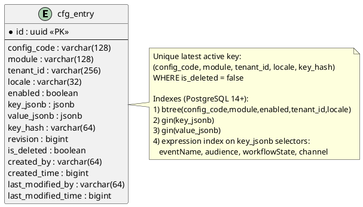
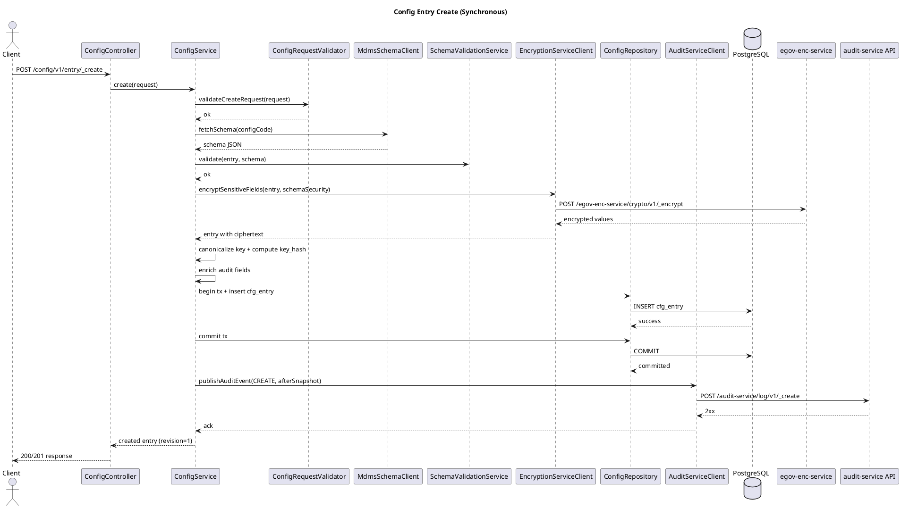
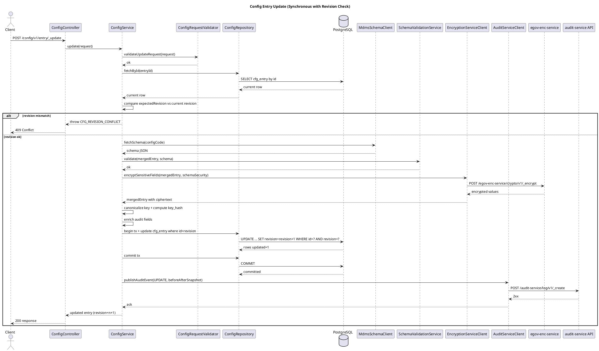
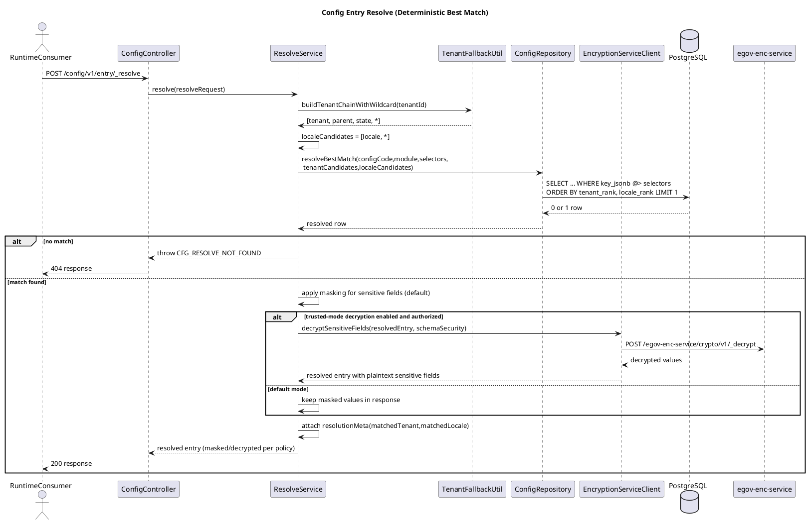

# Config Service LLD

## 1. Purpose and Context

We need a new **Config Service** that is MDMS-like for admin/search use-cases, but optimized for runtime consumers that require deterministic single-record resolution.

### Phase-1 scope is frozen to exactly two `configCode`s

1. `NOTIF_TEMPLATE_MAP`
2. `NOTIF_EVENT_SCHEMA`

### Phase-1 semantics

- `PGR` emits semantic events with named payload fields.
- `module` is first-class (for example `Complaints`, `PropertyTax`).
- Template selection happens in `novu-bridge` via `NOTIF_TEMPLATE_MAP`.
- Twilio WhatsApp parameters are positional; ordering is defined by `paramOrder[]`.
- `requiredVars` and `optionalVars` are part of `NOTIF_TEMPLATE_MAP` (no separate required-vars config).

---

## 2. What/Why Decision Summary

This section attempts to answer why a separate configuration service is needed and why not just use MDMS-v2 to store configurations. Example: WhatsApp providers, credentials, templates per provider etc..

### 2.1 Reuse decision

**Reuse MDMS-v2 patterns selectively: YES.**

### 2.2 What to reuse

- Layered service structure: controller -> service -> repository -> querybuilder.
- PostgreSQL + JSONB model and query-builder style.
- DIGIT audit enrichment (`createdBy`, `createdTime`, `lastModifiedBy`, `lastModifiedTime`).
- Tenant fallback utility concepts.
- Exception and response conventions.

### 2.3 What not to reuse as-is

- Async persistence pattern (Kafka producer + persister).
- Runtime list/search retrieval followed by client-side filtering.
- Non-deterministic/implicit fallback behavior.

### 2.4 Why

- Runtime consumers (for example `novu-bridge`) need **single deterministic best match**, not list responses that MDMS-v2 provides.
- MDMS-v2 cannot store credentials securely. Helm charts are the place currently where credentials are encrypted and stored. However, Helm charts are global and applicable to all tenants.
- Runtime API must be **index-backed and fast**, not fetch-and-filter (like MDMS-v2).
- We require **synchronous writes** for immediate read-after-write behavior and operational simplicity.

---

## 3. Important Constraint from Latest Input

- This service will **NOT** expose schema APIs.
- Schema definitions will remain in MDMS and be accessed through **MDMS schema APIs**. Config service schemas to be defined up-front in MDMS schema at setup time.
- Config Service will use MDMS schema APIs only for write-time validation of payloads.

---

## 4. Functional Requirements

### 4.1 Admin/Browse/Search

- Create/update/search config entries.
- Filter by `configCode`, `module`, `tenantId`, `locale`, `enabled`.
- Keep revision and audit history.

### 4.2 Runtime Resolve

- Return a single best-match config entry.
- Deterministic precedence with tenant+locale fallback.
- Selector matching through `key` object.
- Must be DB index-backed.

---

## 5. API Design

### 5.1 Endpoints

- `POST /config/v1/entry/_create`
- `POST /config/v1/entry/_update`
- `POST /config/v1/entry/_search`
- `POST /config/v1/entry/_resolve`

### 5.1.1 API Summary Table

| Endpoint | Purpose | Success Code | Notes |
|---|---|---:|---|
| `POST /config/v1/entry/_create` | Create a new config entry | `201` | Sync DB write, schema-validated via MDMS schema API |
| `POST /config/v1/entry/_update` | Update an existing entry | `200` | Uses optimistic locking with `expectedRevision` |
| `POST /config/v1/entry/_search` | Search entries with filters | `200` | Supports filters on code/module/tenant/locale/enabled and JSON filters |
| `POST /config/v1/entry/_resolve` | Resolve deterministic best match | `200` | Returns exactly one entry based on rules & precedence; `404` if no match |

### 5.1.2 Full API Specification

- OpenAPI file: [`config-service.openapi.yaml`](./config-service.openapi.yaml)

### 5.1.3 RBAC Requirements

Required roles for API access:

| Endpoint | Required Role |
|---|---|
| `POST /config/v1/entry/_create` | `CONFIG_CREATOR` |
| `POST /config/v1/entry/_update` | `CONFIG_CREATOR` |
| `POST /config/v1/entry/_search` | `CONFIG_VIEWER` |
| `POST /config/v1/entry/_resolve` | `CONFIG_VIEWER` |
| `POST /config/v1/entry/_resolve` with `decryptSensitive=true` | `CONFIG_SECRET_VIEWER` (in addition to `CONFIG_VIEWER`) |

Notes:
- `CONFIG_CREATOR` is required for all write APIs.
- `CONFIG_VIEWER` is required for all read/resolve APIs.
- Role checks should be enforced at Gateway layer and covered by authorization tests.

### 5.2 Create request example

```json
{
  "requestInfo": {},
  "entry": {
    "configCode": "NOTIF_TEMPLATE_MAP",
    "module": "Complaints",
    "tenantId": "pb.amritsar",
    "locale": "en_IN",
    "enabled": true,
    "key": {
      "eventName": "COMPLAINT_CREATED",
      "audience": "CITIZEN",
      "workflowState": "PENDINGFORASSIGNMENT",
      "channel": "WHATSAPP"
    },
    "value": {
      "templateKey": "pgr_created_v1",
      "templateVersion": "1",
      "requiredVars": ["complaintId", "name"],
      "optionalVars": ["ward"],
      "paramOrder": ["name", "complaintId", "ward"],
      "fallbackTemplateKey": "pgr_created_fallback",
      "fallbackTemplateVersion": "1"
    }
  }
}
```

### 5.3 Resolve request example

```json
{
  "requestInfo": {},
  "resolveRequest": {
    "configCode": "NOTIF_TEMPLATE_MAP",
    "module": "Complaints",
    "tenantId": "pb.amritsar",
    "locale": "en_IN",
    "selectors": {
      "eventName": "COMPLAINT_CREATED",
      "audience": "CITIZEN",
      "workflowState": "PENDINGFORASSIGNMENT",
      "channel": "WHATSAPP"
    }
  }
}
```

### 5.4 Resolve response shape

```json
{
  "responseInfo": {},
  "resolved": {
    "id": "...",
    "configCode": "NOTIF_TEMPLATE_MAP",
    "module": "Complaints",
    "tenantId": "pb.amritsar",
    "locale": "en_IN",
    "enabled": true,
    "key": {},
    "value": {},
    "revision": 4,
    "resolutionMeta": {
      "matchedTenant": "pb.amritsar",
      "matchedLocale": "en_IN"
    }
  }
}
```

---

## 6. Data Model

### 6.1 `cfg_entry` (latest/current records)

- `id` (`UUID`, PK)
- `config_code`
- `module`
- `tenant_id`
- `locale`
- `enabled`
- `key_jsonb`
- `value_jsonb`
- `key_hash` (canonical key hash)
- `revision`
- `is_deleted`
- audit fields

### 6.2 Audit Trail Integration

- No local history table in Config Service.
- Audit trail is pushed to DIGIT `audit-service` via API after successful DB write.
- Audit payload should include:
  - action (`CREATE`/`UPDATE`)
  - entity identifiers (`id`, `config_code`, `module`, `tenant_id`, `locale`)
  - revision
  - before/after snapshot (for update)
  - actor and timestamp from `RequestInfo`/audit details

### 6.3 Constraints

- Unique active latest key:
  - `(config_code, module, tenant_id, locale, key_hash)` where `is_deleted=false`

### 6.4 Indexing strategy

- Base resolve index: `(config_code, module, enabled, tenant_id, locale)`
- GIN on `key_jsonb`.
- GIN on `value_jsonb` (for admin search/filtering on config values).
- Expression index for `NOTIF_TEMPLATE_MAP` selectors:
  - `eventName`, `audience`, `workflowState`, `channel` from `key_jsonb`.

### 6.5 ER Diagram (PlantUML)

Primary keys are UUID. For PostgreSQL, use native `uuid` type (for example `gen_random_uuid()` defaults with `pgcrypto`).



---

## 7. Deterministic Resolve Logic

### 7.1 Precedence order

1. exact tenant + exact locale
2. exact tenant + `*`
3. `*` + exact locale
4. `*` + `*`

### 7.2 Tenant fallback chain

For `pb.amritsar.zone1`:

1. `pb.amritsar.zone1`
2. `pb.amritsar`
3. `pb`
4. `*`

### 7.3 Match criteria

- `config_code`, `module`, `enabled=true`, `is_deleted=false`
- `tenant_id IN tenantCandidates`
- `locale IN localeCandidates`
- `key_jsonb @> selectors`

---

## 8. Synchronous Persistence Design

### 8.1 Create flow

1. Validate request basics.
2. Allow only `NOTIF_TEMPLATE_MAP` and `NOTIF_EVENT_SCHEMA`.
3. Fetch schema from MDMS schema API by `configCode`.
4. Validate payload (`key` + `value`) against schema.
5. Parse security metadata from schema (`x-security` / field-level `x-data-security`).
6. Encrypt configured sensitive fields in payload using `egov-enc-service`.
7. Canonicalize `key_jsonb` and compute `key_hash`.
8. Start DB transaction.
9. Insert into `cfg_entry`.
10. Commit DB transaction.
11. Emit audit event via `audit-service` API with masked/redacted snapshots only.
12. Return persisted object.

### 8.2 Update flow

1. Fetch current row by `id`.
2. Validate optimistic lock (`expectedRevision`).
3. Validate merged payload against MDMS schema.
4. Parse security metadata from schema (`x-security` / field-level `x-data-security`).
5. Encrypt configured sensitive fields in merged payload using `egov-enc-service`.
6. Recompute `key_hash` if key changes.
7. Start DB transaction.
8. Update `cfg_entry` (`revision = revision + 1`).
9. Commit DB transaction.
10. Emit audit event via `audit-service` API (include masked before/after snapshots).

### 8.3 Why sync

- Predictable read-after-write.
- Simpler operational model.
- Fewer moving parts for MVP.

### 8.4 Audit Service Emission

- Audit events are emitted via API call to DIGIT `audit-service` (from `Digit-Core/core-services/audit-service`) after successful DB commit.
- Exact API endpoint: `POST /audit-service/log/v1/_create`
- If audit API call fails:
  - business write remains committed,
  - failure is logged with retry metadata,
  - retries should be attempted through configurable retry policy/backoff.
- This keeps config write-path synchronous for primary data while decoupling audit availability from business correctness.

### 8.5 Sample Audit API Payload

Request body should follow `AuditLogRequest` shape used by audit-service (`RequestInfo` + `AuditLogs[]`).

```json
{
  "RequestInfo": {
    "apiId": "config-service",
    "ver": "1.0",
    "ts": 1739596200000,
    "action": "CREATE",
    "did": "1",
    "key": "",
    "msgId": "config-create-1739596200000",
    "authToken": "jwt-token"
  },
  "AuditLogs": [
    {
      "userUUID": "2a4d6d4b-1b9c-4a34-8f1b-9ed8f6d4dc9a",
      "module": "CONFIG-SERVICE",
      "tenantId": "pb.amritsar",
      "transactionCode": "CONFIG_ENTRY_CREATE",
      "changeDate": 1739596200000,
      "entityName": "cfg_entry",
      "objectId": "c6f2b6b0-4d48-45e2-a6be-cf761de3e1c3",
      "auditCorrelationId": "f4b3380c-d96e-4f41-92b3-77070f54574f",
      "keyValueMap": {
        "after": {
          "id": "c6f2b6b0-4d48-45e2-a6be-cf761de3e1c3",
          "config_code": "NOTIF_TEMPLATE_MAP",
          "module": "Complaints",
          "tenant_id": "pb.amritsar",
          "locale": "en_IN",
          "revision": 1,
          "enabled": true
        }
      },
      "operationType": "CREATE"
    }
  ]
}
```

For update operations:
- set `transactionCode` to `CONFIG_ENTRY_UPDATE`
- set `operationType` to `UPDATE`
- include both `before` and `after` snapshots in `keyValueMap`

---

## 9. MDMS Schema Integration

- No schema CRUD/search API in Config Service.
- `MdmsSchemaClient` calls MDMS schema API on create/update.
- Recommended schema cache:
  - key: `configCode`
  - TTL: short (for example 300 seconds)
- Fail closed on missing schema or validation failure.

### 9.1 Security Extensions in Schema (Service-Enforced)

MDMS stores schema; Config Service enforces security semantics from custom `x-*` attributes.

There is no standard JSON Schema keyword for encryption. Use custom extensions:

1. Root-level security paths:
```json
{
  "x-security": {
    "encryptedPaths": ["$.value.apiKey", "$.value.password"],
    "maskedPaths": ["$.value.apiKey", "$.value.password"]
  }
}
```

2. Field-level security flags (optional):
```json
{
  "properties": {
    "value": {
      "type": "object",
      "properties": {
        "apiKey": {
          "type": "string",
          "x-data-security": { "encrypted": true, "masked": true }
        }
      }
    }
  }
}
```

Implementation rule:
- Config Service should support both styles; when both are present, union them.
- Invalid/malformed security paths should fail request with `CFG_SCHEMA_VALIDATION_FAILED`.

### 9.2 Encryption/Masking Behavior by API

1. `/_create` and `/_update`
- Encrypt all configured sensitive fields before persisting.
- Persist only ciphertext for those fields.
- Never persist plaintext secrets.

2. `/_search`
- Return masked values for sensitive fields by default.
- Never decrypt for broad search responses.

3. `/_resolve`
- Default behavior: masked output for sensitive fields.
- Optional trusted-mode behavior: decrypt sensitive fields only for authorized internal callers.
- Decrypted values must not be logged or added to audit snapshots.

### 9.2.1 Trusted-Mode Decrypt Contract for `/_resolve`

- Request field: `resolveRequest.decryptSensitive` (boolean, default `false`).
- Default (`false`): always return masked sensitive fields.
- Trusted mode (`true`) requires all of:
  1. caller has `CONFIG_SECRET_VIEWER` role (or equivalent service-account policy).
  2. caller is internal/trusted channel per gateway policy.
  3. `configCode` is allowed for decryption by policy (deny-list/allow-list configurable).
- If `decryptSensitive=true` without authorization, return `403` with `CFG_SECRET_ACCESS_DENIED`.

### 9.3 Integration with `egov-enc-service`

- Add `EncryptionServiceClient` in Config Service.
- Use exact endpoints from `egov-enc-service`:
  - `POST /egov-enc-service/crypto/v1/_encrypt`
  - `POST /egov-enc-service/crypto/v1/_decrypt`
- Write-path flow:
  1. collect sensitive values by schema paths
  2. call encrypt API
  3. replace plaintext with ciphertext
- Read trusted-mode flow (if enabled):
  1. collect ciphertext paths
  2. call decrypt API
  3. return decrypted values in response body only

Operational defaults:
- Fail closed on encryption failure (`CFG_ENCRYPTION_FAILED`).
- For optional trusted-mode decryption, fail with `CFG_DECRYPTION_FAILED` if decrypt call fails.

#### 9.3.1 Sample encrypt request to enc-service

```json
{
  "encryptionRequests": [
    {
      "tenantId": "pb.amritsar",
      "type": "symmetric",
      "value": {
        "apiKey": "plain-api-key",
        "password": "plain-password"
      }
    }
  ]
}
```

#### 9.3.2 Sample decrypt request to enc-service

```json
{
  "apiKey": {
    "keyId": "pb.amritsar-sym-001",
    "ciphertext": "BASE64_CIPHERTEXT_A"
  },
  "password": {
    "keyId": "pb.amritsar-sym-001",
    "ciphertext": "BASE64_CIPHERTEXT_B"
  }
}
```

#### 9.3.3 Field processing algorithm (implementation-oriented)

1. Build `SecurityPlan` from schema:
- `encryptedPaths`: list of JSONPaths to encrypt before persistence.
- `maskedPaths`: list of JSONPaths to mask in API/audit responses.

2. On create/update:
- Copy incoming payload to mutable JSON tree.
- For each `encryptedPath`, extract plaintext value.
- Build encryption request grouped by `tenantId`.
- Call enc-service API (`POST /egov-enc-service/crypto/v1/_encrypt`).
- Replace extracted plaintext nodes with returned ciphertext objects.
- Persist transformed JSON only.

3. On search/resolve default mode:
- Copy persisted JSON tree.
- For each `maskedPath`, replace node value with redacted token (for example `"****"`).
- Return masked copy.

4. On resolve trusted mode:
- Verify caller authorization for decrypted access.
- Collect ciphertext nodes for encrypted paths.
- Call enc-service API (`POST /egov-enc-service/crypto/v1/_decrypt`).
- Replace ciphertext nodes with plaintext in response copy only.
- Never persist decrypted values.

5. Safety checks:
- If any encrypted path is missing at runtime, either:
  - fail request for required paths, or
  - skip for optional paths based on schema.
- Never log plaintext or decrypted response bodies.

### 9.4 Logging and Audit Rules for Sensitive Data

- Do not log plaintext sensitive field values.
- Do not send plaintext secrets to `audit-service`.
- Audit payloads must contain masked/redacted snapshots for protected fields.
- Include only non-sensitive metadata in application logs (`id`, `config_code`, `tenant_id`, `revision`, status).

### 9.5 Security Error Codes

- `CFG_SECRET_ACCESS_DENIED` for unauthorized decrypt requests.

### 9.6 Search and Indexing Constraints for Encrypted Fields

- Do not support plaintext filtering on encrypted fields in `value_jsonb`.
- If equality lookup is needed later, introduce deterministic hash sidecar fields (future enhancement).
- Existing JSONB GIN indexes remain valid for non-sensitive JSON filters.

---

## 10. Migration Plan from MDMS-v2

1. Bootstrap new service from MDMS-v2 structure.
2. Remove async producer/persister write path.
3. Add synchronous repository methods for create/update.
4. Add `audit-service` API client and audit event contract mapping.
5. Add new Flyway migrations for `cfg_entry` only.
6. Add resolve query builder and deterministic ranking.
7. Add MDMS schema client for write-time validation.
8. Seed/import Phase-1 entries (`NOTIF_TEMPLATE_MAP`, `NOTIF_EVENT_SCHEMA`).
9. Shadow test resolve behavior with runtime consumer.
10. Cut over consumers to `/entry/_resolve`.

---

## 11. Project Structure (Implementation Guide)

```text
src/main/java/org/egov/config/
  controller/
    ConfigController.java
  service/
    ConfigService.java
    ResolveService.java
    SchemaValidationService.java
    SecurityFieldService.java
  repository/
    ConfigRepository.java
    querybuilder/
      ConfigQueryBuilder.java
      ResolveQueryBuilder.java
    rowmapper/
      ConfigEntryRowMapper.java
  client/
    MdmsSchemaClient.java
    AuditServiceClient.java
    EncryptionServiceClient.java
  validator/
    ConfigRequestValidator.java
  enrichment/
    AuditEnricher.java
  util/
    TenantFallbackUtil.java
    CanonicalJsonUtil.java
    HashUtil.java
    JsonPathSecurityUtil.java
  model/
    request/
    response/
    domain/
  errors/
    ErrorCodes.java
```

```text
src/main/resources/
  db/migration/main/
    V202602150001__create_cfg_entry.sql
    V202602150002__create_cfg_entry_indexes.sql
```

---

## 12. Error Codes

- `CFG_INVALID_CONFIG_CODE`
- `CFG_SCHEMA_NOT_FOUND`
- `CFG_SCHEMA_VALIDATION_FAILED`
- `CFG_DUPLICATE_ACTIVE_ENTRY`
- `CFG_REVISION_CONFLICT`
- `CFG_RESOLVE_NOT_FOUND`
- `CFG_BAD_REQUEST`
- `CFG_ENCRYPTION_FAILED`
- `CFG_DECRYPTION_FAILED`
- `CFG_SECRET_ACCESS_DENIED`

### 12.1 Exception Handling Contract (Tracer-Compatible)

- The service must throw `org.egov.tracer.model.CustomException` for all business, validation, and conflict scenarios.
- Exception keys should map to the error codes listed above (for example `CFG_SCHEMA_VALIDATION_FAILED`, `CFG_REVISION_CONFLICT`).
- Do not swallow exceptions in service/repository layers; propagate `CustomException` so DIGIT tracer can intercept and publish observability/error telemetry.
- For unexpected/unhandled failures, wrap with a stable `CustomException` key (for example `CFG_INTERNAL_ERROR`) and preserve original cause in logs.

---

## 13. Error Localization Strategy

### 13.1 Principles

- Error `code` is the stable, machine-readable contract.
- Localized `message` is user-facing and can vary by locale.
- Clients should branch on `code`, not message text.
- Ensure code and default en_IN localization message is entered in the localization Excel file.

### 13.2 Localization key format

- One localization key per error code.
- Suggested key pattern: `error.config.<ERROR_CODE>`
- Example: `error.config.CFG_RESOLVE_NOT_FOUND`

### 13.3 Response behavior

- API error response should include:
  - `code`: canonical error code.
  - `message`: localized message if available.
  - `params`: optional placeholder values for templates.

### 13.4 Locale resolution and fallback

1. Resolve locale from `RequestInfo` (or `Accept-Language` if adopted).
2. Fetch localized message from localization service.
3. If missing, fallback to default locale (for example `en_IN`).
4. If still missing, return safe default message from code.

### 13.5 Validation error localization

- For schema/field-level validation errors, use parameterized templates.
- Example:
  - key: `error.config.CFG_SCHEMA_VALIDATION_FAILED`
  - params: `field`, `reason`
- This avoids hardcoding many per-field static messages.

### 13.6 Quality guardrails

- Maintain localization entries for all `ErrorCodes` constants.
- Add a unit/build check that fails if any error code lacks a default-locale localization key.

---

## 14. Test Plan

### 14.1 Unit Tests

1. `ConfigRequestValidator`
- Accepts valid payload for `NOTIF_TEMPLATE_MAP`.
- Rejects unknown `configCode`.
- Rejects missing mandatory fields (`module`, `tenantId`, `locale`, `key`, `value`).

2. `SchemaValidationService`
- Passes valid payload against MDMS schema.
- Fails invalid payload with `CFG_SCHEMA_VALIDATION_FAILED`.
- Fails when schema is not found with `CFG_SCHEMA_NOT_FOUND`.

2.1 `SchemaSecurityParser` (or equivalent security metadata parser)
- Extracts `encryptedPaths` and `maskedPaths` from root-level `x-security`.
- Extracts field-level `x-data-security` flags.
- Produces merged de-duplicated path set.
- Rejects malformed path config.

3. `ResolveService`
- Builds tenant chain correctly: `pb.amritsar.zone1 -> pb.amritsar -> pb -> *`.
- Builds locale candidates correctly: `en_IN -> *`.
- Returns `CFG_RESOLVE_NOT_FOUND` when repository returns no row.

4. `AuditEnricher` and utility tests
- Populates create/update audit fields correctly.
- Canonical JSON hashing is deterministic (same content, different field order -> same hash).

5. `EncryptionServiceClient` and field processor
- Encrypt is called for all configured sensitive paths on create/update.
- Non-sensitive fields are not sent to encryption service.
- Path replacement preserves JSON structure and non-sensitive fields.
- Masking utility redacts sensitive fields correctly for search/audit payloads.

### 14.2 Repository / SQL Tests

1. Create inserts into `cfg_entry` transactionally.
2. Update increments revision transactionally.
3. Optimistic lock update fails when `expectedRevision` mismatches.
4. Duplicate active latest key violates unique constraint.
5. Search query applies filters for:
- `configCode`, `module`, `tenantId`, `locale`, `enabled`.
- `keyFilter` (`key_jsonb` containment).
- `valueFilter` (`value_jsonb` containment).
6. Resolve query ordering is deterministic with tie-breakers:
- tenant rank, locale rank.
7. Persisted row stores ciphertext (not plaintext) for encrypted paths.

### 14.3 Integration Tests

1. End-to-end create -> resolve returns created record immediately (sync write/read consistency).
2. End-to-end update -> resolve returns updated record immediately.
3. Resolve precedence matrix:
- exact tenant + exact locale
- exact tenant + `*`
- `*` + exact locale
- `*` + `*`
4. Resolve selector matching for `NOTIF_TEMPLATE_MAP` key fields:
- `eventName`, `audience`, `workflowState`, `channel`.
5. Search pagination:
- respects default and explicit `limit/offset`.
- returns stable ordering.
6. Audit integration:
- create emits audit event to `audit-service` with expected payload.
- update emits audit event with before/after snapshots.
- audit API failure does not roll back committed config write.
7. Security integration:
- create/update call `egov-enc-service` and persist ciphertext.
- search response masks sensitive fields.
- resolve returns masked fields in default mode.
- (if trusted-mode enabled) resolve returns decrypted values for authorized internal callers only.

### 14.4 RBAC / Authorization Tests

1. `_create` with `CONFIG_CREATOR` succeeds, without it fails (`401/403` per gateway policy).
2. `_update` with `CONFIG_CREATOR` succeeds, without it fails.
3. `_search` with `CONFIG_VIEWER` succeeds, without it fails.
4. `_resolve` with `CONFIG_VIEWER` succeeds, without it fails.
5. `_resolve` with `decryptSensitive=true` requires `CONFIG_SECRET_VIEWER` (in addition to `CONFIG_VIEWER`); otherwise fails with `CFG_SECRET_ACCESS_DENIED`.

### 14.5 Performance / Index Validation Tests

1. `EXPLAIN ANALYZE` for resolve query confirms index usage on:
- base resolve index,
- selector expression index (`NOTIF_TEMPLATE_MAP`),
- JSONB GIN indexes (`key_jsonb`, `value_jsonb`) where applicable.
2. Search queries with JSON filters remain performant under realistic dataset volume.
3. Encryption path does not create plaintext leakage in logs/responses/audit payloads under load tests.

### 14.6 Audit Retry/Resilience Tests

1. If audit API call fails with transient errors (5xx/timeout), retry with exponential backoff.
2. If retries exhaust, publish audit payload to retry topic or persistent retry store.
3. Verify alert is emitted when retry backlog exceeds threshold.
4. Verify config writes remain successful even when audit-service is unavailable.

### 14.7 Operational Defaults (Audit)

- Audit retry policy defaults:
  - maxAttempts: 5
  - initialBackoffMs: 500
  - multiplier: 2.0
  - maxBackoffMs: 30000
- Dead-letter/retry sink:
  - `config.audit.retry` (topic or durable retry table)
- Alerting thresholds:
  - retry queue depth > 100 for 5 minutes
  - audit failure rate > 5% for 10 minutes

---

## 15. Sequence Diagrams (Create/Update/Resolve)

Developers can paste the following snippets into any PlantUML renderer.

### 15.1 Create Flow (Sync Persistence)



### 15.2 Update Flow (Optimistic Lock + Sync Persistence)



### 15.3 Resolve Flow (Deterministic Best Match)



---

## 16. Non-Goals (Phase-1)

- No generic rules engine.
- No schema management APIs in this service.
- No expansion beyond the two frozen config codes.
