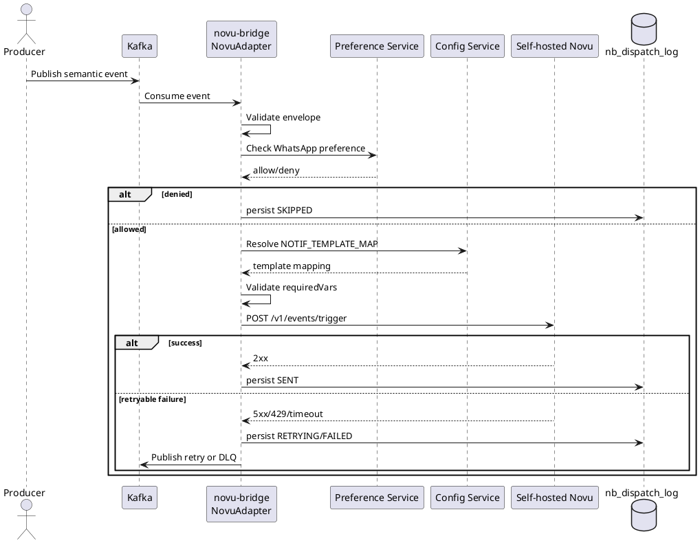
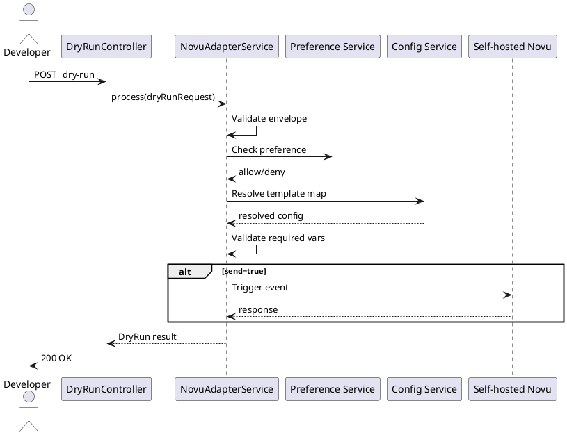

# Novu Adapter LLD (Phase-1)

## 1. Purpose

Implement a lightweight Novu adapter inside `novu-bridge` for WhatsApp outbound notifications.

The adapter will:
- Consume DIGIT semantic notification events from Kafka.
- Validate event envelope (`NOTIF_EVENT_SCHEMA`).
- Validate user preferences for WhatsApp.
- Resolve template/workflow mapping from Config Service (`NOTIF_TEMPLATE_MAP`).
- Validate required template variables.
- Trigger self-hosted Novu via HTTP.
- Handle retries and DLQ.
- Provide test/dry-run APIs without Kafka.

## 2. Phase-1 Scope

### 2.1 In scope

- Channel: `WHATSAPP` outbound only.
- Producer: initially `complaints-service` but adapter remains module-agnostic.
- Config codes only:
  - `NOTIF_TEMPLATE_MAP`
  - `NOTIF_EVENT_SCHEMA`
- Deterministic resolution is done in novu-bridge through Config Service.
- Preference gating is mandatory before dispatch.
- Self-hosted Novu only.

### 2.2 Out of scope

- Novu SaaS.
- Channel fallback (WhatsApp to SMS).
- Complex Novu workflow branching.
- Kafka-less production path (dry-run APIs are for testing/ops only).

## 3. Architecture

### 3.1 Components

- `KafkaConsumer`: Reads notification events.
- `EnvelopeValidator`: Validates mandatory envelope structure + channel checks.
- `PreferenceResolver`: Validates recipient opt-in for WhatsApp.
- `ConfigResolverClient`: Calls Config Service resolve API.
- `PayloadValidator`: Validates requiredVars existence in event data.
- `NovuClient`: Calls `POST /v1/events/trigger` on self-hosted Novu.
- `DispatchRepository`: Stores dispatch attempts and outcomes.
- `RetryWorker`: Retries transient failures and moves terminal failures to DLQ.
- `DryRunController`: Exposes no-Kafka test APIs.

### 3.2 External dependencies

- Kafka topics:
  - input: `egov.core.notification` (or env-specific input topic)
  - retry topic
  - DLQ topic
- Config Service resolve API.
- User preference service API.
- Self-hosted Novu API.

## 4. Event Contract (Input)

Minimum expected envelope (generic complaints domain event):

```json
{
  "eventId": "uuid",
  "eventType": "COMPLAINTS_WORKFLOW_TRANSITIONED",
  "eventTime": "ISO-8601",
  "producer": "complaints-service",
  "module": "Complaints",
  "eventName": "COMPLAINTS.WORKFLOW.ASSIGN",
  "entityType": "COMPLAINT",
  "entityId": "CMP-123",
  "tenantId": "pb.amritsar",
  "actor": {
    "userId": "uuid",
    "userType": "EMPLOYEE"
  },
  "workflow": {
    "action": "ASSIGN",
    "fromState": "PENDINGFORASSIGNMENT",
    "toState": "PENDINGATLME"
  },
  "stakeholders": [
    {
      "type": "CITIZEN",
      "userId": "uuid-optional",
      "mobile": "+9198xxxx"
    }
  ],
  "context": {
    "locale": "en_IN"
  },
  "data": {
    "id": "CMP-123",
    "complaint_type": "Garbage"
  }
}
```

### 4.1 Adapter-derived notification context

`novu-bridge` derives notification-specific fields from the generic event:

- `channel`: fixed to `WHATSAPP` in Phase-1 (adapter scope).
- `workflowState`: from `workflow.toState`.
- `audience`: from selected stakeholder type (`CITIZEN` or `EMPLOYEE`).
- `recipient`: from stakeholder contact data (`mobile` preferred; fallback strategy can use user lookup if configured).
- `locale`: from `context.locale`; fallback to tenant default.

### 4.2 Sample: Complaint Created Event

Use this payload when a complaint is created and needs notification dispatch:

```json
{
  "eventId": "uuid",
  "eventType": "COMPLAINTS_WORKFLOW_TRANSITIONED",
  "eventName": "COMPLAINTS.WORKFLOW.APPLY",
  "eventTime": "ISO-8601",
  "producer": "complaints-service",
  "module": "Complaints",
  "entityType": "COMPLAINT",
  "entityId": "CMP-123",
  "tenantId": "pb.amritsar",
  "actor": {
    "userId": "citizen-uuid",
    "userType": "CITIZEN"
  },
  "workflow": {
    "action": "APPLY",
    "fromState": null,
    "toState": "PENDINGFORASSIGNMENT"
  },
  "stakeholders": [
    {
      "type": "CITIZEN",
      "userId": "citizen-uuid",
      "mobile": "+9198xxxx"
    }
  ],
  "context": {
    "locale": "en_IN"
  },
  "data": {
    "complaintNo": "CMP-123",
    "complaintType": "Garbage"
  }
}
```

## 5. Runtime Processing Flow

1. Consume event from Kafka.
2. Validate envelope using `NOTIF_EVENT_SCHEMA` constraints.
3. Derive notification context (`channel`, `audience`, `workflowState`, `recipient`, `locale`) from the domain event.
4. Reject if recipient/contact is unavailable for the selected audience.
5. Check user preference for WhatsApp.
6. Resolve `NOTIF_TEMPLATE_MAP` with selectors:
   - `eventName`, `audience`, `workflowState`, `channel`
7. Validate all `requiredVars` are available in event `data`.
8. Build Novu trigger payload:
   - `name` = `templateKey`
   - `to.subscriberId` = recipient mobile or stable user id strategy
   - `payload` = named values from event `data`
   - `transactionId` = `eventId`
9. Call Novu trigger API.
10. Persist dispatch result synchronously.
11. On transient failure, retry with backoff; on max attempts, publish DLQ.

## 6. Config Service Interaction

Resolve request shape:

```json
{
  "requestInfo": {},
  "resolveRequest": {
    "configCode": "NOTIF_TEMPLATE_MAP",
    "module": "Complaints",
    "tenantId": "pb.amritsar",
    "locale": "en_IN",
    "selectors": {
      "eventName": "COMPLAINTS.WORKFLOW.ASSIGN",
      "audience": "CITIZEN",
      "workflowState": "PENDINGATLME",
      "channel": "WHATSAPP"
    }
  }
}
```

Expected config `value` fields:
- `templateKey`
- `templateVersion`
- `requiredVars[]`
- `optionalVars[]`
- `paramOrder[]` (retained but not used in Novu payload for Phase-1)
- `fallbackTemplateKey`
- `fallbackTemplateVersion`

## 7. Novu Integration

### 7.1 Endpoint

- `POST {NOVU_BASE_URL}/v1/events/trigger`

### 7.2 Auth

- Header: `Authorization: ApiKey <NOVU_API_KEY>`

### 7.3 Trigger request (example)

```json
{
  "name": "complaints_assign_citizen_whatsapp_v1",
  "to": {
    "subscriberId": "+9198xxxx"
  },
  "payload": {
    "id": "CMP-123",
    "complaint_type": "Garbage"
  },
  "transactionId": "6f6db286-f11a-49a8-b353-850e4e341930"
}
```

## 8. Error Handling and Retries

### 8.1 Failure classes

- Validation failure (bad envelope, missing required vars): non-retryable, DLQ.
- Preference denied: non-retryable, mark skipped.
- Config not found: non-retryable, DLQ.
- Novu 4xx functional errors: non-retryable (except 429).
- Novu 5xx/network timeout: retryable.
- Novu 429: retryable with longer backoff.

### 8.2 Retry policy

- Exponential backoff (example: 30s, 2m, 10m).
- Max attempts configurable (`NOVU_ADAPTER_MAX_RETRIES`).
- After max attempts, publish to DLQ with reason code.

## 9. Persistence Model

Table: `nb_dispatch_log`

- `id` UUID PK
- `event_id` varchar(64) not null
- `module` varchar(128) not null
- `event_name` varchar(256) not null
- `tenant_id` varchar(256) not null
- `channel` varchar(64) not null
- `recipient_value` varchar(256) not null
- `template_key` varchar(256)
- `template_version` varchar(64)
- `status` varchar(32) not null (`RECEIVED`,`SKIPPED`,`FAILED`,`SENT`,`RETRYING`,`DLQ`)
- `attempt_count` int not null default 0
- `last_error_code` varchar(128)
- `last_error_message` text
- `provider_response_jsonb` jsonb
- `created_time` bigint not null
- `last_modified_time` bigint not null

Recommended indexes (PostgreSQL 14+):
- `uk_nb_dispatch_event_channel` unique (`event_id`, `channel`)
- `idx_nb_dispatch_status_lmt` on (`status`, `last_modified_time`)
- `idx_nb_dispatch_tenant_event` on (`tenant_id`, `event_name`)

## 10. Test/Dry-Run APIs (Without Kafka)

### 10.1 Purpose

Allow developers/ops to validate end-to-end adapter behavior using direct HTTP call without waiting for Kafka events.

### 10.2 Endpoints summary

| Endpoint | Purpose |
|---|---|
| `POST /novu-adapter/v1/dispatch/_dry-run` | Validates domain event, derives notification context, checks preference/config/vars; optionally calls Novu |
| `POST /novu-adapter/v1/dispatch/_validate` | Validates envelope + resolve + vars only; does not call Novu |
| `POST /novu-adapter/v1/dispatch/_test-trigger` | Sends direct trigger to Novu using explicit template key and payload |

Full API specification:
- [`novu-adapter.openapi.yaml`](./novu-adapter.openapi.yaml)

## 11. Sequence Diagrams (PlantUML)

### 11.1 Runtime Kafka flow



### 11.2 Dry-run API flow



## 12. Observability

- Structured logs with `eventId`, `tenantId`, `module`, `eventName`, `channel`, `attempt`.
- Metrics:
  - `novu_adapter_consume_total`
  - `novu_adapter_validate_fail_total`
  - `novu_adapter_preference_denied_total`
  - `novu_adapter_resolve_fail_total`
  - `novu_adapter_novu_trigger_total`
  - `novu_adapter_novu_trigger_fail_total`
  - `novu_adapter_dlq_total`
- Tracing: propagate correlation id from `RequestInfo`/headers where available.

## 13. Security and RBAC

- Internal service APIs secured with DIGIT auth/JWT.
- Dry-run endpoints should require admin/operator role (example `NOVU_ADAPTER_TESTER`).
- Novu API key must come from environment/secret manager, never from request.
- Mask PII (mobile numbers) in logs except last 2-4 digits.

## 14. Implementation Plan

1. Create adapter package structure in `novu-bridge`.
2. Implement envelope validator and DTOs.
3. Implement preference client + config resolver client.
4. Implement Novu client with timeout and retry-aware error mapping.
5. Add `nb_dispatch_log` Flyway migration.
6. Build Kafka consumer/retry/DLQ handling.
7. Add dry-run/test APIs.
8. Add metrics, tracing, and structured logging.
9. Add unit/integration tests.

## 15. Testing Guidance

- Unit tests:
  - Envelope validation pass/fail.
  - Preference gating behavior.
  - Config resolve request mapping.
  - Required var validation.
  - Novu client response handling.
- Integration tests:
  - Dry-run endpoint with mocked Pref/Config/Novu.
  - Kafka consume to dispatch log lifecycle.
  - Retry and DLQ transition behavior.
- Contract tests:
  - Config Service resolve request/response compatibility.
  - Novu trigger request compatibility.
