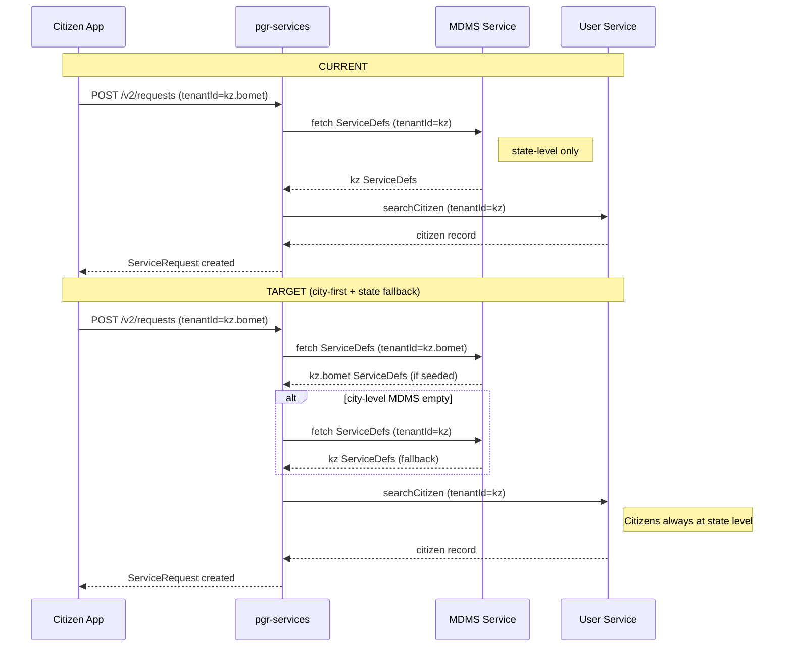
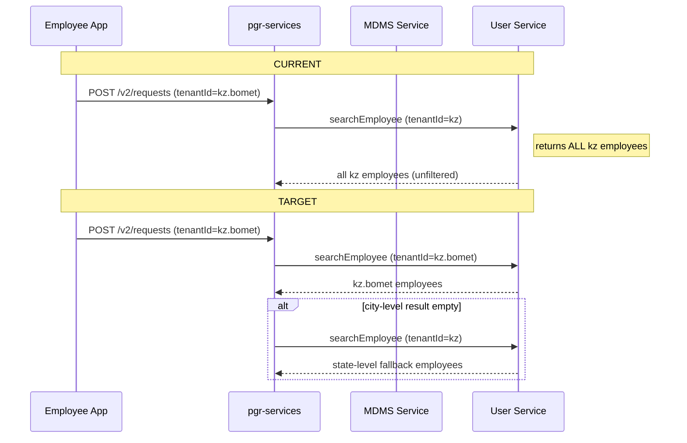
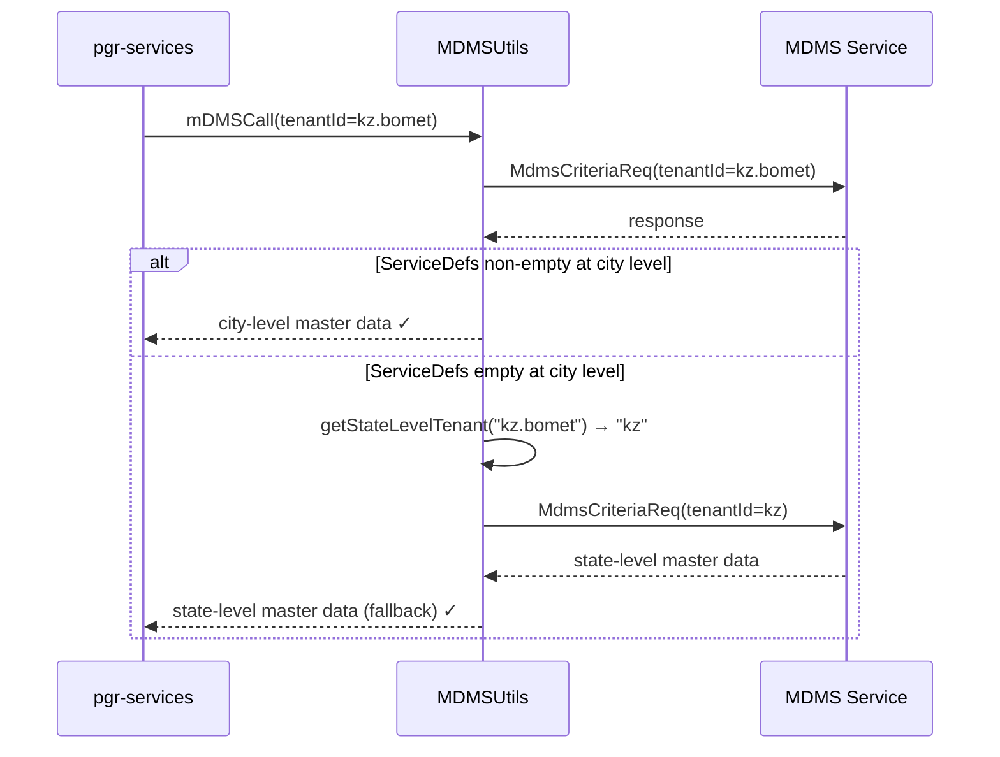
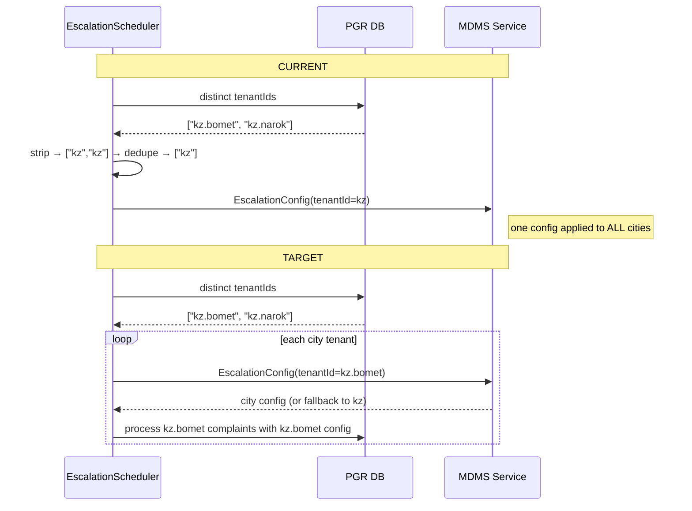

# SaaS Complex Tenancy — Standalone Tenant Design

**Goal:** Make every tenant self-contained with complete master data. Remove dependency on parent/state-level tenant for MDMS. Prepare for DIGIT 3.0 where tenant hierarchy does not exist.

**Scope:** MDMS data layer · pgr-services backend · novu-bridge · xstate-chatbot · Frontend · DevOps/Ansible

---

## 1. Current Architecture (As-Is)

### 1.1 Tenant Hierarchy Today

```
State tenant  →  kz          (e.g. Kazakhstan)
City tenant   →  kz.bomet    (e.g. Bomet City)
```

| Entity | Tenant used | Example |
|---|---|---|
| Citizens | **State level** — citizens are registered at the state tenant | `kz` |
| Employees | **City level** — employees belong to a specific city | `kz.bomet` |
| MDMS master data | **State level** — all masters (ServiceDefs, Dept, Workflow) live at state | `kz` |
| Complaint record (`tenantId` in DB) | **City level** — complaint stored under city tenant | `kz.bomet` |
| Localization strings | **State level** | `kz` |

### 1.2 `getStateLevelTenant()` — What It Does Today

`MultiStateInstanceUtil.getStateLevelTenant(tenantId)` strips the city suffix:

| Input | Output | Used for |
|---|---|---|
| `kz.bomet` | `kz` | MDMS lookup, citizen user search, localization |
| `mz.maputo` | `mz` | Same |
| `kz` | `kz` | No-op when already state-level |

### 1.3 All Call Sites of `getStateLevelTenant()` Today

| File | Purpose | Change in SaaS bridge |
|---|---|---|
| `MDMSUtils.java` | MDMS master data lookup | **Change** → city-first with state fallback |
| `UserUtils.java` (citizen path) | Citizens registered at state tenant | **Keep** — citizens stay at state level |
| `UserUtils.java` (employee path) | Employee lookup | **Change** → city-level first |
| `UserService.java` | User search/create | **Partial** — citizen=state, employee=city |
| `NotificationUtil.java` | Localization fetch | **Keep** — locale strings at state level |
| `NotificationService.java` | Notification dispatch | **Keep** — locale at state level |
| `EscalationScheduler.java` | MDMS EscalationConfig fetch | **Change** → city-first with fallback |

### 1.4 MDMS Data Layout (Current)

```
ansible/nairobi-mdms/mdms/
├── tenant/
│   ├── tenants.json              ← tenantId: "ke" (state root)
│   │                               + tenantId: "ke.nairobi" (city child)
│   └── citymodule.json
├── RAINMAKER-PGR/                ← ALL stored at STATE tenant "ke"
│   ├── ServiceDefs.json
│   ├── UIConstants.json
│   └── EscalationConfig.json
├── common-masters/               ← stored at STATE tenant "ke"
│   ├── Department.json
│   ├── Designation.json
│   ├── StateInfo.json
│   └── ...
└── Workflow/
    └── BusinessService.json      ← stored at STATE tenant "ke"
```

### 1.5 `PGRQueryBuilder` — Tenant Matching Today

```java
// Current: state tenant → prefix match (returns ALL city tenants under state)
if (tenantIdChunks.length == config.getStateLevelTenantIdLength()) {
    query.append("AND service.tenantid LIKE :tenantId ");   // "kz.%"
} else {
    query.append("AND service.tenantid = :tenantId ");      // exact
}
```

---

## 2. Problem Statement

| # | Problem | Impact |
|---|---|---|
| P1 | MDMS masters at state level are **shared** across all city tenants | One city's config change breaks others — not SaaS-safe |
| P2 | No city-level MDMS override possible | Cannot customise ServiceDefs per city without forking state data |
| P3 | DIGIT 3.0 removes the parent-child tenant concept entirely | `getStateLevelTenant()` has no equivalent; system breaks |
| P4 | `PGRQueryBuilder` prefix-match on state tenant returns **all cities' complaints** | Cross-tenant data exposure risk in API responses |
| P5 | New SaaS tenant silently inherits state master even if incorrect for that city | Data correctness risk |
| P6 | Employee user lookup at state level returns employees from **all cities** | Wrong employee assigned to complaint |

---

## 3. Target Architecture

### 3.1 Core Design Decisions

| Concern | Decision | Rationale |
|---|---|---|
| **Citizens** | Continue registering at **state-level tenant** | Citizen users are shared across cities within a state; changing this is out of scope |
| **Employees** | Look up at **city-level tenant first**; fall back to state if not found | Employees belong to a city but may also exist at state level in some configurations |
| **MDMS masters** | Look up at **city-level tenant first**; fall back to state level if not found | Enables per-city customisation while state-level acts as default template |
| **Complaint DB record** | Store **city-level tenantId** — unchanged | No migration needed |
| **Localization** | Use **state-level tenant** — unchanged | Locale strings shared per language, not per city |
| **Query builder** | Always **exact-match** on city tenantId | Prevents cross-tenant data leakage |

### 3.2 Standalone Tenant Model

Each tenant is self-contained. The state tenant acts only as a **fallback template**, not as an authority.

```
┌──────────────────────────────────────────────────────────┐
│  SaaS Standalone (city-first)                            │
│                                                          │
│  ┌────────────────────────────────────────────────────┐  │
│  │  kz.bomet  (primary)                               │  │
│  │  ├─ ServiceDefs     (own copy — city overrides)    │  │
│  │  ├─ Department      (own copy)                     │  │
│  │  ├─ Workflow config (own copy)                     │  │
│  │  └─ Employee users  (city-scoped)                  │  │
│  └────────────────────────────────────────────────────┘  │
│            │ fallback if city data absent                 │
│  ┌────────────────────────────────────────────────────┐  │
│  │  kz  (state — fallback only)                       │  │
│  │  ├─ ServiceDefs     (shared defaults)              │  │
│  │  ├─ Department      (shared defaults)              │  │
│  │  ├─ Citizen users   (always here)                  │  │
│  │  └─ Locale strings  (always here)                  │  │
│  └────────────────────────────────────────────────────┘  │
└──────────────────────────────────────────────────────────┘
```

---

## 4. Sequence Diagrams

### 4.1 Complaint Create — Citizen (current vs target)



### 4.2 Complaint Create — Employee (current vs target)



### 4.3 MDMS Fallback Logic (City-First)



### 4.4 Escalation Scheduler — Current vs Target



---

## 5. Detailed Changes Required

---

### 5.1 MDMS Data Layer

#### 5.1.1 Master Data Strategy

Seed city-level copies of all masters. State-level masters remain as fallback. City-level takes precedence where both exist.

#### 5.1.2 Masters to Seed per City Tenant

| Module | Master | Notes |
|---|---|---|
| `RAINMAKER-PGR` | `ServiceDefs` | May differ per city |
| `RAINMAKER-PGR` | `UIConstants` | REOPEN SLA |
| `RAINMAKER-PGR` | `EscalationConfig` | May differ per city |
| `RAINMAKER-PGR` | `ComplaintCategory` | MIS field |
| `RAINMAKER-PGR` | `ComplaintTypeDepartments` | Multi-dept mapping |
| `common-masters` | `Department` | City-specific departments |
| `common-masters` | `Designation` | City-specific designations |
| `common-masters` | `StateInfo` | City-specific info |
| `Workflow` | `BusinessService` | PGR workflow definition |
| `tenant` | `tenants.json` | Own entry only |

#### 5.1.3 `tenants.json` Change

**Current** (parent-child):
```json
[
  { "tenantId": "kz",       "data": { "code": "kz",       "type": "STATE" } },
  { "tenantId": "kz",       "data": { "code": "kz.bomet", "type": "CITY"  } }
]
```

**Target** (city entry becomes standalone; state entry kept as fallback):
```json
[
  { "tenantId": "kz",        "data": { "code": "kz",        "type": "STATE"      } },
  { "tenantId": "kz.bomet",  "data": { "code": "kz.bomet",  "type": "STANDALONE" } }
]
```

#### 5.1.4 New MDMS Directory Layout

```
ansible/
├── kz-bomet-mdms/                   ← NEW — kz.bomet city-level data
│   └── mdms/
│       ├── tenant/tenants.json
│       ├── RAINMAKER-PGR/
│       │   ├── ServiceDefs.json          (tenantId: "kz.bomet")
│       │   ├── UIConstants.json
│       │   └── EscalationConfig.json
│       ├── common-masters/
│       │   ├── Department.json           (tenantId: "kz.bomet")
│       │   ├── Designation.json
│       │   └── StateInfo.json
│       └── Workflow/
│           └── BusinessService.json      (tenantId: "kz.bomet")
│
├── kz-mdms/                             ← EXISTING state-level (kept as fallback)
│   └── mdms/
│       └── ...                          (tenantId: "kz" — unchanged)
│
└── mz-mdms/                             ← EXISTING — already flat standalone
    └── mdms/
        └── ...                          (tenantId: "mz" — no change needed)
```

---

### 5.2 Backend — `pgr-services`

#### 5.2.1 `MDMSUtils.java` — City-First with State Fallback

**File:** `backend/pgr-services/src/main/java/org/egov/pgr/util/MDMSUtils.java`

```java
// CURRENT
public Object mDMSCall(ServiceRequest request) {
    String tenantId = request.getService().getTenantId();
    MdmsCriteriaReq req = getMDMSRequest(requestInfo,
        multiStateInstanceUtil.getStateLevelTenant(tenantId));  // ← always state
    return serviceRequestRepository.fetchResult(getMdmsSearchUrl(), req);
}

// TARGET — city-first, state fallback
public Object mDMSCall(ServiceRequest request) {
    RequestInfo requestInfo = request.getRequestInfo();
    String tenantId = request.getService().getTenantId();

    // 1. Try city-level tenant first
    MdmsCriteriaReq cityReq = getMDMSRequest(requestInfo, tenantId);
    Object cityResult = serviceRequestRepository.fetchResult(getMdmsSearchUrl(), cityReq);

    // 2. If city-level has no ServiceDefs, fall back to state tenant
    List<?> cityServiceDefs = safeJsonPathRead(cityResult, MDMS_DATA_JSONPATH);
    if (CollectionUtils.isEmpty(cityServiceDefs)) {
        String stateTenant = multiStateInstanceUtil.getStateLevelTenant(tenantId);
        if (!stateTenant.equals(tenantId)) {
            log.debug("No ServiceDefs at city tenant {}; falling back to state tenant {}",
                tenantId, stateTenant);
            MdmsCriteriaReq stateReq = getMDMSRequest(requestInfo, stateTenant);
            return serviceRequestRepository.fetchResult(getMdmsSearchUrl(), stateReq);
        }
    }
    return cityResult;
}

private List<?> safeJsonPathRead(Object result, String jsonPath) {
    try {
        return JsonPath.read(result, jsonPath);
    } catch (Exception e) {
        return Collections.emptyList();
    }
}
```

Same fallback pattern for `getServiceCodeToSlaMillis()`:

```java
// TARGET
public Map<String, Long> getServiceCodeToSlaMillis(String tenantId) {
    return serviceCodeToSlaCache.computeIfAbsent(tenantId,
        this::fetchServiceCodeToSlaMillisWithFallback);
}

private Map<String, Long> fetchServiceCodeToSlaMillisWithFallback(String tenantId) {
    Map<String, Long> result = fetchServiceCodeToSlaMillis(tenantId);   // try city
    if (result.isEmpty()) {
        String stateTenant = multiStateInstanceUtil.getStateLevelTenant(tenantId);
        if (!stateTenant.equals(tenantId)) {
            result = fetchServiceCodeToSlaMillis(stateTenant);           // fallback
        }
    }
    return result;
}
```

---

#### 5.2.2 `UserUtils.java` — Split Citizen vs Employee Paths

**File:** `backend/pgr-services/src/main/java/org/egov/pgr/util/UserUtils.java`

Replace the single `getStateLevelTenant()` usages with two explicit methods:

```java
/**
 * Returns tenantId for citizen user operations.
 * Citizens are registered at state level (e.g. "kz" for "kz.bomet").
 */
public String getCitizenTenant(String tenantId) {
    return multiStateInstanceUtil.getStateLevelTenant(tenantId);   // unchanged
}

/**
 * Returns tenantId for employee user operations.
 * Employees are registered at city level (e.g. "kz.bomet").
 * Caller applies state-level fallback if city returns empty.
 */
public String getEmployeeTenant(String tenantId) {
    return tenantId;   // city-level direct
}
```

Update all call sites in this file:
- Citizen enrichment / role assignment → `getCitizenTenant()`
- Employee-related paths → `getEmployeeTenant()`

---

#### 5.2.3 `UserService.java` — Citizen vs Employee Split

**File:** `backend/pgr-services/src/main/java/org/egov/pgr/service/UserService.java`

```java
// CITIZEN SEARCH — always state-level
private User searchCitizen(String tenantId, RequestInfo requestInfo) {
    String citizenTenant = userUtils.getCitizenTenant(tenantId);   // state level
    // call user-service with citizenTenant
}

// EMPLOYEE SEARCH — city-level first, state fallback
private List<User> searchEmployees(String tenantId, RequestInfo requestInfo) {
    // 1. Search at city level
    List<User> employees = callUserService(tenantId, requestInfo);

    // 2. If empty, fall back to state level
    if (CollectionUtils.isEmpty(employees)) {
        String stateTenant = userUtils.getCitizenTenant(tenantId);
        if (!stateTenant.equals(tenantId)) {
            employees = callUserService(stateTenant, requestInfo);
        }
    }
    return employees;
}
```

---

#### 5.2.4 `NotificationUtil.java` — Keep State-Level for Localization

**File:** `backend/pgr-services/src/main/java/org/egov/pgr/util/NotificationUtil.java`

No change. Localization strings are seeded at state level and shared across cities.

```java
// KEEP as-is
String stateLevelTenantId = multiStateInstanceUtil.getStateLevelTenant(tenantId);
// fetch localization messages with stateLevelTenantId
```

---

#### 5.2.5 `NotificationService.java` — Keep State-Level for Localization

**File:** `backend/pgr-services/src/main/java/org/egov/pgr/service/NotificationService.java`

No change. Locale resolution stays at state level.

---

#### 5.2.6 `EscalationScheduler.java` — Per-City Config with Fallback

**File:** `backend/pgr-services/src/main/java/org/egov/pgr/service/EscalationScheduler.java`

```java
// CURRENT — one state config applied to all cities
Set<String> stateTenants = cityTenants.stream()
    .map(t -> multiStateInstanceUtil.getStateLevelTenant(t))
    .collect(Collectors.toSet());
for (String stateTenant : stateTenants) {
    Object mdmsData = mdmsUtils.fetchEscalationConfig(stateTenant);
    processEscalations(getCityTenantsFor(stateTenant), mdmsData);
}

// TARGET — each city fetches its own config (fallback inside MDMSUtils)
Set<String> cityTenants = fetchDistinctTenantIdsFromDB();
for (String cityTenant : cityTenants) {
    Object mdmsData = mdmsUtils.fetchEscalationConfigWithFallback(cityTenant);
    if (mdmsData == null) {
        log.warn("No EscalationConfig for tenant {}; skipping", cityTenant);
        continue;
    }
    processEscalations(List.of(cityTenant), mdmsData);
}
```

Add `fetchEscalationConfigWithFallback(String tenantId)` in `MDMSUtils.java` following the same city-first + state-fallback pattern as `mDMSCall()`.

---

#### 5.2.7 `PGRQueryBuilder.java` — Always Exact-Match

**File:** `backend/pgr-services/src/main/java/org/egov/pgr/repository/querybuilder/PGRQueryBuilder.java`

```java
// CURRENT — prefix-match for state tenant leaks cross-tenant data
if (tenantIdChunks.length == config.getStateLevelTenantIdLength()) {
    params.put("tenantId", tenantId + ".%");
    query.append("AND service.tenantid LIKE :tenantId ");
} else {
    params.put("tenantId", tenantId);
    query.append("AND service.tenantid = :tenantId ");
}

// TARGET — always exact match
params.put("tenantId", tenantId);
query.append("AND service.tenantid = :tenantId ");
```

> **Pre-merge audit required:** Identify any dashboard or reporting call that passes a state-level tenantId expecting aggregated results across cities. If found, build a dedicated multi-tenant aggregation endpoint before removing the prefix-match.

---

#### 5.2.8 `DashboardQueryBuilder.java` — Always Exact-Match

**File:** `backend/pgr-services/src/main/java/org/egov/pgr/repository/querybuilder/DashboardQueryBuilder.java`

Same change as `PGRQueryBuilder` — remove the `stateLevelTenantIdLength` branch, always use exact-match.

---

#### 5.2.9 `PGRConfiguration.java` — Mark Hierarchy Properties Deprecated

**File:** `backend/pgr-services/src/main/java/org/egov/pgr/config/PGRConfiguration.java`

```java
// No longer drives query logic — mark deprecated, keep bound to avoid startup failure
@Deprecated
@Value("${state.level.tenantid.length:1}")
private Integer stateLevelTenantIdLength;

@Deprecated
@Value("${is.environment.central.instance:false}")
private Boolean isEnvironmentCentralInstance;
```

Remove from `application.properties` once `PGRQueryBuilder` and `DashboardQueryBuilder` no longer reference them.

---

### 5.3 Backend — `novu-bridge`

**File:** `backend/novu-bridge/src/main/java/org/egov/novubridge/service/DispatchPipelineService.java`

If provider selection is keyed by state tenant, apply city-first fallback:

```java
// TARGET
ProviderConfig config = providerMap.getOrDefault(
    tenantId,                                          // city-level first
    providerMap.get(multiStateInstanceUtil             // state-level fallback
        .getStateLevelTenant(tenantId))
);
```

Provider entries in `seed-data/provider-detail-examples.json` must be added for city-level tenantIds. State-level entries remain as fallback templates.

---

### 5.4 Backend — `xstate-chatbot`

Apply city-first + state-fallback for any MDMS lookups inside the chatbot. Review `ORG_CODE_TENANT_DESIGN.md` — if org-code→tenantId mapping references a parent tenant, update it to reference the standalone city tenantId.

---

### 5.5 Frontend

#### 5.5.1 No Breaking Change

`VITE_CITIZEN_TENANT` already holds the full city tenantId (e.g., `kz.bomet`). The frontend passes this to the backend unchanged.

#### 5.5.2 Rename for Clarity (Optional)

```typescript
// digit-ui-v2/src/providers/citizenBridge.ts

// BEFORE (misleading name)
const CITY_TENANT = (import.meta.env.VITE_CITIZEN_TENANT as string) || 'ke.nairobi';

// AFTER (intent-revealing)
const TENANT_ID = (import.meta.env.VITE_CITIZEN_TENANT as string) || 'ke.nairobi';
```

---

### 5.6 DevOps / Ansible

#### 5.6.1 `application.properties` per Tenant

```properties
# Retain for now — getStateLevelTenant() still used for citizen/locale paths
state.level.tenantid.length=1
```

#### 5.6.2 New Tenant Onboarding Checklist

When onboarding a new city tenant:

- [ ] Create `ansible/<tenant>-mdms/mdms/` with complete master set at city tenantId
- [ ] `tenants.json` — add entry with `"type": "STANDALONE"`
- [ ] `ServiceDefs.json` — all complaint types with `"tenantId": "<city-tenant>"`
- [ ] `Department.json`, `Designation.json` — city-specific values
- [ ] `Workflow/BusinessService.json` — PGR workflow at city tenantId
- [ ] `EscalationConfig.json` — city-level SLA config
- [ ] `ComplaintCategory.json` (if MIS fields required)
- [ ] Novu provider config entry for city tenantId
- [ ] Verify MDMS search at city tenantId returns all expected masters **before** code deploy

---

## 6. Migration Path

### Step 1 — Seed City-Level MDMS Data

- Copy all state-level masters (e.g. `kz`) to city-level (e.g. `kz.bomet`)
- Update `tenantId` in all copied records: `"kz"` → `"kz.bomet"`
- Seed into MDMS alongside existing state-level data (both live simultaneously)
- Verify: MDMS search for `kz.bomet` returns ServiceDefs, Department, Workflow

### Step 2 — Deploy Updated `pgr-services`

- `MDMSUtils`: city-first + state fallback
- `UserUtils`: `getCitizenTenant()` (state) and `getEmployeeTenant()` (city)
- `UserService`: separate citizen/employee search paths
- `PGRQueryBuilder`: exact-match on tenantId
- `DashboardQueryBuilder`: exact-match on tenantId
- `EscalationScheduler`: per-city with MDMS fallback

### Step 3 — Smoke Test

- [ ] Citizen creates complaint in `kz.bomet` → ServiceDefs resolved from `kz.bomet` ✓
- [ ] Employee assigned at `kz.bomet` level ✓
- [ ] Escalation runs for `kz.bomet` using `kz.bomet` EscalationConfig ✓
- [ ] Dashboard for `kz.bomet` shows only `kz.bomet` complaints ✓
- [ ] No cross-tenant data returned from PGR search ✓

### Zero-Downtime Ordering Rule

> **Seed MDMS data BEFORE deploying code changes.**

If code is deployed before city-level MDMS data is seeded:
- City-level lookup returns empty → fallback fires → state-level used → system continues to work
- Acceptable degraded-but-safe state

Never remove state-level MDMS entries until city-level data is confirmed seeded and tested for all active tenants.

### `mz` Tenant

`mz` is already flat (single-segment tenantId). `getStateLevelTenant("mz") == "mz"` — fallback is a no-op. **No data migration needed.**

---

## 7. Risk Register

| Risk | Mitigation |
|---|---|
| MDMS empty at both levels after code deploy | Never remove state-level data until city-level is verified |
| Prefix-match removal breaks state-level aggregation dashboards | Audit all callers of PGRQueryBuilder with state tenantId before merge; add explicit multi-tenant aggregate endpoint if needed |
| Escalation applies wrong config | Log which tenantId resolved the EscalationConfig; warn if fallback fires |
| Employee search returns wrong city's employees | Fixed by exact city-level match; verify in smoke test |
| `serviceCodeToSlaCache` stale after city-level seed | Cache misses on first request post-deploy — acceptable; resolves on next fetch |

---

## 8. Complete File Change Checklist

### Backend — `pgr-services`

| File | Change |
|---|---|
| `util/MDMSUtils.java` | `mDMSCall()` and `fetchServiceCodeToSlaMillis()` → city-first + state fallback |
| `util/UserUtils.java` | Add `getCitizenTenant()` (state) and `getEmployeeTenant()` (city); replace `getStateLevelTenant()` call sites |
| `service/UserService.java` | Citizen search → state tenant; Employee search → city-first + fallback |
| `util/NotificationUtil.java` | **No change** |
| `service/NotificationService.java` | **No change** |
| `service/EscalationScheduler.java` | Iterate city tenants; fetch config per city with fallback |
| `repository/querybuilder/PGRQueryBuilder.java` | Remove prefix-match; always exact-match |
| `repository/querybuilder/DashboardQueryBuilder.java` | Remove prefix-match; always exact-match |
| `config/PGRConfiguration.java` | Mark `stateLevelTenantIdLength` and `isEnvironmentCentralInstance` `@Deprecated` |

### Backend — `novu-bridge`

| File | Change |
|---|---|
| `service/DispatchPipelineService.java` | Provider selection: city-first + state fallback |
| `seed-data/provider-detail-examples.json` | Add city-tenantId-keyed provider entries |

### Backend — `xstate-chatbot`

| File | Change |
|---|---|
| Tenant config / MDMS fetch calls | City-first + state fallback |

### MDMS Data

| File | Change |
|---|---|
| `ansible/<city>-mdms/` (new per city) | Seed complete master set at city tenantId |
| `ansible/<state>-mdms/mdms/tenant/tenants.json` | Add city entry with `"type": "STANDALONE"` |

### Frontend

| File | Change |
|---|---|
| `digit-ui-v2/src/providers/citizenBridge.ts` | Rename `CITY_TENANT` → `TENANT_ID` (optional, cosmetic) |

---

## 9. Summary — What Changes Where

```
┌─────────────────────────────────────────────────────────────────────┐
│                         CHANGES                                     │
│                                                                     │
│  MDMSUtils        ──► city-first + state fallback                   │
│  UserUtils        ──► citizen=state (unchanged), employee=city-first│
│  UserService      ──► separate citizen/employee search paths        │
│  EscalationSched  ──► per city-tenant with MDMS fallback            │
│  PGRQueryBuilder  ──► exact-match only (no prefix-match)            │
│  DashboardQB      ──► exact-match only                              │
│  MDMS data        ──► seed city-level copies of all masters         │
│  novu-bridge      ──► city-first provider selection                 │
│                                                                     │
│  UNCHANGED: NotificationUtil, NotificationService, Frontend         │
└─────────────────────────────────────────────────────────────────────┘
```

---

## 10. Definition of Done

- [ ] `MDMSUtils.mDMSCall()` fetches city-level first; falls back to state if empty
- [ ] `UserUtils` has distinct `getCitizenTenant()` (state) and `getEmployeeTenant()` (city) methods
- [ ] Employee search uses city-level tenantId; falls back to state only when city returns empty
- [ ] Citizen search always uses state-level tenantId
- [ ] `PGRQueryBuilder` and `DashboardQueryBuilder` use exact-match only
- [ ] `EscalationScheduler` fetches config per city tenant with fallback
- [ ] City-level MDMS data seeded and verified for all active tenants before code deploy
- [ ] Complaint create / search / close smoke-tested end-to-end for a city tenant
- [ ] No cross-tenant data returned from any PGR search API call
- [ ] `novu-bridge` resolves provider by city tenantId with state fallback
