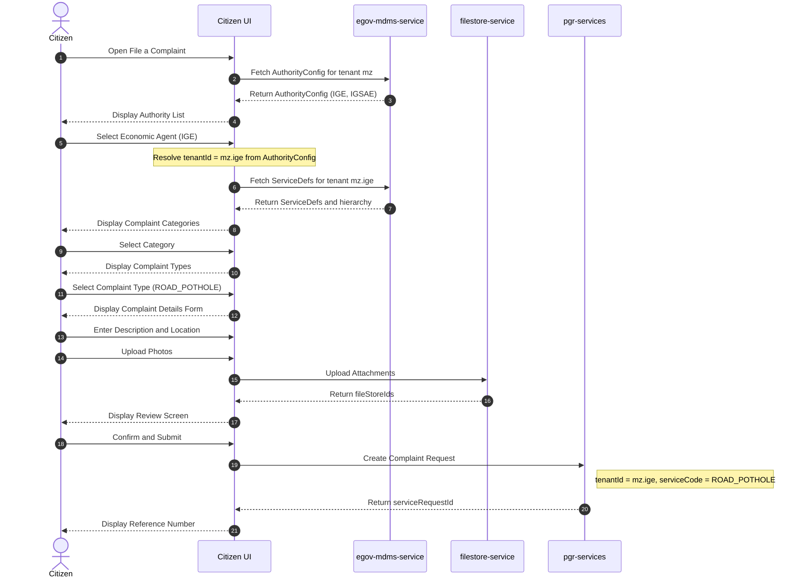
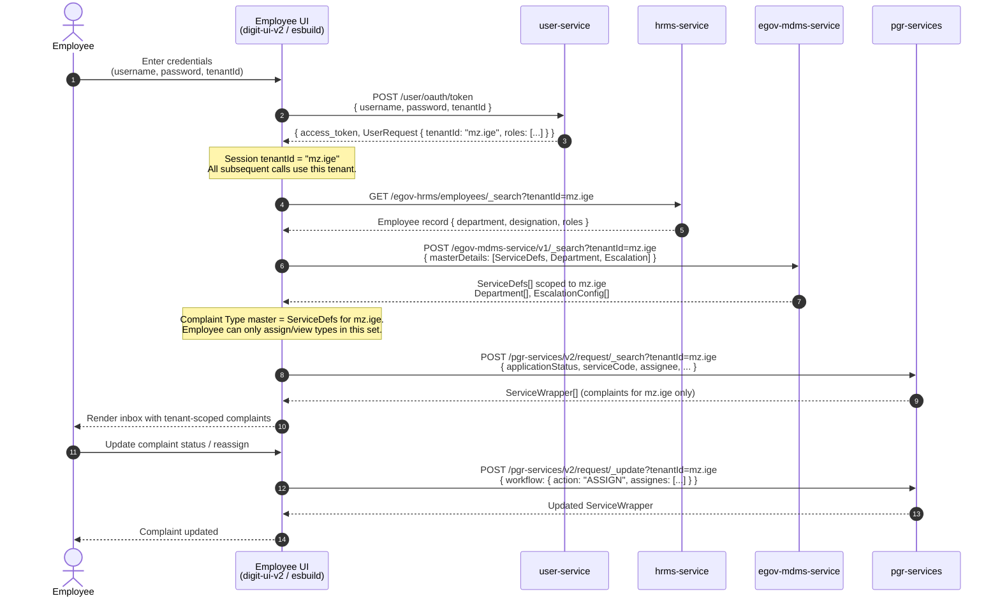
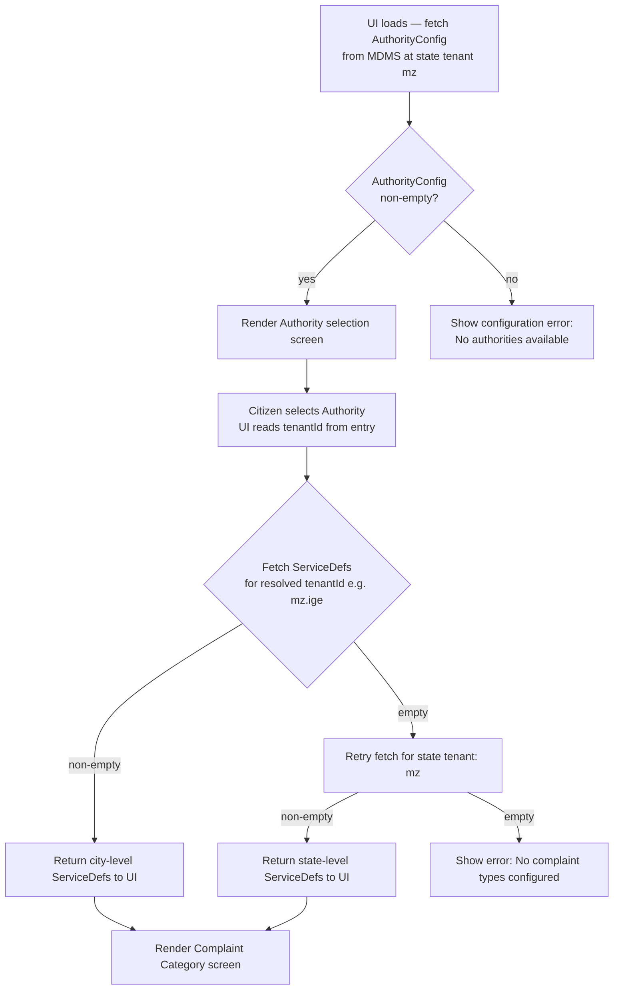

# Authority–Based Tenant Mapping for Complaint Registration

## Overview

Citizens filing a complaint do **not** select a DIGIT tenant directly. Instead they pick an
**Authority** that is meaningful to them. The available authorities and their corresponding
tenant codes are configured in an MDMS master (`RAINMAKER-PGR.AuthorityConfig`) stored at the
state tenant level. The UI fetches this master on load, resolves the tenant code from the
citizen's selection, and uses it for all downstream MDMS and PGR service calls. Tenant codes
are never exposed to the citizen.

---

## 1. Authority → Tenant Mapping

| Authority (UI Label)        | Internal Tenant Code |
|-----------------------------------|----------------------|
| Economic Agent (IGE)              | `mz.ige`             |
| Public Administration (IGSAE)     | `mz.igsae`           |

This mapping is stored in the `RAINMAKER-PGR.AuthorityConfig` MDMS master at the state tenant
(`mz`). The UI fetches it on application load. Adding or renaming an authority requires only an
MDMS data change — no frontend redeployment.

---

## 2. Citizen Complaint Registration Flow

### 2.1 High-Level Steps

```
Step 1 — Fetch AuthorityConfig      (UI loads RAINMAKER-PGR.AuthorityConfig from MDMS at state tenant mz)
Step 2 — Authority selection        (citizen picks from the fetched list, e.g. Economic Agent / Public Administration)
Step 3 — Tenant resolution          (UI reads tenantId from selected AuthorityConfig entry, invisible to citizen)
Step 4 — Fetch ServiceDefs          (MDMS call with resolved tenantId to get complaint categories)
Step 5 — Complaint Category pick    (citizen selects from categories returned by MDMS)
Step 6 — Complaint Type pick        (citizen selects leaf serviceCode)
Step 7 — Complaint Details          (description, location, photos)
Step 8 — Review & Submit            (POST /pgr-services/v2/request/_create with resolved tenantId)
```

### 2.2 Sequence Diagram — Citizen Flow



---

## 3. Employee Complaint Management Flow

When an employee logs in, the **tenantId they authenticate against** determines which
complaint-type master (ServiceDefs) is loaded. The employee sees only complaints and categories
belonging to their assigned tenant.

### 3.1 Sequence Diagram — Employee Flow



---

## 4. MDMS Fallback Behaviour

If no ServiceDefs are configured directly under the city tenant (e.g. `mz.ige`), the backend
falls back to the state-level tenant (`mz`) automatically. This follows the existing
city-first + state-fallback pattern.



---

## 5. Frontend Implementation Guide

### 5.1 MDMS Master — `AuthorityConfig`

**Stored at:** state tenant (`mz`), module `RAINMAKER-PGR`

**Path:** `<mdms-repo>/data/mz/RAINMAKER-PGR/AuthorityConfig.json`

```json
[
  {
    "code": "IGE",
    "name": "Economic Agent (IGE)",
    "tenantId": "mz.ige",
    "order": 1,
    "active": true
  },
  {
    "code": "IGSAE",
    "name": "Public Administration (IGSAE)",
    "tenantId": "mz.igsae",
    "order": 2,
    "active": true
  }
]
```

**React hook to fetch it** (`digit-ui-v2/src/hooks/useAuthorities.ts`):

```typescript
export interface AuthorityConfig {
  code: string;
  name: string;
  tenantId: string;
  order: number;
  active: boolean;
}

export function useAuthorities(stateTenant: string) {
  return useQuery<AuthorityConfig[]>({
    queryKey: ["authorityConfig", stateTenant],
    queryFn: async () => {
      const res = await mdmsSearch(stateTenant, "RAINMAKER-PGR", [
        { name: "AuthorityConfig", filter: "[?(@.active==true)]" },
      ]);
      return res["RAINMAKER-PGR"]?.AuthorityConfig ?? [];
    },
    staleTime: 10 * 60 * 1000,
  });
}
```

### 5.2 Complaint Create Page — Changes Required

**File:** `digit-ui-v2/src/pages/CitizenComplaintCreatePage.tsx`

1. **Add Step 0** — Authority selection screen before the existing Step 1 (complaint type).
2. **Fetch authority list on mount** using the `useAuthorities` hook (state tenant from env):
   ```typescript
   const { data: authorities = [] } = useAuthorities(import.meta.env.VITE_STATE_TENANT);
   ```
3. **State addition:**
   ```typescript
   const [resolvedTenantId, setResolvedTenantId] = useState<string | null>(null);
   ```
4. **On Authority select** — read `tenantId` directly from the selected `AuthorityConfig` entry:
   ```typescript
   const onAuthoritySelect = (selected: AuthorityConfig) => {
     setResolvedTenantId(selected.tenantId);
   };
   ```
5. **Pass `resolvedTenantId` to `useServiceDefs` hook** instead of the env-level
   `VITE_CITIZEN_TENANT`.
6. **Use `resolvedTenantId`** in the `_create` POST payload's `service.tenantId` and the
   filestore upload call.

### 5.3 `useServiceDefs` Hook — Change Required

**File:** `digit-ui-v2/src/hooks/useServiceDefs.ts`

Accept `tenantId` as a parameter (instead of reading the env constant directly):

```typescript
export function useServiceDefs(tenantId: string | null) {
  return useQuery({
    queryKey: ["serviceDefs", tenantId],
    queryFn: () => fetchServiceDefs(tenantId!),
    enabled: !!tenantId,   // do not fire until tenant is resolved
    staleTime: 5 * 60 * 1000,
  });
}
```

---

## 6. Backend — No Changes Required

The PGR backend already:

- Accepts `tenantId` as a query parameter on every endpoint.
- Validates `serviceCode` against `ServiceDefs` fetched for the request's `tenantId`.
- Applies the city-first + state-fallback MDMS lookup via `MDMSUtils.java`.

No backend code changes are needed for this feature.

---

## 7. MDMS Data Setup

### 7.1 AuthorityConfig (state tenant — one file for all authorities)

**Path:** `<mdms-repo>/data/mz/RAINMAKER-PGR/AuthorityConfig.json`

```json
[
  { "code": "IGE",   "name": "Economic Agent (IGE)",        "tenantId": "mz.ige",   "order": 1, "active": true },
  { "code": "IGSAE", "name": "Public Administration (IGSAE)", "tenantId": "mz.igsae", "order": 2, "active": true }
]
```

To add or rename an authority, edit this file and reload MDMS — no frontend change needed.

### 7.2 ServiceDefs (per authority tenant)

For each authority tenant, ensure the complaint types master exists:

**Path:** `<mdms-repo>/data/mz/<tenantShortCode>/RAINMAKER-PGR/ServiceDefs.json`

```json
[
  {
    "serviceCode": "ROAD_POTHOLE",
    "name": "Road Pothole",
    "menuPath": "Infrastructure>Roads",
    "department": "DEPT_INFRASTRUCTURE",
    "slaHours": 48,
    "active": true
  }
]
```

If a city tenant has no ServiceDefs, the state-level tenant (`mz`) acts as the fallback.

---

## 8. Summary of Decisions

| Decision | Rationale |
|----------|-----------|
| Authority selection by citizen | Avoids exposing technical tenant codes to end users |
| Authority list fetched from MDMS (`AuthorityConfig`) | Admins can add/rename authorities via MDMS data change with no frontend redeployment |
| `tenantId` embedded in each `AuthorityConfig` entry | Single source of truth — no parallel mapping constant to keep in sync |
| No backend changes | PGR already tenant-parameterised; MDMS fallback already in place |
| Employee sees types from login tenant | Ensures employees are scoped to their authority's configuration automatically |
