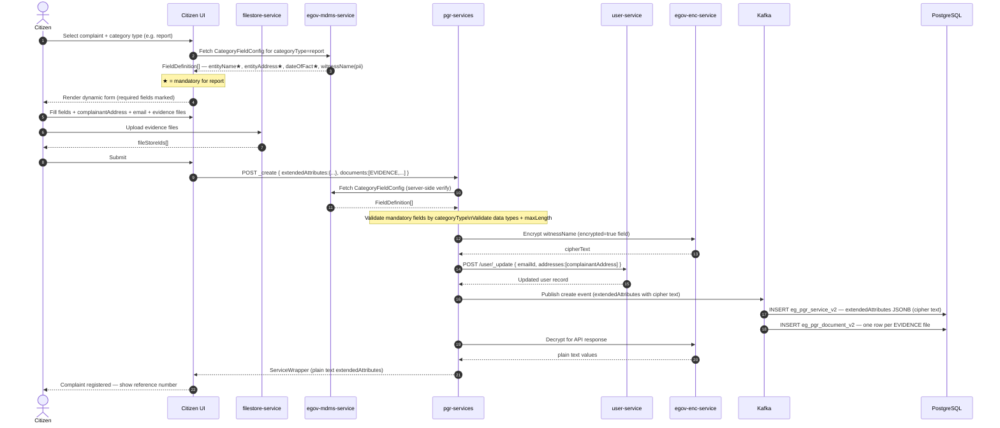
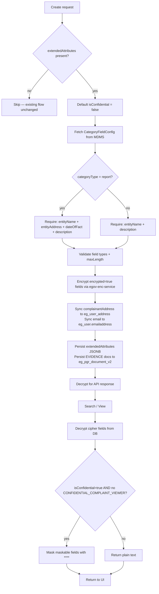

# Extended Attributes — Dynamic Category Fields for Complaint Registration

## Overview

This document covers the end-to-end design for capturing **category-specific dynamic fields**
during complaint registration. Categories can be things like Complaints, Grievances, Citizen Feedback etc.. Fields are defined per complaint `categoryType` in the
`RAINMAKER-PGR.ComplaintTemplateTypes` MDMS master. Validated data is stored in the new
`extendedAttributes` JSONB column on `eg_pgr_service_v2`. PII fields (complainant address,
email) are stored directly in the DIGIT user tables. Evidence attachments reuse the existing
`eg_pgr_document_v2` table. 

| Concern | Approach |
|---------|----------|
| Dynamic fields per category type | `RAINMAKER-PGR.ComplaintTemplateTypes` MDMS master |
| Storage (template-specific fields) | `extendedAttributes` JSONB column on `eg_pgr_service_v2` |
| Storage (complainant address) | `eg_user` / `eg_user_address` via User Service |
| Storage (complainant email) | `eg_user.emailaddress` via User Service |
| Evidence attachments | Existing `eg_pgr_document_v2` table (multiple docs per complaint) |
| Validation | Backend reads field schema from MDMS; enforces mandatory + type + template-type rules |
| PII encryption | `egov-enc-service` encrypts tagged fields before DB write; decrypts on read |
| Confidentiality | `isConfidential` flag (default `false`) in `extendedAttributes`; PII masked in all responses when set |

> **Backward compatibility guarantee:** The existing `additionalDetails` column, `Service.java`
> model, create/update flow, and all existing API consumers are **unchanged**. The new
> `extendedAttributes` column is additive. All new behaviour is opt-in via the presence of
> `service.extendedAttributes` in the request payload.

---

## 1. Database Migration

**File:** `backend/pgr-services/src/main/resources/db/migration/main/V20260621000000__add_extended_attributes.sql`

```sql
-- Additive column for citizen-supplied, category-schema-driven, PII-encrypted fields.
-- Kept separate from additionalDetails (system-managed metadata: department, serviceName,
-- escalation) to isolate concerns and allow independent schema evolution.
ALTER TABLE eg_pgr_service_v2
    ADD COLUMN IF NOT EXISTS extended_attributes JSONB;

ALTER TABLE eg_pgr_service_v2
    ADD COLUMN IF NOT EXISTS complaint_template_type varchar;

CREATE INDEX IF NOT EXISTS idx_pgr_svc_extended_attrs_gin
    ON eg_pgr_service_v2 USING GIN (extended_attributes);
```

**Resulting table columns (relevant):**

| Column | Type | Purpose |
|--------|------|---------|
| `additionalDetails` | JSONB | System metadata (department, escalation). **Existing — unchanged.** |
| `extended_attributes` | JSONB | Citizen-supplied dynamic fields + PII flags + confidentiality. **New.** |
| `complaint_template_type` | JSONB | The type of complaint - grievance, feedback, petition, report. **New.** |

---

## 2. Fields — Storage Mapping

| Field | UI Label | Type | Storage | Notes |
|-------|----------|------|---------|-------|
| `caseRelatedTo` | Case Related To | string | `extendedAttributes.fields` | Free text |
| `isConfidential` | Keep details confidential | boolean | `extendedAttributes.isConfidential` | Default `false` |
| `dateOfFact` | Date of Fact | date | `extendedAttributes.fields` | ISO-8601 `YYYY-MM-DD` |
| `entityName` | Entity Name | string | `extendedAttributes.fields` | Organisation or person involved |
| `entityAddress` | Entity Address | string | `extendedAttributes.fields` | Full address string |
| `witnessName` | Witness Name | string | `extendedAttributes.fields` | Optional; PII; encrypted |
| `witnessNote` | Witness Note | string | `extendedAttributes.fields` | Optional |
| `complainantAddress` | Complainant Address | string | `eg_user_address` via User Service | **Not** stored in extendedAttributes |
| `email` | Email Address | string | `eg_user.emailaddress` via User Service | **Not** stored in extendedAttributes |
| Evidence attachments | Supporting Documents | file[] | `eg_pgr_document_v2` | Multiple; reuses existing table |

---

## 3. Template-Type Validation Rules

| Template Type | Mandatory Fields |
|---------------|-----------------|
| `report` | `entityName`, `entityAddress`, `dateOfFact`, `description` (on `Service.description`) |
| `petition` | `description` (on `Service.description`), `entityName` |
| `grievance` | `description` (on `Service.description`), `entityName` |
| `complaint` | `description` (on `Service.description`), `entityName` |

Optional for all types: `caseRelatedTo`, `witnessName`, `witnessNote`, evidence attachments,
`dateOfFact` (except `report` where it is mandatory), `entityAddress` (except `report`).

---

## 4. MDMS Master — `ComplaintTemplateType`

**Stored at:** state tenant (`mz`), module `RAINMAKER-PGR`

**Path:** `<mdms-repo>/data/mz/RAINMAKER-PGR/ComplaintTemplateType.json`

```json
[
  {
    "templateType": "report",
    "active": true,
    "fields": [
      { "fieldKey": "caseRelatedTo",  "label": "Case Related To",  "dataType": "string", "mandatory": false, "pii": false, "maskable": false, "encrypted": false, "maxLength": 500,  "order": 1 },
      { "fieldKey": "categoryType",   "label": "Category Type",    "dataType": "string", "mandatory": true,  "pii": false, "maskable": false, "encrypted": false,                    "order": 2 },
      { "fieldKey": "entityName",     "label": "Entity Name",      "dataType": "string", "mandatory": true,  "pii": true, "maskable": false, "encrypted": false, "maxLength": 300,  "order": 3 },
      { "fieldKey": "entityAddress",  "label": "Entity Address",   "dataType": "string", "mandatory": true,  "pii": true, "maskable": false, "encrypted": false, "maxLength": 1000, "order": 4 },
      { "fieldKey": "dateOfFact",     "label": "Date of Fact",     "dataType": "date",   "mandatory": true,  "pii": false, "maskable": false, "encrypted": false,                    "order": 5 },
      { "fieldKey": "witnessName",    "label": "Witness Name",     "dataType": "string", "mandatory": false, "pii": true,  "maskable": true,  "encrypted": true,  "maxLength": 200,  "order": 6 },
      { "fieldKey": "witnessNote",    "label": "Witness Note",     "dataType": "string", "mandatory": false, "pii": false, "maskable": false, "encrypted": false, "maxLength": 1000, "order": 7 }
    ]
  },
  {
    "categoryType": "petition",
    "active": true,
    "fields": [
      { "fieldKey": "caseRelatedTo",  "label": "Case Related To",  "dataType": "string", "mandatory": false, "pii": false, "maskable": false, "encrypted": false, "maxLength": 500,  "order": 1 },
      { "fieldKey": "categoryType",   "label": "Category Type",    "dataType": "string", "mandatory": true,  "pii": false, "maskable": false, "encrypted": false,                    "order": 2 },
      { "fieldKey": "entityName",     "label": "Entity Name",      "dataType": "string", "mandatory": true,  "pii": true, "maskable": false, "encrypted": false, "maxLength": 300,  "order": 3 },
      { "fieldKey": "entityAddress",  "label": "Entity Address",   "dataType": "string", "mandatory": false, "pii": true, "maskable": false, "encrypted": false, "maxLength": 1000, "order": 4 } ,
      { "fieldKey": "witnessName",    "label": "Witness Name",     "dataType": "string", "mandatory": false, "pii": true,  "maskable": true,  "encrypted": true,  "maxLength": 200,  "order": 5},
      { "fieldKey": "witnessNote",    "label": "Witness Note",     "dataType": "string", "mandatory": false, "pii": false, "maskable": false, "encrypted": false, "maxLength": 1000, "order": 6 }
    ]
  },
  {
    "categoryType": "grievance",
    "active": true,
    "fields": [
      { "fieldKey": "caseRelatedTo",  "label": "Case Related To",  "dataType": "string", "mandatory": false, "pii": false, "maskable": false, "encrypted": false, "maxLength": 500,  "order": 1 },
      { "fieldKey": "categoryType",   "label": "Category Type",    "dataType": "string", "mandatory": true,  "pii": false, "maskable": false, "encrypted": false,                    "order": 2 },
      { "fieldKey": "entityName",     "label": "Entity Name",      "dataType": "string", "mandatory": true,  "pii": true, "maskable": false, "encrypted": false, "maxLength": 300,  "order": 3 },
      { "fieldKey": "entityAddress",  "label": "Entity Address",   "dataType": "string", "mandatory": false, "pii": true, "maskable": false, "encrypted": false, "maxLength": 1000, "order": 4 }, 
      { "fieldKey": "witnessName",    "label": "Witness Name",     "dataType": "string", "mandatory": false, "pii": true,  "maskable": true,  "encrypted": true,  "maxLength": 200,  "order": 5},
      { "fieldKey": "witnessNote",    "label": "Witness Note",     "dataType": "string", "mandatory": false, "pii": false, "maskable": false, "encrypted": false, "maxLength": 1000, "order": 6 }
    ]
  },
  {
    "categoryType": "complaint",
    "active": true,
    "fields": [
      { "fieldKey": "caseRelatedTo",  "label": "Case Related To",  "dataType": "string", "mandatory": false, "pii": false, "maskable": false, "encrypted": false, "maxLength": 500,  "order": 1 },
      { "fieldKey": "categoryType",   "label": "Category Type",    "dataType": "string", "mandatory": true,  "pii": false, "maskable": false, "encrypted": false,                    "order": 2 },
      { "fieldKey": "entityName",     "label": "Entity Name",      "dataType": "string", "mandatory": true,  "pii": true, "maskable": false, "encrypted": false, "maxLength": 300,  "order": 3 },
      { "fieldKey": "entityAddress",  "label": "Entity Address",   "dataType": "string", "mandatory": false, "pii": true, "maskable": false, "encrypted": false, "maxLength": 1000, "order": 4 },
      { "fieldKey": "witnessName",    "label": "Witness Name",     "dataType": "string", "mandatory": false, "pii": true,  "maskable": true,  "encrypted": true,  "maxLength": 200,  "order": 5 },
      { "fieldKey": "witnessNote",    "label": "Witness Note",     "dataType": "string", "mandatory": false, "pii": false, "maskable": false, "encrypted": false, "maxLength": 1000, "order": 6 }
    ]
  }
]
```

### Field Schema Reference

| Property | Type | Description |
|----------|------|-------------|
| `fieldKey` | string | Key used in `extendedAttributes.fields` JSON |
| `label` | string | UI display label |
| `dataType` | enum | `string`, `number`, `date`, `email`, `phone`, `boolean` |
| `mandatory` | boolean | Must be present and non-empty |
| `pii` | boolean | Contains Personally Identifiable Information |
| `maskable` | boolean | Replaced with `****` when confidential and caller lacks `CONFIDENTIAL_COMPLAINT_VIEWER` |
| `encrypted` | boolean | Encrypted via `egov-enc-service` before DB write |
| `maxLength` | number | Optional string length cap |
| `order` | number | Render order on the UI form |

---

## 5. `extendedAttributes` JSONB — Stored Structure

### 5.1 `report`

```json
{
  "isConfidential": false,
  "schemaVersion": "1.0",
  "encryptedFields": ["witnessName"],
  "fields": {
    "caseRelatedTo":  "Illegal dumping near residential area",
    "categoryType":   "report",
    "entityName":     "Empresa Alfa Lda",
    "entityAddress":  "Av. 24 de Julho, 123, Maputo",
    "dateOfFact":     "2026-06-15",
    "witnessName":    "<encrypted-cipher-text>",
    "witnessNote":    "Witness saw the truck arrive at night"
  }
}
```

### 5.2 `petition` (isConfidential = true)

```json
{
  "categoryType": "petition",
  "isConfidential": true,
  "schemaVersion": "1.0",
  "encryptedFields": ["witnessName"],
  "fields": {
    "caseRelatedTo":  "Unfair dismissal by employer",
    "categoryType":   "petition",
    "entityName":     "Empresa Beta SA",
    "entityAddress":  "Rua dos Trabalhadores, 45, Beira",
    "witnessName":    "<encrypted-cipher-text>",
    "witnessNote":    "Colleague present at the time of dismissal"
  }
}
```

### 5.3 `grievance` / `complaint`

```json
{
  "categoryType": "grievance",
  "isConfidential": false,
  "schemaVersion": "1.0",
  "encryptedFields": [],
  "fields": {
    "caseRelatedTo": "Public health concern",
    "categoryType":  "grievance",
    "entityName":    "Centro de Saúde da Polana",
    "entityAddress": "Av. Julius Nyerere, Maputo"
   }
}
```

> `complainantAddress` and `email` are **not** stored in this JSONB — they are persisted to
> `eg_user_address` and `eg_user.emailaddress` via the User Service.
> Evidence files reference this complaint via `eg_pgr_document_v2.service_id`.

---

## 6. Complainant Address & Email — User Service

### 6.1 Storage Targets

| Field | Stored In |
|-------|----------|
| `complainantAddress` | `eg_user_address` (linked to `eg_user.id`) |
| `email` | `eg_user.emailaddress` |

Both updated via `POST /user/_update` during complaint creation enrichment.

### 6.2 `EnrichmentService.enrichUserContactDetails()`

```java
public void enrichUserContactDetails(ServiceRequest request) {
    ExtendedAttributes ext = request.getService().getExtendedAttributes();
    if (ext == null) return;

    String address = ext.getComplainantAddress();
    String email   = ext.getEmail();
    if (address == null && email == null) return;

    User user = userService.searchByUuid(
        request.getService().getAccountId(),
        request.getRequestInfo()).getUser().get(0);

    if (email   != null) user.setEmailId(email);
    if (address != null) user.setAddresses(List.of(Address.builder()
        .type("CORRESPONDENCE").address(address)
        .tenantId(request.getService().getTenantId()).build()));

    userService.updateUser(user, request.getRequestInfo());
}
```

Runs after standard enrichment, before Kafka push.

---

## 7. Evidence Attachments — `eg_pgr_document_v2`

No schema change required. Use `document_type = 'EVIDENCE'` to distinguish from photos.

```json
{ "documentType": "EVIDENCE", "fileStoreId": "<fs-id>", "documentUid": "DOC-001",
  "additionalDetails": { "fileName": "contract.pdf", "fileSize": 204800 } }
```

**Flow:** Citizen uploads files → UI gets `fileStoreId` from filestore → sent in
`service.documents[]` with `documentType: "EVIDENCE"` → existing persister writes to
`eg_pgr_document_v2`. No backend change.

---

## 8. Backend Implementation

### 8.1 `ExtendedAttributes.java`

```java
@Data @Builder @NoArgsConstructor @AllArgsConstructor
@JsonIgnoreProperties(ignoreUnknown = true)
public class ExtendedAttributes {

    // Top-level control fields (persisted in JSONB)
    private Boolean      isConfidential;    // default false
    private String       categoryType;      // report | petition | grievance | complaint
    private String       schemaVersion;
    private List<String> encryptedFields;

    // Category-specific data (persisted in JSONB)
    private Map<String, Object> fields;

    // User-service-bound — received in API but NOT written to JSONB
    @JsonProperty("complainantAddress")
    private String complainantAddress;      // → eg_user_address

    @JsonProperty("email")
    private String email;                   // → eg_user.emailaddress

    public boolean isEncrypted(String key) {
        return encryptedFields != null && encryptedFields.contains(key);
    }
    public boolean getIsConfidentialSafe() {
        return Boolean.TRUE.equals(isConfidential);
    }
}
```

**`Service.java` — additive field (existing fields unchanged):**

```java
private ExtendedAttributes extendedAttributes;   // NEW
```

### 8.2 `CategoryFieldConfig.java` (MDMS model)

```java
@Data @NoArgsConstructor @AllArgsConstructor
@JsonIgnoreProperties(ignoreUnknown = true)
public class CategoryFieldConfig {
    private String categoryType;
    private Boolean active;
    private List<FieldDefinition> fields;

    @Data @NoArgsConstructor @AllArgsConstructor
    @JsonIgnoreProperties(ignoreUnknown = true)
    public static class FieldDefinition {
        private String  fieldKey;
        private String  label;
        private String  dataType;
        private Boolean mandatory;
        private Boolean pii;
        private Boolean maskable;
        private Boolean encrypted;
        private Integer maxLength;
        private Integer order;
    }
}
```

### 8.3 Constants (`PGRConstants.java`)

```java
public static final String MDMS_CATEGORY_FIELD_CONFIG = "CategoryFieldConfig";
public static final String CATEGORY_REPORT    = "report";
public static final String CATEGORY_PETITION  = "petition";
public static final String CATEGORY_GRIEVANCE = "grievance";
public static final String CATEGORY_COMPLAINT = "complaint";
public static final String ROLE_CONFIDENTIAL_VIEWER = "CONFIDENTIAL_COMPLAINT_VIEWER";
```

### 8.4 `MDMSUtils.fetchCategoryFieldConfig()`

```java
public CategoryFieldConfig fetchCategoryFieldConfig(RequestInfo requestInfo,
                                                     String stateTenantId,
                                                     String categoryType) {
    List<MasterDetail> details = List.of(MasterDetail.builder()
        .name(MDMS_CATEGORY_FIELD_CONFIG)
        .filter("$.[?(@.active==true && @.categoryType=='" + categoryType + "')]")
        .build());
    MdmsCriteriaReq req = MdmsCriteriaReq.builder()
        .requestInfo(requestInfo)
        .mdmsCriteria(MdmsCriteria.builder()
            .tenantId(stateTenantId)
            .moduleDetails(List.of(ModuleDetail.builder()
                .moduleName(MDMS_MODULE_NAME).masterDetails(details).build()))
            .build())
        .build();
    Object result = serviceRequestRepository.fetchResult(getMdmsSearchUrl(), req);
    List<CategoryFieldConfig> configs =
        JsonPath.read(result, "$.MdmsRes.RAINMAKER-PGR.CategoryFieldConfig");
    return (configs != null && !configs.isEmpty()) ? configs.get(0) : null;
}
```

### 8.5 `ExtendedAttributesValidationService`

```java
@Service
public class ExtendedAttributesValidationService {

    private static final Set<String> VALID_TYPES =
        Set.of(CATEGORY_REPORT, CATEGORY_PETITION, CATEGORY_GRIEVANCE, CATEGORY_COMPLAINT);

    public void validate(ExtendedAttributes ext,
                         CategoryFieldConfig config, Service service) {
        if (ext == null) return;

        if (!VALID_TYPES.contains(ext.getCategoryType()))
            throw new CustomException("INVALID_CATEGORY_TYPE",
                "categoryType must be: report, petition, grievance, complaint");

        if (service.getDescription() == null || service.getDescription().isBlank())
            throw new CustomException("DESCRIPTION_REQUIRED", "description is mandatory");

        Map<String, Object> fields =
            ext.getFields() != null ? ext.getFields() : Collections.emptyMap();

        if (CATEGORY_REPORT.equals(ext.getCategoryType())) {
            require(fields, "entityName",    "Entity Name");
            require(fields, "entityAddress", "Entity Address");
            require(fields, "dateOfFact",    "Date of Fact");
        } else {
            require(fields, "entityName", "Entity Name");
        }

        if (config == null) return;

        List<String> errors = new ArrayList<>();
        for (CategoryFieldConfig.FieldDefinition fd : config.getFields()) {
            Object val = fields.get(fd.getFieldKey());
            if (Boolean.TRUE.equals(fd.getMandatory())
                    && (val == null || val.toString().isBlank())) {
                errors.add("'" + fd.getLabel() + "' is mandatory for " + ext.getCategoryType());
                continue;
            }
            if (val == null) continue;
            String s = val.toString();
            if (fd.getMaxLength() != null && s.length() > fd.getMaxLength())
                errors.add("'" + fd.getLabel() + "' exceeds max length " + fd.getMaxLength());
            switch (fd.getDataType() == null ? "string" : fd.getDataType()) {
                case "date"   -> { try { LocalDate.parse(s); }
                                   catch (DateTimeParseException e) {
                                       errors.add("'" + fd.getLabel() + "' must be YYYY-MM-DD"); }}
                case "number" -> { try { Double.parseDouble(s); }
                                   catch (NumberFormatException e) {
                                       errors.add("'" + fd.getLabel() + "' must be a number"); }}
                case "email"  -> { if (!s.matches("^[^@\\s]+@[^@\\s]+\\.[^@\\s]+$"))
                                       errors.add("'" + fd.getLabel() + "' must be a valid email"); }
                case "phone"  -> { if (!s.matches("^\\+?[0-9]{7,15}$"))
                                       errors.add("'" + fd.getLabel() + "' must be a valid phone"); }
            }
        }
        if (!errors.isEmpty())
            throw new CustomException("EXTENDED_ATTRIBUTES_VALIDATION_ERROR",
                String.join("; ", errors));
    }

    private void require(Map<String, Object> fields, String key, String label) {
        Object val = fields.get(key);
        if (val == null || val.toString().isBlank())
            throw new CustomException("REQUIRED_FIELD_MISSING",
                label + " is mandatory for this category type");
    }
}
```

### 8.6 `EncryptionDecryptionService`

```java
@Service
public class EncryptionDecryptionService {

    @Autowired private RestTemplate restTemplate;
    @Autowired private PGRConfiguration config;

    public ExtendedAttributes encrypt(ExtendedAttributes ext, CategoryFieldConfig cfg) {
        if (ext == null || ext.getFields() == null || cfg == null) return ext;
        Map<String, Object> fields = new HashMap<>(ext.getFields());
        List<String> encKeys = new ArrayList<>();
        for (CategoryFieldConfig.FieldDefinition fd : cfg.getFields()) {
            if (!Boolean.TRUE.equals(fd.getEncrypted())) continue;
            Object raw = fields.get(fd.getFieldKey());
            if (raw == null) continue;
            fields.put(fd.getFieldKey(), callEncrypt(raw.toString()));
            encKeys.add(fd.getFieldKey());
        }
        ext.setFields(fields);
        ext.setEncryptedFields(encKeys);
        return ext;
    }

    public ExtendedAttributes decrypt(ExtendedAttributes ext) {
        if (ext == null || ext.getFields() == null
                || ext.getEncryptedFields() == null
                || ext.getEncryptedFields().isEmpty()) return ext;
        Map<String, Object> fields = new HashMap<>(ext.getFields());
        ext.getEncryptedFields().forEach(key -> {
            Object c = fields.get(key);
            if (c != null) fields.put(key, callDecrypt(c.toString()));
        });
        ext.setFields(fields);
        return ext;
    }

    public ExtendedAttributes mask(ExtendedAttributes ext, CategoryFieldConfig cfg) {
        if (ext == null || ext.getFields() == null || cfg == null) return ext;
        Map<String, Object> fields = new HashMap<>(ext.getFields());
        cfg.getFields().stream()
            .filter(fd -> Boolean.TRUE.equals(fd.getMaskable())
                       && fields.containsKey(fd.getFieldKey()))
            .forEach(fd -> fields.put(fd.getFieldKey(), "****"));
        ext.setFields(fields);
        return ext;
    }

    private String callEncrypt(String plain) {
        Map<?, ?> r = restTemplate.postForObject(
            config.getEncHost() + config.getEncEncryptEndpoint(),
            Map.of("value", plain, "keyId", config.getEncKeyId()), Map.class);
        return r != null ? (String) r.get("cipherText") : plain;
    }

    private String callDecrypt(String cipher) {
        Map<?, ?> r = restTemplate.postForObject(
            config.getEncHost() + config.getEncDecryptEndpoint(),
            Map.of("value", cipher, "keyId", config.getEncKeyId()), Map.class);
        return r != null ? (String) r.get("plainText") : cipher;
    }
}
```

### 8.7 `PGRService.create()` — New Steps (inserted after existing enrichment)

```java
// NEW block — existing steps before and after are unchanged
ExtendedAttributes ext = service.getExtendedAttributes();
if (ext != null) {
    if (ext.getIsConfidential() == null) ext.setIsConfidential(false);

    CategoryFieldConfig cfg = mdmsUtils.fetchCategoryFieldConfig(
        request.getRequestInfo(), stateTenant, ext.getCategoryType());

    extendedAttributesValidationService.validate(ext, cfg, service);

    if (cfg != null)
        service.setExtendedAttributes(encryptionDecryptionService.encrypt(ext, cfg));

    enrichmentService.enrichUserContactDetails(request);
}
// After Kafka push — decrypt for response:
if (service.getExtendedAttributes() != null)
    service.setExtendedAttributes(
        encryptionDecryptionService.decrypt(service.getExtendedAttributes()));
```

### 8.8 `PGRService.search()` — Decrypt + Mask

```java
for (ServiceWrapper wrapper : serviceWrappers) {
    Service svc = wrapper.getService();
    if (svc.getExtendedAttributes() == null) continue;

    CategoryFieldConfig cfg = mdmsUtils.fetchCategoryFieldConfig(
        requestInfo, stateTenant, svc.getExtendedAttributes().getCategoryType());

    svc.setExtendedAttributes(encryptionDecryptionService.decrypt(svc.getExtendedAttributes()));

    if (svc.getExtendedAttributes().getIsConfidentialSafe()
            && !hasRole(requestInfo, ROLE_CONFIDENTIAL_VIEWER))
        svc.setExtendedAttributes(encryptionDecryptionService.mask(svc.getExtendedAttributes(), cfg));
}
```

### 8.9 Row Mapper

```java
String extJson = rs.getString("extendedattributes");
if (extJson != null)
    service.setExtendedAttributes(objectMapper.readValue(extJson, ExtendedAttributes.class));
```

### 8.10 Persister YAML

```yaml
- jsonPath: $.service.extendedAttributes
  type: JSON
  dbType: JSONB
```

Add to both INSERT (create) and UPDATE persister query maps.

---

## 9. API Contract

### 9.1 Create Request

```json
POST /pgr-services/v2/request/_create?tenantId=mz.ige
{
  "service": {
    "tenantId": "mz.ige", "serviceCode": "REPORT_ENV", "source": "web",
    "description": "Illegal dumping causing health hazard near Escola Primária",
    "address": { "locality": { "code": "LOC_001" },
                 "geoLocation": { "latitude": -25.9, "longitude": 32.5 } },
    "extendedAttributes": {
      "categoryType":       "report",
      "isConfidential":     false,
      "complainantAddress": "Av. Eduardo Mondlane, 200, Maputo",
      "email":              "citizen@example.com",
      "fields": {
        "caseRelatedTo":  "Environmental pollution",
        "categoryType":   "report",
        "entityName":     "Empresa Alfa Lda",
        "entityAddress":  "Av. 24 de Julho, 123, Maputo",
        "dateOfFact":     "2026-06-15",
        "witnessName":    "Maria da Silva",
        "witnessNote":    "Saw the truck arrive at night"
      }
    },
    "documents": [
      { "documentType": "EVIDENCE", "fileStoreId": "fs-uuid-1" },
      { "documentType": "EVIDENCE", "fileStoreId": "fs-uuid-2" }
    ]
  },
  "workflow": { "action": "APPLY" }
}
```

### 9.2 Search Response — Unmasked (caller has `CONFIDENTIAL_COMPLAINT_VIEWER` or `isConfidential=false`)

```json
{
  "extendedAttributes": {
    "categoryType": "report", "isConfidential": false,
    "encryptedFields": ["witnessName"],
    "fields": {
      "caseRelatedTo": "Environmental pollution", "categoryType": "report",
      "entityName": "Empresa Alfa Lda", "entityAddress": "Av. 24 de Julho, 123, Maputo",
      "dateOfFact": "2026-06-15", "witnessName": "Maria da Silva",
      "witnessNote": "Saw the truck arrive at night"
    }
  }
}
```

### 9.3 Search Response — Confidential + No Viewer Role

```json
{
  "extendedAttributes": {
    "categoryType": "petition", "isConfidential": true,
    "fields": {
      "caseRelatedTo": "Unfair dismissal", "categoryType": "petition",
      "entityName": "****", "entityAddress": "****",
      "witnessName": "****"
    }
  }
}
```

---

## 10. Sequence Diagrams

### 10.1 Create — Extended Attributes + Encryption



### 10.2 View — Decrypt + Confidentiality Masking

```mermaid
sequenceDiagram
    autonumber

    actor Caller
    participant UI as UI
    participant PGR as pgr-services
    participant DB as PostgreSQL
    participant ENC as egov-enc-service
    participant MDMS as egov-mdms-service

    Caller->>UI: Open complaint detail
    UI->>PGR: POST /pgr-services/v2/request/_search

    PGR->>DB: SELECT eg_pgr_service_v2 + eg_pgr_document_v2
    DB-->>PGR: Row with extendedAttributes (cipher text), documents[]

    PGR->>ENC: Decrypt encryptedFields[]
    ENC-->>PGR: Plain text

    PGR->>MDMS: Fetch CategoryFieldConfig for categoryType
    MDMS-->>PGR: FieldDefinition[] (maskable flags)

    alt isConfidential=true AND no CONFIDENTIAL_COMPLAINT_VIEWER role
        Note over PGR: Replace maskable fields with ****
        PGR-->>UI: Masked extendedAttributes
        UI-->>Caller: Confidential banner; witness fields shown as ●●●●
    else caller has viewer role OR isConfidential=false
        PGR-->>UI: Plain text extendedAttributes
        UI-->>Caller: All fields visible
    end
```

### 10.3 Decision Flowchart



---

## 11. Frontend Summary

| Component | Change |
|-----------|--------|
| `FormValues` | Add `categoryType`, `isConfidential`, `complainantAddress`, `email`, `caseRelatedTo`, `entityName`, `entityAddress`, `dateOfFact`, `witnessName`, `witnessNote`, `evidenceFiles[]` |
| `useCategoryFieldConfig` hook | Fetch `CategoryFieldConfig` from MDMS by `categoryType` (state tenant) |
| New wizard step | Category type selector, complainant address + email, dynamic MDMS-driven fields, confidentiality toggle, evidence uploader |
| Submit payload | Include `extendedAttributes`; merge EVIDENCE docs into `documents[]` |
| Complaint detail view | `ExtendedAttributesView` with confidential banner and `****` → `●●●●` masking |

---

## 12. Configuration

```properties
# application.properties — new properties only
egov.enc.host=http://egov-enc-service:8080
egov.enc.encrypt.endpoint=/crypto/v1/_encrypt
egov.enc.decrypt.endpoint=/crypto/v1/_decrypt
egov.enc.key.id=pgr-pii-key
```

### Role — `CONFIDENTIAL_COMPLAINT_VIEWER`

```json
{
  "code": "CONFIDENTIAL_COMPLAINT_VIEWER",
  "roleName": "Confidential Complaint Viewer",
  "description": "Grants access to unmasked PII in confidential complaint extendedAttributes"
}
```

Grant to: `PGR_ADMIN`, `GRIEVANCE_OFFICER`.  
Do **not** grant to: self-service `CITIZEN` role.

---

## 13. Implementation Checklist

### Phase 1 — Database & MDMS
- [ ] Apply `V20260621000000__add_extended_attributes.sql`
- [ ] Create `CategoryFieldConfig.json` in MDMS (4 category types)
- [ ] Register `CONFIDENTIAL_COMPLAINT_VIEWER` role in access-control master
- [ ] Register `pgr-pii-key` in `egov-enc-service`

### Phase 2 — Backend
- [ ] `ExtendedAttributes.java` model
- [ ] `CategoryFieldConfig.java` MDMS model
- [ ] Constants in `PGRConstants.java`
- [ ] `fetchCategoryFieldConfig()` in `MDMSUtils.java`
- [ ] `extendedAttributes` field on `Service.java` (additive)
- [ ] `ExtendedAttributesValidationService.java`
- [ ] `EncryptionDecryptionService.java`
- [ ] `enrichUserContactDetails()` in `EnrichmentService.java`
- [ ] `PGRService.create()` — validate → encrypt → user sync → Kafka → decrypt-for-response
- [ ] `PGRService.search()` — decrypt → mask
- [ ] `PGRRowMapper` — map `extendedattributes` column
- [ ] Persister YAML — `extendedAttributes` JSONB in INSERT + UPDATE

### Phase 3 — Frontend
- [ ] Extend `FormValues`
- [ ] `useCategoryFieldConfig` hook
- [ ] `CategoryDetailsForm` component (MDMS-driven dynamic fields)
- [ ] `EvidenceUploader` component (multi-file; `documentType: EVIDENCE`)
- [ ] New wizard step
- [ ] Updated submit payload builder
- [ ] `ExtendedAttributesView` in complaint detail

### Phase 4 — Testing
- [ ] Unit: `ExtendedAttributesValidationService` — all four category types, mandatory rules
- [ ] Unit: `EncryptionDecryptionService` — round-trip, mask
- [ ] Integration: create `report` → DB has cipher text for `witnessName`
- [ ] Integration: `isConfidential=true` + no viewer role → `****` in response
- [ ] Integration: `CONFIDENTIAL_COMPLAINT_VIEWER` role → plain text
- [ ] Integration: `eg_user.emailaddress` + `eg_user_address` updated after create
- [ ] Integration: evidence files in `eg_pgr_document_v2` with `document_type = EVIDENCE`

---

## 14. Summary of Design Decisions

| Decision | Rationale |
|----------|-----------|
| `extendedAttributes` column (separate from `additionalDetails`) | No impact on existing consumers; system metadata and citizen-supplied data evolve independently |
| `categoryType` drives validation (not `serviceCode`) | Many service codes share rules; adding a new service code needs no backend change |
| `complainantAddress` + `email` → User Service | PII anchored to user identity, consistent with DIGIT data model |
| Evidence reuses `eg_pgr_document_v2` | Zero schema change; `documentType=EVIDENCE` distinguishes from photos |
| `isConfidential` defaults to `false` | Opt-in confidentiality; no masking unless citizen explicitly requests it |
| `witnessName` encrypted, `witnessNote` plain | Identity is PII; operational notes are for case officers |
| `CONFIDENTIAL_COMPLAINT_VIEWER` role | Fine-grained access — officers see PII; citizen portal never receives other citizens' raw PII |
| Encrypt before Kafka push | No PII in message bus logs |
| Decrypt in-process for API response | No client-side key management required |
