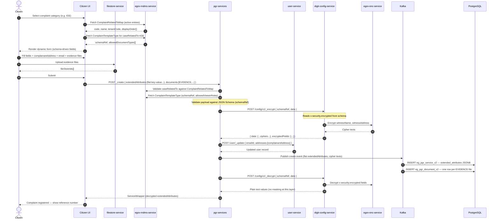
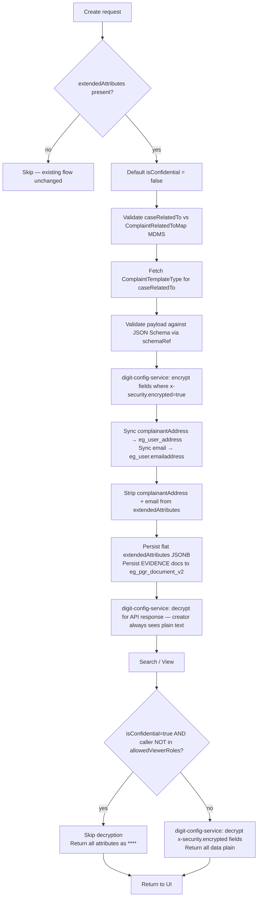

# Extended Attributes — Dynamic Category Fields for Complaint Registration

## Overview

This document covers the end-to-end design for capturing **category-specific dynamic fields**
during complaint registration. The complaint type is looked up from the new
`RAINMAKER-PGR.ComplaintRelatedToMap` MDMS master; the matching entry in
`RAINMAKER-PGR.ComplaintTemplateType` provides the JSON-Schema reference, allowed document
types, and permitted viewer roles. Validated data is stored flat in the new
`extendedAttributes` JSONB column on `eg_pgr_service_v2`. PII fields (complainant address,
email) are stored in DIGIT user tables. Evidence attachments reuse the existing
`eg_pgr_document_v2` table.

| Concern | Approach |
|---------|----------|
| Complaint-type lookup | `RAINMAKER-PGR.ComplaintRelatedToMap` MDMS master |
| Form schema per type | `RAINMAKER-PGR.ComplaintTemplateType` — `schemaRef` → JSON Schema |
| Storage (dynamic fields) | `extendedAttributes` JSONB column — **flat key-value, no nested `fields` object** |
| Storage (complainant address) | `eg_user` / `eg_user_address` via User Service |
| Storage (complainant email) | `eg_user.emailaddress` via User Service |
| Evidence attachments | `eg_pgr_document_v2` — type code from `ComplaintTemplateType.allowedDocumentTypes` |
| Validation | Backend loads JSON Schema by `schemaRef`; enforces type + mandatory rules |
| Encryption at rest | `digit-config-service` reads `x-security.encrypted` from JSON Schema; calls `egov-enc-service` |
| Masking / visibility | Driven by `isConfidential` + `allowedViewerRoles` + **caller identity**. Applies to both `extendedAttributes` JSONB fields and the `citizen` PII object returned in search responses. |
| Confidentiality | `isConfidential=false` → all data visible. `isConfidential=true` + caller in `allowedViewerRoles` → full plain text. `isConfidential=true` + caller is complaint creator → full plain text (self-access). `isConfidential=true` + none of the above → `extendedAttributes` all `****`, citizen PII all `****`. |
| Citizen self-access | The citizen who created the complaint (`userInfo.uuid == service.accountId`) always receives their own user PII and decrypted `extendedAttributes` regardless of `isConfidential`. |

Schema files (JSON Schema draft-07 with `x-security` extensions):

```
utilities/default-data-handler/src/main/resources/schema/ComplaintRelatedToMap.json
utilities/default-data-handler/src/main/resources/schema/IgeComplaintExtendedAttributes.json
utilities/default-data-handler/src/main/resources/schema/IgsaeComplaintExtendedAttributes.json
```

MDMS seed data:

```
utilities/default-data-handler/src/main/resources/mdmsData-dev/RAINMAKER-PGR/RAINMAKER-PGR.ComplaintRelatedToMap.json
utilities/default-data-handler/src/main/resources/mdmsData-dev/RAINMAKER-PGR/RAINMAKER-PGR.ComplaintTemplateType.json
```

Localization messages (add to existing XLSX files):

```
utilities/default-data-handler/src/main/resources/localisations-dev/localizations (en_IN).xlsx
utilities/default-data-handler/src/main/resources/localisations-dev/localizations (default).xlsx
```

> **Backward compatibility guarantee:** The existing `additionalDetails` column, `Service.java`
> model, create/update flow, and all existing API consumers are **unchanged**. The new
> `extendedAttributes` column is additive. All new behaviour is opt-in via the presence of
> `service.extendedAttributes` in the request payload.

---

## 1. Database Migration

**File:** `backend/pgr-services/src/main/resources/db/migration/main/V20260621000000__add_extended_attributes.sql`

```sql
-- Additive column for citizen-supplied, category-schema-driven, PII-encrypted fields.
ALTER TABLE eg_pgr_service_v2
    ADD COLUMN IF NOT EXISTS extended_attributes JSONB;

-- Targeted B-tree expression indexes on the two fields used in search predicates.
-- A full GIN index on the entire JSONB column would be unnecessarily broad and expensive
-- to maintain; GIN is only warranted if @> containment queries are needed in future.
CREATE INDEX IF NOT EXISTS idx_pgr_ext_case_related_to
    ON eg_pgr_service_v2 ((extended_attributes->>'caseRelatedTo'));

CREATE INDEX IF NOT EXISTS idx_pgr_ext_is_confidential
    ON eg_pgr_service_v2 ((extended_attributes->>'isConfidential'));
```

**Resulting table columns (relevant):**

| Column | Type | Purpose |
|--------|------|---------|
| `additionalDetails` | JSONB | System metadata (department, escalation). **Existing — unchanged.** |
| `extended_attributes` | JSONB | Citizen-supplied dynamic fields. **New — flat key-value.** |

---

## 2. Fields — Storage Mapping

All dynamic fields are stored **directly** in `extendedAttributes` (no nested `fields` object).

| Field | UI Label | Type | Storage | Encrypted |
|-------|----------|------|---------|-----------|
| `caseRelatedTo` | Case Related To | string | `extendedAttributes.caseRelatedTo` | — (control field) |
| `isConfidential` | Keep details confidential | boolean | `extendedAttributes.isConfidential` | — (drives all masking) |
| `hierarchyLevel1` | Complaint Category | string | `extendedAttributes.hierarchyLevel1` | ✗ |
| `hierarchyLevel2` | Complaint Sub-type | string | `extendedAttributes.hierarchyLevel2` | ✗ |
| `instituteName` | Institute Name | string | `extendedAttributes.instituteName` | **✓** (in `x-security`, IGE) |
| `dateOfFact` | Date of Fact | date | `extendedAttributes.dateOfFact` | **✓** (in `x-security`, IGSAE) |
| `entityName` | Entity Name | string | `extendedAttributes.entityName` | **✓** (in `x-security`, IGSAE) |
| `entityAddress` | Entity Address | string | `extendedAttributes.entityAddress` | **✓** (in `x-security`, IGSAE) |
| `witnessName` | Witness Name | string | `extendedAttributes.witnessName` | **✓** (in `x-security`, both) |
| `witnessAddress` | Witness Address | string | `extendedAttributes.witnessAddress` | **✓** (in `x-security`, both) |
| `witnessNote` | Witness Note | string | `extendedAttributes.witnessNote` | **✓** (in `x-security`, both) |
| `complainantAddress` | Complainant Address | string | `eg_user_address` via User Service | **Not** stored in extendedAttributes |
| `email` | Email Address | string | `eg_user.emailaddress` via User Service | **Not** stored in extendedAttributes |
| Evidence attachments | Supporting Documents | file[] | `eg_pgr_document_v2` | Type code from `allowedDocumentTypes` |

> **Encrypted fields** are declared once in the schema-level `x-security` array (see § 4.3).
> **Masking is all-or-nothing** — when `isConfidential=true` and the caller lacks
> `CONFIDENTIAL_COMPLAINT_VIEWER`, every attribute is returned as `****` and decryption is
> skipped entirely.

---

## 3. Template-Type Validation Rules

| Case Related To | Mandatory Fields |
|-----------------|-----------------|
| `IGE`   | `instituteName`, `description` (on `Service.description`) |
| `IGSAE` | `entityName`, `entityAddress`, `dateOfFact`, `description` (on `Service.description`) |

Mandatory rules are enforced via the JSON Schema referenced in `ComplaintTemplateType.schemaRef`.
Optional for all types: `witnessName`, `witnessAddress`, `witnessNote`, evidence attachments.

---

## 4. MDMS Masters

All masters are stored under state tenant `mz`, module `RAINMAKER-PGR`.

### 4.1 `ComplaintRelatedToMap` (NEW)

**Purpose:** Lookup table of complaint categories. Each entry maps a category code to its
sub-tenant, display metadata, and ordering. `ComplaintTemplateType.caseRelatedTo` references a
`code` from this master.

**Schema:** `utilities/default-data-handler/src/main/resources/schema/ComplaintRelatedToMap.json`

**Dev seed:** `utilities/default-data-handler/src/main/resources/mdmsData-dev/RAINMAKER-PGR/RAINMAKER-PGR.ComplaintRelatedToMap.json`

```json
[
  {
    "code": "IGE",
    "name": "Inspeccão Geral do Estado",
    "active": true,
    "tenantCode": "mz.ige",
    "shortName": "IGE",
    "tenantId": "mz",
    "displayOrder": 1
  },
  {
    "code": "IGSAE",
    "name": "Inspecção-Geral dos Serviços de Administração do Estado",
    "active": true,
    "tenantCode": "mz.igsae",
    "shortName": "IGSAE",
    "tenantId": "mz",
    "displayOrder": 2
  }
]
```

| Property | Type | Description |
|----------|------|-------------|
| `code` | string | Unique category code (FK in `ComplaintTemplateType.caseRelatedTo`) |
| `name` | string | Full display name (also used as localization fallback) |
| `active` | boolean | Whether the category is currently available |
| `tenantCode` | string | Sub-tenant code (e.g. `mz.ige`) |
| `shortName` | string | Abbreviated label for UI chips / dropdowns |
| `tenantId` | string | Parent state tenant (e.g. `mz`) |
| `displayOrder` | integer | Sort order for UI lists |

---

### 4.2 `ComplaintTemplateType`

**Purpose:** Links each complaint category to its JSON Schema, allowed document types, and the
role(s) permitted to view confidential data. Field-level encryption and masking are declared
via `x-security` extensions inside the referenced JSON Schema (§ 4.3) — not inline here.

**Dev seed:** `utilities/default-data-handler/src/main/resources/mdmsData-dev/RAINMAKER-PGR/RAINMAKER-PGR.ComplaintTemplateType.json`

```json
[
  {
    "caseRelatedTo": "IGE",
    "active": true,
    "schemaRef": "IgeComplaintExtendedAttributes",
    "allowedDocumentTypes": ["EVIDENCE"],
    "allowedViewerRoles": ["CONFIDENTIAL_COMPLAINT_VIEWER"]
  },
  {
    "caseRelatedTo": "IGSAE",
    "active": true,
    "schemaRef": "IgsaeComplaintExtendedAttributes",
    "allowedDocumentTypes": ["EVIDENCE"],
    "allowedViewerRoles": ["CONFIDENTIAL_COMPLAINT_VIEWER"]
  }
]
```

| Property | Type | Description |
|----------|------|-------------|
| `caseRelatedTo` | string | Foreign key → `ComplaintRelatedToMap.code` |
| `active` | boolean | Template in use |
| `schemaRef` | string | JSON Schema `$id` — used for both payload validation and `x-security` lookup |
| `allowedDocumentTypes` | string[] | Permitted `documentType` codes from `DocumentType` MDMS master |
| `allowedViewerRoles` | string[] | Roles that may view unmasked confidential complaint data |

---

### 4.3 `x-security` Schema Extension

Encrypted fields are declared **once at the schema level** as a top-level `x-security` array
(`x-` prefix, ignored by standard JSON Schema validators). This mirrors the same pattern used by
`required` — a single array listing field names — rather than annotating each property
individually.

```json
{
  "required":   ["caseRelatedTo", "instituteName"],
  "x-security": ["witnessName", "witnessAddress"],
  "properties": { ... }
}
```

`digit-config-service` reads `x-security` when PGR calls its encrypt/decrypt APIs and calls
`egov-enc-service` for exactly those fields. Properties not in the array are left untouched.

**Is `maskable` needed?  No.**  
Masking is **not** a per-field decision. It is all-or-nothing, driven by:

1. `isConfidential` flag on the complaint (set by the citizen).
2. Whether the caller has a role listed in `ComplaintTemplateType.allowedViewerRoles`.

| `isConfidential` | Caller in `allowedViewerRoles` | Action |
|-----------------|-------------------------------|--------|
| `false` | any | Decrypt `x-security` fields; return all data plain |
| `true` | yes | Decrypt `x-security` fields; return all data plain |
| `true` | no | **Skip decryption entirely**; return all attributes as `****` |

**IGE — `x-security`: `["instituteName", "witnessName", "witnessAddress", "witnessNote"]`**

| Field | In `x-security` |
|-------|----------------|
| `instituteName` | **✓** |
| `witnessName` | **✓** |
| `witnessAddress` | **✓** |
| `witnessNote` | **✓** |

**IGSAE — `x-security`: `["dateOfFact", "entityName", "entityAddress", "witnessName", "witnessAddress", "witnessNote"]`**

| Field | In `x-security` |
|-------|----------------|
| `dateOfFact` | **✓** |
| `entityName` | **✓** |
| `entityAddress` | **✓** |
| `witnessName` | **✓** |
| `witnessAddress` | **✓** |
| `witnessNote` | **✓** |

**How `digit-config-service` uses `x-security`:**

1. PGR calls `POST /digit-config-service/v1/_encrypt` with `{ schemaRef, data }`.
2. Config-service loads the schema by `$id`, reads the top-level `x-security` array, encrypts those field values via `egov-enc-service`, and returns the updated data. No `encryptedFields` list is returned or stored — the schema is the source of truth.
3. PGR calls `POST /digit-config-service/v1/_decrypt` with `{ schemaRef, data }` — no roles passed; masking is handled by PGR, not by digit-config-service.
4. Config-service reads the same `x-security` array from the schema, decrypts exactly those fields, and returns plain text.

---

### 4.4 `CONFIDENTIAL_COMPLAINT_VIEWER` Role (NEW)

A new DIGIT role must be created and granted to the relevant user types.

**Role definition** (add to MDMS `ACCESSCONTROL-ROLES.json` or equivalent):

```json
{
  "code": "CONFIDENTIAL_COMPLAINT_VIEWER",
  "name": "Confidential Complaint Viewer",
  "description": "Grants access to unmasked PII fields and confidential extendedAttributes on complaints"
}
```

**Role-action mappings** (add to `ACCESSCONTROL-ROLEACTIONS.json`):

| Action | API | Method |
|--------|-----|--------|
| Search complaints (unmasked) | `/pgr-services/v2/request/_search` | POST |

**Grant to:** `PGR_ADMIN`, `GRIEVANCE_OFFICER`  
**Do not grant to:** `CITIZEN` (self-service role)

---

## 5. `extendedAttributes` JSONB — Stored Structure (Flat)

All dynamic fields are stored at the **top level** of the JSONB object. There is no nested
`fields` sub-object.

### 5.1 `IGE`

```json
{
  "caseRelatedTo":    "IGE",
  "isConfidential":   false,
  "schemaVersion":    "1.0",
  "hierarchyLevel1": "Garbage",
  "hierarchyLevel2": "BurningOfGarbage",
  "instituteName":    "<encrypted-cipher-text>",
  "witnessName":      "<encrypted-cipher-text>",
  "witnessAddress":   "<encrypted-cipher-text>",
  "witnessNote":      "<encrypted-cipher-text>"
}
```

### 5.2 `IGSAE` (isConfidential = true)

```json
{
  "caseRelatedTo":    "IGSAE",
  "isConfidential":   true,
  "schemaVersion":    "1.0",
  "hierarchyLevel1": "StreetLights",
  "hierarchyLevel2": "StreetLightNotWorking",
  "dateOfFact":       "<encrypted-cipher-text>",
  "entityName":       "<encrypted-cipher-text>",
  "entityAddress":    "<encrypted-cipher-text>",
  "witnessName":      "<encrypted-cipher-text>",
  "witnessAddress":   "<encrypted-cipher-text>",
  "witnessNote":      "<encrypted-cipher-text>"
}
```

> `complainantAddress` and `email` are **not** stored here — persisted to `eg_user_address`
> and `eg_user.emailaddress` via the User Service.
> Evidence files reference this complaint via `eg_pgr_document_v2.service_id`.

---

## 6. Complainant Address & Email — User Service

### 6.1 Storage Targets

| Field | Stored In |
|-------|----------|
| `complainantAddress` | `eg_user_address` (linked to `eg_user.id`) |
| `email` | `eg_user.emailaddress` |

Both updated via `POST /user/_update` during complaint creation enrichment.

### 6.2 `EnrichmentService.enrichUserContactDetails()`

```java
public void enrichUserContactDetails(ServiceRequest request) {
    ExtendedAttributes ext = request.getService().getExtendedAttributes();
    if (ext == null) return;

    String address = ext.getComplainantAddress();
    String email   = ext.getEmail();
    if (address == null && email == null) return;

    User user = userService.searchByUuid(
        request.getService().getAccountId(),
        request.getRequestInfo()).getUser().get(0);

    if (email   != null) user.setEmailId(email);
    if (address != null) user.setAddresses(List.of(Address.builder()
        .type("CORRESPONDENCE").address(address)
        .tenantId(request.getService().getTenantId()).build()));

    userService.updateUser(user, request.getRequestInfo());
}
```

Runs after standard enrichment, before Kafka push.

---

## 7. Evidence Attachments — `eg_pgr_document_v2`

No schema change required. The document type code (`EVIDENCE`) comes from
`ComplaintTemplateType.allowedDocumentTypes` — the backend reads this list from MDMS and
validates the caller-supplied `documentType` against it, rather than hardcoding the string.

```json
{ "documentType": "EVIDENCE", "fileStoreId": "<fs-id>", "documentUid": "DOC-001",
  "additionalDetails": { "fileName": "contract.pdf", "fileSize": 204800 } }
```

The `EVIDENCE` code must exist in the `DocumentType` MDMS master
(`RAINMAKER-PGR.DocumentType` or `common-masters.DocumentType`).

**Flow:** Citizen uploads files → UI gets `fileStoreId` from filestore → sent in
`service.documents[]` with `documentType` matching a code in `allowedDocumentTypes` →
existing persister writes to `eg_pgr_document_v2`.

---

## 8. Backend Implementation

### 8.1 `ExtendedAttributes.java`

All dynamic key-value pairs are stored **inline** using `@JsonAnySetter` / `@JsonAnyGetter`.
The `complainantAddress` and `email` are received from the API payload but stripped before
the Kafka push (extracted by `EnrichmentService` and forwarded to the User Service).

```java
@Data @NoArgsConstructor
@JsonIgnoreProperties(ignoreUnknown = false)
@JsonInclude(JsonInclude.Include.NON_NULL)
public class ExtendedAttributes {

    // Top-level control fields (persisted in JSONB)
    private Boolean isConfidential;   // default false
    private String  caseRelatedTo;    // code from ComplaintRelatedToMap master
    private String  schemaVersion;

    // Flat dynamic key-value fields serialised inline via @JsonAnyGetter
    @JsonIgnore
    private Map<String, Object> attributes = new LinkedHashMap<>();

    @JsonAnySetter
    public void setAttribute(String key, Object value) { attributes.put(key, value); }

    @JsonAnyGetter
    public Map<String, Object> getAttributes() { return attributes; }

    // User-service-bound — received in API but stripped before JSONB persistence
    @JsonProperty("complainantAddress")
    private String complainantAddress;

    @JsonProperty("email")
    private String email;

    public boolean getIsConfidentialSafe() { return Boolean.TRUE.equals(isConfidential); }
}
// Note: encryptedFields is NOT stored. digit-config-service reads x-security from the
// registered schema to know which fields to encrypt/decrypt — no runtime tracking needed.
```

**`Service.java` — additive field (existing fields unchanged):**

```java
private ExtendedAttributes extendedAttributes;   // NEW
```

### 8.2 `ComplaintTemplateTypeConfig.java` (MDMS model)

The previous `CategoryFieldConfig` with per-field `pii`/`maskable`/`encrypted` flags is replaced
by this simpler model. Field-level security is declared in the JSON Schema via `x-security` (§ 4.3).

```java
@Data @NoArgsConstructor @AllArgsConstructor
@JsonIgnoreProperties(ignoreUnknown = true)
public class ComplaintTemplateTypeConfig {
    private String       caseRelatedTo;
    private Boolean      active;
    private String       schemaRef;
    private List<String> allowedDocumentTypes;
    private List<String> allowedViewerRoles;
}
```

### 8.3 Constants (`PGRConstants.java`)

```java
public static final String MDMS_COMPLAINT_TEMPLATE_TYPE  = "ComplaintTemplateType";
public static final String MDMS_COMPLAINT_RELATED_TO_MAP = "ComplaintRelatedToMap";
public static final String CATEGORY_IGE   = "IGE";
public static final String CATEGORY_IGSAE = "IGSAE";

// Role that grants access to unmasked confidential complaint data.
// Must match the code registered in ACCESSCONTROL-ROLES MDMS master.
public static final String ROLE_CONFIDENTIAL_VIEWER = "CONFIDENTIAL_COMPLAINT_VIEWER";
```

### 8.4 `MDMSUtils.fetchComplaintTemplateTypeConfig()`

```java
public ComplaintTemplateTypeConfig fetchComplaintTemplateTypeConfig(RequestInfo requestInfo,
                                                                     String stateTenantId,
                                                                     String caseRelatedTo) {
    List<MasterDetail> details = List.of(MasterDetail.builder()
        .name(MDMS_COMPLAINT_TEMPLATE_TYPE)
        .filter("$.[?(@.active==true && @.caseRelatedTo=='" + caseRelatedTo + "')]")
        .build());
    MdmsCriteriaReq req = MdmsCriteriaReq.builder()
        .requestInfo(requestInfo)
        .mdmsCriteria(MdmsCriteria.builder()
            .tenantId(stateTenantId)
            .moduleDetails(List.of(ModuleDetail.builder()
                .moduleName(MDMS_MODULE_NAME).masterDetails(details).build()))
            .build())
        .build();
    Object result = serviceRequestRepository.fetchResult(getMdmsSearchUrl(), req);
    List<ComplaintTemplateTypeConfig> configs =
        JsonPath.read(result, "$.MdmsRes.RAINMAKER-PGR.ComplaintTemplateType");
    return (configs != null && !configs.isEmpty()) ? configs.get(0) : null;
}

public boolean isValidCaseRelatedTo(RequestInfo requestInfo,
                                     String stateTenantId, String code) {
    List<MasterDetail> details = List.of(MasterDetail.builder()
        .name(MDMS_COMPLAINT_RELATED_TO_MAP)
        .filter("$.[?(@.active==true && @.code=='" + code + "')]")
        .build());
    // ... build and execute MdmsCriteriaReq (same pattern as above) ...
    List<?> results = JsonPath.read(result, "$.MdmsRes.RAINMAKER-PGR.ComplaintRelatedToMap");
    return results != null && !results.isEmpty();
}
```

### 8.5 `ExtendedAttributesValidationService`

Validation runs against the JSON Schema (fetched via `schemaRef`) and validates `caseRelatedTo`
against the `ComplaintRelatedToMap` master.

```java
@Service
public class ExtendedAttributesValidationService {

    public void validate(ExtendedAttributes ext,
                         ComplaintTemplateTypeConfig config, Service service,
                         RequestInfo requestInfo, String stateTenantId) {
        if (ext == null) return;

        if (!mdmsUtils.isValidCaseRelatedTo(requestInfo, stateTenantId, ext.getCaseRelatedTo()))
            throw new CustomException("INVALID_CASE_RELATED_TO",
                "caseRelatedTo must be an active code in ComplaintRelatedToMap");

        if (service.getDescription() == null || service.getDescription().isBlank())
            throw new CustomException("DESCRIPTION_REQUIRED", "description is mandatory");

        if (config != null && config.getSchemaRef() != null) {
            JsonSchema schema = schemaLoader.load(config.getSchemaRef());
            Set<ValidationMessage> errors = schema.validate(toJsonNode(ext));
            if (!errors.isEmpty())
                throw new CustomException("EXTENDED_ATTRIBUTES_VALIDATION_ERROR",
                    errors.stream().map(ValidationMessage::getMessage)
                          .collect(Collectors.joining("; ")));
        }
    }
}
```

### 8.6 `EncryptionDecryptionService`

Encryption and masking are delegated to **`digit-config-service`**, which reads `x-security`
from the JSON Schema identified by `schemaRef` and calls `egov-enc-service` internally.
The PGR service does not iterate per-field flags — it passes the schema reference and the
flat attribute map.

```java
@Service
public class EncryptionDecryptionService {

    @Autowired private DigitConfigClient digitConfigClient;

    public ExtendedAttributes encrypt(ExtendedAttributes ext, String schemaRef) {
        if (ext == null || schemaRef == null) return ext;
        // digit-config-service reads x-security.encrypted from schema,
        // encrypts matching fields via egov-enc-service
        DigitConfigEncryptResponse resp =
            digitConfigClient.encrypt(schemaRef, ext.getAttributes());
        ext.getAttributes().putAll(resp.getData());
        ext.setEncryptedFields(resp.getEncryptedFields());
        return ext;
    }

    public ExtendedAttributes decrypt(ExtendedAttributes ext, String schemaRef) {
        if (ext == null || schemaRef == null) return ext;
        // digit-config-service decrypts only x-security.encrypted fields.
        // No masking here — masking is all-or-nothing at the application layer (PGRService.search)
        // based on isConfidential + allowedViewerRoles.
        DigitConfigDecryptResponse resp =
            digitConfigClient.decrypt(schemaRef, ext.getAttributes());
        ext.getAttributes().putAll(resp.getData());
        return ext;
    }
}
```

**`DigitConfigClient`:**

```java
@Component
public class DigitConfigClient {

    @Autowired private RestTemplate restTemplate;
    @Autowired private PGRConfiguration config;

    public DigitConfigEncryptResponse encrypt(String schemaRef, Map<String, Object> data) {
        return restTemplate.postForObject(
            config.getDigitConfigHost() + "/config/v1/_encrypt",
            Map.of("schemaRef", schemaRef, "data", data),
            DigitConfigEncryptResponse.class);
    }

    public DigitConfigDecryptResponse decrypt(String schemaRef, Map<String, Object> data) {
        return restTemplate.postForObject(
            config.getDigitConfigHost() + "/config/v1/_decrypt",
            Map.of("schemaRef", schemaRef, "data", data),
            DigitConfigDecryptResponse.class);
    }
}
```

### 8.7 `PGRService.create()` — New Steps (inserted after existing enrichment)

```java
// NEW block — existing steps before and after are unchanged
ExtendedAttributes ext = service.getExtendedAttributes();
if (ext != null) {
    if (ext.getIsConfidential() == null) ext.setIsConfidential(false);

    ComplaintTemplateTypeConfig cfg = mdmsUtils.fetchComplaintTemplateTypeConfig(
        request.getRequestInfo(), stateTenant, ext.getCaseRelatedTo());

    extendedAttributesValidationService.validate(
        ext, cfg, service, request.getRequestInfo(), stateTenant);

    if (cfg != null)
        service.setExtendedAttributes(
            encryptionDecryptionService.encrypt(ext, cfg.getSchemaRef()));

    enrichmentService.enrichUserContactDetails(request);
    // Strip user-service-bound fields before Kafka push
    ext.setComplainantAddress(null);
    ext.setEmail(null);
}
// After Kafka push — decrypt for response (creator always sees plain text):
if (service.getExtendedAttributes() != null) {
    ComplaintTemplateTypeConfig cfg = mdmsUtils.fetchComplaintTemplateTypeConfig(
        request.getRequestInfo(), stateTenant,
        service.getExtendedAttributes().getCaseRelatedTo());
    service.setExtendedAttributes(
        encryptionDecryptionService.decrypt(
            service.getExtendedAttributes(),
            cfg != null ? cfg.getSchemaRef() : null));
}
```

### 8.8 `PGRService.search()` — Decrypt + Confidentiality Masking

Masking applies to two scopes simultaneously: the `extendedAttributes` JSONB fields and the
`citizen` PII object (name, mobileNumber, emailId, addresses). The caller's visibility is
determined by three principals in priority order:

1. **Complaint creator (citizen self-access)** — `userInfo.uuid == service.accountId` → always sees full plain text, regardless of `isConfidential`.
2. **Authorized officer** — caller has a role in `ComplaintTemplateType.allowedViewerRoles` (e.g. `CONFIDENTIAL_COMPLAINT_VIEWER`) → always sees full plain text.
3. **Everyone else when `isConfidential=true`** — decryption is skipped; every `extendedAttributes` attribute and every PII field in `citizen` is returned as `****`.

```java
for (ServiceWrapper wrapper : serviceWrappers) {
    Service svc = wrapper.getService();
    ExtendedAttributes ext = svc.getExtendedAttributes();

    ComplaintTemplateTypeConfig cfg = mdmsUtils.fetchComplaintTemplateTypeConfig(
        requestInfo, stateTenant,
        ext != null ? ext.getCaseRelatedTo() : null);

    List<String> callerRoles = getRoles(requestInfo);
    String callerUuid = requestInfo.getUserInfo().getUuid();

    boolean isCreator  = callerUuid != null && callerUuid.equals(svc.getAccountId());
    boolean isViewer   = cfg != null && cfg.getAllowedViewerRoles() != null
                         && cfg.getAllowedViewerRoles().stream().anyMatch(callerRoles::contains);
    boolean confidential = ext != null && ext.getIsConfidentialSafe();

    boolean callerCanView = !confidential || isCreator || isViewer;

    if (callerCanView) {
        // Decrypt x-security.encrypted fields; citizen PII returned as-is from User Service
        if (ext != null)
            svc.setExtendedAttributes(
                encryptionDecryptionService.decrypt(ext, cfg != null ? cfg.getSchemaRef() : null));
    } else {
        // isConfidential=true AND not creator AND not authorized viewer:
        // 1. Skip decryption; mask all extendedAttributes
        if (ext != null)
            ext.getAttributes().replaceAll((k, v) -> "****");
        // 2. Mask citizen PII in the ServiceWrapper
        maskCitizenPii(wrapper.getCitizen());
    }
}
```

**`maskCitizenPii()`** nulls or replaces every PII field on the `User` object:
`name`, `mobileNumber`, `emailId`, `userName`, `addresses` → all set to `"****"` (or empty list for addresses).

**Decision table:**

| `isConfidential` | Caller is complaint creator | Caller has `CONFIDENTIAL_COMPLAINT_VIEWER` | `extendedAttributes` | Citizen PII |
|-----------------|-----------------------------|--------------------------------------------|----------------------|-------------|
| `false` | any | any | Decrypted, plain text | Plain text |
| `true` | **yes** | any | Decrypted, plain text | Plain text (own data) |
| `true` | no | **yes** | Decrypted, plain text | Plain text |
| `true` | no | no | No decryption; all `****` | All `****` |

### 8.11 User PII — User Service SecurityPolicy vs. PGR Complaint Masking

The User Service already enforces field-level masking via `DataSecurity.SecurityPolicy` MDMS
master (e.g. `mobileNumber`, `emailId` are `maskable` and returned as `****` unless the caller
has the right role). PGR complaint masking is a **separate, complaint-scoped** concern:

| Layer | What it masks | Trigger |
|-------|--------------|---------|
| User Service `SecurityPolicy` | `mobileNumber`, `emailId` based on caller role | Always, on every user search |
| PGR complaint masking (this design) | All citizen PII + all `extendedAttributes` | Only when `isConfidential=true` on that specific complaint |

Because these are independent, a complaint confidentiality masking pass happens **after** the
User Service returns user data. When the complaint is confidential and the caller is not
authorized, PGR replaces every citizen PII field in the response with `****` — independent of
what the User Service already masked or decrypted.

**Creator self-access in Inbox:** The citizen views their complaints through the inbox
(`/inbox/v2/_search` → PGR search). Because `callerUuid == service.accountId`, the
`callerCanView = true` path is taken, and the citizen always receives:
- Their own decrypted `extendedAttributes` (witness data, institution name, etc.)
- Their own plain-text citizen PII (name, phone, email, address)

No special inbox endpoint or token is needed — the `accountId` check is enforced inside
`PGRService.search()` on every call.

### 8.9 Row Mapper

```java
String extJson = rs.getString("extendedattributes");
if (extJson != null)
    service.setExtendedAttributes(objectMapper.readValue(extJson, ExtendedAttributes.class));
```

### 8.10 Persister YAML

```yaml
- jsonPath: $.service.extendedAttributes
  type: JSON
  dbType: JSONB
```

Add to both INSERT (create) and UPDATE persister query maps.

---

## 9. API Contract

### 9.1 Create Request

```json
POST /pgr-services/v2/request/_create?tenantId=mz.ige
{
  "service": {
    "tenantId": "mz.ige", "serviceCode": "IGE_PROCUREMENT", "source": "web",
    "description": "Irregular procurement process in public institution",
    "address": { "locality": { "code": "LOC_001" },
                 "geoLocation": { "latitude": -25.9, "longitude": 32.5 } },
    "extendedAttributes": {
      "caseRelatedTo":      "IGE",
      "isConfidential":     false,
      "hierarchyLevel1":   "Garbage",
      "hierarchyLevel2":   "BurningOfGarbage",
      "complainantAddress": "Av. Eduardo Mondlane, 200, Maputo",
      "email":              "citizen@example.com",
      "instituteName":      "Instituto Nacional de Gestão do Estado",
      "witnessName":        "Maria da Silva",
      "witnessNote":        "Witness observed the signing of inflated contracts"
    },
    "documents": [
      { "documentType": "EVIDENCE", "fileStoreId": "fs-uuid-1" },
      { "documentType": "EVIDENCE", "fileStoreId": "fs-uuid-2" }
    ]
  },
  "workflow": { "action": "APPLY" }
}
```

### 9.2 Search Response — Unmasked (caller has `CONFIDENTIAL_COMPLAINT_VIEWER` or `isConfidential=false`)

```json
{
  "extendedAttributes": {
    "caseRelatedTo":  "IGE",
    "isConfidential": false,
    "instituteName":  "Instituto Nacional de Gestão do Estado",
    "witnessName":    "Maria da Silva",
    "witnessNote":    "Witness observed the signing of inflated contracts"
  }
}
```

### 9.3 Search Response — Confidential + No `CONFIDENTIAL_COMPLAINT_VIEWER` Role (and not creator)

Both `extendedAttributes` and `citizen` PII are masked. `isConfidential` and `caseRelatedTo`
are control fields and remain visible so the UI can render the confidential banner.

```json
{
  "citizen": {
    "name":         "****",
    "mobileNumber": "****",
    "emailId":      "****",
    "userName":     "****",
    "addresses":    []
  },
  "extendedAttributes": {
    "caseRelatedTo":  "IGSAE",
    "isConfidential": true,
    "dateOfFact":     "****",
    "entityName":     "****",
    "entityAddress":  "****",
    "witnessName":    "****"
  }
}
```

### 9.4 Search Response — Confidential + Caller is Complaint Creator (Inbox)

Creator always receives full plain text regardless of `isConfidential`.

```json
{
  "citizen": {
    "name":         "João Manuel",
    "mobileNumber": "849999999",
    "emailId":      "joao@example.com"
  },
  "extendedAttributes": {
    "caseRelatedTo":  "IGSAE",
    "isConfidential": true,
    "dateOfFact":     "2026-03-15",
    "entityName":     "Instituto Nacional XYZ",
    "entityAddress":  "Av. Eduardo Mondlane, 100",
    "witnessName":    "Maria da Silva"
  }
}
```

---

## 10. Sequence Diagrams

### 10.1 Create — Extended Attributes + Encryption



### 10.2 View — Decrypt + Confidentiality Masking

```mermaid
sequenceDiagram
    autonumber

    actor Caller
    participant UI as UI
    participant PGR as pgr-services
    participant DB as PostgreSQL
    participant CFG as digit-config-service
    participant ENC as egov-enc-service
    participant MDMS as egov-mdms-service

    Caller->>UI: Open complaint detail
    UI->>PGR: POST /pgr-services/v2/request/_search

    PGR->>DB: SELECT eg_pgr_service_v2 + eg_pgr_document_v2
    DB-->>PGR: Row with flat extendedAttributes (cipher text), documents[]

    PGR->>MDMS: Fetch ComplaintTemplateType (schemaRef, allowedViewerRoles)

    alt isConfidential=false OR caller has CONFIDENTIAL_COMPLAINT_VIEWER
        PGR->>CFG: POST /config/v1/_decrypt { schemaRef, data }
        CFG->>ENC: Decrypt x-security.encrypted fields
        CFG-->>PGR: Plain text values
        PGR-->>UI: All data + citizen PII in plain text
        UI-->>Caller: All fields visible
    else isConfidential=true AND caller UUID == service.accountId (creator)
        Note over PGR: Self-access: creator always sees own data
        PGR->>CFG: POST /config/v1/_decrypt { schemaRef, data }
        CFG->>ENC: Decrypt x-security.encrypted fields
        CFG-->>PGR: Plain text values
        PGR-->>UI: All data + citizen PII in plain text (own record)
        UI-->>Caller: Full complaint visible in inbox
    else isConfidential=true AND caller NOT in allowedViewerRoles AND not creator
        Note over PGR: Skip decryption entirely\nReplace ALL extendedAttributes with ****\nMask all citizen PII fields as ****
        PGR-->>UI: Fully masked extendedAttributes + masked citizen PII
        UI-->>Caller: Confidential banner; all fields shown as ●●●●
    end
```

### 10.3 Decision Flowchart



---

## 11. Frontend Summary

| Component | Change |
|-----------|--------|
| `FormValues` | Add `caseRelatedTo`, `isConfidential`, `complainantAddress`, `email`, `instituteName` (IGE), `entityName` / `entityAddress` / `dateOfFact` (IGSAE), `witnessName`, `witnessNote`, `evidenceFiles[]` |
| `useComplaintRelatedToMap` hook | Fetch `ComplaintRelatedToMap` from MDMS (state tenant) for the category selector |
| `useComplaintTemplateType` hook | Fetch `ComplaintTemplateType` for selected `caseRelatedTo` — get `schemaRef` + `allowedDocumentTypes` |
| New wizard step | Category selector (driven by `ComplaintRelatedToMap`), complainant address + email, schema-driven fields, confidentiality toggle, evidence uploader |
| Submit payload | Include flat `extendedAttributes`; merge EVIDENCE docs into `documents[]` using code from `allowedDocumentTypes` |
| Complaint detail view | `ExtendedAttributesView` with confidential banner and `****` → `●●●●` masking |
| Localization | Field labels, category names, error messages, and UI strings from `rainmaker-pgr` module (see § 15) |

---

## 12. Configuration

```properties
# application.properties — new properties only
egov.enc.host=http://egov-enc-service:8080
egov.enc.encrypt.endpoint=/crypto/v1/_encrypt
egov.enc.decrypt.endpoint=/crypto/v1/_decrypt
egov.enc.key.id=cmc-pii-key

# digit-config-service host (used by DigitConfigClient for x-security-driven encrypt/decrypt)
digit.config.host=http://digit-config-service:8080
```

**`CONFIDENTIAL_COMPLAINT_VIEWER` role** (register in MDMS access-control):

```json
{
  "code": "CONFIDENTIAL_COMPLAINT_VIEWER",
  "name": "Confidential Complaint Viewer",
  "description": "Grants access to unmasked PII and confidential extendedAttributes on complaints"
}
```

Grant to: `PGR_ADMIN`, `GRIEVANCE_OFFICER`.  
Do **not** grant to: `CITIZEN`.

---

## 13. Implementation Checklist

### Phase 1 — Database & MDMS
- [ ] Apply `V20260621000000__add_extended_attributes.sql` (targeted expression indexes, not full GIN)
- [ ] Create `ComplaintRelatedToMap` in MDMS (IGE, IGSAE entries)
- [ ] Update `ComplaintTemplateType` in MDMS (no fields array; `allowedViewerRoles: ["CONFIDENTIAL_COMPLAINT_VIEWER"]`)
- [ ] Register `CONFIDENTIAL_COMPLAINT_VIEWER` role in `ACCESSCONTROL-ROLES` MDMS master
- [ ] Add role-action mappings for `CONFIDENTIAL_COMPLAINT_VIEWER` in `ACCESSCONTROL-ROLEACTIONS`
- [ ] Grant `CONFIDENTIAL_COMPLAINT_VIEWER` to `PGR_ADMIN` and `GRIEVANCE_OFFICER`
- [ ] Register JSON Schemas (`IgeComplaintExtendedAttributes`, `IgsaeComplaintExtendedAttributes`) with `digit-config-service`
- [ ] Register `cmc-pii-key` in `egov-enc-service`
- [ ] Confirm `EVIDENCE` exists in `DocumentType` MDMS master

### Phase 2 — Backend
- [ ] `ExtendedAttributes.java` — flat model with `@JsonAnySetter` / `@JsonAnyGetter`
- [ ] `ComplaintTemplateTypeConfig.java` — simplified MDMS model (replaces `CategoryFieldConfig`)
- [ ] Update constants in `PGRConstants.java` (add `ROLE_CONFIDENTIAL_VIEWER`)
- [ ] `fetchComplaintTemplateTypeConfig()` + `isValidCaseRelatedTo()` in `MDMSUtils.java`
- [ ] `extendedAttributes` field on `Service.java` (additive)
- [ ] `ExtendedAttributesValidationService.java` — JSON Schema validation + ComplaintRelatedToMap check
- [ ] `DigitConfigClient.java` — encrypt/decrypt via `digit-config-service`
- [ ] `EncryptionDecryptionService.java` — delegates to `DigitConfigClient` using `schemaRef`
- [ ] `enrichUserContactDetails()` in `EnrichmentService.java` (strip fields before Kafka push)
- [ ] `PGRService.create()` — validate → encrypt → user sync → strip → Kafka → decrypt-for-response
- [ ] `PGRService.search()` — digit-config decrypt → application-layer confidential mask
- [ ] `PGRRowMapper` — map `extendedattributes` column
- [ ] Persister YAML — `extendedAttributes` JSONB in INSERT + UPDATE

### Phase 3 — Frontend
- [ ] Extend `FormValues`
- [ ] `useComplaintRelatedToMap` hook (new)
- [ ] `useComplaintTemplateType` hook (replaces `useCategoryFieldConfig`)
- [ ] `CategoryDetailsForm` component (schema-driven dynamic fields)
- [ ] `EvidenceUploader` component (multi-file; `documentType` from `allowedDocumentTypes`)
- [ ] New wizard step
- [ ] Updated submit payload builder (flat `extendedAttributes`)
- [ ] `ExtendedAttributesView` in complaint detail

### Phase 4 — Testing
- [ ] Unit: `ExtendedAttributesValidationService` — valid/invalid `caseRelatedTo`; schema validation
- [ ] Unit: `EncryptionDecryptionService` / `DigitConfigClient` — encrypt/decrypt round-trip
- [ ] Integration: create `IGE` → DB has cipher text for `witnessName`, `witnessAddress`
- [ ] Integration: create `IGSAE` → DB has cipher text for `witnessName`, `witnessAddress`
- [ ] Integration: `isConfidential=true` + no `CONFIDENTIAL_COMPLAINT_VIEWER` role + not creator → `****` in `extendedAttributes` AND `****` in `citizen` PII fields
- [ ] Integration: `isConfidential=true` + caller UUID matches `service.accountId` → full plain text (creator self-access via inbox)
- [ ] Integration: caller has `CONFIDENTIAL_COMPLAINT_VIEWER` → plain text for both `extendedAttributes` and `citizen` PII
- [ ] Integration: `eg_user.emailaddress` + `eg_user_address` updated after create
- [ ] Integration: evidence files in `eg_pgr_document_v2` with `document_type = EVIDENCE`

### Phase 5 — Localization
- [ ] Add field-label messages to `localisations-dev/localizations (en_IN).xlsx` (see § 15)
- [ ] Add field-label messages to `localisations-dev/localizations (default).xlsx`
- [ ] Add category-name messages for IGE and IGSAE
- [ ] Add UI string messages (confidential banner, masking placeholder, form section title)
- [ ] Add validation error messages
- [ ] Add role display name for `CONFIDENTIAL_COMPLAINT_VIEWER`
- [ ] Verify all message keys are consumed by `ExtendedAttributesView` and dynamic form components

---

## 14. Summary of Design Decisions

| Decision | Rationale |
|----------|-----------|
| `extendedAttributes` column separate from `additionalDetails` | No impact on existing consumers; system metadata and citizen-supplied data evolve independently |
| `ComplaintRelatedToMap` as a dedicated MDMS master | Complaint categories (codes, names, tenants) are business data, not hardcoded; adding a new category requires only an MDMS entry |
| `caseRelatedTo` (not `categoryType`) as the discriminator | Aligns with the business concept; validated against `ComplaintRelatedToMap` rather than a hardcoded enum |
| Flat key-value in `extendedAttributes` (no nested `fields`) | Simpler JSONB structure; easier querying, indexing, and digit-config-service integration |
| Targeted B-tree expression indexes instead of full GIN | A GIN on the entire JSONB indexes all paths — expensive to maintain, unnecessary when only 2 top-level fields are used in predicates |
| `x-security` in JSON Schema (not separate EncryptionPolicy/SecurityPolicy masters) | Single source of truth for field contract and security in one file; digit-config-service reads it at runtime — adding a new field with security needs only a schema update |
| `digit-config-service` as the enc/decrypt intermediary | Consistent with DIGIT privacy framework; PGR does not iterate field flags manually; enc-service implementation details are hidden behind the config-service API |
| `allowedViewerRoles: ["CONFIDENTIAL_COMPLAINT_VIEWER"]` (named role, not admin roles) | Named role is granted/revoked independently of other admin roles; follows principle of least privilege |
| `CONFIDENTIAL_COMPLAINT_VIEWER` as a dedicated new role | Separates confidential-data access from general admin access; can be granted/revoked per user without changing other permissions |
| `allowedDocumentTypes` in `ComplaintTemplateType` (not hardcoded) | Document type codes come from `DocumentType` MDMS master; no code deploy to add new allowed types |
| `complainantAddress` + `email` → User Service | PII anchored to user identity, consistent with DIGIT data model |
| Evidence reuses `eg_pgr_document_v2` | Zero schema change; document type code from MDMS distinguishes from photos |
| `isConfidential` defaults to `false` | Opt-in confidentiality; no masking unless citizen explicitly requests it |
| Encrypt before Kafka push; strip user-service fields | No PII in message bus logs; User Service fields not persisted in complaint JSONB |
| `maskable` per-field flag not needed | Masking is all-or-nothing based on `isConfidential` + `allowedViewerRoles`; every field gets masked equally when triggered — a per-field flag would add complexity with no practical benefit |
| Decryption skipped when masking applies | When `isConfidential=true` and caller lacks the viewer role, calling dec-service and then immediately masking the result is wasteful; skip the round-trip entirely |
| Model-level decrypt (no roles passed to digit-config-service) | digit-config-service only handles `encrypted` fields; the visibility decision (`isConfidential` + `allowedViewerRoles`) is a business rule owned by PGR, not by the config service |
| Citizen self-access via `accountId` check (not a special endpoint) | The creator is identified by `userInfo.uuid == service.accountId` inside `PGRService.search()` — no separate inbox endpoint or special token is required. The inbox calls the standard `_search` API; PGR applies the self-access exception transparently. |
| User PII masking at PGR layer (independent of User Service `SecurityPolicy`) | User Service SecurityPolicy masks fields globally based on role; PGR complaint masking is complaint-scoped — triggered only when `isConfidential=true` on a specific record. Both layers are active and independent; PGR applies its own `****` pass on top of whatever the User Service returned. |
| Citizen PII masked to `****` (not omitted) | Returning `"****"` rather than omitting the field keeps the response shape stable; the UI can render a masked placeholder without special null-handling. |

---

## 15. Localization Messages

Localization messages for the `rainmaker-pgr` module must be added to the XLSX seed files:

```
utilities/default-data-handler/src/main/resources/localisations-dev/localizations (en_IN).xlsx
utilities/default-data-handler/src/main/resources/localisations-dev/localizations (default).xlsx
```

At runtime, messages are served by the `egov-localization` service and retrieved via:

```
GET /localization/messages/v1/_search?locale=en_IN&tenantId=mz&module=rainmaker-pgr
```

### 15.1 Field Labels

| Message Code | English (en_IN) | Portuguese (pt_MZ) |
|---|---|---|
| `PGR_EXT_CASE_RELATED_TO_LABEL` | Case Related To | Tipo de Reclamação |
| `PGR_EXT_IS_CONFIDENTIAL_LABEL` | Keep details confidential | Manter detalhes confidenciais |
| `PGR_EXT_IS_CONFIDENTIAL_HINT` | Confidential complaints are visible only to authorised officers | Reclamações confidenciais são visíveis apenas para funcionários autorizados |
| `PGR_EXT_INSTITUTE_NAME_LABEL` | Institute Name | Nome do Instituto |
| `PGR_EXT_DATE_OF_FACT_LABEL` | Date of Fact | Data do Facto |
| `PGR_EXT_ENTITY_NAME_LABEL` | Entity Name | Nome da Entidade |
| `PGR_EXT_ENTITY_ADDRESS_LABEL` | Entity Address | Endereço da Entidade |
| `PGR_EXT_WITNESS_NAME_LABEL` | Witness Name | Nome da Testemunha |
| `PGR_EXT_WITNESS_ADDRESS_LABEL` | Witness Address | Endereço da Testemunha |
| `PGR_EXT_WITNESS_NOTE_LABEL` | Witness Note | Nota da Testemunha |
| `PGR_EXT_COMPLAINANT_ADDRESS_LABEL` | Complainant Address | Endereço do Reclamante |
| `PGR_EXT_EMAIL_LABEL` | Email Address | Endereço de Email |
| `PGR_EXT_EVIDENCE_LABEL` | Supporting Documents | Documentos Comprovativos |
| `PGR_EXT_EVIDENCE_UPLOAD_HINT` | Upload supporting documents (PDF, JPG, PNG, max 5 MB each) | Carregar documentos comprovativos (PDF, JPG, PNG, máx. 5 MB cada) |
| `PGR_EXT_SECTION_TITLE` | Additional Complaint Details | Detalhes Adicionais da Reclamação |

### 15.2 Complaint Category Names

| Message Code | English (en_IN) | Portuguese (pt_MZ) |
|---|---|---|
| `PGR_COMPLAINT_RELATED_TO_IGE` | General State Inspection | Inspeccão Geral do Estado |
| `PGR_COMPLAINT_RELATED_TO_IGSAE` | General Inspection of State Administration Services | Inspecção-Geral dos Serviços de Administração do Estado |
| `PGR_EXT_SELECT_CASE_RELATED_TO` | Select complaint category | Seleccione o tipo de reclamação |

### 15.3 UI Strings

| Message Code | English (en_IN) | Portuguese (pt_MZ) |
|---|---|---|
| `PGR_CONFIDENTIAL_BANNER` | This complaint is marked as confidential | Esta reclamação está marcada como confidencial |
| `PGR_CONFIDENTIAL_MASKED_VALUE` | ●●●● | ●●●● |
| `PGR_EVIDENCE_DOCUMENT_TYPE_LABEL` | Evidence | Evidência |
| `PGR_EXT_MANDATORY_INDICATOR` | * | * |

### 15.4 Validation Error Messages (UI)

| Message Code | English (en_IN) | Portuguese (pt_MZ) |
|---|---|---|
| `PGR_ERR_INVALID_CASE_RELATED_TO` | Please select a valid complaint category | Por favor, seleccione um tipo de reclamação válido |
| `PGR_ERR_INSTITUTE_NAME_REQUIRED` | Institute Name is mandatory for IGE complaints | O Nome do Instituto é obrigatório para reclamações IGE |
| `PGR_ERR_ENTITY_NAME_REQUIRED` | Entity Name is mandatory | O Nome da Entidade é obrigatório |
| `PGR_ERR_ENTITY_ADDRESS_REQUIRED` | Entity Address is mandatory | O Endereço da Entidade é obrigatório |
| `PGR_ERR_DATE_OF_FACT_REQUIRED` | Date of Fact is mandatory | A Data do Facto é obrigatória |
| `PGR_ERR_DATE_OF_FACT_FORMAT` | Date of Fact must be in YYYY-MM-DD format | A Data do Facto deve estar no formato AAAA-MM-DD |
| `PGR_ERR_DESCRIPTION_REQUIRED` | Complaint description is mandatory | A descrição da reclamação é obrigatória |
| `PGR_ERR_DOCUMENT_TYPE_INVALID` | Document type is not allowed for this complaint category | Tipo de documento não permitido para esta categoria de reclamação |

### 15.5 Role Display Name

| Message Code | English (en_IN) | Portuguese (pt_MZ) |
|---|---|---|
| `ACCESSCONTROL_ROLES_CONFIDENTIAL_COMPLAINT_VIEWER` | Confidential Complaint Viewer | Visualizador de Reclamações Confidenciais |

### 15.6 Localization API Seed Payload (runtime upsert reference)

```json
POST /localization/messages/v1/_upsert
{
  "tenantId": "mz",
  "module": "rainmaker-pgr",
  "locale": "en_IN",
  "messages": [
    { "code": "PGR_EXT_CASE_RELATED_TO_LABEL",    "message": "Case Related To" },
    { "code": "PGR_EXT_IS_CONFIDENTIAL_LABEL",     "message": "Keep details confidential" },
    { "code": "PGR_EXT_INSTITUTE_NAME_LABEL",      "message": "Institute Name" },
    { "code": "PGR_EXT_DATE_OF_FACT_LABEL",        "message": "Date of Fact" },
    { "code": "PGR_EXT_ENTITY_NAME_LABEL",         "message": "Entity Name" },
    { "code": "PGR_EXT_ENTITY_ADDRESS_LABEL",      "message": "Entity Address" },
    { "code": "PGR_EXT_WITNESS_NAME_LABEL",        "message": "Witness Name" },
    { "code": "PGR_EXT_WITNESS_ADDRESS_LABEL",     "message": "Witness Address" },
    { "code": "PGR_EXT_WITNESS_NOTE_LABEL",        "message": "Witness Note" },
    { "code": "PGR_EXT_COMPLAINANT_ADDRESS_LABEL", "message": "Complainant Address" },
    { "code": "PGR_EXT_EMAIL_LABEL",               "message": "Email Address" },
    { "code": "PGR_EXT_EVIDENCE_LABEL",            "message": "Supporting Documents" },
    { "code": "PGR_EXT_SECTION_TITLE",             "message": "Additional Complaint Details" },
    { "code": "PGR_COMPLAINT_RELATED_TO_IGE",      "message": "General State Inspection" },
    { "code": "PGR_COMPLAINT_RELATED_TO_IGSAE",    "message": "General Inspection of State Administration Services" },
    { "code": "PGR_CONFIDENTIAL_BANNER",           "message": "This complaint is marked as confidential" },
    { "code": "PGR_CONFIDENTIAL_MASKED_VALUE",     "message": "●●●●" },
    { "code": "PGR_ERR_INVALID_CASE_RELATED_TO",  "message": "Please select a valid complaint category" },
    { "code": "PGR_ERR_INSTITUTE_NAME_REQUIRED",   "message": "Institute Name is mandatory for IGE complaints" },
    { "code": "PGR_ERR_ENTITY_NAME_REQUIRED",      "message": "Entity Name is mandatory" },
    { "code": "PGR_ERR_ENTITY_ADDRESS_REQUIRED",   "message": "Entity Address is mandatory" },
    { "code": "PGR_ERR_DATE_OF_FACT_REQUIRED",     "message": "Date of Fact is mandatory" },
    { "code": "PGR_ERR_DESCRIPTION_REQUIRED",      "message": "Complaint description is mandatory" },
    { "code": "ACCESSCONTROL_ROLES_CONFIDENTIAL_COMPLAINT_VIEWER", "message": "Confidential Complaint Viewer" }
  ]
}
```

---

## 16. Module-wise Changes Summary

### 16.1 MDMS / `default-data-handler` (egov-mdms-data)

#### New Masters

| Master | File | Description |
|--------|------|-------------|
| `ComplaintRelatedToMap` | `RAINMAKER-PGR/RAINMAKER-PGR.ComplaintRelatedToMap.json` | Category lookup — code, name, tenantCode, shortName, displayOrder |
| `CONFIDENTIAL_COMPLAINT_VIEWER` role | `ACCESSCONTROL-ROLES.json` (add entry) | New role granting access to confidential complaint data |

#### Updated Masters

| Master | File | What changes |
|--------|------|-------------|
| `ComplaintTemplateType` | `RAINMAKER-PGR/RAINMAKER-PGR.ComplaintTemplateType.json` | Removed `fields[]` array; added `allowedDocumentTypes`, `allowedViewerRoles: ["CONFIDENTIAL_COMPLAINT_VIEWER"]`; removed `securityPolicyRef` |
| `ACCESSCONTROL-ROLEACTIONS` | `ACCESSCONTROL-ROLEACTIONS.json` | Add role-action mappings for `CONFIDENTIAL_COMPLAINT_VIEWER` on `/pgr-services/v2/request/_search` |

#### New JSON Schemas (`schema/`)

| File | Description |
|------|-------------|
| `ComplaintRelatedToMap.json` | Validates `ComplaintRelatedToMap` master entries |
| `IgeComplaintExtendedAttributes.json` | Updated — flat structure, `x-security` with `pii` + `encrypted` only (removed `maskable`, `visibilityRoles`) |
| `IgsaeComplaintExtendedAttributes.json` | Updated — flat structure, same `x-security` simplification |

#### Localization

| File | What to add |
|------|------------|
| `localisations-dev/localizations (en_IN).xlsx` | ~25 new message keys (§ 15) |
| `localisations-dev/localizations (default).xlsx` | Same keys with default (English) values |

---

### 16.2 `pgr-services` (Backend — `backend/pgr-services`)

#### Database

| File | Change |
|------|--------|
| `V20260621000000__add_extended_attributes.sql` | New — adds `extended_attributes JSONB` column + 2 B-tree expression indexes |

#### New Java Classes

| Class | Package | Description |
|-------|---------|-------------|
| `ExtendedAttributes.java` | `models` | Flat JSONB model — `@JsonAnySetter`/`@JsonAnyGetter`; control fields (`isConfidential`, `caseRelatedTo`, `encryptedFields`); user-service fields stripped before persist |
| `ComplaintTemplateTypeConfig.java` | `models.mdms` | MDMS model for `ComplaintTemplateType` — replaces `CategoryFieldConfig` |
| `ExtendedAttributesValidationService.java` | `service` | JSON Schema validation (via `schemaRef`) + `caseRelatedTo` lookup against `ComplaintRelatedToMap` |
| `EncryptionDecryptionService.java` | `service` | Delegates encrypt/decrypt to `DigitConfigClient` using `schemaRef`; application-layer masking when `isConfidential=true` |
| `DigitConfigClient.java` | `repository` | REST client for `digit-config-service` `/config/v1/_encrypt` and `_decrypt` |

#### Modified Java Classes

| Class | Change |
|-------|--------|
| `Service.java` | Add `extendedAttributes` field (additive, no existing fields changed) |
| `PGRConstants.java` | Add `MDMS_COMPLAINT_TEMPLATE_TYPE`, `MDMS_COMPLAINT_RELATED_TO_MAP`, `ROLE_CONFIDENTIAL_VIEWER` constants |
| `MDMSUtils.java` | Add `fetchComplaintTemplateTypeConfig()` and `isValidCaseRelatedTo()` methods |
| `EnrichmentService.java` | Add `enrichUserContactDetails()` — syncs address + email to User Service, strips them before Kafka |
| `PGRService.java` (create) | New block: default isConfidential → validate → encrypt → user sync → strip → Kafka → decrypt-for-response |
| `PGRService.java` (search) | New block: check `isConfidential` + `allowedViewerRoles` → decrypt or mask-all |
| `PGRRowMapper.java` | Map `extendedattributes` JSONB column to `ExtendedAttributes` model |
| `PGRConfiguration.java` | Add `digitConfigHost` property |

#### Configuration

| File | Change |
|------|--------|
| `application.properties` | Add `digit.config.host`, `egov.enc.key.id` |
| Persister YAML | Add `extendedAttributes` JSONB mapping in both INSERT and UPDATE query maps |

---

### 16.3 `digit-config-service`

| Action | Description |
|--------|-------------|
| Register schema `IgeComplaintExtendedAttributes` | Upload JSON Schema so digit-config-service can resolve it by `$id` at encrypt/decrypt time |
| Register schema `IgsaeComplaintExtendedAttributes` | Same |
| No code changes | Service already supports `x-security.encrypted` convention; consumes it at runtime |

---

### 16.4 `egov-enc-service`

| Action | Description |
|--------|-------------|
| Register key `cmc-pii-key` | Encryption key used for `witnessName` and `witnessAddress` |
| No code changes | Existing encrypt/decrypt APIs are used as-is by digit-config-service |

---

### 16.5 `egov-persister`

| Action | Description |
|--------|-------------|
| Update PGR persister YAML | Add `extendedAttributes` JSONB binding in service INSERT and UPDATE topic query maps |

---

### 16.6 `egov-localization`

| Action | Description |
|--------|-------------|
| Seed localization messages | ~25 keys for `rainmaker-pgr` module (§ 15) — either via XLSX seed or `POST /localization/messages/v1/_upsert` |

---

### 16.7 Frontend / `pgr-ui` (micro-ui)

#### New Hooks

| Hook | Description |
|------|-------------|
| `useComplaintRelatedToMap` | Fetches `ComplaintRelatedToMap` from MDMS; drives category dropdown |
| `useComplaintTemplateType` | Fetches `ComplaintTemplateType` for selected `caseRelatedTo`; returns `schemaRef`, `allowedDocumentTypes` |

#### New / Modified Components

| Component | Change |
|-----------|--------|
| Category selector | New — dropdown populated from `ComplaintRelatedToMap` with localized names |
| `CategoryDetailsForm` | New — renders dynamic fields based on `caseRelatedTo` (IGE vs IGSAE conditional fields) |
| `EvidenceUploader` | New — multi-file uploader; uses `documentType` from `allowedDocumentTypes` |
| Complaint create wizard | Modified — add new step for category + dynamic fields + confidentiality toggle + evidence upload |
| `ExtendedAttributesView` | New — complaint detail component; shows confidential banner + `●●●●` for `****` values |
| Submit payload builder | Modified — assembles flat `extendedAttributes`; merges evidence docs into `documents[]` |
| `FormValues` type | Modified — add all new fields |

#### Localization

All new component strings use keys defined in § 15 (`PGR_EXT_*`, `PGR_COMPLAINT_RELATED_TO_*`,
`PGR_CONFIDENTIAL_*`, `PGR_ERR_*`) fetched via the standard `useTranslation` / localization hook.

---

### 16.8 Services with No Changes

| Service | Reason |
|---------|--------|
| `egov-user-service` | Existing `POST /user/_update` used as-is |
| `egov-filestore-service` | Existing file upload API used as-is |
| `egov-workflow-v2` | No workflow model changes |
| `egov-notification-sms` / `egov-notification-mail` | No template changes required by this feature |
