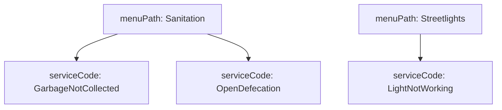
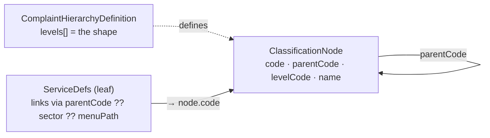
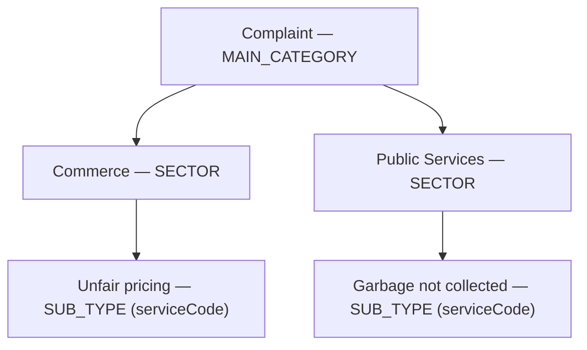
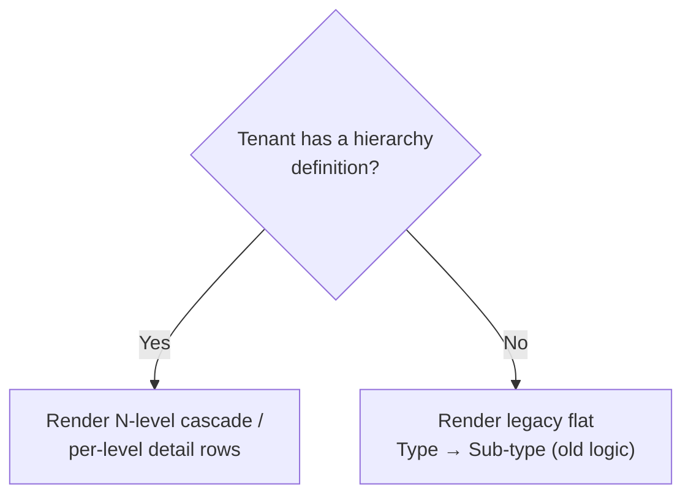
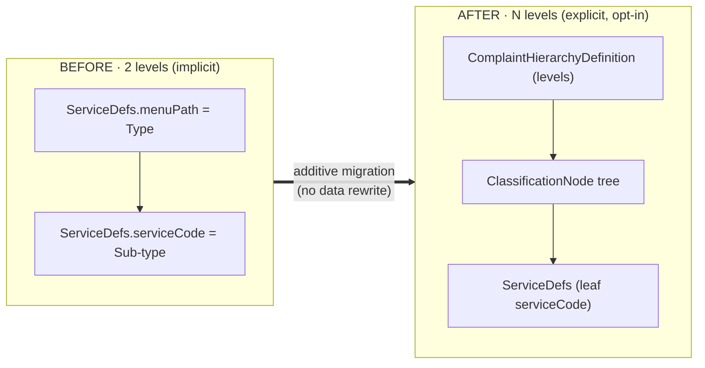

# Complaint Classification: 2‑level → configurable N‑level hierarchy

**What changed, in one line:** PGR complaint types used to be a fixed **2 levels**
(Type → Sub‑type). They are now a **configurable N‑level hierarchy** (e.g. Authority →
Main Category → Sector → Sub‑type) that each tenant **opts into** — with **zero backend
changes** and **full backward compatibility** (a tenant with no hierarchy keeps the old
flat flow, untouched).

| | Before (`develop`) | After (this change) |
|---|---|---|
| Levels | Fixed **2** | Configurable **N** (≥2) |
| Where the tree lives | *implicit* in `ServiceDefs.menuPath` | *explicit* `ComplaintHierarchyDefinition` + `ClassificationNode` |
| Picker UI | 2 dropdowns | N cascading dropdowns |
| Backend (`pgr-services`, DB) | — | **unchanged** |
| Per‑tenant opt‑in | — | yes; flat **fallback** when not configured |

> Related docs: [design](design/complaint-hierarchy-design.md) · [migration guide + runbook](migration/complaint-type-2level-to-Nlevel.md) · [pre‑flight dry‑run](migration/preflight-dryrun.cjs)

---

## 1. Before — the old 2‑level model

**MDMS:** a single schema, `RAINMAKER-PGR.ServiceDefs`. One record per complaint **sub‑type**:

| Field | Meaning |
|---|---|
| `serviceCode` | the sub‑type (the leaf; stored on every complaint) |
| `menuPath` | the **category** code (level 1) |
| `menuPathName` | category display label |
| `department`, `slaHours`, `keywords`, `active`, `order` | the rest |

The 2 levels were **implicit** — the UI built them at render time by grouping records on `menuPath`:

**Screens (old):** citizen *File Complaint* and employee *Create Complaint* each show **2 dropdowns** (Type → Sub‑type); the details page shows **2 rows** (Complaint Type / Sub‑Type).

---

## 2. After — the configurable N‑level model

The tree becomes **explicit data** — three records instead of one implicit grouping:

- **`ComplaintHierarchyDefinition`** declares *how many* levels and their order (the shape).
- **`ClassificationNode`** holds the non‑leaf values as an adjacency list (each node points at its `parentCode`).
- **`ServiceDefs`** is still the leaf; it links to its parent node via `parentCode ?? sector ?? menuPath`.

**Concrete example — `ke.bomet` (3 levels):**

**Screens (new):** the pickers render **one dropdown per level** (cascading), and the details
pages show **one row per level** (Main Category → Sector → Sub‑Type) instead of the flat pair.

---

## 3. New & changed MDMS schemas

| Schema | New? | Key fields | Role |
|---|---|---|---|
| `RAINMAKER-PGR.ComplaintHierarchyDefinition` | **new** | `hierarchyType`, `active`, `levels[] {levelCode, order, parentLevel, isFreeText, isLeafServiceCode, label}` | the level shape (one per tenant) |
| `RAINMAKER-PGR.ClassificationNode` | **new** | `hierarchyType`, `levelCode`, `code`, `parentCode`, `name`, `order`, `active`, `path` | the tree nodes (non‑leaf values) |
| `RAINMAKER-PGR.ServiceDefs` | **updated (additive)** | + optional `hierarchyType / authorityType / category / sector / path / parentCode` | leaf; **required fields unchanged** → old records stay valid |
| `RAINMAKER-PGR.HierarchySchema`, `…ComplaintTypeDepartments` | new (supporting) | — | optional metadata; not required for migration |

> The only ServiceDefs change is **new optional fields**. Existing records validate unchanged — this is what makes the deploy safe.

---

## 4. What changed (by area)

| Area | Files | Nature |
|---|---|---|
| **MDMS schemas** | `RAINMAKER-PGR.json` + data‑handler config | additive (the table above) |
| **Citizen / employee UI** | `digit-ui-esbuild/.../pgr` — cascade picker + create flows + **details breakdown** | cascade **with flat fallback** |
| **Configurator** | hierarchy resources, Phase‑3 Excel setup, **one‑click migrate button** | additive admin tooling |
| **Backend** (`pgr-services`, Java, DB, APIs) | — | **none** |

`pgr-services` still validates `serviceCode` against `ServiceDefs` exactly as before — the new
hierarchy masters are **read by the UI only**.

---

## 5. The screens — and why nothing breaks

Every complaint surface checks one thing: *does this tenant have a `ComplaintHierarchyDefinition`?*

| Screen | Gate | No hierarchy → behaviour |
|---|---|---|
| Citizen *File Complaint* | `hierarchyActive` | legacy flat `menuPath` grouping |
| Employee *Create Complaint* | `hasHierarchy` | legacy flat Type → Sub‑type |
| Citizen / Employee **details** | `buildComplaintPath()` returns `null` (also on any error) | legacy flat Type / Sub‑Type rows |
| Configurator *File Complaint* / *Complaint Types* | n/a — flat `serviceCode` form | unchanged |

**Why a tenant on the old build is safe after deploy:**
1. New ServiceDefs fields are **optional** → existing records valid.
2. No definition data → every screen falls back to **flat** (the gates above).
3. **0 backend / 0 dependency changes** → runs on the existing runtime.
4. The details resolver is wrapped in a guard → even malformed data falls back, never crashes.

So deploying the code is **inert** until a tenant is explicitly migrated.

---

## 6. Migrating a tenant (2 → N)

Migration is **additive and reversible** — it only *adds* the definition + nodes; it never
rewrites `ServiceDefs`. The existing `menuPath` already encodes the tree, so a category node is
created per `menuPath` (`code = menuPath`) and existing leaves link automatically.

| Path | How |
|---|---|
| **One click** | Configurator → *Manage → Complaint Hierarchies* → **Migrate from 2‑level** (auto‑hides once done) |
| **Headless** | script in the [migration guide](migration/complaint-type-2level-to-Nlevel.md) §5 |
| **Pre‑flight (gate)** | [`preflight-dryrun.cjs`](migration/preflight-dryrun.cjs) — read‑only, predicts the result |
| **Rollback** | delete the tenant's `ComplaintHierarchyDefinition` + `ClassificationNode` → flat returns |

Recommended order for production: **install schemas → deploy frontend (still flat) → pre‑flight →
migrate per tenant → verify**. Filed complaints are never affected — their `serviceCode` never changes.

---

## 7. At a glance — the whole shift

