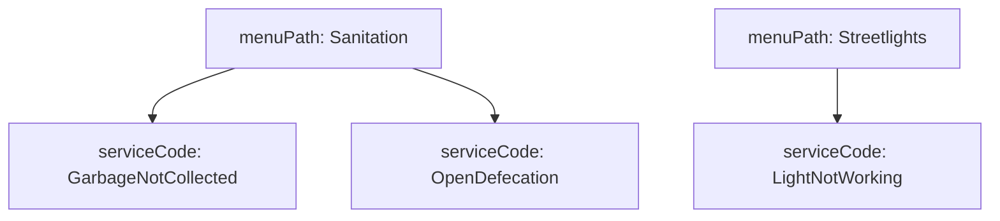
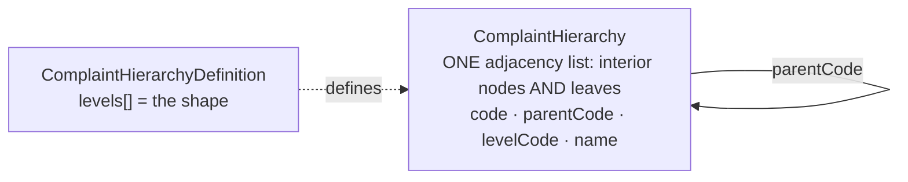
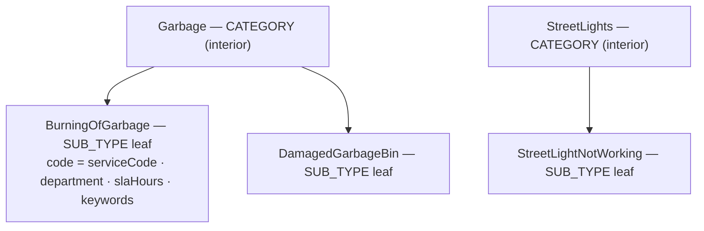
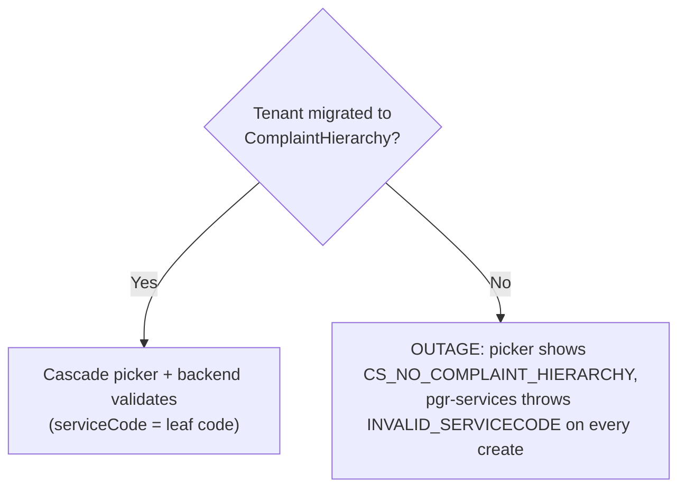
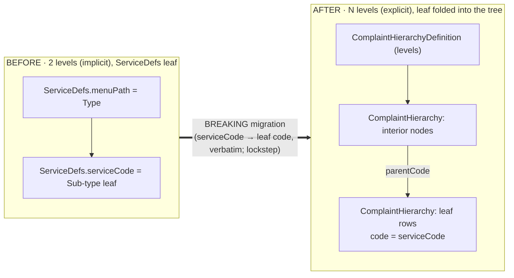

# Complaint Classification: 2‑level → configurable N‑level hierarchy

**What changed, in one line:** PGR complaint types used to be a fixed **2 levels**
(Type → Sub‑type) implicit in `ServiceDefs.menuPath`. They are now a **configurable
N‑level hierarchy** (e.g. Authority → Main Category → Sector → Sub‑type) held in **two
MDMS masters**, and the leaf complaint types live **inside the hierarchy** itself. This is
a **breaking, lockstep** change — `ServiceDefs` is removed, `pgr-services` reads the new
master, and there is **no flat fallback**: every tenant must be migrated.

| | Before (`develop`) | After (this change) |
|---|---|---|
| Levels | Fixed **2** | Configurable **N** (≥2) |
| Where the tree lives | *implicit* in `ServiceDefs.menuPath` | *explicit* `ComplaintHierarchyDefinition` + `ComplaintHierarchy` |
| Where the **leaf** lives | the `ServiceDefs` record | a `ComplaintHierarchy` **leaf row** (at the `isLeafServiceCode` level) |
| Picker UI | 2 dropdowns | N cascading dropdowns |
| Backend (`pgr-services`, analytics MV) | — | **changed** — validates + sources SLA + builds the grain MV from `ComplaintHierarchy` |
| Per‑tenant opt‑in | — | **no** — breaking; every tenant migrated before cutover; **no flat fallback** |

> Related docs: [design](design/complaint-hierarchy-design.md) · [two‑master rework plan](design/complaint-hierarchy-2master-rework-plan.md) · [migration guide + runbook](migration/complaint-type-2level-to-Nlevel.md) · [pre‑flight dry‑run](migration/preflight-dryrun.cjs)

---

## 1. Before — the old 2‑level model

**MDMS:** a single schema, `RAINMAKER-PGR.ServiceDefs`. One record per complaint **sub‑type**:

| Field | Meaning |
|---|---|
| `serviceCode` | the sub‑type (the leaf; stored on every complaint) |
| `menuPath` | the **category** code (level 1) |
| `menuPathName` | category display label |
| `department`, `slaHours`, `keywords`, `active`, `order` | the rest |

The 2 levels were **implicit** — the UI built them at render time by grouping records on `menuPath`:

**Screens (old):** citizen *File Complaint* and employee *Create Complaint* each show **2 dropdowns** (Type → Sub‑type); the details page shows **2 rows** (Complaint Type / Sub‑Type).

---

## 2. After — the configurable N‑level model

The tree becomes **explicit data** in **two** masters, and the leaf complaint types live **inside the tree** (not in a separate master):

- **`ComplaintHierarchyDefinition`** declares *how many* levels and their order (the shape). Exactly one level has `isLeafServiceCode: true`.
- **`ComplaintHierarchy`** is a single adjacency list holding **every** node — interior level nodes **and** leaf complaint sub‑types — each pointing at its `parentCode`. Leaf rows (at the `isLeafServiceCode` level) additionally carry `department` / `departments[]` / `slaHours` / `keywords`. **A leaf row's `code` IS the `serviceCode` stored on a complaint.**

> There is no `ServiceDefs` master and no separate node master anymore. A row is a **leaf**
> iff it carries `department` or `slaHours` (interior nodes omit them).

**Concrete example — `ke.bomet` (2 levels: CATEGORY → SUB_TYPE):**

**Screens (new):** the pickers render **one dropdown per level** (cascading), and the details
pages show **one row per level** (Category → … → Sub‑Type) instead of the flat pair. Grouping
labels (the old `menuPathName`) are now derived from the leaf's parent node `name`.

---

## 3. The MDMS masters

| Schema | Status | Key fields | Role |
|---|---|---|---|
| `RAINMAKER-PGR.ComplaintHierarchyDefinition` | **kept (unchanged)** | `hierarchyType`, `active`, `levels[] {levelCode, order, parentLevel, isFreeText, isLeafServiceCode, label}` | the level shape (one per tenant) |
| `RAINMAKER-PGR.ComplaintHierarchy` | **the merged master** | `hierarchyType`, `levelCode`, `code`, `parentCode`, `name`, `order`, `active`, `path` — **plus leaf‑only** `department`, `departments[]`, `slaHours`, `keywords` | the whole tree: interior nodes AND leaf complaint types in one adjacency list |
| ~~`RAINMAKER-PGR.ServiceDefs`~~ | **removed** | — | folded into `ComplaintHierarchy` leaf rows (`serviceCode → code`, verbatim) |
| ~~`RAINMAKER-PGR.ClassificationNode`~~ | **removed** | — | renamed/merged into `ComplaintHierarchy` (interior rows) |
| ~~`RAINMAKER-PGR.HierarchySchema`~~ | **removed** | — | per‑module window — dropped; derived from `levels[]` order |
| ~~`RAINMAKER-PGR.ComplaintTypeDepartments`~~ | **removed** | — | multi‑dept folded inline into the leaf row's `departments[]` |

> **`menuPath` / `menuPathName` are gone from the masters.** They were UI‑only derived
> values. The leaf→parent link is now the explicit `parentCode` field; the group label is the
> parent node's `name`. Code that needs the legacy `menuPath`/`menuPathName` shape reconstructs
> it at the data‑access layer (`menuPath = leaf.parentCode`, `menuPathName = parent node name`).

**Leaf-only fields & detection.** `department`, `departments[]`, `slaHours`, `keywords` appear
**only** on leaf rows; interior nodes omit them. The schema allows this mixed shape because those
four are optional `properties` (not `required`) under `additionalProperties:false`. A row is a
**leaf** iff `department` or `slaHours` is present — this is exactly the predicate pgr-services and
the analytics MV use.

---

## 4. What changed (by area)

| Area | Files | Nature |
|---|---|---|
| **MDMS schemas** | `schema/RAINMAKER-PGR.json` + data‑handler config + Helm `values.yaml` | **breaking** — rename `ClassificationNode`→`ComplaintHierarchy` + leaf fields; delete `ServiceDefs`/`HierarchySchema`/`ComplaintTypeDepartments` |
| **Backend** (`pgr-services`) | `PGRConstants`, `MDMSUtils`, `ServiceRequestValidator`, `PGRService`, `NotificationService`, `DashboardQueryBuilder`, `PGRQueryBuilder`, `MigrationUtils`, `V20260608000000__create_v2_grain_mvs.sql` | **changed** — validate / SLA‑map / dept‑name / grain MV all read `ComplaintHierarchy` leaf rows |
| **Citizen / employee UI** | `digit-ui-esbuild/.../pgr`, `frontend/micro-ui/web/.../pgr`, `digit-ui-v2` — cascade picker + create flows + details breakdown | repointed to `ComplaintHierarchy`; **no flat fallback** |
| **Configurator** | hierarchy resources, Phase‑3 Excel setup, one‑click migrate button | rewritten to write leaf rows into `ComplaintHierarchy`; breaking/one‑way copy |

`pgr-services` now validates `serviceCode` against **`ComplaintHierarchy` leaf rows** (JSONPath
`$.MdmsRes.RAINMAKER-PGR.ComplaintHierarchy[?(@.code=='X')]`, leaf‑only), sources the SLA map from
their `slaHours`, and the V2‑grain materialized view builds from them
(`WHERE schemacode = 'RAINMAKER-PGR.ComplaintHierarchy' AND data->>'department' IS NOT NULL`,
`service_group = parentCode`). This is **not** backend‑untouched.

---

## 5. Rollout — why this is breaking (and how nothing-breaks-once-migrated)

This is a **BREAKING, mandatory, lockstep** change. There is **no per‑tenant opt‑in and no flat
fallback**. Once `ServiceDefs` is removed and `pgr-services` reads `ComplaintHierarchy`, an
un‑migrated tenant has a **hard outage**:

| Surface | After cutover, un‑migrated tenant → |
|---|---|
| Citizen *File Complaint* | `CS_NO_COMPLAINT_HIERARCHY` — cannot file |
| Employee *Create Complaint* | no options — cannot create |
| pgr-services create/update | `INVALID_SERVICECODE` on every request |
| Citizen / Employee **details** | path resolver returns null (no crash, but no breakdown) |

**Why it is safe once every tenant is migrated, in order:**

1. **Leaf `code` == old `serviceCode`, verbatim** → every already‑filed complaint still resolves; no complaint data is rewritten.
2. **Lockstep release.** Masters migration (every tenant, city **and** state level) → pgr-services cutover + restart + V2‑MV → all frontend bundles + indexer/chatbot/MCP → only **then** delete the old masters.
3. **Preflight gate.** The read‑only dry‑run asserts schemas installed, `(hierarchyType, code)` globally unique, every old serviceCode present as a leaf, and leaf fields carried — before any write.
4. **Rollback is via snapshot, not a delete.** Because leaves were *moved* (not added alongside `ServiceDefs`), reverting means restoring the old masters from the mandatory MDMS snapshot, redeploying the old pgr-services images, and reverting the V2‑MV migration — **not** "delete the definition + nodes".

---

## 6. Migrating a tenant (2 → N)

Migration **moves** the leaf data: each `ServiceDefs` record becomes a `ComplaintHierarchy` leaf
row (`code = serviceCode` verbatim, plus `parentCode`, `department`/`departments[]`/`slaHours`/`keywords`),
and each `ClassificationNode` interior row is copied 1:1. It is idempotent on `(hierarchyType, code)`
but it is **not** additive and **not** reversible by deletion.

| Path | How |
|---|---|
| **One click** | Configurator → *Manage → Complaint Hierarchies* → **Migrate from 2‑level** (writes leaf rows into `ComplaintHierarchy`; reads the old masters as a read‑only source) |
| **Headless** | masters‑migration script in the [migration guide](migration/complaint-type-2level-to-Nlevel.md) §5 |
| **Pre‑flight (gate)** | [`preflight-dryrun.cjs`](migration/preflight-dryrun.cjs) — read‑only; asserts uniqueness + verbatim‑code preservation + backend‑validation readiness |
| **Rollback** | restore `ServiceDefs`/`ClassificationNode` from the MDMS snapshot + redeploy old pgr-services images + revert the V2‑MV migration |

Mandatory production order: **snapshot → install schemas → migrate every tenant (city + state) →
pre‑flight green → deploy pgr-services (restart) + V2‑MV → deploy all frontends → only then delete
old masters**. Filed complaints are never rewritten — correctness hinges on the verbatim leaf
`code` = old `serviceCode`.

---

## 7. At a glance — the whole shift

