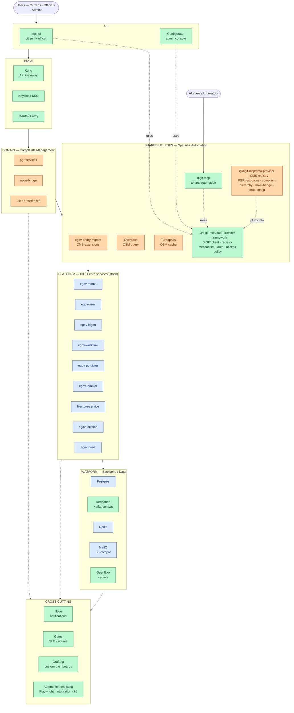

# Complaints Management (CMS) Deployment: Ansible vs. Kubernetes — What We Run Today

**Audience:** CTO · **Purpose:** Context on the two deployment substrates we operate today, and what CMS has customized on top of stock DIGIT · **Last updated:** 2026-08-24

## TL;DR

CMS ships as one product with two deployment substrates: **Ansible on a single VM** (dev, demos, pilots, CI) and **Helm on Kubernetes** (recommended for production). Same service images, same tenant / MDMS / branding / boundary configuration drive both. The more interesting story is *what CMS has swapped or added on top of stock DIGIT* — several of those additions logically belong in DIGIT itself over time and are marked below as absorption candidates.

## Architecture at a glance

*Source of this diagram: [`docs/images/complaints-management-architecture.mmd`](images/complaints-management-architecture.mmd) — edit there and keep this block in sync.*

**Legend.** Blue = stock DIGIT platform (we consume, we don't own). Orange = CMS domain services (Complaints Management business logic). Green = CMS-added at the platform tier — candidates for absorption into DIGIT over time.

## Deployment modes

| Mode | Substrate | Use for | HA |
|---|---|---|---|
| A. Ansible + Docker Compose | Single VM | Dev, demos, pilots, CI | No |
| B. Local Kubernetes | kind / k3d | Developing & validating the k8s path | No |
| **C. Helm + K8S (recommended for production)** | Multi-node cluster | Production tenants | Capable, opt-in |

Non-production runs on **Mode A** (fastest bring-up, most reproducible). Production tenants run on **Mode C**. **Mode B** exists only to develop and validate the k8s manifests without a cloud cluster.

## Ansible mode (Mode A)

An Ansible playbook (`local-setup/ansible/playbook-deploy.yml`) converges a single host: renders `digit.env`, `globalConfigs.js`, and the nginx site from templates; brings up the Docker Compose stack (~36 containers); runs DB migrations; bootstraps the tenant. Blank VM → green in ~5 minutes. Idempotent re-converge. Per-tenant values in one file (`inventory/host_vars/<tenant>.yml`). Runs today on **bomet** (dev + nightly), **naipepea** (demo), **maputo**, **tamilnadu**; CI also uses it for E2E validation. Limits: single-host, vertical scale only, operator-managed backups.

## Kubernetes mode (Mode C — recommended for production)

Helm charts (`devops/deploy-as-code/charts/`) on HA RKE2 (or cloud-managed K8s provisioned via `devops/infra-as-code/terraform/`). Charts organized by tier — `backbone-services`, `core-services`, `urban` (pgr-services, digit-ui, boundary-mgmnt), `common-services`, `monitoring`, `analytics`, `auxiliary-services`. Env-level overrides in `charts/environments/env.yaml` parameterize one cluster, not individual DIGIT tenants. **HA is available and opt-in**: the shipped chart values default to Postgres `architecture: standalone` and most services to `replicas: 1`, so production HA must explicitly enable Postgres replication, `replicas > 1` with anti-affinity / PDBs for stateless services, ≥3 RKE2 control-plane nodes for etcd quorum, and shared storage (NFS or object store) for the filestore.

## What CMS changed vs. stock DIGIT

Ordered by CTO-impact (identity/compliance → security → perimeter → cost/scale → recurring cost → feature velocity → ops → observability → developer productivity). The same componentry ships in both Mode A and Mode C.

| # | Component | Stock DIGIT | CMS choice | Why we changed | Absorption candidate? |
|---|---|---|---|---|---|
| 1 | **Identity / SSO** | egov-user + custom JWTs | **Keycloak + OAuth2 Proxy** | Standards-based (OIDC), realm-per-tenant, external-IdP federation without touching services, better session/token management, auth enforced at the edge | **Yes, for 2.9.x** |
| 2 | **Secrets** | Env vars in files | **OpenBao** (Vault-compatible fork) | Central secret store with rotation and audit trail — required for enterprise ops and compliance reviews | **Yes, for 2.9.x** |
| 3 | **API gateway** | Spring Cloud Gateway (JVM) | **Kong** (nginx + Lua) | Off-JVM (no heap contention with services); declarative config; mature plugin ecosystem (rate limit, auth, CORS, transforms); first-class K8s ingress controller; lower, more predictable footprint. | **Yes, for 2.9.x. 3.0 is on Kong already** |
| 4 | **Event bus** | Kafka (KRaft mode) | **Redpanda** (single binary) | Kafka wire-compatible drop-in — existing Kafka clients (spring-kafka etc.) work unchanged. KRaft has closed the ZooKeeper gap, so the remaining differentiators are: C++ / Seastar thread-per-core → no JVM GC pauses and more predictable p99 tail latency; meaningfully lower RAM floor at rest (critical for the single-VM Ansible profile — Kafka can be tuned down but Redpanda has a lower floor); faster cold-boot for CI / pilot bring-up; smaller ops surface (single binary + declarative config vs. broker/controller roles, listener config, and JVM tuning) | Maybe |
| 5 | **Maps / spatial** | Google Maps tiles (paid, external) | **Overpass + Turbopass** (self-hosted OSM) | Zero per-tile cost, no external dependency, no location data leaves the deployment (data-sovereignty) | Domain-adjacent |
| 6 | **Notifications** | egov-notification-sms/email/* per-channel services | **Novu** | One notification platform, one API, workflow-driven templates; UI for config & logs; channel expansion (WhatsApp bidirectional sits on top) without new services | Maybe |
| 7 | **Admin console** | Workbench or Piecemeal per-service MDMS UIs | **Configurator** (built by us) | Single admin surface for platform config (tenant, roles etc..) / branding / complaints /configuration; ships identically in both modes | **Yes, for 2.9.x and 3.0** |
| 8 | **Observability** | Prometheus baseline | **Gatus + custom Grafana dashboards** | Gatus gives leadership a black-box SLO/uptime view; dashboards tuned for JVM/pod metrics | **Yes** |
| 9 | **Automation test suite** | Ad-hoc, per-service | **Playwright (E2E) + integration tests + k6 (perf)**, wired to run against deployed environments via the `integration-tests-runner` systemd service | Continuous validation against real environments (not just CI), makes rapid release credible, catches regressions before tenant rollout — the quality gate behind the nightly develop redeploy | **Yes, with changes** |
| 10 | **UI framework** | digit-ui (webpack, multi-repo) | **digit-ui-v2** (esbuild, monorepo) | Faster builds, cleaner shared-component story, easier per-tenant theming | **Yes** |
| 11 | **Agentic Layer** | (none) | **digit-mcp** (MCP server) | Programmatic driver for tenant setup, boundary loads, city onboarding — reduces manual ops during rollout and validates configurations independently | **Yes** |

"Absorption candidate" = a platform-tier choice that logically belongs upstream in DIGIT rather than in CMS. If adopted upstream, CMS would stop owning it.

## Shared foundation

Both modes consume the same service images, same tenant config, same MDMS, same boundary data, same branding. That is deliberate: componentry choices in the table above are product-level decisions, not per-mode decisions. It also means graduating a tenant from Ansible (Mode A) to Kubernetes (Mode C) is a data + config migration, not a rewrite — snapshot Postgres and filestore, provision the cluster, add the tenant override to `charts/environments/env.yaml`, `helm upgrade --install`, restore data, cut DNS.

## Operational implications

- **HA on K8s is opt-in, not default.** Shipped chart values run in standalone / single-replica mode. Production HA must be explicitly enabled: Postgres replication, `replicas > 1` with anti-affinity / PDBs, ≥3 RKE2 control-plane nodes, shared storage for the filestore.
- **Ansible has an anonymous-volume hazard.** `docker compose down -v` destroys stateful data on that host. Operator discipline required, especially for the bomet nightly re-converge.
- **Mode B uses raw manifests, not the production Helm charts** — small dev/prod drift we should close to make local == prod.

## Open questions

-**Maintenance** - Maintaining two modes of deployment for each release is additional work. 
- **Backup / restore story** — product-level guarantee for Mode A pilots vs. the replication + snapshot story for Mode C needs to be validated.

## Further reading

- Detailed technical comparison: [`docs/deployment-modes.md`](deployment-modes.md)
- Business framing: [`docs/deployment-overview.md`](deployment-overview.md)
- Ansible entry point: [`local-setup/ansible/README.md`](../local-setup/ansible/README.md)
- Kubernetes deployment assets: [`devops/deploy-as-code/`](../devops/deploy-as-code/) and [`devops/infra-as-code/terraform/`](../devops/infra-as-code/terraform/)
