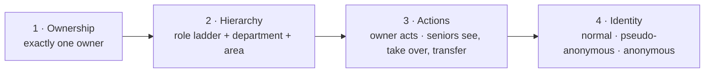
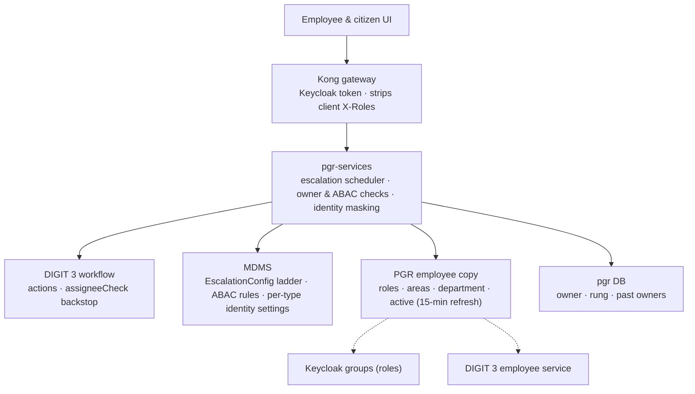
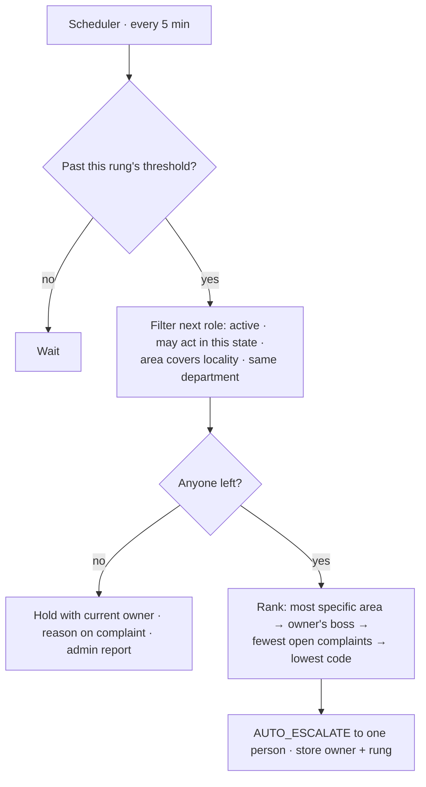
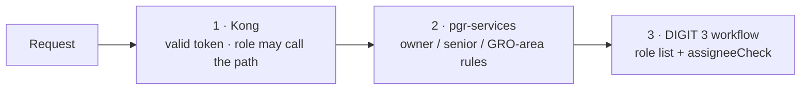
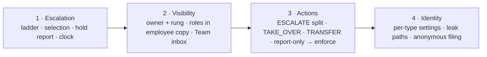

# Complaint escalation and access

| | |
|---|---|
| **Status** | Proposal for review |
| **Date** | 2026-10-06 |
| **Baseline** | CCRS on DIGIT 3 (`ChakshuGautam/ccrs-digit3`, branch `develop`) |
| **Scope** | `pgr-services`, PGR workflow definition, MDMS config, PGR employee copy |

One model for who owns a complaint, who is senior to whom, who may act, and what anyone can see about the citizen.

Items marked **(proposed)** are recommendations not yet confirmed. Section 9 lists what's still open.

## 1. Problem

1. **Escalate to a role:** stuck complaints go to the next role up, not to a hand-wired boss.
2. **Seniors see juniors' work:** within their area and department.
3. **The owner has rights:** the person holding a complaint acts on it; others don't.
4. **Anonymous filing:** no identity; tracked only by complaint ID and a code.
5. **Pseudo-anonymous filing:** the system knows who filed; staff never do.

## 2. Starting point (DIGIT 3)

| Area | Today | Problem |
|---|---|---|
| Escalation | Goes to the owner's row in a CCRS-owned supervisor table (`eg_pgr_supervisor_edge`), seeded from 2.x `reportingTo` | Depends on a hand-maintained person-to-person chart |
| Team inbox | Follows the same table. Nobody below you, or a team over 25, falls back to every open complaint in the tenant | Silent over-exposure |
| Owner rights | None. Any GRO, LME or viewer can resolve; any role, even a citizen, can call `ESCALATE` | Nobody is accountable for a resolution |
| Access rules (ABAC) | Works on search only, served through ccrs-compat from DIGIT 3 MDMS | Updates aren't checked |
| Anonymity | Not supported. The identity sits in the individual service, Keycloak, the timeline, events and notifications | Many places to protect |

## 3. Model



**Senior:** employee A is senior to B for a complaint when all three hold:

- A's role is higher on the ladder than B's.
- A is in the complaint's department.
- A's area covers the complaint's locality.

Top rungs can be set to ignore the department or area check (e.g. a commissioner). Escalation, visibility and permissions all use this one definition.



## 4. Ownership and escalation



- **Boss-based escalation is retired.** The supervisor table stays as the org chart and only breaks ties.
- **Thresholds** are percentages of the complaint type's SLA (shipped: 80%, 120%, 200%), counted from **first assignment**.
- **Overdue** (100% of SLA, counted from filing) is the citizen's clock and is unchanged.
- **Unassigned too long** (more than N hours) appears on the admin report.
- **Auto-assign at filing** is optional per city, off by default.
- **A senior transferring a complaint down** restarts the clock for that rung.
- **(proposed) Role holders** come from PGR's employee copy, which gains roles (from Keycloak groups) and areas. Changes take effect within 15 minutes.

**Configuration:** this extends `RAINMAKER-PGR.EscalationConfig`. A city record overrides the state record, which works on DIGIT 3 because tenants stay `ke` / `ke.bomet`. Saving a ladder checks that its roles exist and grants them the workflow actions they need.

```jsonc
{
  "code": "DEFAULT",
  "defaultSlaPercentageByLevel": [80, 120, 200],
  "autoAssign": false,
  "unassignedAlertHours": 4,
  "roleLadder": [
    { "role": "PGR_LME" },
    { "role": "JUNIOR_ENGINEER" },
    { "role": "CITY_ENGINEER" },
    { "role": "COMMISSIONER", "ignoreArea": true, "ignoreDepartment": true }
  ],
  "departmentLadders": { "WATER": [ /* … */ ] }
}
```

## 5. Hierarchy and visibility

- **Seniors** see complaints held anywhere below them, open and closed (closed ones read-only). The default inbox shows the rung directly below, plus anything overdue or held deeper.
- **Nobody below you** means you see only your own complaints. There's no tenant-wide fallback.
- **Previous owners** keep read access and can comment, but lose actions and sensitive fields.
- **Sensitive fields** (e.g. the citizen's phone) follow ownership, not rank. A senior gets them only by taking over.
- **Each complaint stores** its owner, the owner's rung and its past owners. The Team inbox becomes one database query, with no 25-person cap.

## 6. Actions and enforcement

| Action (with a worker) | Who may | Workflow setting |
|---|---|---|
| `RESOLVE` | Owner only; a GRO only after assigning the complaint to themselves | `assigneeCheck` on |
| `ESCALATE` (manual) | Owner only | Ladder roles, `assigneeCheck` on |
| `AUTO_ESCALATE` (new) | Scheduler only | `SYSTEM`, no check |
| `REASSIGN` | Owner, seniors, GRO in own area and department | Back to the GRO queue |
| `TAKE_OVER` (new) | Seniors | Self-loop; senior checked by pgr-services |
| `TRANSFER` (new) | Seniors, to anyone below them | Self-loop; owners can't pick a peer |
| `COMMENT` | Owner, seniors, previous owners, GRO, citizen | Restricted in pgr-services |

`PGR_VIEWER` becomes view-only.



- **pgr-services** is the primary check and gives clear errors. It needs four new facts for its rules: caller roles, assignees, attempted action and ladder ranks.
- **The per-city switch** goes `OFF` → `REPORT_ONLY` → `ENFORCE`, and `assigneeCheck` is turned on at `ENFORCE`.
- **New workflow actions** are added by a one-time script for existing cities. New cities get them from the default workflow, and the 2.x rebuild adds them for migrated cities. After that, saving a ladder keeps the roles in sync.

## 7. Complainant identity

| | Pseudo-anonymous | Anonymous |
|---|---|---|
| System knows who filed | Yes, stored only | No |
| Citizen tracks via | Their account; SMS updates | Complaint ID + secret code; no notifications |
| Staff contact via | Comment thread only | Comment thread only |
| Enabled by | Complaint type: `ALWAYS` / `CITIZEN_CHOICE` (default) / `NEVER` | Complaint type `allowAnonymous`, off by default |
| Citizen's own actions | **(proposed)** Recorded under the service account (`SYSTEM`, then allowed to file, reopen and rate) | Same |

| Leak path | Fix |
|---|---|
| Search / update responses | ABAC field rules hide name, phone, email, address and user ID |
| Timeline (ccrs-compat) | Hide the name, not just the mobile |
| Staff user search (ccrs-compat) | Apply the anonymity check |
| Individual service | Keep it unrouted; turn off request-body logging; keep Vault on |
| Event outbox and notifications | Null the citizen in the outbox; blank `{citizen_name}` for staff; treat the novu-bridge dispatch log as personal data |
| Anonymous filing | **(proposed)** Public Kong routes only for pgr-services' anonymous endpoints, behind a captcha and daily limits. Strip photo metadata |

**(proposed) Gate:** "hide my identity" is offered only after every leak path above is covered.

## 8. Rollout



- **(proposed)** Per city: configure the ladder before switching it on, so escalation never pauses. Tell staff that escalations now go to the next role in their area and department.
- Phase 4 ships separately, gated on the leak-path checklist.

## 9. Open questions and asks

**Open**

- **Reopen and the escalation clock:**
  - (a) Restart the clock and flag reopened complaints *(recommended)*.
  - (b) Restart the clock one rung higher.
  - (c) Keep DIGIT 3's behaviour: the clock runs from filing.
- **Which ladder roles ignore area or department:** set per city during ladder setup.

**Asks for the migration team**

1. **The Bomet cutover** expects about 25 boss-based escalations on the first run. Plan the switch to the ladder.
2. **#613** (GRO resolves any complaint) is superseded by §6.
3. **`ESCALATE` is open to every role on DIGIT 3,** including citizens. The split in §6 fixes this.
4. **Supervisor table admin rights** include supervisor roles. Restrict them, and check that employees exist in the tenant.
5. **Staging escalation** scans only the `pg` state, so Bomet complaints may never escalate there.
6. **Workflow tooling for adding actions** (§6) is needed in the register script and the 2.x rebuild.
