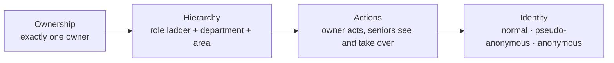

# Complaint escalation and access model

| | |
|---|---|
| **Status** | Draft for review |
| **Date** | 2026-09-30 |
| **Scope** | `backend/pgr-services`, PGR workflow, MDMS config, Configurator, PGR employee UI |
| **Related** | `docs/escalation.md`, `docs/migration/pgr-escalation-self-loop.md`, `VISIBILITY-DESIGN.md` |

## How to review

- **Decisions are numbered 1–22** in section 3. Please refer to them by number, e.g. "Decision 15: …".
- Each decision states **what we chose** and **why**. Challenge the reasoning, not just the choice.
- **Section 3.6 lists two assumptions** made during the discussion. Please confirm or correct them.
- Sections 4–7 describe how the design works. They don't introduce new decisions; they reference them by number.
- Section 8 lists the work required. Items marked **(verified)** come from checking the current code and config.
- The tag after each decision title (e.g. `D16`) is the ID used during the design discussion, kept for traceability.

## Contents

1. [Summary](#1-summary)
2. [Where things stand today](#2-where-things-stand-today)
3. [Decisions and reasoning](#3-decisions-and-reasoning)
4. [How escalation picks the next owner](#4-how-escalation-picks-the-next-owner)
5. [How senior visibility works](#5-how-senior-visibility-works)
6. [Who may do what, and how it's enforced](#6-who-may-do-what-and-how-its-enforced)
7. [How identity is protected](#7-how-identity-is-protected)
8. [Work required](#8-work-required)

---

## 1. Summary

The five requirements:

1. Complaints escalate to a **role**, not a hand-picked person.
2. **Seniors** can see their juniors' complaints.
3. The **owner** of a complaint has rights others don't.
4. Citizens can file **anonymously**.
5. Citizens can file **pseudo-anonymously**: the system knows who they are, but staff don't.

They're answered by one model with four layers:



- **Ownership:** a complaint always has exactly one owner. When it escalates, the system picks the next owner from the next role on a configured ladder.
- **Hierarchy:** "senior" means higher on that same ladder, in the same department and area. Escalation, visibility and permissions all use this one definition.
- **Actions:** only the owner resolves or escalates. Seniors can see, comment, take over and hand complaints down. Each city switches this on gradually.
- **Identity:** for pseudo-anonymous and anonymous complaints, no staff member ever sees who filed. The feature goes live only when every place the identity could leak is covered.

---

## 2. Where things stand today

| Area | Today |
|---|---|
| Escalation | Goes to one person: the current owner's boss in HRMS (`reportingTo`). There's no role ladder. |
| First assignment | Nothing assigns a new or reopened complaint automatically. It waits in `PENDINGFORASSIGNMENT` until a GRO (or `PGR_VIEWER`) assigns or rejects it. |
| Senior visibility | The inbox **Team** tab (`VisibilityService`) shows complaints assigned to you or anyone below you in the `reportingTo` chain, plus the unassigned queues. See the note below. |
| Owner rights | None. Anyone with the right role can resolve or reassign any complaint. `ServiceRequestValidator.validateUpdate` has a bare `// TO DO` where an ownership check belongs. |
| Access rules (ABAC) | A rules engine in pgr-services hides whole complaints or single fields, using rules stored in MDMS. It runs on search only. |
| Anonymous | Not supported. Filing requires a citizen record with a mobile number. |
| Pseudo-anonymous | Partial. `isConfidential` hides the extra form fields only, not the citizen's name or phone. |

**About the Team tab.** It needs two switches: the service-wide `PGR_VISIBILITY_ENABLED` (off in code defaults, on in the base compose file) and a per-tenant MDMS flag (`RAINMAKER-PGR.InboxVisibilityConfig`, `enabled`). If it finds nobody below you, it **falls back to tenant-wide**: it drops the team filter and shows every open complaint in the tenant, still limited by your normal department and area permissions. This happens in three cases:

- on XLSX-onboarded tenants, which have no boss data
- for workers with nobody under them
- for teams larger than the fetch cap (`pgr.visibility.team.fanout.max`)

On those tenants, the Team tab looks like it works but shows the whole city.

---

## 3. Decisions and reasoning

In reading order, grouped by layer.

### 3.1 Ownership and escalation

#### Decision 1 — One owner *(ground rule)*
- **Chosen:** A complaint is never with more than one person at a time.
- **Why:** One person is clearly accountable at every moment.

#### Decision 2 — Rollout and ladder shape *(ground rule)*
- **Chosen:** A per-tenant switch between role-ladder and `reportingTo` escalation. A default ladder, with optional per-department ladders.
- **Why:** Tenants keep today's behaviour until they're ready. Departments such as Water can have their own chain.

#### Decision 3 — Who becomes the owner `D1`
- **Chosen:** The system picks one person from the next role immediately.
- **Why:** A group queue would leave a complaint with nobody until someone claims it, which breaks decision 1.

#### Decision 4 — `reportingTo` `D16`
- **Chosen:** Keep it as it is for now, as the second ranking rule (prefer the owner's HRMS boss). Nothing else that uses it is removed now: the HRMS field, the Configurator boss field and the org chart all stay.
- **Why:** It only decides between people who already qualify equally, so wrong or missing data can't send a complaint to the wrong role or area.

#### Decision 5 — Load balancing `D4`
- **Chosen:** Fewest open complaints is used only as a tie-breaker.
- **Why:** Spreads work without making routing unpredictable.

#### Decision 6 — Equal candidates `D2`
- **Chosen:** Pick one using a fixed final tie-break. Nothing is logged.
- **Why:** A tie should never block escalation.

#### Decision 7 — Nobody fits `D3`
- **Chosen:** The complaint stays with its current owner. The scheduler retries every 5 minutes.
- **Why:** Safe and self-healing: it escalates as soon as someone holds the role.

#### Decision 8 — Making held complaints visible `D15`
- **Chosen:** A note on the complaint giving the reason, plus an admin report of held complaints grouped by cause.
- **Why:** Almost every cause is a data problem (vacant post, missing HRMS data) that only an admin can fix.

#### Decision 9 — Area and department exceptions `D5`
- **Chosen:** Handled as configuration. Each rung has "ignore area" and "ignore department" settings, both off by default. Which roles use them is decided later, per city.
- **Why:** Top roles such as a commissioner cover all departments or the whole city. That's a fact about each city's organisation, not a design choice. Until configured, complaints hold at the rung below and show up on the admin report.

#### Decision 10 — First assignment `D20`
- **Chosen:**
  - **Always:** the escalation clock starts at first assignment, not at filing. Complaints unassigned for more than N hours appear on the admin report.
  - **Per city, off by default:** auto-assign at filing and on reopen, to someone with the ladder's first role, using the same filter and ranking as escalation. If nobody fits, the complaint waits in the GRO queue.
- **Why:** Escalation measures how long a worker has held a complaint, so time on the GRO desk shouldn't count against them. The admin report keeps that wait visible. Auto-assign skips the GRO's screening of invalid complaints, so each city chooses. The citizen's SLA still counts from filing.

### 3.2 Hierarchy and visibility

#### Decision 11 — One hierarchy `D6`
- **Chosen:** Senior visibility uses the same ladder, department and area as escalation.
- **Why:** Two different ideas of "senior" would disagree: someone could receive an escalated complaint without seeing their juniors' queue.

#### Decision 12 — What seniors get `D7`
- **Chosen:**
  - **See:** every rung below them, open and closed. Closed complaints are read-only.
  - **Act:** comment, reassign, take over, or transfer to someone below them (decision 15). To resolve, they take over first.
  - **Inbox:** defaults to the rung directly below, plus anything overdue or held further down.
- **Why:** Keeps one owner. Area and department already limit the volume, and the default inbox keeps it useful.

#### Decision 13 — After a complaint moves on `D9`
- **Chosen:**
  - **Previous owners** keep read access and can comment. They lose the right to act and lose the extra fields, such as the citizen's phone.
  - **Seniors** don't get the extra fields unless they take the complaint over.
  - No audited "view with reason" option in the first version.
- **Why:** Sensitive data follows ownership, not rank or history.

### 3.3 Actions and enforcement

#### Decision 14 — Owner-only actions `D8`
- **Chosen:**
  - Only the owner resolves or manually escalates.
  - The owner, seniors, and the GRO within their area and department may reassign.
  - New `TAKE_OVER` action for seniors, and a new employee `COMMENT` action.
  - `PGR_VIEWER` becomes view-only.
  - Enforced in report-only mode first (decision 17).
- **Why:** Resolving closes the complaint, so it belongs to the person accountable for it. The GRO keeps the routing job but not the fixing job.

#### Decision 15 — Moving a complaint between people `D18`
- **Chosen:** A new `TRANSFER` action, for **seniors only**. It hands the complaint straight to anyone below them on the ladder, in its area and department: e.g. from LME Ravi to LME Suresh, or back down after a take-over. The owner can't pick a peer; they ask their senior, or `REASSIGN` it back to the GRO.
- **Why:** Every move between people is decided by someone accountable for both of them. It also avoids the stop at the GRO desk, where nobody works on the complaint and escalation pauses.

#### Decision 16 — Clock after a hand-down `D19`
- **Chosen:** When a senior transfers a complaint down, the escalation clock restarts for the current rung.
- **Why:** Handing down is a deliberate decision. Without a restart, an overdue complaint would bounce straight back up to the senior within 5 minutes.

#### Decision 17 — Switching the rules on `D10`
- **Chosen:** A per-city switch with three positions: `OFF` → `REPORT_ONLY` → `ENFORCE`.
  - It covers the update endpoint only.
  - In `REPORT_ONLY` and `ENFORCE`, a missing rule counts as a deny.
  - The existing deployment-wide `pgr.abac.strict-mode` is left as it is.
- **Why:** Cities go live at different times. The existing strict-mode switch covers the whole deployment and search too. Watching first shows what would break before anyone is blocked.

### 3.4 Complainant identity

#### Decision 18 — Who chooses pseudo-anonymity `D12`
- **Chosen:** Set per complaint type: `ALWAYS`, `CITIZEN_CHOICE` (default) or `NEVER`. The choice is fixed at filing.
- **Why:** Sensitive types (harassment, corruption, complaints against staff) shouldn't rely on the citizen ticking a box. Some types need staff to reach the person. Once staff have seen an identity, hiding it later gives false comfort.

#### Decision 19 — Who may know a pseudo-anonymous complainant `D11`
- **Chosen:** Nobody. The identity is kept in the database only, with no reveal feature, audited or otherwise. Staff contact the complainant through the complaint's comment thread, never by phone.
- **Why:** Any viewer, even an audited one, becomes a possible leak. The system still uses the identity itself for SMS updates, tracking, reopen and rating. Legal or safety requests can only be met by querying the database directly, which leaves no trail in the app.

#### Decision 20 — Anonymous, first version `D13`
- **Chosen:**
  - Complaint ID plus a secret tracking code.
  - With both, the citizen can view status, reply in the thread, reopen and rate.
  - No notifications.
  - Off by default, enabled per complaint type (`allowAnonymous`).
  - Captcha and daily limits per device or network.
- **Why:** IDs follow a pattern and can be guessed, so a code is needed. Replies reuse the comment thread already being built. Opt-in per type limits abuse.

#### Decision 21 — Citizen actions in the timeline `D17`
- **Chosen:** On pseudo-anonymous and anonymous complaints, the citizen's own actions (filing, comment, reopen, rate) are recorded under a system user.
- **Why:** The timeline comes from the workflow service, which pgr-services can't filter. Not storing the name at all is the only fix with no gaps; it also covers workflow history and database exports.

#### Decision 22 — Leak paths `D14`
- **Chosen:** Every place a person could see the identity is covered before the feature goes live. Until then, the "hide my identity" option isn't shown.
- **Why:** A promise of anonymity that leaks is worse than no promise.

### 3.5 Deferred

- **Which ladder roles ignore area or department** (decision 9) is decided per city, during ladder setup.
- **A masked calling relay** for contacting pseudo-anonymous complainants may come later (decision 19).
- **Merging the ladder separately from the rest of a city's config** can be added if copying the whole record per city becomes painful (section 4.4).

### 3.6 Assumptions to confirm

1. Decision 4 ("keep `reportingTo` as it is") does **not** stop the team inbox moving to the ladder, as decision 11 says.
2. Decision 14 makes `PGR_VIEWER` **view-only**, rather than keeping it as a super-role outside the owner rules.

---

## 4. How escalation picks the next owner

This happens each time a complaint is due to escalate (decisions 3–10).

### 4.1 Selection

1. **Filter.** Keep people who meet all of these:
   - They are active and hold the next role.
   - The workflow lets that role act in the complaint's current state.
   - Their area covers the complaint's locality, unless the rung ignores area.
   - They're in the complaint's department, unless the rung ignores department.
2. **Rank** whoever is left, in this order:
   1. Most specific area. A ward-3 engineer beats a city-wide one.
   2. The owner's HRMS boss. This never applies on XLSX-onboarded tenants, which have no boss data.
   3. Fewest open complaints.
   4. Lowest employee code.
3. **Nobody left:** the complaint stays put. The reason is noted on it (e.g. "no eligible JUNIOR_ENGINEER for ward 3"), and it appears on the admin report.

**Which rung is the complaint on?** The one after the current owner's role, so a complaint never moves sideways or down after a manual reassignment. The level counter only drives SLA timing.

### 4.2 First owner

- **Today:** a new or reopened complaint waits in `PENDINGFORASSIGNMENT` with no owner, until a GRO (or `PGR_VIEWER`) assigns or rejects it. While unassigned it never escalates, yet the escalation clock runs from filing. A 10-hour-SLA complaint assigned at hour 13 escalates twice within minutes.
- **Agreed change** (decision 10):
  - **The escalation clock starts at first assignment** (and restarts on reopen, as today). The citizen's SLA on dashboards still counts from filing.
  - **Unassigned too long:** complaints unassigned for more than N hours appear on the admin report, alongside held complaints (decision 8).
  - **Auto-assign (per city, off by default):** a new or reopened complaint goes straight to someone with the ladder's first role, picked by the same filter and ranking as escalation. If nobody fits, it waits in the GRO queue. Invalid complaints then reach a worker first; the worker sends them back to the GRO with `REASSIGN`, and the GRO rejects them.

### 4.3 Overdue, escalation and held

| | When | What happens |
|---|---|---|
| **Overdue** | At 100% of the complaint type's SLA (`slaHours`), counted **from filing** | Nothing automatic. It's a label on how late the complaint is for the citizen. |
| **Escalation** | At fixed percentages of the same SLA (shipped: 80%, 120%, 200%), counted **from first assignment** (decision 10). The scheduler checks every 5 minutes. | The complaint moves up one rung. |
| **Held** | An escalation is due but nobody qualifies (decision 7) | It stays with its owner, with the reason recorded and shown on the admin report. |

**Example:** a 10-hour-SLA complaint filed at 9:00 and assigned at 12:00, after 3 hours on the GRO desk.

| Time | Event | Why |
|---|---|---|
| 12:00 | Assigned to LME | GRO assigns it |
| 19:00 | **Overdue** | 10 hours after filing (9:00 + 10h) |
| 20:00 | **1st escalation**, to Junior Engineer | 80% of SLA = 8h after assignment (12:00 + 8h) |
| 24:00 | **2nd escalation**, to City Engineer | 120% = 12h after assignment |
| 08:00 next day | **3rd escalation**, to Commissioner | 200% = 20h after assignment |

- **Normally the first escalation comes before the complaint is overdue.** It's an early warning at 80%, so the senior can act before the deadline.
- **A slow GRO desk can flip the order,** as in this example, because time on the GRO desk no longer counts against the worker (decision 10). The admin report's "unassigned more than N hours" entry covers that gap.
- **Held complaints are almost always overdue too.** Overdue complaints usually aren't held, because escalation moves them up within minutes.
- **Complaint types with no SLA are never overdue.** Their escalation uses the fixed fallback times (shipped: 1h, 4h, 24h).
- **The percentages are set per city** in `EscalationConfig` (`defaultSlaPercentageByLevel`), and can be set per complaint type.

### 4.4 Where the ladder is configured

The ladder lives in the existing MDMS record `RAINMAKER-PGR.EscalationConfig`, next to the SLA settings. Example for state `ke`:

```jsonc
{
  "code": "DEFAULT",
  "strategy": "ROLE_LADDER",               // or "REPORTING_TO" (today's behaviour, the default)
  "maxDepth": 3,
  "eligibleStatuses": ["PENDINGATLME"],
  "defaultSlaPercentageByLevel": [80, 120, 200],
  "autoAssign": false,                     // per city: assign new/reopened complaints to rung 1
  "unassignedAlertHours": 4,               // report complaints unassigned longer than this
  "roleLadder": [                          // lowest rung first
    { "role": "PGR_LME" },
    { "role": "JUNIOR_ENGINEER" },
    { "role": "CITY_ENGINEER" },
    { "role": "COMMISSIONER", "ignoreArea": true, "ignoreDepartment": true }
  ],
  "departmentLadders": {                   // optional, replaces roleLadder for that department
    "WATER": [
      { "role": "PGR_LME" },
      { "role": "WATER_ENGINEER" },
      { "role": "COMMISSIONER", "ignoreArea": true, "ignoreDepartment": true }
    ]
  }
}
```

- **Rungs and SLA line up by position.** Moving from rung 1 to rung 2 uses the first SLA threshold (80%). The number of escalations is capped by the shortest of `maxDepth`, the SLA list, and the ladder minus one.
- **A city record replaces the state record whole,** as today. A city that needs its own ladder copies the full record.
- **Who edits it:** the Configurator's escalation screen (`pgr-escalation.ts`), extended with a ladder editor. It can also be set through the MDMS API or during onboarding.
- **Checks when it's saved:**
  - every role exists in `ACCESSCONTROL-ROLES`
  - no role appears twice in a ladder
  - every department key is a real department
  - every ladder role may act in the eligible states (`RESOLVE`, `REASSIGN`, `TAKE_OVER`)

---

## 5. How senior visibility works

**Senior** (decision 11): employee A is senior to B for a complaint when all three hold:

- A's role is higher on the ladder.
- A is in the complaint's department.
- A's area covers its locality.

The department and area conditions are skipped where the rung's settings say so (decision 9).

- **Built on** the existing team-inbox design (`VISIBILITY-DESIGN.md`) and search scoping (`policy/ScopePolicy`). Both switch from the `reportingTo` tree to the ladder. The existing depth setting (`reporteeDepth`) drives the default inbox view.
- **Visibility follows the current owner.** A complaint that escalates past you is no longer below you; you keep only previous-owner access (decision 13).
- **Storage:** each complaint records its current owner, that owner's rung, and a list of past owners, updated on every assignment, escalation or transfer. This keeps "complaints held below me" fast and makes previous-owner access possible. Today only the last hop (`escalatedFrom`) is kept.
- **HRMS copy:** PGR's local copy of HRMS (`eg_pgr_hrms_projection`) holds only boss and department today. It needs each employee's roles and areas too.

---

## 6. Who may do what, and how it's enforced

### 6.1 Actions

Only `PENDINGATLME` (with a field worker) has an owner. States with no owner (new, or sent back for reassignment) keep role-based rules: the GRO assigns or rejects within their area and department.

| Action in `PENDINGATLME` | Who | Note |
|---|---|---|
| `RESOLVE` | Owner | GRO, other LMEs and `PGR_VIEWER` lose this on others' complaints |
| Manual `ESCALATE` | Owner, plus SYSTEM for automatic escalation | |
| `REASSIGN` | Owner, seniors, GRO within area and department | "This shouldn't be with me." Sends the complaint back to the GRO's routing queue (`PENDINGFORREASSIGNMENT`) with a mandatory reason, not to a person. While it waits, nobody works on it and escalation pauses; the level is kept. The citizen is notified. |
| `TAKE_OVER` *(new)* | Seniors | Gives ownership in one step, as a self-loop like `ESCALATE` |
| `TRANSFER` *(new)* | Seniors | Hands the complaint straight to someone below them in its area and department. It stays in `PENDINGATLME`, and the escalation clock restarts for the current rung (decision 16) |
| Employee `COMMENT` *(new)* | Owner, seniors, previous owners, GRO | Today only citizens can comment on their own |

The complainant (or staff filing for them) keeps `REOPEN` and `RATE`. Reopen is already checked against the stored complaint.

### 6.2 Enforcement: reuse the ABAC engine

- **How it works:** JsonLogic rules in MDMS (`ACCESSCONTROL-ACTIONS-TEST`), one per API endpoint. A caller's roles only decide whether they can reach the endpoint.
- **Row check** (`SearchAccessPolicyService`) hides whole complaints. **Field check** (`FieldVisibilityService`) hides single fields, e.g. `citizen.mobileNumber`. Today both run on search only (`PGRService.java:178–210`).
- **New checkpoint:** `validateUpdate` evaluates the update-endpoint rule against the complaint as stored in the database, never the request body.
- **Facts the rules need added:** current assignees, the attempted action, the caller's roles, and ladder ranks. Today a rule sees only the caller's user ID, type, departments and jurisdictions, plus the complaint's filer, department and locality.

Example field rule: show the citizen's mobile only to the complainant or the current owner.

```json
{"or": [
  {"==": [{"var": "user.uuid"}, {"var": "resource.complaint.accountId"}]},
  {"in": [{"var": "user.uuid"}, {"var": "resource.complaint.assignees"}]}
]}
```

### 6.3 Per-city switch

Decision 17. An MDMS record per state or city, e.g. `{"code": "DEFAULT", "mode": "REPORT_ONLY"}`.

- The city value overrides the state value.
- No record means `OFF`.
- A change takes effect within minutes, with no restart.

---

## 7. How identity is protected

| | Pseudo-anonymous | Anonymous |
|---|---|---|
| System knows who filed | Yes, stored in the database only | No |
| Citizen tracks it via | Their account; gets SMS updates | Complaint ID + secret tracking code (shown once, not recoverable); no notifications |
| Staff contact the citizen via | The complaint's comment thread only | The complaint's comment thread only |
| Enabled by | Complaint type setting: `ALWAYS` / `CITIZEN_CHOICE` / `NEVER` | Complaint type setting `allowAnonymous`, off by default |
| Abuse controls | — | Captcha, daily limit per device or network |

**Both kinds:**

- **Photo metadata is stripped** on upload.
- **The location stays exact,** because staff need it. The filing screen warns that a complaint about the citizen's own home may identify them.
- **Call-centre (CSR) staff** filing on a citizen's behalf will know who called; everyone after them won't.

**What counts as identity:** name, phone, email, the complainant's own address, and their user ID (`accountId`). The user ID is included because anyone who can search users could look the person up with it.

### 7.1 Every place the identity can leave the system

| Path | Handling |
|---|---|
| Search, update response, inbox endpoint | Hidden by ABAC field rules |
| Workflow timeline and history | Citizen actions recorded under a system user (decision 21). Today the timeline shows the citizen's name and mobile (`TimeLineWrapper.js:67–70`). |
| Staff notifications | Identity placeholders such as `{citizen_name}` left blank for staff audiences. No shipped template uses them, but admins could add them. |
| Exports and dashboards | Hidden |
| Domain events → notification service | Kept, because it's needed to SMS the citizen (`ComplaintDomainEventService.java:122`). The event is marked so staff templates never get the identity. |
| Other Kafka consumers, analytics | Identity removed, or sent only to the notification service |
| Logs | No name or phone in plain text |

---

## 8. Work required

### 8.1 Escalation

1. Add the ladder fields to the `EscalationConfig` schema, plus the ladder editor and save-time checks in the Configurator.
2. Implement next-owner selection (filter, rank, hold) behind the per-tenant `strategy` switch.
3. Write the held reason on complaints, and build the admin report of held and long-unassigned complaints.
4. Start the escalation clock at first assignment, and add the optional per-city auto-assign at filing and reopen.

### 8.2 Visibility

1. Store the current owner, owner rung and past owners on each complaint.
2. Add roles and areas to PGR's HRMS copy.
3. Move the team inbox and search scoping to the ladder, and revise `VISIBILITY-DESIGN.md`.

### 8.3 Actions and enforcement

1. **(verified) Close the back door first.** The gateway lets `CITIZEN`, `CSR`, `EMPLOYEE`, `GRO` and `PGR_LME` call the workflow transition API (`/egov-workflow-v2/egov-wf/process/_transition`, action 1729) directly, bypassing PGR. The default seed also grants it to `CMS_SCREENING_OFFICER`. Only pgr-services needs it, internally, and no client in this repo calls it. Remove those role grants before any city reaches `ENFORCE`.
2. **(verified)** Add the caller's roles, assignees, attempted action and ladder ranks to the ABAC facts. Rules can't tell a GRO from an LME today.
3. Call the ABAC engine from `validateUpdate`, and write the owner rules in MDMS.
4. Add the `TAKE_OVER`, `TRANSFER` and employee `COMMENT` workflow actions, and make `PGR_VIEWER` view-only.
5. Add the per-city `OFF` / `REPORT_ONLY` / `ENFORCE` setting, then move each city through it.

### 8.4 Identity

1. **(verified) Notifications for comments.** No notification rule covers comments (or escalations), and config-driven notifications are off by default (`pgr.notification.config.driven=false`). Add an "employee comment → notify citizen" routing row, and turn config-driven notifications on where needed.
2. Add the per-type settings (`ALWAYS` / `CITIZEN_CHOICE` / `NEVER`, `allowAnonymous`) and the filing options.
3. Record citizen actions under a system user on protected complaints.
4. Build anonymous filing: tracking code, code-based status and replies, captcha and limits.
5. Cover every leak path in section 7.1, then show the "hide my identity" option.
