# Tutorial: Set up notification providers & test delivery (Configurator)

A hands-on, click-by-click guide to wiring notification delivery for a DIGIT/CCRS
deployment from the **Configurator** — add a provider, see what templates are available,
configure who-gets-what, and test delivery end-to-end. Screenshots are from the live Bomet
deployment.

> For the architecture/reference details behind each step, see
> [`provider-onboarding-runbook.md`](./provider-onboarding-runbook.md).

---

## Before you start

- A Configurator URL (e.g. `https://<domain>/configurator/`) and an **employee login**
  with an allowed role (`EMPLOYEE`, `SUPERUSER`, `GRO`, or `PGR_LME`).
- For SMS/Email/WhatsApp you'll need provider credentials (a Twilio account, an SMTP host,
  or a Twilio WhatsApp sender). You enter these **in the Configurator** — they go straight
  to Novu over TLS and are never stored or echoed back by the platform.

**Log in** and switch to **Management Mode**:

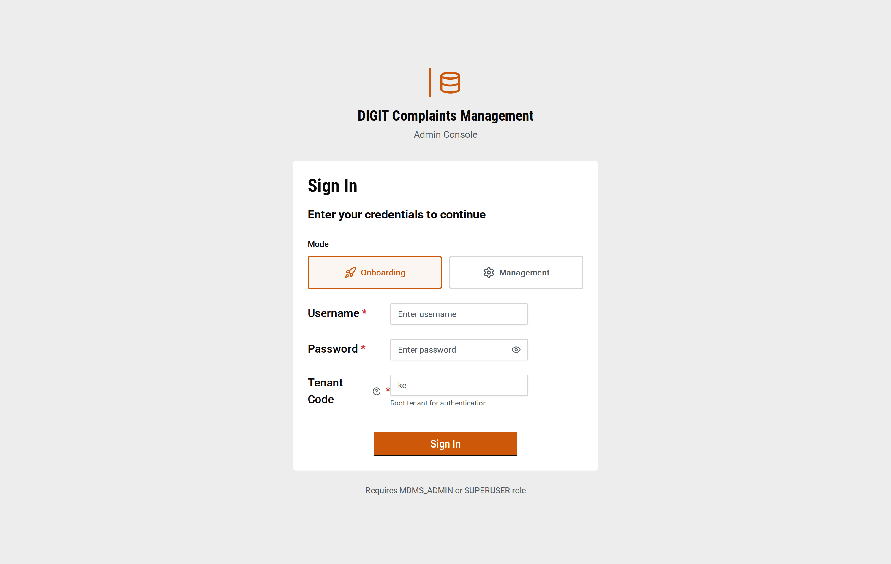

You land on the dashboard; the **NOTIFICATIONS** section in the left nav has everything in
this tutorial: Configure, Notification Routing, Notification Templates, Provider Templates,
Notification Logs, **Notification Providers**, User Preferences.

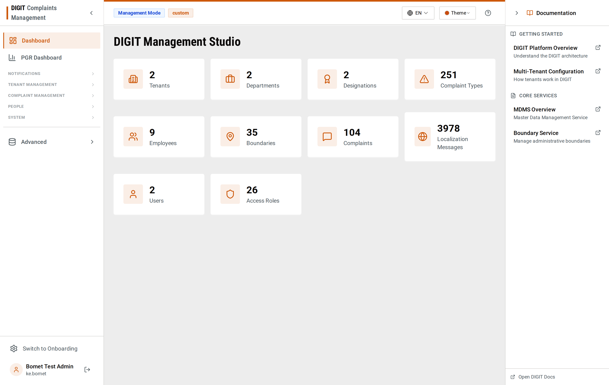

---

## 1. The big picture (read this once)

Notifications flow: **PGR** reads two MDMS masters (routing + templates), renders the
message per recipient, and hands off to **novu-bridge**, which delivers through **Novu**.

| Channel | Provider | How it's delivered |
|---|---|---|
| **SMS** | Twilio (a Novu integration) | Novu workflow `complaints-sms` → Twilio |
| **Email** | SMTP / nodemailer (a Novu integration) | Novu workflow `complaints-email` → SMTP |
| **WhatsApp** | Twilio WABA (a Novu integration, `from: whatsapp:+…`) | Novu trigger with a Twilio ContentSid override |

Two things you manage:
- **Providers** = *how* messages leave the system (credentials live in Novu).
- **Routing + Templates** (MDMS) = *who* gets notified and *what* the message says.

---

## 2. Add a notification provider

Open **Notification Providers**. Each row is a Novu integration; the **Credentials** column
is always redacted server-side. Per-row actions: **Verify**, **Test**, **Templates**.

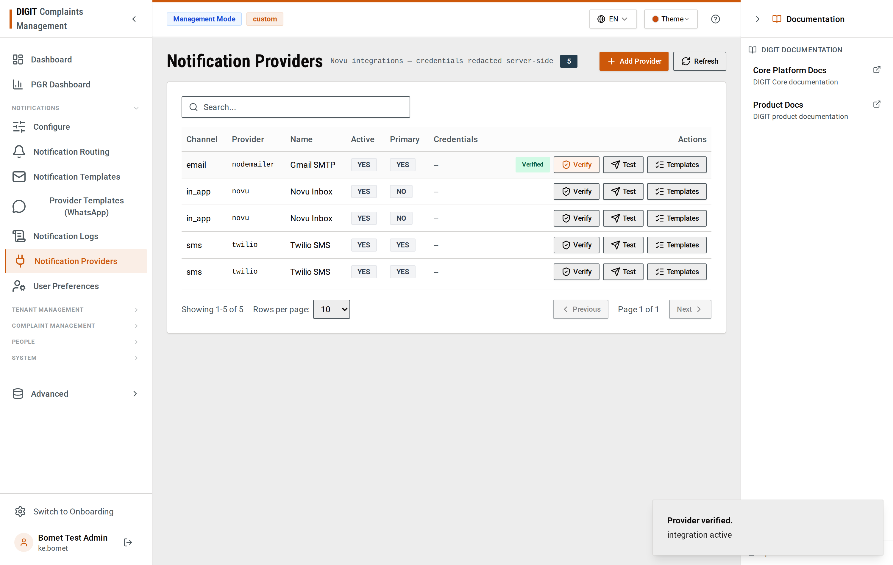

Click **+ Add Provider**. Pick a **Channel**, a **Provider ID**, a **Name**, and fill the
credential fields (they change per provider). Submit — the credentials POST straight to Novu.

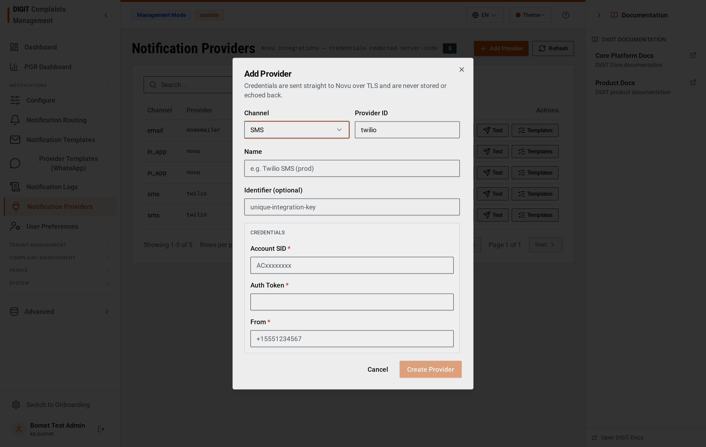

### 2.1 SMS (Twilio)
- **Channel:** SMS · **Provider ID:** `twilio`
- **Credentials:** Account SID, Auth Token, **From** = your SMS-capable Twilio number in
  E.164 (e.g. `+15551234567`).
- Click **Create Provider**.

### 2.2 Email (SMTP)
- **Channel:** Email · **Provider ID:** `nodemailer`
- **Credentials:** host, user, password, from, secure.

### 2.3 WhatsApp (Twilio WABA)
- **Channel:** WhatsApp · **Provider ID:** `twilio`
- **Credentials:** Account SID, Auth Token, **From** = your **WhatsApp** sender with the
  `whatsapp:` prefix (e.g. `whatsapp:+917676472431`).
- WhatsApp uses the Twilio integration with a `whatsapp:` sender; approved templates are
  sent as ContentSid overrides (see §4 and §6).

> **Credentials are never persisted or logged by novu-bridge** and never returned in any
> response — Novu is the credential store.

---

## 3. Verify connectivity

On any provider row, click **Verify**. novu-bridge checks the integration status in Novu and
returns a result — you'll see a green **"Provider verified — integration active"** toast
(bottom-right in the screenshot above) or a red failure with detail. Use this right after
adding a provider to confirm the credentials took.

---

## 4. See what templates are available (Pull templates)

Click **Templates** on a provider row to list the **Novu workflows** available as delivery
shells (`complaints-sms`, `complaints-email`, …), each with a copy-to-clipboard id.

For **WhatsApp**, the approved message templates are **Twilio ContentSids** (`HX…`) — those
are authored on Twilio's side and mapped in the **Provider Templates** screen. This is where
you record the ContentSid + variable order per action:

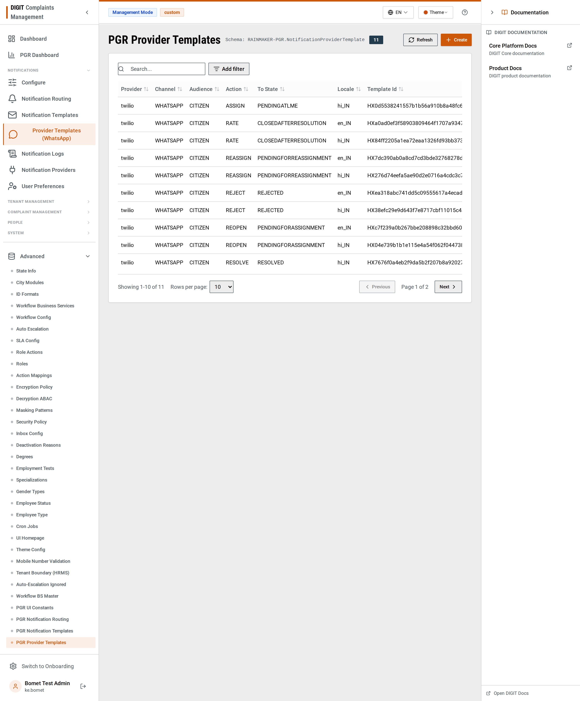

> Templates are **authored by you** — the Configurator shows what's available and lets you
> map it; it does not auto-create templates.

---

## 5. Configure who gets notified, and what it says

### 5.1 Notification Routing — *who + which channel*
Declares, per complaint transition `(action, toState)`, which **audience** (Citizen, GRO,
PGR_LME…) is notified over which **channel**.

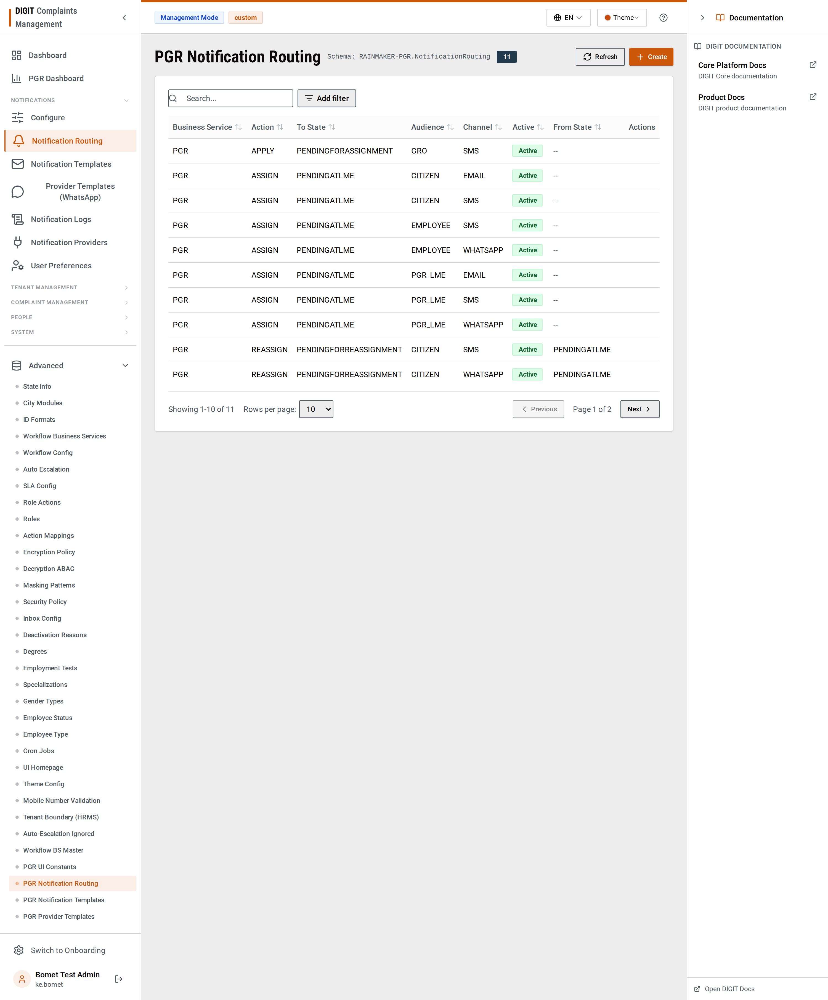

Click **Create** to add a routing rule:

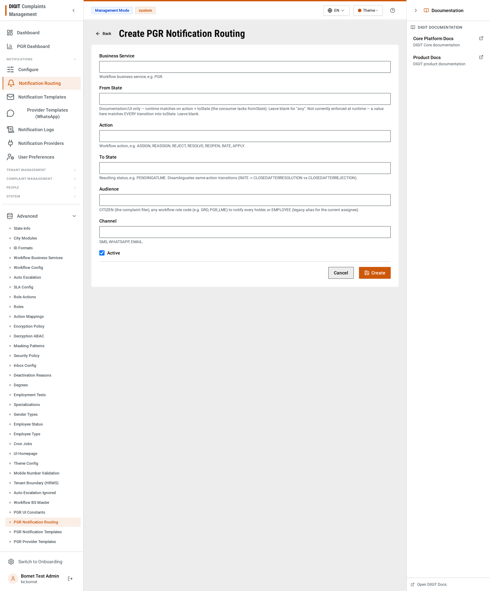

### 5.2 Notification Templates — *the message text*
The localized `body`/`subject` with `{tokens}` (e.g. `{complaint_type}`, `{id}`), keyed per
`(audience, action, toState, channel, locale)`.

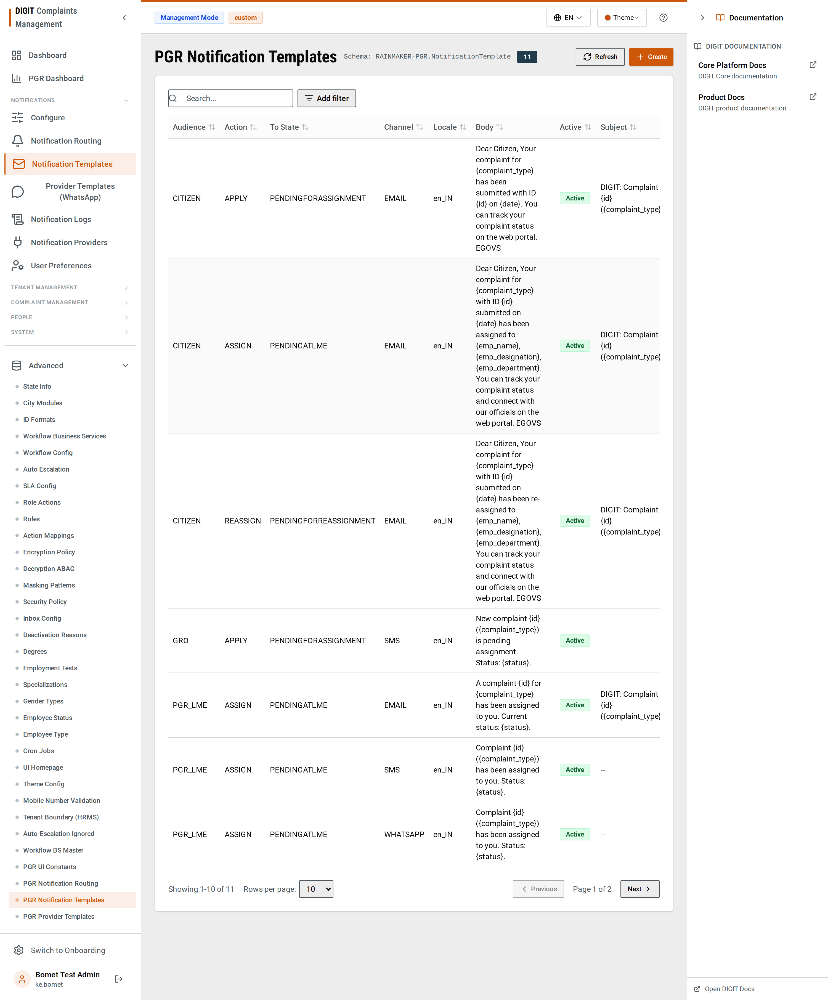

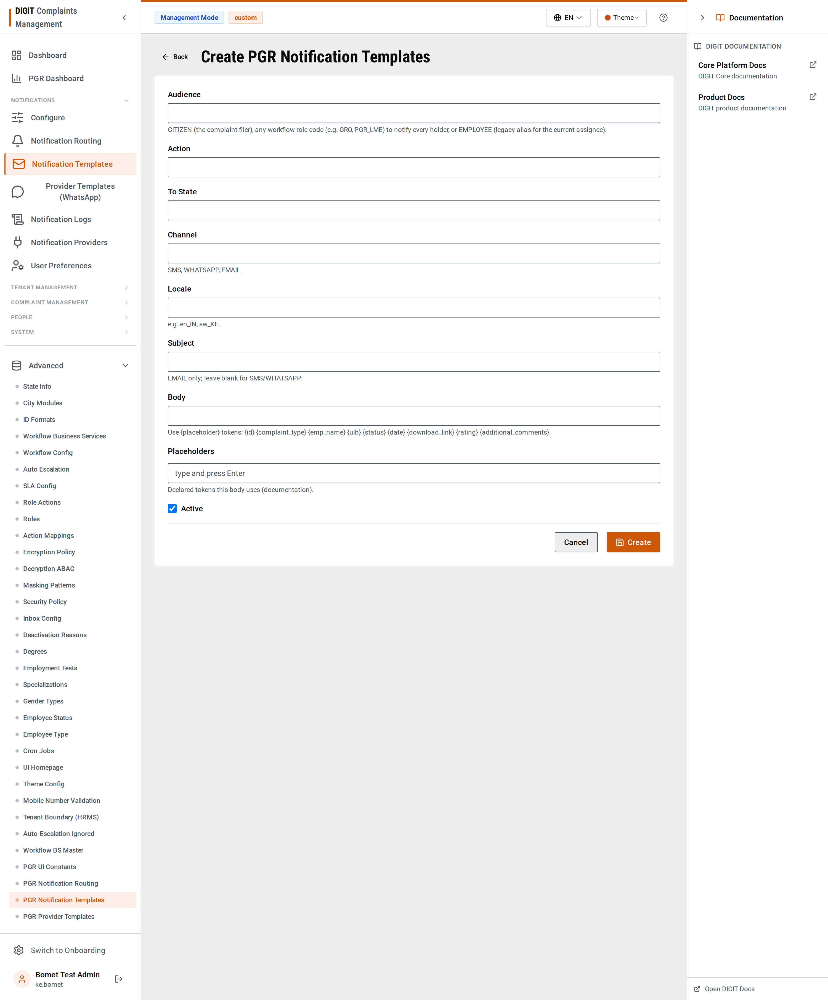

> The **Configure** screen is a guided view over routing + templates for a transition:
>
> 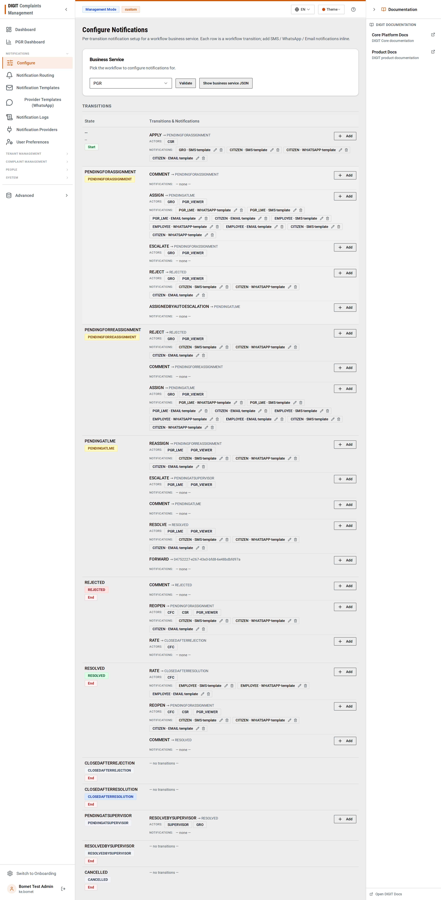

---

## 6. Test delivery end-to-end

### 6.1 Send a test message
On a provider row, click **Test**. Enter a recipient (phone for SMS/WhatsApp, email for
Email) and either a **body** (SMS/Email) or a **ContentSid + variables** (WhatsApp). Submit —
novu-bridge triggers Novu and shows the status + a transaction id. Every test-send is logged
as a **TEST** row (with a masked recipient) so it's separable from real traffic.

- **SMS / Email** deliver immediately through the Novu integration.
- **WhatsApp** requires the provider's **From** to be a `whatsapp:` sender (§2.3) — otherwise
  Twilio rejects it.

### 6.2 Confirm it in Notification Logs
Open **Notification Logs**. Every dispatch lands here with an explicit status
(`SENT` / `FAILED` / `SKIPPED`). Filter by **Complaint #** (or Channel / Status) to find a
specific run fast.

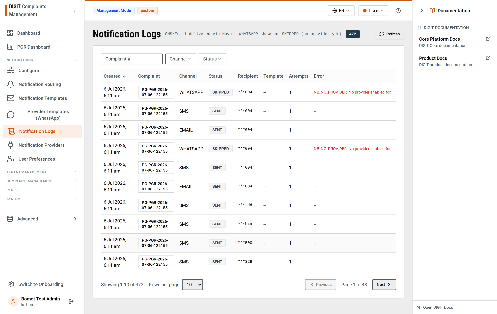

### 6.3 Test the real flow
File a complaint from the citizen UI (or drive a transition as an employee), then watch it
appear in **Notification Logs** — one row per (recipient × channel). `SKIPPED / NB_NO_PROVIDER`
means that channel has no enabled provider yet; `SENT` means Novu accepted it (open the row for
the provider status).

---

## 7. User preferences (consent + language)

**User Preferences** shows each user's per-channel consent (WhatsApp / SMS / Email) and
preferred language — read-only. Notifications honor these (a `REVOKED` channel is skipped;
the preferred language selects the localized template).

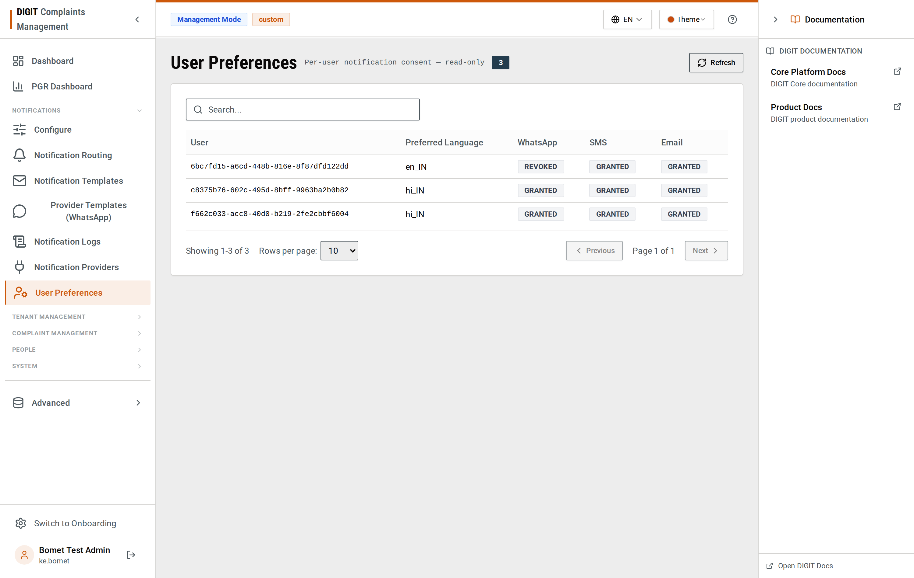

---

## 8. Troubleshooting

| Symptom | Cause / fix |
|---|---|
| Provider **Verify** fails | Credentials wrong, or the integration is inactive in Novu. Re-add with correct creds. |
| SMS/Email not delivered but log says `SENT` | `SENT` = Novu accepted the trigger. Open the log row / check Novu for the provider-side status. |
| WhatsApp `SKIPPED / NB_NO_PROVIDER` | WhatsApp isn't enabled on the bridge channel gate, or no WhatsApp provider is configured. |
| WhatsApp test-send rejected by Twilio | The provider **From** isn't a `whatsapp:` sender (§2.3), or the ContentSid isn't approved. |
| Email dropped silently | Empty subject — templates must carry a `subject`. |

For the full error-code reference and the delivery-path internals, see
[`provider-onboarding-runbook.md`](./provider-onboarding-runbook.md).
