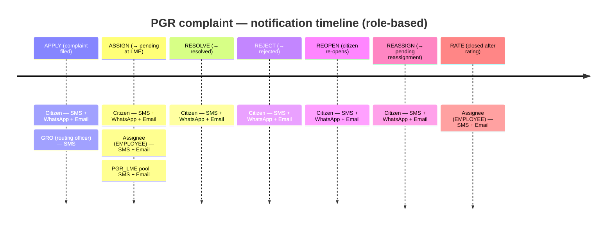

# Design: Provider→Template Mapping in MDMS (consolidating SMS / WhatsApp / Email)

**Date**: 2026-07-06
**Branch**: `feat/pgr-notifications-configure` (fork only — never egovernments/CCRS)
**Context**: The config-driven notification refactor consolidates how SMS, WhatsApp, and
Email are sent. This note covers the one piece the current design can't express: **provider
templates that must be referenced by ID (Twilio WhatsApp ContentSids)** rather than as
free-form rendered text.

---

## 1. Problem

The config-driven path pre-renders a **free-form body** (`RAINMAKER-PGR.NotificationTemplate.body`,
placeholders filled by `TemplateRenderer`) and hands it to novu-bridge → Novu → provider. That
is exactly right for:

- **SMS** (`twilio/text`, or SMSCountry) — free-form text is accepted.
- **Email** (`nodemailer`) — free-form subject + body.

But **WhatsApp via Twilio requires an approved Content template**: you send a `ContentSid` +
**positional** `contentVariables` (`{{1}},{{2}},…`), *not* free-form text. Free-form WhatsApp is
rejected. That is why W1 gates the WHATSAPP channel to `SKIPPED` / `NB_NO_PROVIDER` today — there
was no way to express "send approved template HX… with these variables".

The Bomet Twilio account already has the approved templates (verified 2026-07-06 via
`content.twilio.com/v1/ContentAndApprovals`): **~28 approved complaint-lifecycle templates**
(apply/assign/resolve/reject/reopen/reassign/rate, EN + HI), plus rejected OTP templates
(→ SMSCountry) and unsubmitted misc. Their `friendly_name`s encode the routing key
(`complaints_{action}_{toState}_[hindi_]message_new`), so the mapping is a wiring job, not an
approval wait.

## 2. Principle

**Keep the notification policy provider-agnostic; isolate provider-specific template IDs in a
provider-scoped mapping.**

- `NotificationRouting` / `NotificationTemplate` stay as-is (audience/channel routing +
  free-form body/subject). Switching providers never touches them.
- A new **provider→template mapping** master carries the external template ID + variable order,
  keyed by the *linked provider*. Swap the provider → swap this master only.

## 3. New MDMS master: `RAINMAKER-PGR.NotificationProviderTemplate`

One row per (provider, channel, routing-key, locale). `uniqueIdentifier` =
`provider.channel.audience.action.toState.locale`.

```jsonc
{
  "provider":  "twilio",          // the linked provider this ID belongs to
  "channel":   "WHATSAPP",        // WHATSAPP needs it; SMS may use it or free-form
  "audience":  "CITIZEN",
  "action":    "APPLY",
  "toState":   "PENDINGFORASSIGNMENT",
  "locale":    "en_IN",
  "templateId":"HX67fae4a61c4f50db8a11ebac21c50a79",   // Twilio ContentSid
  "templateName":"complaints_apply_pendingforassignment_message_new",
  "variables": ["complaint_type", "id", "date"],       // ORDERED → contentVariables {1,2,3}
  "approvalStatus":"approved",     // synced from provider; only 'approved' is sendable
  "active": true
}
```

Notes:
- `variables` is the ordered list of **our placeholder names** (without braces) that fill the
  template's positional slots. The emitter builds `contentVariables = { "1": values[variables[0]],
  "2": values[variables[1]], … }`.
- `approvalStatus` is carried so the UI/emitter can refuse to route through a `rejected`/
  `unsubmitted` template (fail safe → `SKIPPED`/`NB_TEMPLATE_NOT_APPROVED` rather than a Twilio 400).
- Locale maps our `en_IN`/`hi_IN` to the provider template language (`en`/`hi`).

### The Twilio → routing-key mapping (CITIZEN, verified 2026-07-06)

Approved `_message_new` set; positional vars `{{1}}=complaint_type {{2}}=id {{3}}=date`, then:

| Routing key (CITIZEN.action.toState) | EN ContentSid | HI ContentSid | variables (ordered) |
|---|---|---|---|
| APPLY.PENDINGFORASSIGNMENT | `HX67fae4a61c4f50db8a11ebac21c50a79` | `HX0f48a25c5dff81a1c5ee47a2cd122b36` | complaint_type, id, date |
| ASSIGN.PENDINGATLME | `HX9d0ab22fb14080bdfd3d4cb43d9bd6f7` | `HX0d5538241557b1b56a910b8a48fc6b48` | complaint_type, id, date, emp_name, emp_designation, emp_department |
| RESOLVE.RESOLVED | `HXe6f34b83cc6e7179c0ede06472dd81fb` | `HX7676f0a4eb2f9da5b2f207b8a9202710` | complaint_type, id, date, emp_name |
| REJECT.REJECTED | `HXea318abc741dd5c09555617a4ecad490` | `HX38efc29e9d643f7e8717cbf11015c4aa` | complaint_type, id, date, additional_comments |
| REOPEN.PENDINGFORASSIGNMENT | `HXc7f239a0b267bbe208898c32bbd6034a` | `HX04e739b1b1e115e4a54f062f044738ac` | complaint_type, id, date |
| REASSIGN.PENDINGFORREASSIGNMENT | `HX7dc390ab0a8cd7cd3bde32768278dbd7` | `HX276d74eefa5ae90d2e0716a4cdc3c7ca` | complaint_type, id, date, emp_name, emp_designation, emp_department |
| RATE.CLOSEDAFTERRESOLUTION | `HXa0ad0ef3f58903809464f1707a9347a8` | `HX84ff2205a1ea72eaa1326fd93bb37368` | complaint_type, id, date |

(Only CITIZEN-audience templates exist in Twilio — GRO/PGR_LME/EMPLOYEE WhatsApp would need new
approved templates. OTP templates are `rejected` → SMSCountry per the ops thread. Older
`_message` (non-`_new`) `rate` variants are `rejected` and have a **different** variable order —
do not use them; the sync's approval filter excludes them.)

## 4. Provider-link auto-sync (the configurator "Providers" screen)

When an operator links/edits the Twilio provider:

1. Call `GET content.twilio.com/v1/ContentAndApprovals` (creds from the linked integration).
2. **Auto-match** each `complaints_{action}_{toState}_[hindi_]message_new` friendly_name to a
   routing key by the naming convention; set `channel=WHATSAPP` for `twilio/call-to-action`/
   `twilio/text` WhatsApp-approved templates.
3. **Infer variable order** from the template body (`{{1}}…` positions vs the known placeholder
   phrases) and **surface it for operator confirmation** — positional vars are the one thing that
   can't be fully auto-trusted.
4. Write/refresh `NotificationProviderTemplate` rows; flag `rejected`/`unsubmitted` templates as
   non-sendable so the operator sees the gaps (e.g. OTP, or missing GRO/LME WhatsApp templates).

This is exactly "link the Twilio account templates with MDMS when the provider is linked."

## 5. Emitter + novu-bridge consumption

`NotificationService.processConfigDriven` (per recipient/channel):

- **SMS / EMAIL** — unchanged: render the free-form body (+ email subject) and publish
  `renderedBody`/`subject`.
- **WHATSAPP** — look up `NotificationProviderTemplate` for (provider, WHATSAPP, audience, action,
  toState, locale). If an **approved** row exists: publish the event with `templateId` +
  `contentVariables` (built from `variables` × the placeholder map) *instead of* a rendered body.
  If none/`rejected`: keep the W1 behavior → `SKIPPED` (`NB_TEMPLATE_NOT_APPROVED`).

`novu-bridge` (`ComplaintsDomainEvent` already has room for this): when `templateId` is present,
trigger the WhatsApp workflow with Novu's Twilio `contentSid` + `contentVariables` passthrough
(Novu's Twilio provider supports both). SMS/email paths unchanged (free-form body/subject).

The W1 channel-enable gate stays the safety net: WHATSAPP only sends when (a) the channel is
enabled **and** (b) an approved provider template is linked; otherwise a clean `SKIPPED` row, never
a Twilio 400 or a free-form WhatsApp rejection.

## 6. Rollout

1. **Seed the mapping upfront** (this task): load the table in §3 into
   `RAINMAKER-PGR.NotificationProviderTemplate` on Bomet + the branch seed, so the wiring exists
   before the code lands. (SMS twilio/text rows can be seeded too for reference; SMS keeps working
   free-form regardless.)
2. Configurator: provider-link auto-sync + a read-only "Templates" view under Providers.
3. pgr-services + novu-bridge: the WHATSAPP `templateId`/`contentVariables` path (§5), behind the
   existing `NOVU_BRIDGE_CHANNELS_ENABLED` gate (add `WHATSAPP` only once seeded).
4. Enable WHATSAPP on the channel gate → the approved CITIZEN templates start delivering; unmapped
   audiences stay `SKIPPED` until their templates are approved.

## 7. Localization linkage (a layer not yet built)

Both the free-form content **and** the provider-template selection must be **locale-aware and
approval-aware**, driven by **each recipient's own locale** — a notification goes out in ONE
language per recipient, never in every language.

**Locale resolution (per recipient, authoritative rule):**

```
recipientLocale =
    user's consented language        (digit-user-preferences-service preferredLanguage)  // 1st
  ? deployment default language      (config.notification.default.locale / tenant)       // 2nd
  ? "en"                             (hard fallback)                                      // 3rd
```

**Reuse the consent service for language — no new store.** `digit-user-preferences-service` (the
same service novu-bridge already calls for per-channel consent via `PreferenceServiceClient`)
already holds, in the `USER_NOTIFICATION_PREFERENCES` record, a **`preferredLanguage`** field
validated against `{en_IN, hi_IN, fr_IN, pt_IN}` alongside the per-channel `Consent`. So the emitter
resolves a recipient's locale by reading `preferredLanguage` from the same lookup it (or the bridge)
uses for consent — falling back to the deployment default, then `en`. Each recipient (citizen, GRO,
LME, …) renders in their own language; a role pool with mixed locales renders per-member (group by
resolved locale), not once for the whole pool.

> **Interim (current):** the emitter renders once in the deployment default. **Email stays `en` by
> default for now** — per-recipient `preferredLanguage` resolution is deferred (it plugs into the
> same `digit-user-preferences-service` lookup as consent when built).

**Current limitation:** the emitter renders once in `config.notification.default.locale` for
*everyone* (the W2.9 single-locale known-limitation) — it does NOT yet read the per-recipient
consented locale. Implementing the rule above (resolve locale per `ResolvedRecipient`, render
per-locale) is the concrete first step of this layer. Two further gaps:

**(a) Free-form content is inline in MDMS, not sourced from egov-localization.**
`NotificationTemplate` stores `body`/`subject` text inline per `(…, locale)` row, so adding a
language means hand-adding MDMS rows. The linkage: let `body`/`subject` reference a **localization
code** (e.g. `pgr.notif.citizen.apply.body`) resolved via **egov-localization** for the recipient's
locale, with default-locale fallback. Then adding a language = adding localization entries (the
normal i18n path, reusable by the UI), not MDMS edits.

**(b) Provider-template selection isn't locale+approval aware.**
For WhatsApp we have per-locale approved ContentSids (EN + HI). Selection must prefer the
recipient locale's **approved** template, with a strict fallback chain:

```
recipient locale L, routing key K, channel C:
  WHATSAPP:  approved(provider, K, L)            -> use its ContentSid + ordered vars
           : approved(provider, K, defaultLocale)-> use that
           : SKIP  (NB_TEMPLATE_NOT_APPROVED)      // never free-form WhatsApp
  SMS/EMAIL: localized body/subject in L (egov-localization)
           : default-locale body/subject
           : (free-form is always allowed for SMS/email — no approval concept)
```

So **"when a localized template is available AND approved, use it"** becomes a concrete rule: for
WhatsApp the emitter checks *provider approval × locale* together and only routes a locale through
the channel when both line up (else falls back a locale, else SKIPs) — never sending an
unlocalized or unapproved WhatsApp message. For SMS/email there is no approval gate, only the
localized→default→free-form content fallback.

This layer is **not built today** (content is inline MDMS; provider approval isn't cross-referenced
with locale). It sequences right after the provider-template mapping (§6): once
`NotificationProviderTemplate` carries per-locale `approvalStatus`, add (1) egov-localization-backed
body/subject resolution and (2) the locale+approval fallback in `TemplateRenderer` / the emitter.

## 8. Notification timeline — who gets what, when

Each recipient receives **one language** (§7 resolution). WhatsApp effectively reaches **CITIZEN
only** (the sole audience with approved Twilio templates); officer WhatsApp legs `SKIP` until
officer templates are approved, so officers get **SMS + Email**.



Same thing as a matrix (`✓` sent, `wa*` = WhatsApp only if an approved template exists for that
audience — today only CITIZEN):

| Transition | CITIZEN | GRO | Assignee (EMPLOYEE) | PGR_LME pool |
|---|---|---|---|---|
| **APPLY** → PENDINGFORASSIGNMENT | SMS · WA · Email | SMS | — | — |
| **ASSIGN** → PENDINGATLME | SMS · WA · Email | — | SMS · Email · *(wa\*)* | SMS · Email · *(wa\*)* |
| **RESOLVE** → RESOLVED | SMS · WA · Email | — | — | — |
| **REJECT** → REJECTED | SMS · WA · Email | — | — | — |
| **REOPEN** → PENDINGFORASSIGNMENT | SMS · WA · Email | — | — | — |
| **REASSIGN** → PENDINGFORREASSIGNMENT | SMS · WA · Email | — | — | — |
| **RATE** → CLOSEDAFTERRESOLUTION | — | — | SMS · Email · *(wa\*)* | — |

Notes:
- **Dedup**: a person holding two notified roles (e.g. the assignee also in the PGR_LME pool) gets
  **one** message per channel (`channel|subscriber` dedup).
- **No-assignee transitions** (REOPEN, REASSIGN target, RATE-after-reject) carry **no** EMPLOYEE row —
  there is no assignee to notify (trimmed from the seed).
- **Language**: every cell is rendered in that recipient's resolved locale (preferredLanguage →
  deployment default → en); **email is `en` by default in the interim**.
- This reflects the deployed Bomet routing; the branch's minimal parity seed ships CITIZEN + EMPLOYEE
  only — GRO/PGR_LME rows are added per deployment.

## 9. Open questions

- **Variable-order confirmation** is inherently manual (positional). The sync should show the body
  + inferred slots and require a save. (§4.3)
- **Non-CITIZEN WhatsApp** (GRO/PGR_LME/EMPLOYEE) has no approved templates yet — either add them
  in Twilio or keep those audiences SMS/email-only.
- **SMS via ContentSid vs free-form** — SMS works free-form today; using the ContentSid is optional
  (useful only if a region later mandates registered SMS templates, à la India DLT).
