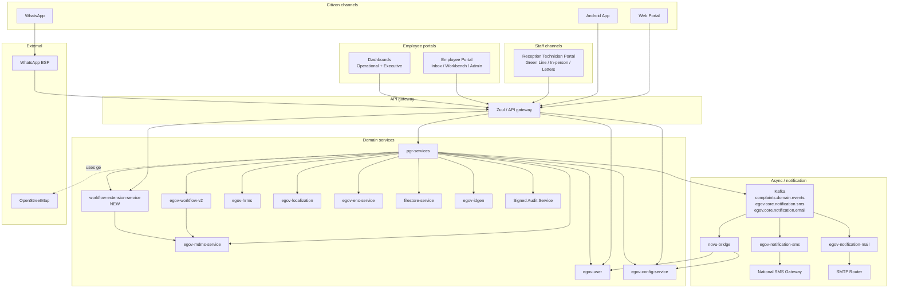

# Mozambique Complaints & Reports Portal (PRD) — Solution Design

**Date:** 2026-06-22
**Status:** Draft for review
**Version:** 1.0
**Authors:** Engineering team (Mozambique PRD initiative)
**Audience:** Engineering team, BRD authors, product owners, IGE/IGSAE IT
**Source inputs:**
- BRD V4.0 — `Plataforma de Reclamações e Denúncias` (English translation)
- Mozambique Engineering Tracker — `docs/superpowers/specs/2026-06-18-mozambique-engineering-tracker-scoping.md`
- Companion design docs in `docs/superpowers/specs/workflow-notification/` (referenced throughout, not duplicated here)

---

## Executive summary (1 page)

The Government of Mozambique enacted Laws 1/2026 and 2/2026 creating the General State Inspectorate (IGE) and the General Inspectorate of Food and Economic Security (IGSAE). The BRD specifies a single Complaints and Reports Portal (PRD) that lets citizens file complaints, grievances, petitions and reports against public entities (routed to IGE) or economic agents (routed to IGSAE), receive automatic SMS updates, and have cases handled through a 7-state workflow within 24–360 hours.

This document is the single solution-architecture reference for that build. It captures:

- The **tenancy model** (`mz` state tenant with `mz.ige` and `mz.igsae` sub-tenants).
- **Ten capabilities** that compose the platform — submission, workflow, routing, notifications, templates, hierarchy, PII, citizen auth, PRD numbering, audit logging.
- **Eight ADRs** capturing the architectural decisions made through prior design conversations; one remains open pending BRD-author clarification (confidentiality scope).
- A **40-row Product vs Customization breakdown** distinguishing changes to the DIGIT/PGR base codebase (upstream-bound) from Mozambique-specific configuration and data.
- Three **new product capabilities** explicitly NOT in the current PGR product, all needed for the BRD: multi-department mapping of complaint types, server-side authorization filter on the reception officer's catalog, and the workflow-extension-service for configurable notification routing.

The document indexes — but does not duplicate — the per-capability specs already written under `workflow-notification/`. Read this first for the system shape; drill into the linked specs for implementation detail.

**Three things blocking ship if not resolved in the next sprint:**
1. **Confidentiality scope** — BRD §5.1 says PII of confidential complaints is "not visible to any IGE/IGSAE employee." If literal, the assigned Case Manager can't act on the case. See ADR-008.
2. **Android app** — BRD §5.1.A makes it mandatory at go-live. The existing roadmap (Row 32) had it as XS prototype / M production. Needs re-sizing and re-resourcing now.
3. **Multi-department mapping** — three NEW product changes (rows 13-15 in §13) are prerequisites for the reception-officer intake flow and don't exist in PGR today.

---

## 1. Context & problem

### 1.1 Why this exists

Laws 1/2026 and 2/2026 of the Republic of Mozambique constitute:
- **IGE** (General State Inspectorate) — successor to IGF + IGAP, owns complaints against public entities (ministries, provincial councils, municipalities).
- **IGSAE** (General Inspectorate of Food and Economic Security) — successor to INAE, owns complaints against economic agents (companies, traders, service providers).

Both need a single, traceable channel that citizens recognise. The BRD positions DIGIT CRS — the existing complaints platform deployed for other geographies — as a Quick Win base, configured for Mozambique and launched in July 2026.

### 1.2 Headline scope numbers

| Dimension | Value |
|---|---|
| Provinces | 11 (incl. Maputo City) |
| Districts | 154 |
| Administrative Posts | 490 |
| Municipalities | 71 |
| Submission channels | 6 (Web, Android, WhatsApp, Green Line, In-person, Letters) |
| Workflow states | 7 (NEW, IN_TRIAGE, REFERRED, UNDER_INVESTIGATION, AWAITING_INFORMATION, RESOLVED, REJECTED) |
| Notification templates | 7 SMS, one per state transition (per BRD §5.1.E) |
| Standard SLAs | IGSAE: 24–120h; IGE: 360h |
| Availability target | 99.5% (excl. scheduled maintenance) |
| Response time target | ≤ 3 seconds |
| Concurrency target | ≥ 500 simultaneous users |
| Go-live | 2026-07-07 |

### 1.3 What it isn't

The BRD explicitly excludes (BRD §1.3):

- AI-driven triage suggestions or duplicate detection.
- USSD channel.
- Anonymous submissions (citizens must log in via OTP).
- Public-facing aggregated dashboard.
- Offline operation.

---

## 2. Scope

### 2.1 In scope (delivered for July 2026)

The ten capabilities enumerated in §7:

1. Submission (six channels, including three staff-intake channels via Reception Technician)
2. Workflow lifecycle (7 states with role-gated transitions)
3. Routing & assignment (two-step: Screening → Supervisor → Case Manager)
4. Notifications (SMS-only at launch; 7 per-state templates)
5. Templates (IGE / IGSAE form variants)
6. Complaint hierarchy (Appendix A catalog with SLAs and department mappings)
7. PII encryption + masking + confidentiality flag
8. Citizen authentication (OTP via SMS)
9. PRD-YYYY-NNNNNNN human-readable case identifier
10. Audit logging (state transitions + PII access)

### 2.2 Out of scope (BRD §1.3 + this initiative's deferred items)

- AI / duplicate-detection.
- USSD.
- Anonymous submissions.
- Public dashboard.
- Offline mode.
- WhatsApp and email channels at launch (architecture supports them; not seeded).
- Other tenants — non-Mozambique DIGIT PGR deployments are unaffected; all Mozambique behaviour is gated by per-tenant feature flags.

### 2.3 Pilot vs full production

The BRD §9 lists "Definition of Pilot Entities" as a discrete phase. Implication: not all 65 municipalities + 11 CSREPs + 10 CEPs + 18 ministries are live on day 1. The pilot scope is a separate decision (open question — see §11). Architecture supports phased onboarding via per-tenant MDMS data.

---

## 3. Stakeholders & roles

### 3.1 Stakeholders (BRD §4.1)

| Stakeholder | Role |
|---|---|
| Citizens | Submit complaints, grievances, petitions, reports. Track via reference number. Rate resolution. |
| IGE | Receives and resolves cases related to public entities. |
| IGSAE | Receives and resolves cases related to economic agents. |

### 3.2 Persona → role mapping (role composition)

**Approach.** Each persona is composed of a **set of roles**, not a single role. The set has four orthogonal dimensions:

1. **Base role** (`EMPLOYEE` or `CITIZEN`) — platform identity tier; gives login affordance and applies the cross-cutting access posture. Existing DIGIT roles, reused.
2. **Functional role** (`CMS_*`) — what the user IS in the Complaints domain (intake clerk, screener, investigator, supervisor, dashboard viewer, admin).
3. **Scope role** (`CENTRAL_USER` or `DEPARTMENT_USER`) — at what level the user OPERATES (institution-wide vs. within one or more concrete departments).
4. **Permission role** (`COMPLAINTS_VIEWER`, `COMPLAINTS_EDITOR`, `COMPLAINTS_CREATOR`) — atomic CRUD-style grants on the Complaints entity, independent of the functional role.

This decomposition replaces the previously-considered name-prefix approach (`CMS_CENTRAL_*` vs `CMS_DEPT_*`). Scope is not in the functional role name; permission grants are not implied by the functional role — they are separate roles on the user. **A Central Screening Officer's role set, for example, is `{CMS_SCREENING_OFFICER, CENTRAL_USER, COMPLAINTS_VIEWER, COMPLAINTS_EDITOR, EMPLOYEE}`.** Authorization code reads the user's role SET (not a single string), AND-ing the relevant rules together.

**Why this is better.**
- No `department.scope` column, no `user.isCentral` flag.
- No name-prefix combinatorial explosion (`CMS_CENTRAL_*` × `CMS_DEPT_*` × `CMS_VIEWER_*` × …).
- The same functional role (e.g. `CMS_SUPERVISOR`) covers both Department and Central supervisors; the scope role decides the visibility envelope.
- The same persona can be temporarily restricted (e.g. losing `COMPLAINTS_EDITOR` during a sanction period) without changing their functional role.
- Defense-in-depth: every state-changing action requires BOTH the functional role (which says "Screening Officer can refer") AND the permission role (`COMPLAINTS_EDITOR` says "this user is allowed to mutate complaint state at all"). Strip either one and the action is denied.
- Future personas can pick a scope and permission grants without inventing a new functional role.

#### 3.2.1 Operational personas (BRD §4.2)

Role sets are shown in 4-dimension order: `{functional, scope, permissions, base}`. The same functional role (e.g. `CMS_SUPERVISOR`) appears for both Central and Department supervisors; the scope role is the discriminator. Permission roles are listed individually so additions/removals can be tracked per-user.

| # | Persona | Role set | HRMS `department` attribute | Visibility |
|---|---|---|---|---|
| 1 | **Citizen** | `{COMPLAINTS_VIEWER, COMPLAINTS_CREATOR, CITIZEN}` | n/a | Own complaints only |
| 2 | **Reception Officer / Counter Employee** | `{CMS_RECEPTION_OFFICER, CENTRAL_USER, COMPLAINTS_VIEWER, COMPLAINTS_CREATOR, COMPLAINTS_EDITOR, EMPLOYEE}` | none (`CENTRAL_USER` means "no department filter") | Institution catalog; intakes land in central pool until screened |
| 3 | **Central Screening Officer** | `{CMS_SCREENING_OFFICER, CENTRAL_USER, COMPLAINTS_VIEWER, COMPLAINTS_EDITOR, EMPLOYEE}` | none | All NEW + IN_TRIAGE cases for the institution |
| 4 | **Central Supervisor** | `{CMS_SUPERVISOR, CENTRAL_USER, COMPLAINTS_VIEWER, COMPLAINTS_EDITOR, EMPLOYEE}` | none | All cases across departments; cross-department escalation owner |
| 5 | **Department Supervisor** | `{CMS_SUPERVISOR, DEPARTMENT_USER, COMPLAINTS_VIEWER, COMPLAINTS_EDITOR, EMPLOYEE}` | one or more concrete department codes (e.g. `MIN_HEALTH`) | All REFERRED + downstream cases in their department(s) |
| 6 | **Case Manager** | `{CMS_CASE_MANAGER, DEPARTMENT_USER, COMPLAINTS_VIEWER, COMPLAINTS_EDITOR, EMPLOYEE}` | one or more concrete department codes | Only cases assigned to *them* within their department(s) |

**Permission-role assignment rationale:**

- **Citizen** gets `COMPLAINTS_CREATOR` (file a complaint) + `COMPLAINTS_VIEWER` (track status). No `COMPLAINTS_EDITOR` — citizens can only respond to specific workflow prompts (e.g. `AWAITING_INFORMATION` → reply), which is a workflow-action permission gated by the state machine, not free-form editing.
- **Reception Officer** is the only employee persona with `COMPLAINTS_CREATOR` — they file on behalf of citizens via Green Line / counter / letters.
- **Screening Officer, Supervisor, Case Manager** are `EDITOR` (workflow actions: refer, assign, resolve, reject, request information) but **not** `CREATOR` — they handle existing cases; they don't open new ones.
- **All operational personas** have `COMPLAINTS_VIEWER`; without it, the read paths refuse.

#### 3.2.2 Non-operational personas

| Persona | Role set | Purpose |
|---|---|---|
| IGE / IGSAE Leadership | `{CMS_DASHBOARD_VIEWER, CENTRAL_USER, COMPLAINTS_VIEWER, EMPLOYEE}` | Read-only executive dashboards; aggregated KPIs only. `COMPLAINTS_VIEWER` lets them open a specific case from a dashboard drill-down; absence of `COMPLAINTS_EDITOR` means they cannot mutate state. |
| System Administrator | `{CMS_ADMIN, EMPLOYEE}` | Master data + workflow + template configuration; no case access, so no scope role and no permission roles for the Complaints entity. If a State Admin needs occasional case visibility (incident support, debugging), grant `COMPLAINTS_VIEWER` separately — explicit and auditable. |

#### 3.2.3 How CENTRAL vs DEPARTMENT is enforced at runtime

The discriminator is **the presence of `CENTRAL_USER` or `DEPARTMENT_USER` in the user's role set**, NOT a flag on the user record and NOT a column on the department record. This avoids adding new schema to either `egov-hrms` or any `Department` master.

Authorization-code pseudocode — every Complaints API call passes through this gate:

```java
// Step 1: permission gate (atomic CRUD check) — fastest reject
switch (operation) {
    case READ:
        if (!roles.contains("COMPLAINTS_VIEWER")) deny("no read permission");
        break;
    case CREATE:
        if (!roles.contains("COMPLAINTS_CREATOR")) deny("no create permission");
        break;
    case UPDATE: // includes workflow actions: refer, assign, resolve, reject, requestInfo
        if (!roles.contains("COMPLAINTS_EDITOR")) deny("no edit permission");
        break;
}

// Step 2: functional gate (state-machine + role-to-action matrix)
//         e.g. only CMS_SCREENING_OFFICER can issue the 'refer' action from IN_TRIAGE
if (!functionalRoleAllowsAction(roles, currentState, requestedAction)) {
    deny("functional role does not permit this action in this state");
}

// Step 3: scope gate (visibility envelope)
boolean isCentral    = roles.contains("CENTRAL_USER");
boolean isDepartment = roles.contains("DEPARTMENT_USER");

if (isCentral) {
    // institution-wide visibility; no department filter
    visibleSet = allCasesForInstitution(tenantId);
} else if (isDepartment) {
    // department-scoped visibility per ADR-007
    List<String> myDepts = hrmsUserDepartments(user);
    visibleSet = casesWhereDepartmentIn(tenantId, myDepts);
} else {
    // neither — applies to roles like CMS_ADMIN that don't operate on cases
    visibleSet = none;
}

// Step 4: targeted-entity check (is the specific case in the visible set?)
if (!visibleSet.contains(targetCaseId)) deny("case not in scope");
```

**Filter / authorization logic by scope:**

| Surface | `CENTRAL_USER` in role set | `DEPARTMENT_USER` in role set |
|---|---|---|
| Catalog (intake form complaint-type dropdown) | Full institution catalog — ADR-007 intersection filter is **skipped** | ADR-007 intersection filter applies: `complaintType.departments[] ∩ HRMS_user.departments[]` |
| Inbox / search | Filter by institution (sub-tenant); no department clause | Filter by `applicationStatus IN (REFERRED, …)` AND `department IN HRMS_user.departments` |
| Assignment | Can re-assign across departments (Supervisor); refer to any Department Supervisor (Screening Officer) | Can assign only within own department(s) |
| Dashboard scope | Institution-wide | Department-scoped |

The **`CMS_SUPERVISOR` functional role** carries different concrete permissions depending on the scope role it's paired with:

| Role-set | Concrete permissions |
|---|---|
| `{CMS_SUPERVISOR, CENTRAL_USER, EMPLOYEE}` | Re-assign cases across departments; override Department Supervisor decisions; approve cross-department escalations; sees institution-wide dashboards |
| `{CMS_SUPERVISOR, DEPARTMENT_USER, EMPLOYEE}` | Assign Case Manager within own department(s); approve resolution within department(s); cannot touch cases outside their `HRMS_user.departments`; sees department-scoped dashboards |

#### 3.2.4 Role registration

**Eleven new role codes** to add to the access-control RBAC catalog:

| Code | Type | Purpose |
|---|---|---|
| `CMS_RECEPTION_OFFICER` | functional | Intake |
| `CMS_SCREENING_OFFICER` | functional | Triage, refer, reject-during-screening |
| `CMS_CASE_MANAGER` | functional | Investigate, request information, resolve |
| `CMS_SUPERVISOR` | functional | Assign, approve, escalate, reject, override |
| `CMS_DASHBOARD_VIEWER` | functional | Read-only executive dashboards |
| `CMS_ADMIN` | functional | Master / workflow / template configuration |
| `CENTRAL_USER` | scope | Marks the user as institution-scope |
| `DEPARTMENT_USER` | scope | Marks the user as department-scope |
| `COMPLAINTS_VIEWER` | permission | Atomic READ grant on the Complaints entity |
| `COMPLAINTS_EDITOR` | permission | Atomic UPDATE grant on the Complaints entity (covers workflow actions: refer, assign, resolve, reject, requestInfo) |
| `COMPLAINTS_CREATOR` | permission | Atomic CREATE grant on the Complaints entity (file a new case) |

`EMPLOYEE` and `CITIZEN` are existing DIGIT base roles — re-used, not re-registered.

Existing PGR tenants continue to use legacy role codes (`PGR_LME`, `GRO`, `DGRO`, …); Mozambique deploys with the `CMS_*` + scope + permission set throughout. Existing PGR roles can be wired as functional aliases later if cross-deployment compatibility is needed.

**Note**: If there is hardcoding of roles in the UI or backend, this change will expose that. It should be fixed at a product level, not just at a solution level.

#### 3.2.5 Rationale notes

- **Reception Officer / Counter Employee as one persona.** The BRD treats counter staff and Green-Line/letter intake as the same operational persona — same desk, three input channels. One role code, two human-readable names.
- **Why scope as a separate role.** No new flag is needed on `egov-hrms` user records or on the `Department` master to mark central vs department membership. The scope role on the user IS the discriminator. Future personas inherit this without schema churn.
- **Why one Supervisor functional role, not two.** The work a Supervisor *does* (assign, approve, escalate, close) is the same regardless of scope. What changes is the *visibility envelope* — which is exactly what scope roles encode. One functional role + scope role gives clean composition; two functional roles (`CMS_DEPT_SUPERVISOR` + `CMS_CENTRAL_SUPERVISOR`) was a worse fit because the permission code still had to switch on something.
- **Why Leadership and Admin are separate.** BRD §4.2 separates "Leadership" (executive overview, read-only) from "System Administrator" (configuration management) — different capabilities, different audiences, different audit-log scrutiny.
- **Admin doesn't need a scope role.** Configuration is global to the tenant the admin is bound to (`mz`, `mz.ige`, `mz.igsae`, or cross-tenant for State Admin). Case-scope rules don't apply to config-edit operations.

---

## 4. Tenancy model

### 4.1 Tenant hierarchy

```
mz (state tenant — shared vocabulary, workflow definitions, MDMS masters)
├── mz.ige   (sub-tenant — IGE-specific data, users, entities, complaints)
└── mz.igsae (sub-tenant — IGSAE-specific data, users, entities, complaints)
```

State-level fallback (via `MultiStateInstanceUtil`): MDMS lookups at `mz.ige` and `mz.igsae` fall back to `mz` for shared masters (`Workflow.BusinessService`, `ComplaintHierarchy`, `LanguageStrategy`).

### 4.2 Routing across sub-tenants

The citizen never picks the institution. The "Complaint related to" dropdown (BRD §5.1.D + Appendix B Section I) maps the citizen's natural-language choice to a `templateType` via the `RAINMAKER-PGR.ComplaintRelatedToMap` MDMS master. Selecting `templateType=IGE` writes the complaint into the `mz.ige` sub-tenant; `IGSAE` into `mz.igsae`. Complaint types and subtypes are fetched from the sub-tenant based on the same param.

### 4.3 Data partitioning

- Each `eg_pgr_service_v2` row is tagged with the sub-tenant id (existing `tenantid` column).
- Default search scope is the caller's sub-tenant.
- Cross-tenant visibility is allowed only for users with `CMS_DASHBOARD_VIEWER` or `CMS_ADMIN` in their role set AND whose tenant binding is the State tenant `mz` — they see consolidated dashboards across `mz.ige` + `mz.igsae`. Sub-tenant-bound Leadership/Admin see only their sub-tenant.
- HRMS user records are anchored at the sub-tenant level. Multi-department assignment per user is allowed (one user can be a Reception Technician for multiple departments).

### 4.4 MDMS scoping

**Design principle:** every tenant (`mz`, `mz.ige`, `mz.igsae`) is **capable of being self-sufficient** — it can carry a complete, standalone copy of any master it needs. The state-level (`mz`) entry exists as a **backward-compatibility fallback**, not as a required common layer. Default lookup order at any sub-tenant is *sub-tenant first, then state-level fallback via `MultiStateInstanceUtil`*.

This means each table row below is a **default scope** — i.e., where the canonical data is *expected* to live for Mozambique — but every master can be overridden at any tenant level if a deployment needs it. New tenants joining later can be fully self-contained without inheriting from `mz`.

| Master | Default scope | Override allowed at | Rationale |
|---|---|---|---|
| `Workflow.BusinessService` | `mz` | `mz.ige`, `mz.igsae` | Shared 7-state lifecycle by default; sub-tenant can override states/transitions if a regulator requires |
| `Workflow.BusinessServiceExtension` | `mz` | `mz.ige`, `mz.igsae` | Audience routing shared by default; can diverge per institution |
| `ComplaintHierarchy` (schema) | `mz` | sub-tenant | Schema shape (MOZ_008) is shared |
| `ComplaintHierarchy` (data) | `mz.ige`, `mz.igsae` separately | either | IGE and IGSAE have fundamentally different taxonomies |
| `ComplaintTemplateType` (schema + the two IGE/IGSAE definition rows) | `mz` | sub-tenant | Form variants are platform-level; sub-tenants may add tenant-specific variants later |
| `Department` + `Entity` catalogs | `mz.ige`, `mz.igsae` separately | either | Institution-specific entity lists |
| `TemplateBinding` (SMS bodies) | `mz` | sub-tenant | Body text is institution-neutral by default; sub-tenants may override for distinct branding |
| `ComplaintRelatedToMap` (dispatcher) | `mz` | (rare) | Citizen-facing dropdown — shared across institutions |
| `LanguageStrategy` (locale precedence + fallback) | `mz` | sub-tenant | Per BRD: pt_MZ default for Mozambique; sub-tenant can pick a different locale strategy |
| `RAINMAKER-PGR.PGRConfiguration` (feature flags + per-tenant overrides) | `mz.ige`, `mz.igsae` separately | either | Independent rollout per institution |

**Fallback semantics in practice.** When `pgr-services` resolves any master for a complaint filed under `mz.ige`:

1. Look up at `mz.ige` first.
2. On miss, fall back to `mz`.
3. On miss at `mz`, return empty / null (which becomes the consumer's signal to use defaults or fail loudly).

This is the standard DIGIT `MultiStateInstanceUtil` behavior and doesn't require new code — but the design intent (every tenant *capable* of self-sufficiency, fallback merely a convenience) should be reflected in operations training and the master-editing UX (configurator). 

---

## 5. System architecture

### 5.1 Service inventory



### 5.2 Service responsibilities

| Service | Status | Responsibility |
|---|---|---|
| **pgr-services and ui** | Existing — substantial modification | Complaint CRUD, workflow trigger, notification trigger, citizen-facing search, audit write |
| **egov-workflow-v2** | Existing — unchanged | Workflow state machine (Mozambique uses `mz` Workflow.BusinessService config) |
| **workflow-extension-service** | **NEW** | Notification audience routing per workflow transition; serves `notifyRoles[]` per `(tenantId, businessService, fromState, action)`. Owned by `docs/superpowers/specs/workflow-notification/2026-06-20-moz_007-design-and-implementation.md` |
| **egov-user** | Existing — config change | Citizen accounts; OTP-based login; Phone number prefix configurations; multi-address support |
| **egov-hrms** | Existing — verify multi-department(?) | Employee accounts with multi-department assignment 
| **egov-config-service** | Existing — schema bump | TemplateBinding extended for `audience`, `workflowState`, `body` (issue #905) |
| **egov-mdms-service** | Existing — new masters seeded | Stores ComplaintHierarchy, ComplaintTemplateType, Workflow.BusinessServiceExtension, ComplaintRelatedToMap |
| **egov-localization** | Existing — pt_MZ translations added | UI strings; SMS templates migrate OUT of localization into config-service |
| **egov-enc-service** | Existing — used | PII encryption (witnesses field) |
| **filestore-service** | Existing — used | Evidence + photographs storage |
| **egov-idgen** | Existing — config change | PRD-YYYY-NNNNNNN format string registered per tenant |
| **novu-bridge** | Existing — modified | Per-stakeholder fan-out; criteria extended with audience + workflowState (issue #905) |
| **egov-notification-sms** | Existing — unchanged | Consumes rendered SMS payloads from Kafka; dispatches via national SMS gateway |
| **egov-notification-mail** | Existing — wired in for email channel | Consumes rendered email payloads; dispatches via SMTP router |
| **xstate-chatbot** | Existing — Row 31 enhancement | WhatsApp bidirectional submission flow |
| **Signed Audit Service** | Existing DIGIT platform — newly consumed by pgr-services | Tamper-evident audit log for state transitions + master data + PII access. pgr-services, mdms, workflow & other core services are a producer; no service-owned audit storage. |

### 5.3 External integrations

| Integration | Purpose | Owner | Status |
|---|---|---|---|
| WhatsApp Business API (via BSP) | Inbound + outbound WhatsApp | TBD operational | Number registration pending |
| National SMS Gateway | Outbound SMS delivery | TBD operational | Contract pending (BRD §9 lists as "Not Done") |
| SMTP Router (email provider) | Outbound email delivery via `egov-notification-mail` | TBD operational | Provider selection + relay credentials pending |
| OpenStreetMap (OSM) | GPS coordinate display + (optional) reverse geocoding on the citizen form | OSM community / Mozambique tiles | Tile server URL + attribution; no API key for vanilla OSM |

---

## 6. Domain model

### 6.1 Entity diagram (conceptual)

```
Service (existing PGR entity)
├── serviceRequestId (carries the PRD-YYYY-NNNNNNN value via egov-idgen
│                     — no new DB column; same existing field)
├── serviceCode (leaf of ComplaintHierarchy)
├── tenantId (mz.ige or mz.igsae)
├── accountId (citizen UUID)
├── description
├── address {geoLocation, locality}
├── audit (existing)
└── extended_attributes JSONB                        ← NEW
    ├── templateType (IGE | IGSAE)
    ├── prefersConfidentiality
    ├── consents[] (truthfulness + data-processing)
    ├── encryptedFields[]
    ├── schemaVersion
    └── fields {category, subcategory1, subcategory2, …template-specific…}

ComplaintTemplateType (MDMS — default scope mz, overridable per sub-tenant)
├── IGE
│   └── definition (JSON Schema for IGE extendedAttributes)
└── IGSAE
    └── definition (JSON Schema for IGSAE extendedAttributes)

ComplaintHierarchy (MDMS — default scope mz.ige + mz.igsae separately, overridable)
└── tree of nodes
    └── leaf
        ├── name (display label)
        ├── serviceCode (joins to Service.serviceCode)
        ├── slaHours
        ├── departments[]                              ← NEW per ADR-007
        └── primaryDepartment

Workflow.BusinessService (MDMS — default scope mz, overridable per sub-tenant)
└── 7-state lifecycle (BRD §5.2)

Workflow.BusinessServiceExtension (MDMS — default scope mz, overridable per sub-tenant)
└── per-transition notifyRoles[] (no template body)

TemplateBinding (config-service — default scope mz, overridable per sub-tenant)
└── per (eventName, channel, locale, audience, workflowState) → {body, templateId, …}

Signed Audit Service (external DIGIT platform service — pgr-services is a producer)
└── audit events: STATE_TRANSITION, PII_DECRYPT, MASTER_EDIT, …
    each carries (event_id, actor, when, before_state, after_state, payload_digest, signature)
```

### 6.2 New DB columns / tables

| Object | Action | Purpose |
|---|---|---|
| `eg_pgr_service_v2.extended_attributes` JSONB | ADD | Template-specific dynamic fields |
| `eg_pgr_service_v2.complaint_template_type` varchar(16) | ADD | Denormalized templateType (IGE/IGSAE) for indexed filter |
| GIN index on `extended_attributes` | CREATE | Fast containment queries (MOZ_013) |

**No new DB tables.** Audit goes to the Signed Audit Service (external). PRD numbering reuses the existing `serviceRequestId` column populated by `egov-idgen` — no schema change or sequence table needed.

### 6.3 New MDMS masters

| Master | Tenant | Source |
|---|---|---|
| `Workflow.BusinessServiceExtension` | `mz` | workflow-extension-service spec |
| `RAINMAKER-PGR.ComplaintTemplateType` | `mz` | extended-attrs design |
| `RAINMAKER-PGR.ComplaintHierarchy` (with `departments[]`) | `mz.ige` + `mz.igsae` | MOZ_008 + ADR-007 |
| `RAINMAKER-PGR.ComplaintRelatedToMap` | `mz` | this design |
| `RAINMAKER-PGR.LanguageStrategy` | `mz` | Bucket A reconciliation |
| Updated `RAINMAKER-PGR.PGRConfiguration` (with `useWorkflowExtension`, `useConfigServiceTemplates`) | `mz.ige` + `mz.igsae` | MOZ_007 spec |

---

## 7. Capability specs

Each subsection is a brief — for implementation detail, follow the companion-doc pointer.

### 7.1 Submission (six channels)

| Channel | Type | Auth | Form rendering |
|---|---|---|---|
| Web Portal | Citizen self-service | OTP via SMS (6-digit) | React app; reads template via MDMS |
| Android App | Citizen self-service | OTP via SMS | Native form; same template source |
| WhatsApp | Citizen self-service | No auth — phone number identifies | Conversational; xstate-chatbot |
| Green Line | Reception Technician (staff) | DIGIT employee login | Staff-intake form |
| In-person counter | Reception Technician (staff) | DIGIT employee login | Same staff-intake form |
| Letters | Reception Technician (staff, digitisation) | DIGIT employee login | Same staff-intake form + attachment upload |

`Service.source` enum extends to: `WEB`, `ANDROID`, `WHATSAPP`, `GREENLINE`, `COUNTER`, `LETTER`.

The three staff channels share one Reception Technician portal — see capability 7.3 for the catalog filter that limits what they can register.

### 7.2 Workflow lifecycle (7 states)

Per BRD §5.2 Case Life Cycle. State machine lives in `Workflow.BusinessService` MDMS at `mz`.

| State | Description | Activated by | SLA |
|---|---|---|---|
| NEW | Case received, awaiting initial analysis | System (on APPLY) | Immediate |
| IN_TRIAGE | Manual review by Screening Officer | Screening Officer (start triage action) | 24h |
| REFERRED | Assigned to relevant unit + Supervisor | Screening Officer (refer action); Supervisor (assignManager self-loop) | 48h |
| UNDER_INVESTIGATION | Active research by Case Manager | Case Manager (startInvestigation) | Per hierarchy SLA |
| AWAITING_INFORMATION | Paused — awaiting citizen / third party | Case Manager (requestInformation) | Pauses SLA clock |
| RESOLVED | Decision approved, citizen notified | Case Manager or Supervisor (resolve) | Terminal |
| REJECTED | Out of scope / duplicate / unfounded — with justification | Screening Officer or Supervisor or Case Manager (reject) | Terminal |

REJECT requires: justification text + ≥1 attached document with `documentType='REJECTION_JUSTIFICATION'`. Server-side validation in `ServiceRequestValidator`.

The 7 state names are configurable (MDMS-driven). PGR's `MigrationService` v1→v2 state name map is preserved untouched.

### 7.3 Routing & assignment

Two-step assignment per BRD §5.2 Business Rules:
1. **Central Screening Officer** — role set `{CMS_SCREENING_OFFICER, CENTRAL_USER, EMPLOYEE}` — transitions IN_TRIAGE → REFERRED, picks a department + a Department Supervisor in that department.
2. **Department Supervisor** — role set `{CMS_SUPERVISOR, DEPARTMENT_USER, EMPLOYEE}` — self-loops REFERRED → REFERRED, picks a Case Manager from their team.
3. **Central Supervisor** — role set `{CMS_SUPERVISOR, CENTRAL_USER, EMPLOYEE}` — can override either step for escalations or cross-department re-routing.

**Department authorization filter (new product capability)** — see ADR-007 and the scope rules in §3.2.3:
- `ComplaintHierarchy` leaves carry `departments[]` (one or more authorised destination departments).
- HRMS users carry their assigned `departments[]` (only meaningful when the user has `DEPARTMENT_USER` in their role set).
- **DEPARTMENT_USER** in the role set ⇒ intake catalog and inbox are filtered by `complaintType.departments[] ∩ HRMS_user.departments[] ≠ ∅`.
- **CENTRAL_USER** in the role set ⇒ intake catalog and inbox span the entire institution; no department filter applied.
- Filter is enforced server-side in `ServiceRequestValidator` on every create/update — UI bypass is impossible.
- The Central Screening Officer's "refer to department" picker shows all departments in the institution intersected with available Department Supervisors. Department-scope users (Case Manager, Department Supervisor) cannot refer — only Central Screening Officer can — so the refer-picker is never rendered for them.

### 7.4 Notifications

SMS-only at launch. Owned by `docs/superpowers/specs/workflow-notification/2026-06-20-moz_007-design-and-implementation.md`.

Per BRD §5.1.E, 7 SMS bodies trigger on the 7 state transitions:

| Trigger state | SMS body (BRD verbatim) |
|---|---|
| Submission received | "Your case has been received with the number PRD-[YEAR]-[NRSEQ]. Use this number to track the status of your complaint via the portal link." |
| In screening | "Your case PRD-[YEAR]-[NRSEQ] is being reviewed by the triage team. You will be notified when it is referred." |
| Referred | "Your case PRD-[YEAR]-[NRSEQ] has been forwarded to the appropriate authority and assigned to a case manager." |
| Under investigation | "Your case PRD-[YEAR]-[NRSEQ] is under investigation. You will be notified of the result." |
| Awaiting further information | "Your case PRD-[SEQ NR] is awaiting further information. A technician may contact you." |
| Resolved | "Your case PRD-[YEAR]-[NRSEQ] has been resolved. Rate the resolution by logging into the platform." |
| Rejected | "Your case PRD-[YEAR]-[NRSEQ] has been rejected. Please see the reasoning on the platform." |

Bodies live in `egov-config-service` `TemplateBinding` entries keyed by `(eventName, channel=sms, locale, audience, workflowState)`. pgr-services resolves at notification time, renders placeholders, pushes to `egov.core.notification.sms`.

WhatsApp and email are downstream of the same `complaints.domain.events` Kafka topic; novu-bridge handles them via the same `TemplateBinding` keyed by `channel=whatsapp` or `channel=email`. Not seeded at launch.

### 7.5 Templates (IGE / IGSAE)

Two `ComplaintTemplateType` entries in MDMS at `mz`. Each carries a JSON Schema definition validating the shape of `extended_attributes`. Schemas drafted in earlier conversation; canonical paths:
- `utilities/default-data-handler/src/main/resources/schema/IgeComplaintExtendedAttributes.json`
- `utilities/default-data-handler/src/main/resources/schema/IgsaeComplaintExtendedAttributes.json`

Form fields per BRD Appendix B Sections II + III. Section I (citizen identity) flows to user-service, NOT into `extended_attributes`.

### 7.6 Complaint hierarchy

Per Appendix A. Owned by the existing MOZ_008 work (branch `feat/complaint-classification-hierarchy`).

Two trees, one per institution:
- IGE: top-level Complaint / Grievance / Petition → subcategories → leaf serviceCodes.
- IGSAE: top-level economic sectors (Education, Culture, Sport, Business, Services, Transportation, Tourism and Catering, Intellectual Property) → subcategories → leaf serviceCodes.

Each leaf carries `name`, `serviceCode`, `slaHours`, `departments[]`, `primaryDepartment`. The `departments[]` field is the new product change per ADR-007.

Ancestor path (`category`, `subcategory1`, `subcategory2`) is denormalised onto each complaint row at submission time as an immutable snapshot — per ADR-005. Preserves historical accuracy and enables direct SQL aggregation by category.

### 7.7 PII encryption, masking, confidentiality

Three layers:
1. **At-rest encryption** (MOZ_014): the `witnesses` field in `extended_attributes` is encrypted via `egov-enc-service` before persist; decrypted on read.
2. **Response-time masking** (MOZ_015): `prefersConfidentiality=true` on the row gates whether PII is returned in plain text to a calling role.
3. **Confidentiality scope** (ADR-008 — OPEN): BRD §5.1 Business Rules say "not visible to any IGE/IGSAE employee." Strict interpretation precludes the Case Manager from acting on the case. Resolution pending.

Audit log entries are written every time PII is decrypted for response under a non-citizen role.

### 7.8 Citizen authentication (OTP)

Per BRD §5.1.B. Existing DIGIT `egov-user` behaviour configured for Mozambique:
- Web + Android: 6-digit OTP sent via SMS on every session start. No passwords stored.
- First-time submission with a previously-unseen phone number → account auto-created on OTP validation.
- WhatsApp channel does NOT require a login; the sender's phone number identifies the citizen (account auto-created if needed).

This is configuration of existing capability, not a new architectural decision (hence dropped as an ADR earlier).

### 7.9 PRD-YYYY-NNNNNNN numbering

Format: `PRD-YYYY-NNNNNNN` (e.g. `PRD-2026-0000001`). Sequential per tenant per year, zero-padded to 7 digits, immutable.

Implemented entirely by configuring the existing `egov-idgen` service with a per-tenant format string. **No new DB column and no new sequence table.** The generated id is written into the existing `Service.serviceRequestId` field — that field already serves as the human-readable case identifier in PGR (every tenant today configures its own format via `egov-idgen`; Mozambique's format is just `PRD-YYYY-NNNNNNN`). Threaded into every SMS template and citizen-facing view via the same field consumers already read.

Not an ADR — `egov-idgen` is existing platform; the work is one configuration entry per tenant.

### 7.10 Audit logging

**No new audit table.** All audit events are emitted to the existing **Signed Audit Service** — a DIGIT platform service that provides tamper-evident, signed audit trails consumable across services. pgr-services becomes a producer of audit events; it does not own the storage.

**Event types emitted by pgr-services:**

| Event type | Trigger | Payload fields |
|---|---|---|
| `STATE_TRANSITION` | every workflow action that changes `applicationStatus` | `tenantId`, `serviceRequestId`, `fromState`, `toState`, `action`, `actorUuid`, `actorRole`, `timestamp`, `payloadDigest` |
| `PII_DECRYPT` | every read where `extended_attributes` PII is returned in plain text to a non-citizen role | `tenantId`, `serviceRequestId`, `actorUuid`, `actorRole`, `fieldsAccessed[]`, `timestamp`, `clientIp` |
| `MASTER_EDIT` *(future)* | admin edits to ComplaintHierarchy / TemplateBinding / etc. via configurator | `tenantId`, `masterCode`, `before`, `after`, `actorUuid`, `timestamp` |

**Producers in pgr-services:**

- `ComplaintDomainEventService.publishWorkflowTransitionEvent()` adds a Signed Audit Service emit alongside the existing `ComplaintsDomainEvent` Kafka publish.
- A new interceptor / aspect around `PGRService.search()` emits `PII_DECRYPT` events whenever the masker returns plaintext PII to a non-citizen caller.
- The existing `egov-workflow-v2` ProcessInstance history continues to capture state transitions in its own way; the Signed Audit Service is the cross-service unified audit lens that callers (legal, compliance, ops) query.

**Retention** of audit events is the Signed Audit Service's concern, not pgr-services' — the platform configures the 7-year retention required by §2 Decree 30/2001 once for the whole DIGIT stack.

---

## 8. ADRs

Each ADR follows: **Context · Decision · Alternatives · Consequences**. Detailed bodies inline.

### ADR-001 — workflow-extension-service is a standalone microservice, not a library

**Context.** Notification audience routing today is hardcoded in `pgr-services` (`NotificationService.java:86-116`). The BRD requires per-tenant configurable routing.

**Decision.** Build `workflow-extension-service` as a new platform microservice. Each module (PGR first; TL, FireNOC later) consumes it via a thin HTTP client.

**Alternatives.**
- *Shared library bundled into each module.* Rejected: every existing DIGIT cross-cutting capability (MDMS, workflow, HRMS, encryption) is a microservice; bundling diverges from the platform pattern and reduces upgrade independence.
- *Inline in pgr-services.* Rejected: would not serve future modules.

**Consequences.**
- One new microservice to deploy + monitor.
- Centralized validation logic; cannot drift across consumers.
- Per-consumer TTL cache + last-known-good fallback handles service unavailability.

### ADR-002 — SMS template bodies move from egov-localization to egov-config-service

**Context.** Today PGR constructs localization keys like `PGR_<ROLE>_<ACTION>_<STATUS>_SMS_MESSAGE` and pulls bodies from `egov-localization`. The BRD requires per-tenant + per-locale + per-audience templates which cannot be expressed in flat localization keys.

**Decision.** Migrate SMS template bodies to `egov-config-service` `TemplateBinding` entries (Option B from the earlier discussion). PGR resolves bodies via the existing `egov-config-service` `_resolve` endpoint; renders + pushes pre-rendered text to `egov.core.notification.sms` as today; `egov-notification-sms` continues to be the SMS provider integration.

**Alternatives.**
- *Status quo* (Option A): bodies stay in localization. Rejected: doesn't address the per-audience need.
- *novu-bridge dispatches SMS via egov-notification-sms* (Option C): cleaner long-term but requires novu-bridge code changes that compete with the July deadline.

**Consequences.**
- One template store across all channels (SMS, future WhatsApp, future email).
- PGR adds a `ConfigServiceClient` consumer for SMS template resolution.
- `egov-localization` PGR SMS keys are marked deprecated post-migration but not deleted until all tenants opt in.

### ADR-003 — TemplateBinding extended with audience, workflowState, body (issue #905)

**Context.** novu-bridge's `ConfigServiceClient.resolveTemplate` today passes only `(eventName, channel, locale)` in resolve criteria. The Novu Adapter LLD §6 specified `(eventName, audience, workflowState, channel)`. ADR-002 also requires an inline `body` field for non-Novu SMS dispatch.

**Decision.** Extend the `TemplateBinding` schema with `audience` (required), `workflowState` (optional), `body` (optional). Tracked as GitHub issue #905.

**Alternatives.**
- *New parallel schema `SmsTemplate`* for inline-body templates, leaving TemplateBinding for Novu refs. Rejected: two storage models for the same concept.
- *Encode `audience` in `eventName`* (e.g., `COMPLAINTS.WORKFLOW.ASSIGN.CITIZEN`). Rejected: forces N events per transition.

**Consequences.**
- One schema with two modes (`body` present → inline render; absent → Novu reference).
- Backfill migration sets `audience='CITIZEN'` on all existing entries.
- Feature-flagged rollout (`novu.bridge.criteria.extended.enabled`).

### ADR-004 — Two template types (IGE, IGSAE), not four

**Context.** A colleague's design proposed four `categoryType` values (`report`, `petition`, `grievance`, `complaint`). BRD Appendix B Sections II + III show two distinct forms; the four values are actually field values within the IGE form's Category dropdown.

**Decision.** `ComplaintTemplateType` has exactly two entries: `IGE` and `IGSAE`. The pathway is the discriminator. Category sub-types (Complaint / Grievance / Petition for IGE; economic sectors for IGSAE) are field values driven by the existing `ComplaintHierarchy` (MOZ_008), not separate templates.

**Alternatives.**
- *Four templates* (the colleague's design). Rejected: misaligns with BRD shape; duplicates fields across templates.
- *One template with conditional fields.* Rejected: form variants are too different.

**Consequences.**
- Fewer templates, less duplication.
- The "Complaint related to" dispatch field maps citizen choice → templateType via a small new `ComplaintRelatedToMap` master.
- Category dropdowns are sourced from the `ComplaintHierarchy` MDMS.

### ADR-005 — Complaint hierarchy ancestor path denormalised onto the row

**Context.** PGR stores the leaf `serviceCode` on each complaint. The BRD dashboard requires aggregation by intermediate category (e.g., "Distribution by category", "Category ranking"). Deriving the ancestor path at every query via MDMS tree traversal is expensive and doesn't index.

**Decision.** At submission, walk the `ComplaintHierarchy` from leaf to root and store the path as `extended_attributes.fields.category`, `subcategory1`, `subcategory2`. Immutable after creation; hierarchy edits do NOT rewrite historical rows.

**Alternatives.**
- *Derive on read.* Rejected: dashboard performance.
- *Refresh path on every hierarchy edit.* Rejected: silent rewrite of history is wrong — a complaint filed under "Education/Hygiene" stays under that path even if the tree is reorganised.

**Consequences.**
- ~30–60 bytes per row of path storage (trivial).
- Dashboard aggregation is direct `GROUP BY data->>'category'` against the existing GIN index.
- Historical accuracy preserved.
- One MDMS read per create (cached).

### ADR-006 — novu-bridge iterates stakeholders[] and dispatches per stakeholder

**Context.** `DispatchPipelineService.deriveContext` today picks only the first stakeholder from `event.stakeholders[]` and dispatches once. Per-audience templates would be wired but unobservable.

**Decision.** Refactor `DispatchPipelineService.process()` to iterate `event.stakeholders[]`, build a `DerivedContext` per stakeholder, resolve template + dispatch per stakeholder. `transactionId` composition changes from `<eventId>` to `<eventId>:<channel>:<recipient>` to prevent Novu dedup. `nb_dispatch_log` uniqueness extends to `(event_id, channel, recipient_value)`.

**Alternatives.**
- *PGR fans out events* (one event per stakeholder). Rejected: changes the domain-event contract; increases Kafka traffic; doesn't match the LLD's design intent.

**Consequences.**
- Per-stakeholder visibility in `nb_dispatch_log`.
- Per-recipient retry isolation.
- Required for ADR-003 to be observable.
- Bundled into issue #905.

### ADR-007 — Complaint hierarchy leaf carries departments[]; reception officer's catalog is filtered by intersection with their HRMS departments

**Context.** Reception Technicians register complaints on behalf of citizens (Green Line, in-person, letters). Each Technician is assigned to one or more departments via HRMS. The BRD does not allow a Technician in (say) Ministry of Education's reception desk to register an Education complaint that should be routed to Ministry of Health.

**Decision.** Add `departments[]` to each `ComplaintHierarchy` leaf. Reception Technician's visible complaint-type catalog is filtered by `complaintType.departments[] ∩ user.departments[] ≠ ∅`. Enforced server-side in `ServiceRequestValidator` on every create — UI bypass is impossible.

**Alternatives.**
- *Single `department` per complaint type.* Rejected: BRD's catalog has types that are handled by multiple departments (e.g. "Bribes" handled by Ministry of Justice OR the affected agency's internal compliance office).
- *Inherit `departments[]` from parent nodes.* Rejected for v1: explicit leaf-level config is simpler and avoids inheritance walker; can be added later if needed.

**Consequences.**
- `ComplaintHierarchy` schema (MOZ_008) bumps to add `departments[]` array.
- Seed work: each Mozambique leaf needs at least one department mapped — domain SME exercise.
- New `POST /pgr-services/v2/serviceDefs/_search` endpoint returns the filtered catalog.
- Reuses HRMS multi-department lookup from MOZ_018.
- **Three of the rows in §13 are this work — explicitly flagged as new product changes not in the current PGR.**

### ADR-008 (OPEN) — Confidentiality scope

**Context.** BRD §5.1 Business Rules states: *"If the citizen selects confidentiality, their personal data will not be visible to any IGE or IGSAE employee."* — read literally, the assigned Case Manager cannot see the citizen's mobile to call them, the witness's name, or the entity address.

**Decision.** **OPEN.** Two interpretations, each with different design consequences:

**Interpretation A — strict literal.** No employee role can see confidential PII. The `CONFIDENTIAL_COMPLAINT_VIEWER` role is dropped (or repurposed for legal/judicial out-of-band access). Investigation must happen blind to PII or via system-mediated communication. Consequence: case work is significantly impeded; the feature becomes a "filed but un-actionable" state for confidential complaints.

**Interpretation B — operational nuance.** Confidential complaints hide PII in lists, dashboards, and aggregate views — but the **assigned Case Manager** sees PII for the **single case** they're working on, with PII access audit-logged for every view. Consequence: workable for investigation; preserves the privacy intent for incidental viewers.

**Pending.** BRD-author confirmation. Default to Interpretation B in the design; tighten to A if the author confirms strict reading.

**Consequences (either way).**
- All PII access events MUST be emitted to the Signed Audit Service with `eventType=PII_DECRYPT`.
- The masking layer (MOZ_015) gates on `prefersConfidentiality` + role + (per interpretation B) assignment status.
- An "I am the assigned Case Manager" check in the masker is required under interpretation B.

---

## 9. Non-functional requirements

| Requirement | Target | Verification approach |
|---|---|---|
| Availability | 99.5% (excl. scheduled maintenance) | k8s liveness/readiness probes; multi-AZ deployment; quarterly disaster-recovery drill |
| Web response time | ≤ 3 seconds for all citizen-facing GETs | Load test under realistic catalog + complaint volume; p95 reporting in Grafana |
| Simultaneous capacity | ≥ 500 concurrent users | Soak test at 750 users for 30 minutes; verify no errors, response time degradation < 2× |
| Transport security | HTTPS/TLS everywhere | Cert pinning at gateway; cert-manager auto-renewal; monthly expiry monitoring alert |
| Authentication | Profile + role-based; no anonymous access | DIGIT JWT validation on every request; role mapping audited |
| Confidentiality | PII protected per ADR-008 | Per-call masker; audit log on every plaintext decrypt; quarterly PII access review |
| Audit logs | All state transitions + PII access logged | Emitted to Signed Audit Service; retention managed centrally (7 years per legal basis §2) |
| Maintenance window | Outside working hours | Operational policy; deploy automation enforces |

---

## 10. Migration & rollout

### 10.1 Feature flag matrix

| Flag | Owner | Default | Mozambique value | Effect when off |
|---|---|---|---|---|
| `useWorkflowExtension` | PGRConfiguration (per-tenant) | false | true | Legacy hardcoded stakeholders[] in ComplaintDomainEventService |
| `useConfigServiceTemplates` | PGRConfiguration (per-tenant) | false | true | Legacy egov-localization-keyed SMS body lookup |
| `novu.bridge.criteria.extended.enabled` | novu-bridge env var | false | true (post-rollout) | Legacy 3-key resolve criteria |

### 10.2 Rollout sequence

1. **Sprint 11 (now):** Land issue #905 (TemplateBinding bumps + novu-bridge changes). Verify WhatsApp regression-tests pass with flag off.
2. **Sprint 12:** Ship `workflow-extension-service`. Ship `WorkflowExtensionClient` + `ConfigServiceClient` in pgr-services with flags off. Verify no behaviour change.
3. **Sprint 13:** Seed Mozambique MDMS data — `Workflow.BusinessServiceExtension`, `ComplaintTemplateType`, `ComplaintHierarchy` with departments[], `ComplaintRelatedToMap`, `LanguageStrategy`, `Department`/`Entity` catalogs.
4. **Sprint 13–14:** Seed `TemplateBinding` entries for SMS bodies (en_IN + pt_MZ). Translation pass on pt_MZ.
5. **Sprint 14:** Flip flags for `mz.ige` and `mz.igsae` in dev. End-to-end smoke test.
6. **Sprint 15:** Promote to staging, repeat smoke. Begin pilot entity onboarding.
7. **2026-07-07:** Production go-live for pilot entities.

### 10.3 Backward compatibility guarantee

Every flag defaults `false`. Non-Mozambique tenants continue on the legacy code path. No behavioural change for them at any point. The flag flip is per-tenant and reversible.

---

## 11. Risk register & open questions

| Item | Severity | Owner | Mitigation |
|---|---|---|---|
| Confidentiality scope (ADR-008) | High | BRD author | Confirm interpretation A vs B; default to B in design |
| Android app sizing | High | PM | Re-scope Row 32 from "XS prototype / M production" to "M production at go-live"; resource accordingly |
| Municipalities vs Administrative Posts | Medium | BRD author | Clarify whether 4 levels or 3 + parallel |
| SMS gateway contract (BRD §9 "Not Done") | High | Ops | Procurement; needed by Sprint 14 |
| Domain reclamacao.gov.mz + SSL (BRD §9 "Not Done") | High | Ops | DNS + cert provisioning; needed by Sprint 14 |
| pt_MZ translation copywriting | Medium | Hari / translator | Allocate translation pass for 30+ SMS bodies + UI strings |
| Pilot entity sign-off (which subset of 18 ministries / 11 CSREPs / 10 CEPs / 64 municipalities) | Medium | IGE/IGSAE leadership | Open question — needed by Sprint 14 |
| WhatsApp BSP number registration | Medium | Ops | Long lead-time process with Meta; start now |
| Reception officer department mapping (ADR-007) — domain SME for the leaf-to-department seed work | Medium | Hari + IGE/IGSAE SME | ~1-2 weeks of domain-mapping work; depends on entity-list completeness |
| `egov-idgen` per-year sequence rollover semantics | Low | Backend | Verify egov-idgen supports year-boundary reset |

---

## 12. Effort summary

Indicative; refined per work item in the linked specs.

| Capability | Owner | Dev days | Test days | Notes |
|---|---|---|---|---|
| Issue #905 (TemplateBinding bump + novu-bridge changes) | novu-bridge maintainer | 3 | 1.5 | hard dependency for SMS routing |
| workflow-extension-service scaffold + CRUD + validation | Priyanshu | 2 | 1 | new microservice |
| pgr-services adoption (clients + refactors + flag wiring) | Priyanshu | 4 | 2.75 | per MOZ_007 spec |
| extendedAttributes columns + Java models + persister | Priyanshu | 1 | 0.5 | DB + model |
| MOZ_011 + MOZ_012 (template + schema-driven validation) | Priyanshu | 1.5 | 1 | per the colleague's design (corrected) |
| MOZ_008 schema bump (`departments[]`) + endpoint + validator (ADR-007) | Priyanshu/Hari | 1.5 | 1 | NEW product capability |
| MOZ_014 + MOZ_015 (PII encrypt + mask) | Priyanshu | 3 | 1.5 | per existing roadmap |
| MOZ_017 + MOZ_018 (search + role-scoped inbox) | Nitish | 3 | 1.5 | per existing roadmap |
| MOZ_024 (dashboards — operational + executive) | Kanav | 3 | 2 | per existing roadmap |
| Signed Audit Service emit sites in pgr-services (STATE_TRANSITION + PII_DECRYPT) | Priyanshu | 0.5 | 0.25 | producer wiring only; no table |
| PRD-id format config in egov-idgen (per tenant) | Hari | 0.25 | 0.25 | pure config; no DB |
| Reception Technician portal (multi-channel intake) | Hari | 2 | 1 | new UI surface |
| Workflow definition (mz BusinessService — 7 states) | Hari | 1 | 0.5 | MDMS data |
| Hierarchy seed (Appendix A leaves with departments[]) | Hari + domain SME | 3 | 1 | seed work |
| Entity catalogs (Appendix E — ministries, CSREPs, CEPs, municipalities) | Hari | 1 | 0.5 | seed work |
| SMS template seeds (7 templates × 2 locales) + pt_MZ translation | Hari + translator | 2 | 0.5 | seed + translation |
| Roles registration | Hari | 0.5 | 0.25 | config |
| Helm + deployment scaffolds for new services | Pradeep | 1 | 0.5 | infra |
| Android app | TBD | TBD | TBD | **needs re-scope per Row 32 risk** |
| WhatsApp bidirectional (Row 31) | Nitish | 5 | 4 | per existing roadmap (L) |
| Drift CI tests | Priyanshu | 0.5 | 0.25 | per #905 plan |
| **Subtotal (excl. Android)** | | **~38 dev** | **~21 test** | ~59 person-days |

Critical path: Bucket A (#905, days 1–3) → workflow-extension scaffold (days 1–3 in parallel) → pgr-services adoption (days 4–10) → MDMS seed (days 10–14) → flag flip (days 14–16) → go-live by 2026-07-07. Achievable with parallelisation across 4 owners assuming Android is resourced separately.

---

## 13. Product vs Customization breakdown

**Definitions:**
- **Product** — change to base DIGIT/PGR codebase; benefits any tenant; should land in upstream.
- **Customization** — Mozambique-specific config / data / seed; lives in tenant MDMS or config-service.
- **Both** — requires a product code change AND tenant-specific data to leverage it.

| # | Change | Component | Type | Status |
|---|---|---|---|---|
| 1 | `workflow-extension-service` (new microservice) | platform | Product | designed; spec in `workflow-notification/` |
| 2 | `TemplateBinding` schema: add `audience`, `workflowState`, `body` | egov-config-service / default-data-handler | Product | issue #905 filed |
| 3 | `ConfigServiceClient.resolveTemplate` — pass `audience` + `workflowState` | novu-bridge | Product | in #905 plan |
| 4 | `DispatchPipelineService` — iterate `stakeholders[]` per event | novu-bridge | Product | in #905 plan |
| 5 | `nb_dispatch_log` uniqueness migration to `(event_id, channel, recipient_value)` | novu-bridge | Product | in #905 plan |
| 6 | `transactionId` composition `<eventId>:<channel>:<recipient>` | novu-bridge | Product | in #905 plan |
| 7 | `LANGUAGE_STRATEGY` config replacing hardcoded `en_IN` fallback | egov-config-service + novu-bridge | Product | reconciliation row 13 |
| 8 | SMS template bodies migrate from `egov-localization` to `egov-config-service` | pgr-services (`NotificationUtil` refactor) + config-service seed | Both | MOZ_007 Option B |
| 9 | `ComplaintTemplateType` MDMS schema (per-template field definitions) | default-data-handler | Product | extended-attrs design |
| 10 | `ComplaintTemplateType` data for IGE + IGSAE (the two `definition` JSONs) | MDMS data for `mz` | Customization | drafted in this initiative |
| 11 | `extended_attributes` JSONB column + `ExtendedAttributes` Java model | pgr-services | Product | MOZ_011 / MOZ_012 |
| 12 | Schema-driven validation of `extended_attributes` per template | pgr-services validator | Product | MOZ_012 |
| 13 | **`ComplaintHierarchy` leaf: add `departments[]` array** | MOZ_008 schema | **Product (NEW — not in current product)** | per ADR-007 |
| 14 | **`POST /pgr-services/v2/serviceDefs/_search` endpoint filtered by user's HRMS departments** | pgr-services | **Product (NEW — not in current product)** | per ADR-007 |
| 15 | **Server-side authorization: reception officer's complaint create is rejected if serviceCode's `departments[]` doesn't intersect with their HRMS departments** | pgr-services `ServiceRequestValidator` | **Product (NEW — not in current product)** | per ADR-007 |
| 16 | Reception officer intake UI uses the filtered serviceDefs endpoint | citizen-complaint frontend | Product | new UI behaviour |
| 17 | Per-tenant feature flags (`useWorkflowExtension`, `useConfigServiceTemplates`) | pgr-services PGRConfiguration | Product (mechanism) + Customization (per-tenant values) | per MOZ_007 |
| 18 | `Workflow.BusinessService` for `mz` with 7 states + transitions per BRD §5.2 | MDMS data | Customization | needs writing |
| 19 | `ComplaintHierarchy` data per BRD Appendix A (categories + SLAs + `departments[]`) | MDMS data for `mz.ige` + `mz.igsae` | Customization | needs writing + domain-SME mapping |
| 20 | Department + Entity catalogs per BRD Appendix E (18 ministries, 11 CSREPs, 10 CEPs, 64 municipalities) | MDMS data for `mz.ige` | Customization | needs writing |
| 21 | 7 SMS templates from BRD §5.1.E (en_IN + pt_MZ) | egov-config-service data | Customization | needs writing + pt_MZ translation |
| 22 | PRD-YYYY-NNNNNNN id format (lands in the existing `serviceRequestId` column; no DB change) | egov-idgen config | Customization | egov-idgen is existing product |
| 23 | OTP-only citizen auth flow | egov-user config + UI | Customization | egov-user already supports OTP |
| 24 | pt_MZ localization translations (UI strings) | localization data | Customization | net-new copywriting |
| 25 | Role codes registration: 6 functional (`CMS_RECEPTION_OFFICER`, `CMS_SCREENING_OFFICER`, `CMS_CASE_MANAGER`, `CMS_SUPERVISOR`, `CMS_DASHBOARD_VIEWER`, `CMS_ADMIN`) + 2 scope (`CENTRAL_USER`, `DEPARTMENT_USER`) + 3 permission (`COMPLAINTS_VIEWER`, `COMPLAINTS_EDITOR`, `COMPLAINTS_CREATOR`) = **11 new role codes**; each persona is a composed set, e.g. Central Screening Officer = `{CMS_SCREENING_OFFICER, CENTRAL_USER, COMPLAINTS_VIEWER, COMPLAINTS_EDITOR, EMPLOYEE}` | access-control config | Both — Product (role codes added to RBAC catalog + 4-step authorization gate in pgr-services: permission → functional → scope → targeted-entity check) + Customization (per-tenant grants) | 11 new role codes |
| 26 | `ComplaintRelatedToMap` dispatcher MDMS master ("Complaint related to" → templateType) | MDMS data + tiny schema | Customization | small new master |
| 27 | `LanguageStrategy` entry for `mz` (fallback to pt_MZ) | egov-config-service data | Customization | uses product schema from row 7 |
| 28 | REJECT action requires justification + attached document | pgr-services validator | Product | new validation rule |
| 29 | "Request Information" workflow round-trip (AWAITING_INFORMATION ↔ UNDER_INVESTIGATION) | pgr-services + UI + workflow def | Both | new state + UI behaviour |
| 30 | Audit emit sites in pgr-services (STATE_TRANSITION + PII_DECRYPT) into the existing Signed Audit Service | pgr-services | Product | producer wiring only; no new table |
| 31 | Dashboard KPIs per BRD Appendix C (operational + executive — two separate surfaces) | dashboard frontend + analytics queries | Both | MOZ_024 |
| 32 | Android app | new mobile app codebase | Product | net-new build (Row 32 — needs re-size) |
| 33 | Inbound WhatsApp auto-submit | xstate-chatbot enhancements | Product | Row 31 |
| 34 | Citizen satisfaction rating capture + executive-dashboard surfacing | pgr-services + dashboard | Product | verify existing RATE captures; surface in KPI |
| 35 | Reception Technician multi-channel intake (Green Line, In-person, Letters) | pgr-services + UI | Product | extend `Service.source` enum + intake form |
| 36 | "Complaint related to" dispatcher field on the citizen intake form | citizen UI | Product | new form question driving templateType pick |
| 37 | Confidentiality flag honoured in all responses (mask PII when `prefersConfidentiality=true` and caller not authorised) | pgr-services masker | Product | MOZ_015 + clarification per ADR-008 |
| 38 | Two-step assignment (Screening → Supervisor → Case Manager) | workflow definition + UI | Customization (workflow def) + Product (assignment UI flow) | per BRD §5.2 |
| 39 | Territorial hierarchy (Province → District → Administrative Post → Locality / Municipality) | MDMS data + 4-level address picker UI | Customization (data) + Product (UI, if not 4-level today) | per BRD §6.1 |
| 40 | `LanguageStrategy` consumer in pgr-services (separate from novu-bridge) for SMS template resolution | pgr-services | Product | needed for pt_MZ SMS body fallback |
| 41 | Confidentiality interpretation guard (Case Manager exception per ADR-008 if interpretation B confirmed) | pgr-services masker | Product | pending ADR-008 close |

**Upstream-bound rows (Product):** 1, 2, 3, 4, 5, 6, 7, 9, 11, 12, **13, 14, 15**, 16, 25, 28, 30, 32, 33, 34, 35, 36, 37, 40, 41 — go to DIGIT/PGR mainline.

**Mozambique-only rows (Customization):** 10, 18, 19, 20, 21, 22, 23, 24, 26, 27 — stay in `mz` tenant MDMS / config / data.

**Hybrid rows (Both):** 8, 17, 25, 29, 31, 38, 39 — split between upstream code change and per-tenant config.

The three rows in bold (13, 14, 15) are the **multi-department mapping** capability that **does not exist in the current PGR product** — surfaced by the recent design discussion and now first-class in the plan.

---

## 14. Appendices

### Appendix A — BRD requirement → roadmap mapping

| BRD section / requirement | Mapped to | Status |
|---|---|---|
| §1.4 Submission channels — Web Portal | existing PGR web UI | done |
| §1.4 Submission channels — Android | Row 32 | **needs re-size** |
| §1.4 Submission channels — WhatsApp bidirectional | Row 31 + ADR-001 | planned |
| §1.4 Submission channels — Green Line, In-person, Letters | row 35 in §13 | planned (NEW) |
| §1.4 Toll-free hotline 800 203 203 | Operations | not code; verify routing to Reception Technician |
| §1.4 SMS notifications per status change | ADR-002 + ADR-003 + ADR-006 + MOZ_007 | planned |
| §3 Portal Identity (reclamacao.gov.mz) | Ops | DNS pending |
| §4.2 Roles (Reception Tech / Screening Officer / Case Manager / Supervisor / Leadership / Sys Admin) | row 25 in §13 | mapping needed |
| §5.1.A Channels (6) | rows 35, 36 in §13 + ADR-001 | planned |
| §5.1.B OTP login + auto-create | row 23 in §13 | existing DIGIT capability |
| §5.1.C PRD-YYYY-NNNNNNN numbering | row 22 in §13 | uses egov-idgen |
| §5.1.D Form fields | rows 9–12 in §13 + ADR-004 | planned |
| §5.1.E 7 SMS templates | row 21 + ADR-002 + ADR-003 | planned |
| §5.1 Business Rules — confidentiality | ADR-008 (OPEN) | needs clarification |
| §5.1 Business Rules — case number immutable | row 22 | egov-idgen guarantee |
| §5.1 Business Rules — category mandatory | row 19 (hierarchy) | validation rule |
| §5.2 Routing logic (Economic → IGSAE, Public → IGE manual triage) | rows 18, 26, 38 + ADR-004 | planned |
| §5.2 SLAs (24–360h) | row 19 (in hierarchy data) | per Appendix A |
| §5.2 7-state lifecycle | rows 18, 28, 29 | planned |
| §5.2 Permission Matrix | row 25 | mapping needed |
| §5.2 Case Management Portal filters | MOZ_017 / MOZ_018 | planned |
| §5.2 Two-step assignment | row 38 | per BRD §5.2 Business Rules |
| §5.3 Citizen monitoring | existing citizen UI + expected-resolution-date calc | needs verification |
| §5.3 Supervisory/Executive Dashboard | MOZ_024 / row 31 | planned |
| §6.1 Territorial hierarchy (4 levels) | row 39 | clarify nesting |
| §6.2 IGE forwards to 18 ministries + CSREPs + CEPs + municipalities | row 20 | seed needed |
| §6.2 IGSAE forwards directly to Case Manager | row 19 (hierarchy) | planned |
| §7.1 Availability 99.5%, response ≤3s, ≥500 users | §9 | NFR verification plan |
| §7.2 Security + audit logs | rows 30, 41 + ADR-008 | planned |
| §8.1 + §8.2 Integrations (WhatsApp BSP, SMS gateway, REST) | Ops + Row 31 | partial |
| §9 Implementation prerequisites (SMS contract, domain, SSL) | §11 risks | Ops pending |

### Appendix B — Per-service file-level change pointer

Detailed file-level diffs live in the per-capability specs. This appendix points at them, doesn't duplicate.

| Capability | Companion doc |
|---|---|
| Workflow extension + notification routing | `workflow-notification/2026-06-20-moz_007-design-and-implementation.md` |
| TemplateBinding schema bump (#905) | `workflow-notification/2026-06-20-moz_007-design-and-implementation.md` §5 + GitHub issue #905 |
| novu-bridge changes | `workflow-notification/2026-06-20-novu-adapter-design-vs-implementation-reconciliation.md` Bucket A |
| OpenAPI for workflow-extension-service | `workflow-notification/workflow-extension-service.openapi.yaml` |
| End-to-end notification sequence | `workflow-notification/notification-flow-sequence.puml` |
| MOZ_* roadmap items | `docs/superpowers/specs/2026-06-18-mozambique-engineering-tracker-scoping.md` |

### Appendix C — MDMS master change inventory

| Master | Schema change | Data change |
|---|---|---|
| `Workflow.BusinessService` | none | NEW: `mz` instance with 7-state lifecycle |
| `Workflow.BusinessServiceExtension` | NEW schema | NEW: `mz` data with audience routing per transition |
| `TemplateBinding` (config-service) | EXTEND: `audience`, `workflowState`, `body` | NEW: 7 SMS templates × 2 locales for `mz` |
| `RAINMAKER-PGR.ComplaintTemplateType` | NEW schema | NEW: 2 entries (IGE, IGSAE) |
| `RAINMAKER-PGR.ComplaintHierarchy` (MOZ_008) | EXTEND: `departments[]`, `primaryDepartment` on leaf | NEW: data per Appendix A for `mz.ige` + `mz.igsae` |
| `RAINMAKER-PGR.ComplaintRelatedToMap` | NEW small schema | NEW: dispatcher data for `mz` |
| `RAINMAKER-PGR.LanguageStrategy` | NEW schema (reconciliation row 13) | NEW: `mz` entry with pt_MZ fallback |
| `RAINMAKER-PGR.PGRConfiguration` | EXTEND: `useWorkflowExtension`, `useConfigServiceTemplates` | NEW: flag values for `mz.ige` + `mz.igsae` |
| `Department` / `Entity` catalogs | none | NEW: 18 ministries + 11 CSREPs + 10 CEPs + 64 municipalities for `mz.ige`; flat list for `mz.igsae` |
| `RAINMAKER-PGR.IgeComplaintExtendedAttributes` | NEW JSON Schema | (validates extended_attributes; no data entries — it's a validator schema) |
| `RAINMAKER-PGR.IgsaeComplaintExtendedAttributes` | NEW JSON Schema | (same) |

### Appendix D — Mozambique seed data status

| Item | Status | Owner |
|---|---|---|
| `Workflow.BusinessService` (mz) — 7 states | Not started | Hari |
| `Workflow.BusinessServiceExtension` (mz) — audience routing | Not started | Hari |
| `ComplaintTemplateType` (IGE + IGSAE) | Drafted in design conversation | Hari |
| `ComplaintHierarchy` data per Appendix A | Partial (CSV exists; needs `departments[]` mapping) | Hari + domain SME |
| `ComplaintRelatedToMap` dispatcher | Not started | Hari |
| `Department` catalog (18 ministries) | Partial (Appendix E provides names) | Hari |
| `Entity` catalogs (CSREPs + CEPs + municipalities) | Partial (Appendix E provides names) | Hari |
| `LanguageStrategy` (mz → pt_MZ) | Not started | Hari |
| `TemplateBinding` SMS templates (en_IN) | Drafted (BRD §5.1.E text) | Hari |
| `TemplateBinding` SMS templates (pt_MZ) | Translation pending | Translator |
| `PGRConfiguration` feature flags | Not started | Hari |
| `RAINMAKER-PGR.IgeComplaintExtendedAttributes` JSON Schema | Drafted in design conversation | (this doc) |
| `RAINMAKER-PGR.IgsaeComplaintExtendedAttributes` JSON Schema | Drafted in design conversation | (this doc) |
| egov-idgen format string for PRD-YYYY-NNNNNNN | Not started | Hari |

### Appendix E — Glossary

| Acronym | Meaning |
|---|---|
| BRD | Business Requirements Document |
| BSP | Business Solution Provider (WhatsApp) |
| CRS | Complaint Resolution System |
| CSREP | Council of State Representation Services in the Province |
| CEP | Provincial Executive Council (Conselho Executivo Provincial) |
| DIGIT | Digital Infrastructure for Governance, Impact & Transformation |
| HRMS | Human Resource Management System |
| IGE | General State Inspectorate |
| IGSAE | General Inspectorate of Food and Economic Security |
| MDMS | Master Data Management Service |
| MOZ_007, MOZ_008, … | Roadmap item identifiers per the Mozambique engineering tracker |
| OTP | One-Time Password |
| PGR | Public Grievance Redressal (DIGIT module name) |
| PII | Personally Identifiable Information |
| PRD | Plataforma de Reclamações e Denúncias (Portuguese name) / Complaints and Reports Portal (English) |
| pt_MZ | Portuguese (Mozambique) locale |
| SLA | Service Level Agreement |
| Sub-tenant | A tenant nested under a state-level parent (e.g., `mz.ige` under `mz`) |

### Appendix F — References

- BRD V4.0 (English translation; original Portuguese is authoritative)
- `docs/superpowers/specs/workflow-notification/2026-06-20-moz_007-design-and-implementation.md`
- `docs/superpowers/specs/workflow-notification/2026-06-20-novu-adapter-design-vs-implementation-reconciliation.md`
- `docs/superpowers/specs/workflow-notification/workflow-extension-service.openapi.yaml`
- `docs/superpowers/specs/workflow-notification/notification-flow-sequence.puml`
- `docs/superpowers/specs/2026-06-18-mozambique-engineering-tracker-scoping.md`
- GitHub issue #905 — TemplateBinding schema bump

---

**End of solution design document.**
