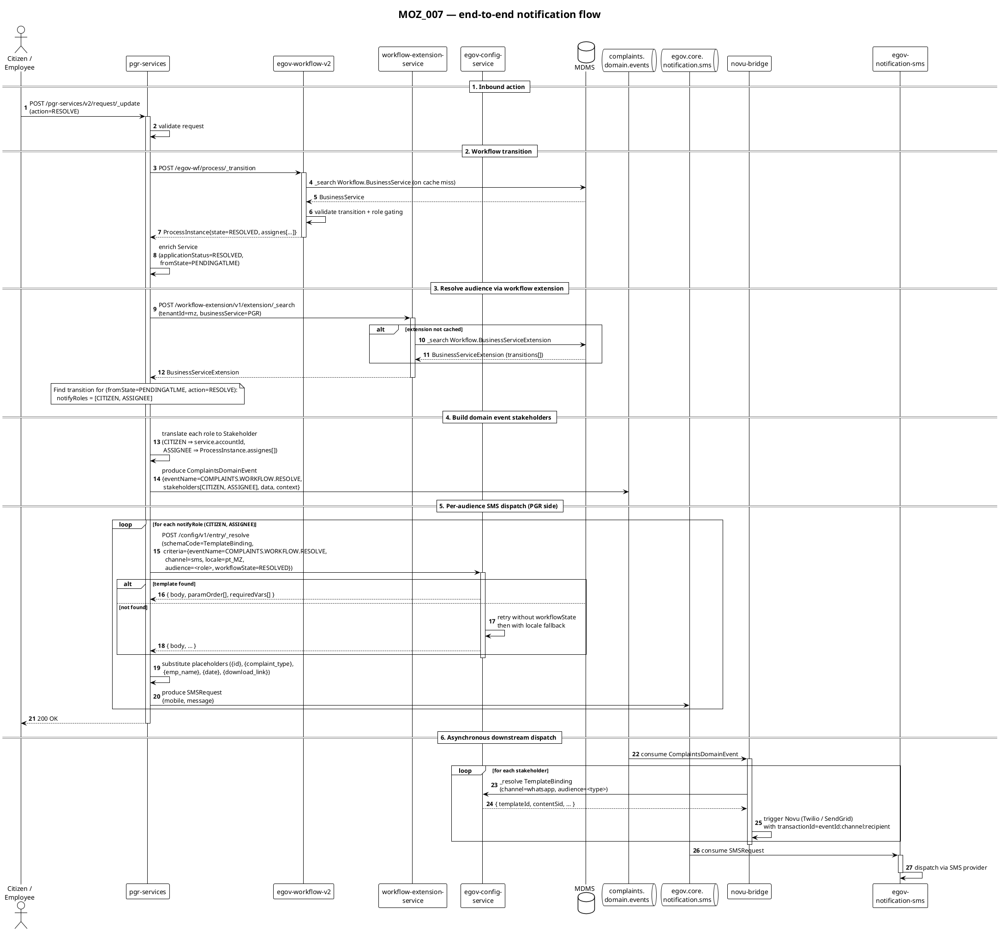

# MOZ_007 — Workflow Notification Routing: Design + Implementation

**Date:** 2026-06-20
**Owner:** Priyanshu / Hari / Pradeep
**Target ship:** 2026-06-30
**Audience:** Engineers implementing this end-to-end (platform service + PGR adoption + upstream fixes)
**Companions:**
- `workflow-extension-service.openapi.yaml` (in this folder) — OpenAPI 3.0.3 spec for the new service
- `notification-flow-sequence.puml` (in this folder) — standalone PlantUML of the end-to-end flow
- `2026-06-20-novu-adapter-design-vs-implementation-reconciliation.md` (in this folder) — full gap analysis between Novu Adapter LLD/HLD and live `novu-bridge` code (this doc pulls in only the Bucket A items that are MOZ_007 prerequisites)

**Supersedes:** `2026-06-19-moz_007-workflow-extension-service-design.md` and `2026-06-20-moz_007-workflow-hardcoding-removal.md` (both absorbed here).

---

## 1. Context & goals

PGR-services hardcodes **who** is notified on each workflow transition. The decision lives in two places today:

- The legacy SMS-direct path: `NotificationService.java:86-116` with 11 hand-written `if (state.eq(…) && action.eq(…))` branches that route SMS to the citizen, the assignee, both, or neither.
- The newer domain-event path: `ComplaintDomainEventService.java:39-62` publishes a `ComplaintsDomainEvent` to the `complaints.domain.events` Kafka topic, with a `stakeholders[]` list built using the same kind of hardcoded transition-to-audience logic. `novu-bridge` consumes this event and handles WhatsApp / email via Novu.

SMS template bodies also live in the wrong place: `egov-localization` keys constructed in code as `PGR_<ROLE>_<ACTION>_<STATUS>_SMS_MESSAGE` (`NotificationUtil.getCustomizedMsg()` lines 89-107). To add a new locale (Mozambique pt_MZ), state, or recipient policy today, you change code, not config.

**The goal of this work** is to make both decisions data-driven:

1. **Audience routing** — for any workflow transition, who should be notified — moves from hardcoded if-chains into a new platform service (`workflow-extension-service`) backed by an MDMS master (`Workflow.BusinessServiceExtension`).
2. **SMS template bodies** — move from `egov-localization` into `egov-config-service` `TemplateBinding` entries with an inline `body` field. PGR resolves and renders locally, then pushes pre-rendered text to `egov.core.notification.sms`.

Email and WhatsApp keep flowing via the existing `complaints.domain.events` → `novu-bridge` path. The only PGR-side change for those channels is that `stakeholders[]` is now driven by the workflow extension, not hardcoded.

Mozambique is the immediate driver — IGE and IGSAE sub-tenants need different recipient policies on the same transitions, plus pt_MZ SMS bodies.

---

## 2. Scope

### In scope

- **`workflow-extension-service`** — new platform microservice, scaffolded from `backend/digit-config-service/`.
- **PGR adoption**:
  - new `WorkflowExtensionClient` and `ConfigServiceClient` classes;
  - refactor `ComplaintDomainEventService.buildEvent` to populate `stakeholders[]` from the extension;
  - refactor `NotificationUtil.getCustomizedMsg` and `NotificationService` SMS loop to resolve template bodies from config-service.
- **`egov-config-service` schema bump**: `TemplateBinding` gains `audience` (selector), `workflowState` (optional selector), `body` (optional inline body).
- **`novu-bridge` adoption**: `ConfigServiceClient.resolveTemplate` passes `audience` + `workflowState`; `DispatchPipelineService.process` iterates `stakeholders[]`; `nb_dispatch_log` uniqueness constraint and `transactionId` composition updated to support per-stakeholder fan-out.
- **Migration of ~30 PGR `PGR_<ROLE>_<ACTION>_<STATUS>_SMS_MESSAGE` localization keys** into config-service entries, plus net-new pt_MZ translations.
- **Mozambique seed data**: extension entry for `(mz, PGR)`, plus the migrated SMS template entries.
- **Per-tenant feature flags** in `RAINMAKER-PGR.PGRConfiguration` and `novu.bridge.criteria.extended.enabled` in novu-bridge config.

### Out of scope (explicit non-goals)

- `DashboardQueryBuilder.CLOSED_STATUSES` — stays hardcoded.
- `EscalationScheduler.java:75` — escalation is a separate track.
- `ServiceRequestValidator.validateReOpen` — per-state reopen rules untouched.
- Configurator `WorkflowActionSelect.tsx` + `StatusChip.tsx` UI labels / colors — separate track (localization).
- `NotificationService.java:86-116` legacy SMS-direct dispatch chain — stays as the fallback when feature flags are off.
- TL / FireNOC adoption of the workflow extension — schema is built to fit them later.
- ConfigSets / versioned activation — separate epic (see Reconciliation doc row 15).
- Other deviations from the Reconciliation doc not listed in §5 below — file separately.

### Hard dependencies

- **GitHub issue #905** ("TemplateBinding: add `audience` selector + `body` field") covers the schema bump and the novu-bridge code change. See §5 — the full content is included here for engineering context.

---

## 3. Architecture

```plantuml
@startuml moz_007-architecture
!theme plain
title MOZ_007 — Component view

cloud "MDMS" as MDMS

package "workflow-extension-service\n(NEW)" #LightBlue {
    component "REST API\n/v1/extension/_search\n/_validate /_create /_update /_delete" as WFExtAPI
    component "ExtensionValidator\n(cross-ref BusinessService)" as Validator
    component "MdmsClient\n(read + write)" as WFExtMdms
    component "WorkflowServiceClient" as WFExtWf
}

package "egov-workflow-v2\n(Digit-Core, untouched)" #LightGray {
    component "BusinessService API" as WFAPI
}

package "egov-config-service\n(schema bump per issue #905)" #LightYellow {
    component "ConfigEntry API\n_resolve /_create /_search" as CfgAPI
    component "TemplateBinding\n(now keyed by audience\n+ workflowState\n+ optional body field for SMS)" as TplBinding
}

package "novu-bridge\n(criteria + per-stakeholder loop)" #LightPink {
    component "DispatchPipelineService\n(iterates stakeholders[])" as Dispatcher
    component "ConfigServiceClient\n(criteria includes audience)" as NovuCfg
    component "NovuClient\n(per-stakeholder transactionId)" as NovuTrigger
}

package "pgr-services\n(MODIFIED)" #LightGreen {
    component "WorkflowExtensionClient\n(new, TTL cache)" as PGRClient
    component "ConfigServiceClient\n(new, TTL cache)" as PGRCfgClient
    component "ComplaintDomainEventService\n(buildEvent → stakeholders[]\nfrom extension)" as CDE
    component "NotificationService /\nNotificationUtil\n(SMS template from config)" as NotifSvc
    component "PGRConfiguration\n(useWorkflowExtension flag)" as PGRCfg
}

queue "complaints.\ndomain.events" as KEvents
queue "egov.core.\nnotification.sms" as KSms

participant "Novu API" as Novu
participant "egov-notification-sms" as SmsSvc

WFExtAPI --> WFExtMdms
WFExtAPI --> WFExtWf --> WFAPI
WFExtMdms --> MDMS
WFAPI --> MDMS

PGRClient --> WFExtAPI
PGRCfgClient --> CfgAPI
CfgAPI --> MDMS
TplBinding --> CfgAPI

CDE --> PGRClient
NotifSvc --> PGRCfgClient
CDE --> KEvents
NotifSvc --> KSms

KEvents --> Dispatcher
Dispatcher --> NovuCfg --> CfgAPI
Dispatcher --> NovuTrigger --> Novu
KSms --> SmsSvc

@enduml
```

### Design rules

- The Digit-Core workflow service in `/Users/subha/Code/Digit-Core/core-services/` is not modified.
- `Workflow.BusinessService.json` is not modified by this work.
- `PGRConstants.java` stays in place as a fallback when the per-tenant flag is off or extension lookup yields nothing.
- The extension service is the **single integrity authority** for `Workflow.BusinessServiceExtension`. All writes flow through it.
- Both new pgr-services clients (`WorkflowExtensionClient` and `ConfigServiceClient`) use per-replica TTL caches with last-known-good fallback. Same pattern as the existing `MDMSUtils.serviceCodeToSlaCache`.
- All novu-bridge behavior changes are gated by `novu.bridge.criteria.extended.enabled` (default `false`).

---

## 4. workflow-extension-service (the new platform service)

### 4.1 Module structure

Scaffolded from `backend/digit-config-service/` (most recent stateless-platform-microservice precedent). New directory at the same level:

```
backend/workflow-extension-service/
├── pom.xml                                                (~90 lines, Spring Boot 3.2.4)
├── Dockerfile
├── README.md
├── src/main/java/org/egov/workflow/extension/
│   ├── WorkflowExtensionApplication.java
│   ├── config/
│   │   ├── ApplicationConfig.java
│   │   └── MultiStateInstanceConfig.java
│   ├── controller/
│   │   └── ExtensionController.java                       (REST surface)
│   ├── service/
│   │   ├── ExtensionService.java                          (orchestration)
│   │   └── ExtensionValidator.java                        (cross-ref check)
│   ├── client/
│   │   ├── MdmsClient.java                                (read + write)
│   │   └── WorkflowServiceClient.java                     (BusinessService read for validation cross-ref)
│   └── web/models/
│       ├── BusinessServiceExtension.java
│       ├── TransitionExtension.java
│       ├── ExtensionSearchRequest.java
│       ├── ExtensionSearchResponse.java
│       ├── ExtensionValidateRequest.java
│       ├── ExtensionValidateResponse.java
│       ├── ExtensionCreateRequest.java
│       ├── ExtensionUpdateRequest.java
│       ├── ExtensionDeleteRequest.java
│       ├── ValidationResult.java
│       ├── ValidationError.java
│       └── ValidationWarning.java
├── src/main/resources/
│   ├── application.properties
│   └── schema/
│       └── Workflow.BusinessServiceExtension.json         (JSON Schema registration for MDMS)
└── src/test/java/...
```

### 4.2 MDMS master — `Workflow.BusinessServiceExtension`

Sibling to `Workflow.BusinessService.json` under the existing `Workflow` MDMS namespace. Schema registered as a new file `utilities/default-data-handler/src/main/resources/schema/Workflow.BusinessServiceExtension.json`.

**Schema definition:**

```json
[
  {
    "tenantId": "{tenantid}",
    "code": "Workflow.BusinessServiceExtension",
    "description": "Per-workflow-transition audience routing. Tells consuming modules which stakeholder role codes to notify when a transition fires.",
    "definition": {
      "type": "object",
      "title": "BusinessServiceExtension",
      "$schema": "http://json-schema.org/draft-07/schema#",
      "required": ["tenantId", "businessService", "transitions"],
      "x-unique": ["tenantId", "businessService"],
      "properties": {
        "tenantId": {
          "type": "string",
          "minLength": 1,
          "maxLength": 256,
          "description": "Tenant scope. State-level / sub-tenant resolution via MultiStateInstanceUtil; an extension at `mz` is visible to all `mz.*` sub-tenants unless a more specific entry exists."
        },
        "businessService": {
          "type": "string",
          "minLength": 1,
          "maxLength": 128,
          "description": "Joins to `Workflow.BusinessService.businessService`. Validated cross-ref."
        },
        "transitions": {
          "type": "array",
          "minItems": 0,
          "items": {
            "type": "object",
            "required": ["action", "notifyRoles"],
            "properties": {
              "fromState": {
                "type": ["string", "null"],
                "maxLength": 128,
                "description": "State the transition fires from. `null` matches the workflow start state (the implicit pre-APPLY position). Joins to `BusinessService.states[].state`."
              },
              "action": {
                "type": "string",
                "minLength": 1,
                "maxLength": 64,
                "description": "Workflow action name. Joins to `BusinessService.states[fromState].actions[].action`."
              },
              "notifyRoles": {
                "type": "array",
                "minItems": 0,
                "items": { "type": "string" },
                "description": "Audience codes for the notification fired when this transition occurs. Each entry must be a role present in the corresponding BusinessService JSON's `states[].actions[].roles[]`. The consuming module translates each code to actual recipients while building the outbound domain event's `stakeholders[]`. Per-channel template selection, user channel preferences, and template rendering are all downstream of this contract."
              }
            }
          }
        },
        "auditDetails": {
          "type": "object",
          "properties": {
            "createdBy": { "type": "string" },
            "createdTime": { "type": "integer" },
            "lastModifiedBy": { "type": "string" },
            "lastModifiedTime": { "type": "integer" }
          }
        }
      }
    },
    "isActive": true
  }
]
```

**Attributes:**

| Attribute | Type | Required | Validated against | Notes |
|---|---|---|---|---|
| `tenantId` | string | yes | state-level fallback resolution | MultiStateInstanceUtil-aware |
| `businessService` | string | yes | `Workflow.BusinessService.businessService` | rejected if no matching BusinessService |
| `transitions[]` | array | yes | — | empty array permitted |
| `transitions[].fromState` | string \| null | no | `BusinessService.states[].state` | `null` = workflow start state |
| `transitions[].action` | string | yes | `BusinessService.states[fromState].actions[].action` | rejected if action not defined for the state |
| `transitions[].notifyRoles[]` | array of string | yes | union of `BusinessService.states[].actions[].roles[]` | rejected if a role is not present anywhere in the BusinessService |

**Uniqueness:** `(tenantId, businessService)`. Exactly one extension document per tenant per businessService.

### 4.3 REST API surface

See `workflow-extension-service.openapi.yaml` in this folder for the full spec. Summary:

| Method | Path | Purpose |
|---|---|---|
| POST | `/workflow-extension/v1/extension/_search` | List extensions for `(tenantId, businessService?)` |
| POST | `/workflow-extension/v1/extension/_validate` | Validate a candidate document; returns 200 with ValidationResult |
| POST | `/workflow-extension/v1/extension/_create` | Validate + persist; 201 on success, 409 on duplicate, 400 on validation failure |
| POST | `/workflow-extension/v1/extension/_update` | Validate + replace; 200 on success, 404 if missing |
| POST | `/workflow-extension/v1/extension/_delete` | Remove by `(tenantId, businessService)` |
| GET  | `/health` | Spring Actuator |

All payloads use standard DIGIT `RequestInfo` / `ResponseInfo` envelopes.

### 4.4 Validation rules

Enforced on every `_validate`, `_create`, `_update`:

| Code | Severity | Rule |
|---|---|---|
| `UNKNOWN_TRANSITION` | error | every `transitions[].(fromState, action)` must exist as `BusinessService.states[fromState].actions[].action` |
| `INVALID_NOTIFY_ROLE` | error | every entry in `notifyRoles[]` must be from the union of all roles present in the BusinessService JSON |
| `DUPLICATE_TRANSITION_EXTENSION` | error | at most one entry per `(fromState, action)` |
| `BUSINESS_SERVICE_NOT_FOUND` | error | no matching BusinessService entry exists for `(tenantId, businessService)` |
| `MISSING_TRANSITION_COVERAGE` | warning | every transition in BusinessService should have an extension entry — non-blocking |

### 4.5 No service DB

Stateless. Persistence is MDMS via `MdmsClient`. No service-owned PostgreSQL schema; no migrations under `src/main/resources/db/migration/`.

### 4.6 Helm chart

Mirror `Devops/deploy-as-code/charts/core-services/digit-config-service/`. Container resources: `requests: {cpu: 100m, memory: 256Mi}; limits: {cpu: 500m, memory: 512Mi}`. No persistent volume, no Postgres dependency.

### 4.7 Client cache behavior

The service itself does NOT cache. Each consumer (pgr-services in v1) maintains a per-replica TTL cache via its `WorkflowExtensionClient`. Default TTL 10 minutes; configurable. Cache miss + service unreachable → return last-known-good if any; else `Optional.empty()`.

---

## 5. Required upstream fixes (egov-config-service + novu-bridge)

These changes are not part of the workflow-extension-service itself, but they're hard prerequisites for MOZ_007 to work end-to-end. Tracked as **GitHub issue #905**. Reproduced here so engineers see the full picture without flipping to the reconciliation doc.

All novu-bridge changes are gated by `novu.bridge.criteria.extended.enabled` (default `false`). Schema and migration changes are forward-compatible.

### 5.1 TemplateBinding schema bump

**File:** `utilities/default-data-handler/src/main/resources/schema/TemplateBinding.json` (canonical; downstream stale copies at `backend/novu-bridge/schemas/` and `local-setup/db/notif-mdms-seed/schemas/` cleaned up in a separate ticket)

```diff
 "required": ["eventName", "channel", "templateId", "locale"],
 "x-unique": [
   "eventName",
   "channel",
-  "locale"
+  "locale",
+  "audience",
+  "workflowState"
 ],
 "properties": {
   ...
+  "audience": {
+    "type": "string",
+    "description": "Stakeholder type the template targets (CITIZEN, EMPLOYEE, SUPERVISOR, …). Resolved per (event, channel, locale, audience, workflowState). Required by convention; left non-required in JSON Schema until backfill across all environments is confirmed."
+  },
+  "workflowState": {
+    "type": "string",
+    "description": "Optional application status the workflow has transitioned into. When absent, the binding matches any state for the given (event, channel, locale, audience)."
+  },
+  "body": {
+    "type": "string",
+    "maxLength": 4000,
+    "description": "Inline template body, used when the channel does not go through Novu (e.g., SMS via egov-notification-sms). Placeholder format: {variableName}. When present, the consuming module renders locally and pushes pre-rendered text. When absent, templateId is the canonical reference and rendering happens in Novu."
+  }
 }
```

### 5.2 Seed update (default-data-handler)

**File:** `utilities/default-data-handler/src/main/resources/configData/TemplateBinding.json`

For each of the 4 existing entries (APPLY, ASSIGN, RESOLVE, REJECT for WhatsApp), add `"audience": "CITIZEN"`. All current bodies are citizen-facing.

### 5.3 Backfill migration (egov-config-service)

**File (new):** `backend/digit-config-service/src/main/resources/db/migration/main/V20260620120000__backfill_templatebinding_audience.sql`

```sql
-- Idempotent: stamps audience="CITIZEN" on any existing TemplateBinding row that lacks it.
UPDATE eg_config_data
   SET data = jsonb_set(data, '{audience}', '"CITIZEN"', true),
       lastmodifiedtime = (extract(epoch from now()) * 1000)::bigint,
       lastmodifiedby = 'system-migration-V20260620120000'
 WHERE schemacode = 'TemplateBinding'
   AND data->>'audience' IS NULL;
```

No new indexes — the existing `idx_eg_config_data_data_gin` GIN index on `data` supports the new JSONB containment criteria automatically.

### 5.4 ConfigServiceClient — flag + two-attempt resolve

**File:** `backend/novu-bridge/src/main/java/org/egov/novubridge/service/ConfigServiceClient.java`

```java
public ResolvedTemplate resolveTemplate(DerivedContext context, String eventName, String module, String tenantId) {
    if (config.isExtendedCriteriaEnabled()) {
        ResolvedTemplate t = doResolve(context, eventName, tenantId, /*includeWorkflowState=*/ true);
        if (t != null) return t;
        if (context.getWorkflowState() != null) {
            t = doResolve(context, eventName, tenantId, /*includeWorkflowState=*/ false);
            if (t != null) return t;
        }
    }
    return doResolveLegacy(context, eventName, tenantId);
}

private ResolvedTemplate doResolve(DerivedContext context, String eventName, String tenantId, boolean includeWorkflowState) {
    Map<String, Object> criteria = new HashMap<>();
    criteria.put("eventName", eventName);
    criteria.put("channel", context.getChannel());
    criteria.put("locale", context.getLocale());
    criteria.put("audience", context.getAudience());
    if (includeWorkflowState && context.getWorkflowState() != null) {
        criteria.put("workflowState", context.getWorkflowState());
    }
    // ... existing POST shape, factored into a helper
}
```

The existing locale fallback (lines 59-66 — retries with hardcoded `en_IN` on miss) stays in v1. Replacing it with a `LANGUAGE_STRATEGY` config is a separate ticket (Reconciliation row 13).

### 5.5 DispatchPipelineService — per-stakeholder loop

**File:** `backend/novu-bridge/src/main/java/org/egov/novubridge/service/DispatchPipelineService.java`

Today: `deriveContext` picks the first stakeholder and dispatches once. New: when flag on, iterate `event.stakeholders[]` and dispatch per stakeholder.

```java
public DispatchOutcome process(ComplaintsDomainEvent event, boolean send, DryRunRequest dryRun) {
    if (!config.isExtendedCriteriaEnabled()) {
        return processLegacy(event, send, dryRun);    // existing single-stakeholder path
    }
    if (CollectionUtils.isEmpty(event.getStakeholders())) {
        return DispatchOutcome.skipped("NO_STAKEHOLDERS");
    }
    List<DispatchOutcome> outcomes = new ArrayList<>();
    for (Stakeholder s : event.getStakeholders()) {
        DerivedContext ctx = deriveContextFor(event, s);
        try {
            ResolvedTemplate t = configServiceClient.resolveTemplate(
                ctx, event.getEventName(), event.getModule(), event.getTenantId());
            outcomes.add(dispatchOne(event, ctx, t, send));
        } catch (Exception e) {
            log.error("dispatch failed for event={} stakeholder={}: {}",
                event.getEventId(), s.getType(), e.getMessage());
            outcomes.add(DispatchOutcome.failed(e.getMessage()));
        }
    }
    return DispatchOutcome.aggregate(outcomes);
}
```

`deriveContextFor(event, stakeholder)` is the existing `deriveContext` parameterized to take a specific stakeholder. `dispatchOne` is the existing per-stakeholder block (Novu trigger + dispatch-log write) factored out.

### 5.6 nb_dispatch_log uniqueness migration

**File (new):** `backend/novu-bridge/src/main/resources/db/migration/main/V20260620130000__per_recipient_dispatch_uniqueness.sql`

```sql
-- Per-stakeholder fan-out requires N rows for (event_id, channel) — one per recipient.
-- Original constraint from V20260217124000 was (event_id, channel) which blocks this.
ALTER TABLE nb_dispatch_log
    DROP CONSTRAINT IF EXISTS uk_nb_dispatch_event_channel;

ALTER TABLE nb_dispatch_log
    ADD CONSTRAINT uk_nb_dispatch_event_channel_recipient
    UNIQUE (event_id, channel, recipient_value);
```

### 5.7 transactionId composition

**File:** wherever the Novu trigger payload is built (likely in `dispatchOne` or `NovuClient` — verify during implementation).

Today: `.transactionId(event.getEventId())`. After: `.transactionId(String.format("%s:%s:%s", event.getEventId(), context.getChannel(), context.getRecipientMobile()))`.

Matches WhatsAppDesign §3.3 spec. Without this change, Novu's dedup logic silently drops the second stakeholder's trigger because two triggers with the same `transactionId` are duplicates. Gated by the same flag as 5.4–5.6.

---

## 6. PGR adoption

### 6.1 New: `WorkflowExtensionClient.java`

**Path:** `backend/pgr-services/src/main/java/org/egov/pgr/client/WorkflowExtensionClient.java`

```java
@Component
@Slf4j
public class WorkflowExtensionClient {

    private final ServiceRequestRepository repository;
    private final PGRConfiguration config;
    private final ObjectMapper mapper;
    private final ConcurrentHashMap<CacheKey, CachedExtension> cache = new ConcurrentHashMap<>();

    public Optional<TransitionExtension> getTransition(
            RequestInfo requestInfo, String tenantId, String businessService,
            String fromState, String action) {
        BusinessServiceExtension ext = fetchOrCache(requestInfo, tenantId, businessService);
        if (ext == null || ext.getTransitions() == null) return Optional.empty();
        return ext.getTransitions().stream()
                .filter(t -> equalsNullable(t.getFromState(), fromState)
                          && action.equalsIgnoreCase(t.getAction()))
                .findFirst();
    }

    private BusinessServiceExtension fetchOrCache(
            RequestInfo requestInfo, String tenantId, String businessService) {
        CacheKey key = new CacheKey(tenantId, businessService);
        CachedExtension cached = cache.get(key);
        if (cached != null && !cached.isExpired()) return cached.value();
        try {
            BusinessServiceExtension fresh = doFetch(requestInfo, tenantId, businessService);
            cache.put(key, new CachedExtension(fresh,
                    System.currentTimeMillis() + config.getExtensionCacheTtlMs()));
            return fresh;
        } catch (Exception e) {
            log.warn("Failed to fetch workflow extension for tenant={}, businessService={} — serving last-known-good",
                    tenantId, businessService, e);
            return cached != null ? cached.value() : null;
        }
    }

    private BusinessServiceExtension doFetch(
            RequestInfo requestInfo, String tenantId, String businessService) {
        String url = config.getWorkflowExtensionHost() + config.getWorkflowExtensionSearchEndpoint();
        ExtensionSearchRequest body = ExtensionSearchRequest.builder()
                .requestInfo(requestInfo)
                .criteria(ExtensionSearchCriteria.builder()
                        .tenantId(tenantId)
                        .businessService(businessService)
                        .build())
                .build();
        Object response = repository.fetchResult(new StringBuilder(url), body);
        ExtensionSearchResponse parsed = mapper.convertValue(response, ExtensionSearchResponse.class);
        if (parsed.getExtensions() == null || parsed.getExtensions().isEmpty()) return null;
        return parsed.getExtensions().get(0);
    }

    private static boolean equalsNullable(String a, String b) {
        return a == null ? b == null : a.equalsIgnoreCase(b);
    }
}
```

### 6.2 New: `ConfigServiceClient.java`

**Path:** `backend/pgr-services/src/main/java/org/egov/pgr/client/ConfigServiceClient.java`

```java
@Component
@Slf4j
public class ConfigServiceClient {

    private final ServiceRequestRepository repository;
    private final PGRConfiguration config;
    private final ObjectMapper mapper;
    private final ConcurrentHashMap<CacheKey, CachedTemplate> cache = new ConcurrentHashMap<>();

    public Optional<String> resolveSmsBody(
            RequestInfo requestInfo, String tenantId, String eventName,
            String audience, String workflowState, String locale) {
        CacheKey key = new CacheKey(tenantId, eventName, audience, workflowState, locale);
        CachedTemplate cached = cache.get(key);
        if (cached != null && !cached.isExpired()) return Optional.ofNullable(cached.body());
        try {
            String body = doResolve(requestInfo, tenantId, eventName, audience, workflowState, locale);
            cache.put(key, new CachedTemplate(body,
                    System.currentTimeMillis() + config.getConfigCacheTtlMs()));
            return Optional.ofNullable(body);
        } catch (Exception e) {
            log.warn("Failed to resolve SMS template tenant={}, event={}, audience={}, state={}, locale={}",
                    tenantId, eventName, audience, workflowState, locale, e);
            return cached != null ? Optional.ofNullable(cached.body()) : Optional.empty();
        }
    }

    private String doResolve(RequestInfo requestInfo, String tenantId, String eventName,
                             String audience, String workflowState, String locale) {
        String url = config.getConfigServiceHost() + config.getConfigServiceResolveEndpoint();
        Map<String, Object> criteria = new HashMap<>();
        criteria.put("eventName", eventName);
        criteria.put("audience", audience);
        criteria.put("channel", "sms");
        criteria.put("locale", locale);
        if (workflowState != null) criteria.put("workflowState", workflowState);
        Map<String, Object> resolveRequest = new HashMap<>();
        resolveRequest.put("schemaCode", "TemplateBinding");
        resolveRequest.put("tenantId", tenantId);
        resolveRequest.put("criteria", criteria);
        Map<String, Object> body = new HashMap<>();
        body.put("RequestInfo", requestInfo);
        body.put("resolveRequest", resolveRequest);
        Object response = repository.fetchResult(new StringBuilder(url), body);
        TemplateResolveResponse parsed = mapper.convertValue(response, TemplateResolveResponse.class);
        return parsed.getConfigData() != null
            ? (String) parsed.getConfigData().getData().get("body")
            : null;
    }
}
```

### 6.3 Refactor: `ComplaintDomainEventService.buildEvent`

**Path:** `backend/pgr-services/src/main/java/org/egov/pgr/service/ComplaintDomainEventService.java`

Replace the hardcoded `stakeholders[]` construction with an extension lookup:

```java
@Autowired private WorkflowExtensionClient extensionClient;

// In buildEvent(ServiceRequest request, String fromState, String action) at line ~70
List<Map<String, Object>> stakeholders;
if (config.getUseWorkflowExtension(tenantId)) {
    Optional<TransitionExtension> tx = extensionClient.getTransition(
        request.getRequestInfo(), tenantId, "PGR", fromState, action);
    if (tx.isPresent()) {
        stakeholders = resolveStakeholders(tx.get().getNotifyRoles(), request);
    } else {
        log.warn("workflow extension has no transition entry for tenant={}, fromState={}, action={} — falling back to legacy",
                tenantId, fromState, action);
        stakeholders = legacyBuildStakeholders(fromState, action, request);
    }
} else {
    stakeholders = legacyBuildStakeholders(fromState, action, request);
}
event.put("stakeholders", stakeholders);
```

`resolveStakeholders(List<String> notifyRoles, ServiceRequest request)` translates role codes to stakeholder entries:

| Role code | Resolution |
|---|---|
| `CITIZEN` | `request.service.accountId` → User Service lookup |
| `ASSIGNEE` | `ProcessInstance.assignes[]` for the current state |
| `CREATOR` | `request.service.auditDetails.createdBy` → User Service lookup |
| `SUPERVISOR` | HRMS `reportingTo` of `ASSIGNEE` |
| `PREVIOUS_ASSIGNEE` | `ProcessInstance` history, one step back |
| any other role (workflow role from BusinessService) | HRMS lookup of users with the role for the tenant; log and skip if none |

Each resolution returns a `Stakeholder{type, userId, mobile, locale}` ready for the outbound event payload.

### 6.4 Refactor: `NotificationUtil.getCustomizedMsg`

**Path:** `backend/pgr-services/src/main/java/org/egov/pgr/util/NotificationUtil.java`

Replace the localization-key construction with a config-service resolve:

```java
public String getCustomizedMsg(RequestInfo requestInfo, String tenantId,
                                String action, String applicationStatus,
                                String roles, String locale,
                                String legacyLocalizationMessage) {
    if (config.getUseConfigServiceTemplates(tenantId)) {
        Optional<String> body = configServiceClient.resolveSmsBody(
                requestInfo, tenantId,
                "COMPLAINTS.WORKFLOW." + action.toUpperCase(),
                roles.toUpperCase(),
                applicationStatus.toUpperCase(),
                locale);
        if (body.isPresent()) return body.get();
        log.warn("config-service returned no SMS body for tenant={}, event=COMPLAINTS.WORKFLOW.{}, audience={}, state={}, locale={} — falling back to localization",
                tenantId, action, roles, applicationStatus, locale);
    }
    return legacyGetCustomizedMsg(action, applicationStatus, roles, legacyLocalizationMessage);
}
```

### 6.5 Refactor: `NotificationService` SMS loop

**Path:** `backend/pgr-services/src/main/java/org/egov/pgr/service/NotificationService.java`

The SMS loop needs per-audience template lookups now that templates are keyed by `audience`. Inside the existing `process()` method:

```java
List<String> notifyRoles = resolveNotifyRolesFromExtension(...);
for (String role : notifyRoles) {
    String mobile = resolveMobileForRole(role, serviceWrapper, requestInfo);
    if (mobile == null) continue;

    String body = notificationUtil.getCustomizedMsg(
            requestInfo, tenantId, action, applicationStatus,
            role, locale, legacyLocalizationMessage);
    if (body == null) continue;

    body = substitutePlaceholders(body, serviceWrapper, requestInfo);

    SMSRequest sms = SMSRequest.builder()
            .mobileNumber(mobile)
            .message(body)
            .build();
    notificationUtil.sendSMS(tenantId, Collections.singletonList(sms));
}
```

Placeholder substitution (`{complaint_type}`, `{id}`, `{emp_name}`, etc.) is unchanged — same logic that exists today, just applied to the body string regardless of where it came from.

### 6.6 PGRConfiguration additions

**Path:** `backend/pgr-services/src/main/java/org/egov/pgr/config/PGRConfiguration.java`

```java
@Value("${pgr.use.workflow.extension:false}")
private Boolean defaultUseWorkflowExtension;

@Value("${pgr.use.config.service.templates:false}")
private Boolean defaultUseConfigServiceTemplates;

@Value("${pgr.workflow.extension.host}")
private String workflowExtensionHost;

@Value("${pgr.workflow.extension.search.endpoint:/workflow-extension/v1/extension/_search}")
private String workflowExtensionSearchEndpoint;

@Value("${pgr.workflow.extension.cache.ttl.ms:600000}")
private Long extensionCacheTtlMs;

@Value("${pgr.config.service.host}")
private String configServiceHost;

@Value("${pgr.config.service.resolve.endpoint:/config/v1/entry/_resolve}")
private String configServiceResolveEndpoint;

@Value("${pgr.config.cache.ttl.ms:600000}")
private Long configCacheTtlMs;

// Per-tenant overrides from RAINMAKER-PGR.PGRConfiguration MDMS master:
public Boolean getUseWorkflowExtension(String tenantId) { ... }
public Boolean getUseConfigServiceTemplates(String tenantId) { ... }
```

### 6.7 Fallback semantics

| Condition | stakeholders[] source | SMS body source |
|---|---|---|
| Both flags off | Legacy hardcoded logic | egov-localization |
| `useWorkflowExtension=true`, extension reachable, transition found | Extension's `notifyRoles[]` | (per `useConfigServiceTemplates`) |
| `useWorkflowExtension=true`, extension reachable, transition not found | Legacy hardcoded logic | (per `useConfigServiceTemplates`) |
| `useWorkflowExtension=true`, extension service unreachable, cache has last-known-good | Cached extension | (per `useConfigServiceTemplates`) |
| `useWorkflowExtension=true`, extension service unreachable, no cache | Legacy hardcoded logic | (per `useConfigServiceTemplates`) |
| `useConfigServiceTemplates=true`, config reachable, binding found | (per `useWorkflowExtension`) | config-service `body` |
| `useConfigServiceTemplates=true`, config reachable, binding not found | (per `useWorkflowExtension`) | egov-localization fallback |
| `useConfigServiceTemplates=true`, config unreachable, cache has last-known-good | (per `useWorkflowExtension`) | Cached body |
| `useConfigServiceTemplates=true`, config unreachable, no cache | (per `useWorkflowExtension`) | egov-localization fallback |

Metrics emitted on each fallback path: `pgr.workflow_extension.missing_entry`, `pgr.workflow_extension.fetch_failed`, `pgr.config_service.missing_template`, `pgr.config_service.fetch_failed`. Tag with `(tenantId, event, audience, state)`.

### 6.8 PGRConstants stays

`PGRConstants.java` is not deleted. New code path simply prefers extension values when the flag is on and the lookup succeeds; everything else stays on the legacy code path.

### 6.9 Configurator write path (TS client only)

**`configurator/src/api/services/workflowExtension.ts`** (new). Typed client wrapping the workflow-extension-service's REST surface, mirroring `mdms.ts` in shape. Used by whatever notification-config admin UI exists today (or is added in a separate track) to author `transitions[]` entries against the service rather than writing MDMS directly.

`WorkflowActionSelect.tsx` and `StatusChip.tsx` are **untouched** in v1. Their hardcoded label/color constants stay; localization addresses them out-of-band if at all.

Effort: ~0.5 dev-day for the new TS client.

---

## 7. Data: schemas, seed, migration

### 7.1 Workflow.BusinessServiceExtension — see §4.2

### 7.2 TemplateBinding extended schema — see §5.1

### 7.3 Mozambique seed data

**Workflow extension** — `utilities/default-data-handler/src/main/resources/mdmsData-dev/Workflow/Workflow.BusinessServiceExtension.json`:

```json
[
  {
    "tenantId": "mz",
    "businessService": "PGR",
    "transitions": [
      { "fromState": null,                       "action": "APPLY",    "notifyRoles": ["CITIZEN"] },
      { "fromState": "PENDINGFORASSIGNMENT",     "action": "ASSIGN",   "notifyRoles": ["CITIZEN", "ASSIGNEE"] },
      { "fromState": "PENDINGATLME",             "action": "RESOLVE",  "notifyRoles": ["CITIZEN", "ASSIGNEE"] },
      { "fromState": "PENDINGATLME",             "action": "REASSIGN", "notifyRoles": ["CITIZEN", "ASSIGNEE"] },
      { "fromState": "PENDINGFORREASSIGNMENT",   "action": "REASSIGN", "notifyRoles": ["CITIZEN", "ASSIGNEE"] },
      { "fromState": "PENDINGFORASSIGNMENT",     "action": "REJECT",   "notifyRoles": ["CITIZEN"] },
      { "fromState": "RESOLVED",                 "action": "REOPEN",   "notifyRoles": ["CITIZEN", "PREVIOUS_ASSIGNEE"] },
      { "fromState": "REJECTED",                 "action": "REOPEN",   "notifyRoles": ["CITIZEN", "PREVIOUS_ASSIGNEE"] },
      { "fromState": "RESOLVED",                 "action": "RATE",     "notifyRoles": ["PREVIOUS_ASSIGNEE"] },
      { "fromState": "REJECTED",                 "action": "RATE",     "notifyRoles": ["PREVIOUS_ASSIGNEE"] }
    ]
  }
]
```

**SMS templates for `mz`** — `utilities/default-data-handler/src/main/resources/configData/TemplateBinding.pgr-sms.mz.json`:

```json
[
  {
    "tenantId": "mz", "eventName": "COMPLAINTS.WORKFLOW.APPLY",
    "audience": "CITIZEN", "channel": "sms",
    "locale": "en_IN", "workflowState": "PENDINGFORASSIGNMENT",
    "templateId": "sms-inline",
    "body": "Dear Citizen, your complaint for {complaint_type} with ID {id} submitted on {date} has been received. Track at {download_link}."
  },
  {
    "tenantId": "mz", "eventName": "COMPLAINTS.WORKFLOW.APPLY",
    "audience": "CITIZEN", "channel": "sms",
    "locale": "pt_MZ", "workflowState": "PENDINGFORASSIGNMENT",
    "templateId": "sms-inline",
    "body": "Caro cidadão, a sua reclamação para {complaint_type} com ID {id} submetida em {date} foi recebida. Acompanhe em {download_link}."
  },
  {
    "tenantId": "mz", "eventName": "COMPLAINTS.WORKFLOW.ASSIGN",
    "audience": "CITIZEN", "channel": "sms",
    "locale": "en_IN", "workflowState": "PENDINGATLME",
    "templateId": "sms-inline",
    "body": "Dear Citizen, your complaint {id} has been assigned to {emp_name}, {emp_designation}, {emp_department}."
  },
  {
    "tenantId": "mz", "eventName": "COMPLAINTS.WORKFLOW.ASSIGN",
    "audience": "EMPLOYEE", "channel": "sms",
    "locale": "en_IN", "workflowState": "PENDINGATLME",
    "templateId": "sms-inline",
    "body": "{emp_name}, complaint {id} ({complaint_type}) has been assigned to you for action. Please respond by {sla_date}."
  }
  // … full set: ~30 en_IN + ~30 pt_MZ ≈ 60 entries total
]
```

Portuguese (pt_MZ) bodies are net-new copywriting — assign to Hari or a translator before flag-flip in Mozambique.

### 7.4 PGRConfiguration update — Mozambique flag

`utilities/default-data-handler/src/main/resources/mdmsData-dev/RAINMAKER-PGR/RAINMAKER-PGR.PGRConfiguration.json`:

```json
[
  {
    "tenantId": "mz",
    "useWorkflowExtension": true,
    "useConfigServiceTemplates": true,
    "complainMaxIdleTime": 432000000
  }
]
```

Other tenants: no entry → defaults to `false` → legacy behavior preserved.

### 7.5 Localization → config-service migration mapping

Inventory of PGR localization keys (`utilities/default-data-handler/src/main/resources/localisations/en_IN/rainmaker-pgr.json`):

| Legacy localization key | Becomes TemplateBinding entry |
|---|---|
| `PGR_CITIZEN_APPLY_PENDINGFORASSIGNMENT_SMS_MESSAGE` | `(eventName=COMPLAINTS.WORKFLOW.APPLY, audience=CITIZEN, workflowState=PENDINGFORASSIGNMENT, channel=sms, locale=en_IN)` |
| `PGR_CITIZEN_ASSIGN_PENDINGATLME_SMS_MESSAGE` | `(eventName=COMPLAINTS.WORKFLOW.ASSIGN, audience=CITIZEN, workflowState=PENDINGATLME, channel=sms, locale=en_IN)` |
| `PGR_EMPLOYEE_ASSIGN_PENDINGATLME_SMS_MESSAGE` | `(eventName=COMPLAINTS.WORKFLOW.ASSIGN, audience=EMPLOYEE, workflowState=PENDINGATLME, channel=sms, locale=en_IN)` |
| `PGR_CITIZEN_RESOLVE_RESOLVED_SMS_MESSAGE` | `(eventName=COMPLAINTS.WORKFLOW.RESOLVE, audience=CITIZEN, workflowState=RESOLVED, channel=sms, locale=en_IN)` |
| … | … (full inventory in the migration script) |

**Migration rule:**
- `eventName` = `COMPLAINTS.WORKFLOW.` + uppercase(`<ACTION>`).
- `audience` = uppercase(`<ROLE>`).
- `workflowState` = uppercase(`<STATUS>`).
- `channel` = `"sms"`.
- `locale` = file's locale (`en_IN`).
- `body` = the localized message string verbatim. Placeholders preserved.

**Script:** add as `utilities/default-data-handler/src/main/java/.../migration/PgrSmsLocalizationMigrator.java`. Reads the localization JSON, emits a config-service seed JSON. Run once per locale.

---

## 8. End-to-end sequence diagram



---

## 9. DB schema and indexes

### 9.1 pgr-services DB
**No changes.** All MOZ_007-introduced state is in MDMS or config-service.

### 9.2 workflow-extension-service DB
**None.** MDMS is the persistence layer.

### 9.3 egov-config-service DB

Existing indexes from `V20260302000000__create_eg_config_data.sql` are sufficient. The new resolve criteria (`audience`, `workflowState`) flow through the existing `idx_eg_config_data_data_gin` GIN index on the `data` JSONB column via PostgreSQL's `@>` containment operator (used in `ConfigDataQueryBuilder.appendJsonbFilter`).

Verify the index is present (it is per migration inspection):
```sql
-- Composite index on tenant + schema (heavy hitter for the resolve path)
SELECT 1 FROM pg_indexes WHERE indexname = 'idx_eg_config_data_schemacode';
SELECT 1 FROM pg_indexes WHERE indexname = 'idx_eg_config_data_tenantid';
SELECT 1 FROM pg_indexes WHERE indexname = 'idx_eg_config_data_data_gin';
```

### 9.4 novu-bridge DB — `nb_dispatch_log` uniqueness migration

See §5.6. New migration `V20260620130000__per_recipient_dispatch_uniqueness.sql` replaces `(event_id, channel)` uniqueness with `(event_id, channel, recipient_value)` to support per-stakeholder fan-out.

### 9.5 MDMS

Existing `(module, master, tenantId)` index pattern covers `Workflow.BusinessServiceExtension` lookups. No change.

### 9.6 Consolidated DDL summary

| File | Owner DB | Purpose |
|---|---|---|
| `V20260620120000__backfill_templatebinding_audience.sql` | egov-config-service | Backfill `audience='CITIZEN'` on existing TemplateBinding rows |
| `V20260620130000__per_recipient_dispatch_uniqueness.sql` | novu-bridge | Drop `(event_id, channel)` uniqueness; add `(event_id, channel, recipient_value)` |
| (none new) | pgr-services | — |
| (none new) | workflow-extension-service | No DB |
| (none new) | MDMS | — |

---

## 10. Testing strategy

### 10.1 workflow-extension-service
- Unit: `ExtensionValidator` covering each rule in §4.4 (positive + negative).
- Integration: containerized MDMS instance (testcontainers); create → search → validate → update → delete cycle.
- Contract: a known-bad extension document produces the expected validation errors with correct codes.

### 10.2 pgr-services
- Unit: `WorkflowExtensionClient` cache behavior — cold load, warm load, TTL expiry, service-unreachable fallback to last-known-good, no-cache returns `Optional.empty()`.
- Unit: `ConfigServiceClient.resolveSmsBody` — same matrix; verify per-audience and per-locale lookups return distinct bodies.
- Integration: `ComplaintDomainEventService.buildEvent` with extension on + transition found → stakeholders[] contains CITIZEN + ASSIGNEE entries with resolved mobiles; with extension off → legacy stakeholders.
- Integration: `NotificationService` end-to-end with config-service backed templates → produces one `SMSRequest` per audience with the audience-specific body; with config off → original localization-backed body.
- Contract: published `ComplaintsDomainEvent` payload still matches `ComplaintsDomainEvent.class` in novu-bridge (round-trip JSON test).
- Regression: with both flags off, all existing notification behavior unchanged (golden-output diff).

### 10.3 egov-config-service
- Migration applies cleanly on a populated DB; idempotent re-run.

### 10.4 novu-bridge
- Unit: `ConfigServiceClient.resolveTemplate` — flag off uses 3 keys; flag on adds audience and (conditionally) workflowState; two-attempt precedence retries without workflowState on miss; locale-fallback path retained.
- Integration: `DispatchPipelineService.process()` with flag on + 2 stakeholders → 2 dispatches, 2 nb_dispatch_log rows, 2 distinct transactionIds; with flag off → single-stakeholder regression.
- Integration: per-stakeholder failure isolation — stakeholder 1's template missing; stakeholder 2 still dispatches; nb_dispatch_log records both outcomes.

### 10.5 Drift detection (CI)
- JUnit in `default-data-handler` that loads committed `Workflow.BusinessServiceExtension.json` + `Workflow.BusinessService.json` and asserts every validation rule passes. Blocks PR merges with invalid seed data.
- JUnit that loads committed `TemplateBinding.pgr-sms.*.json` and asserts every `audience` matches a role present in the corresponding BusinessService, every `eventName` is `COMPLAINTS.WORKFLOW.<known-action>`, every `workflowState` is a known state.

### 10.6 Manual verification
- Mozambique sub-tenant smoke test: file a complaint as IGE citizen → flip ASSIGN → verify both citizen and employee receive distinct pt_MZ SMS bodies.

---

## 11. Rollout

1. **Day 1–2:** Land #905 (TemplateBinding schema + ConfigServiceClient criteria + per-stakeholder loop + nb_dispatch_log migration + transactionId composition) in novu-bridge. Schema + backfill in default-data-handler / config-service. Verify WhatsApp dispatch still works with flag off (regression).
2. **Day 3–4:** Ship `workflow-extension-service` scaffold to dev. Smoke-test API surface with empty extension + valid extension.
3. **Day 4–5:** Ship `WorkflowExtensionClient` + `ConfigServiceClient` to dev pgr-services with both flags off for all tenants. Verify no behavior change (regression baseline).
4. **Day 5–6:** Seed `Workflow.BusinessServiceExtension.json` for `mz`. Run the localization → config-service migration script for the ~30 PGR SMS keys in en_IN. Add pt_MZ entries (translation work).
5. **Day 6–7:** Flip `useWorkflowExtension=true` + `useConfigServiceTemplates=true` for `mz` in dev. Flip `novu.bridge.criteria.extended.enabled=true` in novu-bridge dev env. Run smoke test (§10.6).
6. **Promote service + pgr-services to staging.** Repeat smoke test.
7. **Production:** deploy services. Deploy pgr-services with both flags off. Seed extension + TemplateBindings. Flip flags for `mz`. Flip novu-bridge flag. Monitor metrics for 48 hours. Done.

No big-bang switchover. All other tenants stay on legacy behavior indefinitely until they opt in via the per-tenant flags.

---

## 12. Effort estimate

| Item | Owner | Dev | Test | Total |
|---|---|---|---|---|
| #905 — TemplateBinding schema bump + ConfigServiceClient criteria + per-stakeholder loop + nb_dispatch_log uniqueness + transactionId | novu-bridge maintainer | 3 | 1.5 | 4.5 |
| workflow-extension-service scaffold + CRUD + validation | Priyanshu | 2 | 1 | 3 |
| `WorkflowExtensionClient.java` in pgr-services + tests | Priyanshu | 0.75 | 0.5 | 1.25 |
| `ConfigServiceClient.java` in pgr-services + tests | Priyanshu | 0.75 | 0.5 | 1.25 |
| `ComplaintDomainEventService.buildEvent` refactor (stakeholders[]) | Priyanshu | 1 | 0.75 | 1.75 |
| `NotificationUtil` + `NotificationService` SMS-loop refactor | Priyanshu | 1 | 0.75 | 1.75 |
| Localization → config-service migration script + en_IN seed | Hari | 0.5 | 0.25 | 0.75 |
| Mozambique pt_MZ translation + seed entries | Hari + translator | 0.75 | 0.25 | 1 |
| Configurator `workflowExtension.ts` typed client | Hari | 0.5 | 0.25 | 0.75 |
| PGRConfiguration + per-tenant flag wiring | Hari | 0.25 | 0.25 | 0.5 |
| Helm chart + deployment scaffolding | Pradeep | 0.5 | 0.25 | 0.75 |
| Drift CI tests | Priyanshu | 0.5 | 0.25 | 0.75 |
| **Total** | | **11.5** | **6.5** | **18** |

**Calendar fit:** Target 2026-06-30. From 2026-06-22 (Mon) through 2026-06-30 (Tue): 7 working days. 18 person-days across four owners needs aggressive parallelization. Critical path: #905 (novu-bridge maintainer, days 1–3) → workflow-extension-service scaffold (Priyanshu, days 1–3, in parallel) → pgr-services adoption (Priyanshu, days 4–7) ≈ 7 calendar days. Hari and Pradeep parallelize from day 1.

**Slip mitigation:**
- If #905 slips, MOZ_007 can ship workflow-extension + ComplaintDomainEventService refactor without the SMS template migration; per-tenant flag stays off for SMS until #905 lands.
- If pt_MZ translations slip, ship Mozambique with en_IN bodies first; pt_MZ as hotfix.
- If pgr-services critical path slips, defer the configurator TS client to v1.1 (not deployment-blocking).

---

## 13. Risk register

| Risk | Likelihood | Impact | Mitigation |
|---|---|---|---|
| #905 slips and blocks per-audience SMS | Medium | High | Two-phase flag flip: extension flag first, templates flag second |
| Extension service down → stakeholders[] resolution fails | Low | Medium | Last-known-good cache + fallback to legacy hardcoded logic |
| Config-service down → SMS body resolution fails | Low | Medium | Last-known-good cache + fallback to legacy localization lookup |
| pt_MZ translation copywriting drags | Medium | Low | Ship en_IN first; pt_MZ as hotfix |
| novu-bridge regression from schema bump (#905) | Low | High | Schema is forward-compatible (new fields are optional in JSON Schema); regression test WhatsApp dispatch before merging |
| Per-tenant flag confusion (extension on, templates off, etc.) | Medium | Low | Document 9 fallback states in §6.7; integration tests cover each combination |
| Configurator write path migration drags | Low | Low | TS client is small; ops can author extension data via curl in the gap |
| Critical path (Priyanshu) slips | Medium | High | Scaffold workflow-extension-service first so Hari has a real artifact to integrate against |
| Multi-stakeholder fan-out causes duplicate SMS to the same recipient | Low | Medium | Per-stakeholder dedup via `(event_id, channel, recipient_value)` uniqueness constraint; test §10.4 covers it |

---

## 14. Open questions

- **#905 ownership** — who in the novu-bridge team owns the schema bump + ConfigServiceClient + DispatchPipelineService changes? Must be assigned before this work starts.
- **pt_MZ translator** — Hari, an external translator, or AI-generated reviewed by Hari? Affects schedule.
- **`body` field length cap** — 4000 chars in the proposed schema. Are any PGR SMS templates longer? Audit en_IN bodies before locking the cap.
- **TemplateBinding `templateId` required-ness** — when the SMS path stores a `body`, the `templateId` field is meaningless. Either relax `templateId` to optional, OR use the sentinel `"sms-inline"` for SMS-only bindings. Decide before schema seed.

---

## 15. File-level change inventory

### Created
- `backend/workflow-extension-service/` — new module (~1500 LOC, mirrors `backend/digit-config-service/` scaffold)
- `backend/pgr-services/src/main/java/org/egov/pgr/client/WorkflowExtensionClient.java` + model classes
- `backend/pgr-services/src/main/java/org/egov/pgr/client/ConfigServiceClient.java` + model classes
- `utilities/default-data-handler/src/main/resources/schema/Workflow.BusinessServiceExtension.json`
- `utilities/default-data-handler/src/main/resources/mdmsData-dev/Workflow/Workflow.BusinessServiceExtension.json`
- `utilities/default-data-handler/src/main/resources/configData/TemplateBinding.pgr-sms.json` (en_IN baseline)
- `utilities/default-data-handler/src/main/resources/configData/TemplateBinding.pgr-sms.mz.json` (Mozambique en_IN + pt_MZ)
- `utilities/default-data-handler/src/test/java/.../WorkflowExtensionSeedDriftTest.java`
- `utilities/default-data-handler/src/test/java/.../TemplateBindingSeedDriftTest.java`
- `utilities/default-data-handler/src/main/java/.../migration/PgrSmsLocalizationMigrator.java`
- `backend/digit-config-service/src/main/resources/db/migration/main/V20260620120000__backfill_templatebinding_audience.sql`
- `backend/novu-bridge/src/main/resources/db/migration/main/V20260620130000__per_recipient_dispatch_uniqueness.sql`
- `backend/novu-bridge/src/test/java/.../ConfigServiceClientTest.java`
- `backend/novu-bridge/src/test/java/.../DispatchPipelineServiceTest.java`
- `configurator/src/api/services/workflowExtension.ts`
- `Devops/deploy-as-code/charts/core-services/workflow-extension-service/` (Helm chart)

### Modified
- `utilities/default-data-handler/src/main/resources/schema/TemplateBinding.json` (add `audience`, `workflowState`, `body`)
- `utilities/default-data-handler/src/main/resources/configData/TemplateBinding.json` (add `audience: "CITIZEN"` to 4 existing entries)
- `backend/novu-bridge/src/main/java/org/egov/novubridge/config/NovuBridgeConfiguration.java` (add `extendedCriteriaEnabled` flag)
- `backend/novu-bridge/src/main/java/org/egov/novubridge/service/ConfigServiceClient.java` (flag + two-attempt resolve)
- `backend/novu-bridge/src/main/java/org/egov/novubridge/service/DispatchPipelineService.java` (per-stakeholder loop)
- `backend/novu-bridge/src/main/java/org/egov/novubridge/service/NovuClient.java` (transactionId composition)
- `backend/novu-bridge/src/main/resources/application.properties` (document new env key)
- `backend/pgr-services/src/main/java/org/egov/pgr/service/ComplaintDomainEventService.java` (`buildEvent` stakeholders[])
- `backend/pgr-services/src/main/java/org/egov/pgr/util/NotificationUtil.java` (`getCustomizedMsg` template source swap)
- `backend/pgr-services/src/main/java/org/egov/pgr/service/NotificationService.java` (per-audience SMS loop)
- `backend/pgr-services/src/main/java/org/egov/pgr/config/PGRConfiguration.java` (new flag getters + URL/TTL config)
- `backend/pgr-services/src/main/resources/application.properties` (URLs + TTLs)
- `utilities/default-data-handler/src/main/resources/mdmsData-dev/RAINMAKER-PGR/RAINMAKER-PGR.PGRConfiguration.json` (mz tenant entry)

### Untouched (explicit non-goals)
- `/Users/subha/Code/Digit-Core/core-services/` — Digit-Core workflow service and notification services (egov-notification-sms / -mail / -user-event)
- `backend/pgr-services/.../util/PGRConstants.java` — stays as fallback
- `backend/pgr-services/.../service/MigrationService.java` — v1→v2 mapping preserved
- `backend/pgr-services/.../service/EscalationScheduler.java` — escalation is out of scope
- `backend/pgr-services/.../repository/rowmapper/DashboardQueryBuilder.java` — `CLOSED_STATUSES` stays hardcoded
- `backend/pgr-services/.../validator/ServiceRequestValidator.java` — reopen rules unchanged
- `configurator/src/admin/WorkflowActionSelect.tsx` and `StatusChip.tsx` — UI labels and colors stay hardcoded
- `Workflow.BusinessService.json` — source of truth for state machine, unchanged
- `egov-localization` PGR entries — left in place as fallback; not deleted until all tenants are on `useConfigServiceTemplates=true`

---

**End of design + implementation spec.**
