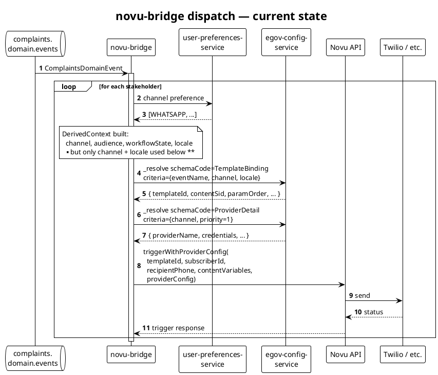
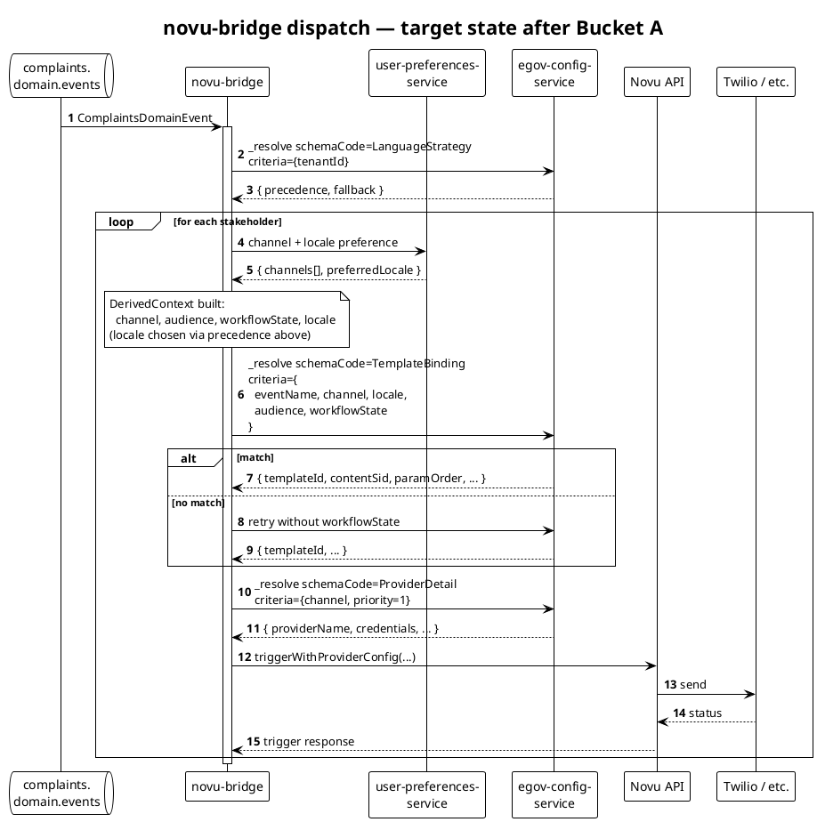

# Novu Adapter — Design vs Implementation Reconciliation

**Date:** 2026-06-20
**Status:** Reference; informs MOZ_007 engineering work
**Audience:** Engineers fixing Bucket A (blocks MOZ_007), tech leads triaging Bucket B and C
**Source docs reviewed:**
- `docs/Novu_Adapter/NovuAdapter_LLD.md`
- `docs/WhatsApp_Bidirectional/HLD.md`
- `docs/WhatsApp_Bidirectional/WhatsAppDesign.md`
- `docs/HLD.md` (Config Service)

**Code surveyed:**
- `backend/novu-bridge/src/main/java/org/egov/novubridge/**`
- `utilities/default-data-handler/src/main/resources/schema/TemplateBinding.json`
- `utilities/default-data-handler/src/main/resources/configData/TemplateBinding.json`
- `backend/novu-bridge/src/main/resources/db/migration/main/V20260217124000__create_nb_dispatch_log.sql`
- `backend/novu-bridge/src/main/resources/db/migration/main/V20260325120000__add_reference_number.sql`
- `backend/novu-bridge/config/Novu-Bootstrap.postman_collection.json`

---

## 1. Purpose

This document compares what the Novu Adapter LLD, the WhatsApp Bidirectional HLD, and the WhatsAppDesign companion specify against what's actually shipping in `novu-bridge` today. It identifies which deviations block MOZ_007, which are documentation drift, and which are unbuilt features the design promised. For deviations that need fixing it provides JSON-Schema diffs, code change locations, DB / index DDL, and PlantUML diagrams of current vs target flows.

This is reference material. The MOZ_007 engineering spec (`2026-06-20-moz_007-workflow-hardcoding-removal.md`) depends on Bucket A from this document being completed before its own ship date.

---

## 2. Percent deviation (executive summary)

| Area | Designed | Implemented | Match |
|---|---|---|---|
| Architecture (services to build) | novu-bridge + user-preferences-service + config-service | all three exist | **~100%** |
| Runtime pipeline (consume → resolve → trigger → log) | full path | full path | **~90%** |
| Recipient + preference resolution | spec'd | matches | **~100%** |
| Persistence (`nb_dispatch_log`) | columns enumerated | matches + 1 extra column | **~95%** |
| Resolve selectors | 4 (`eventName, audience, workflowState, channel`) | 3 passed (`eventName, channel, locale`); only 1 overlaps the spec | **~25%** |
| Template storage model | Config Service is source-of-truth | Novu is source-of-truth; Config Service holds reference only | **~25%** |
| Scope guardrails | WhatsApp-only; Novu for delivery only | Schema accepts SMS / email; Novu owns bodies | **~0%** |
| Policy catalog (event-channels, classification, rate-limits, quiet-hours, retry, language-strategy, consent, keyword-actions, feature-flags) | 11 config types | 2 of 11 built (`TemplateBinding`, `ProviderDetail`) | **~20%** |
| ConfigSets / versioned activation | required | not built | **0%** |
| MDMS vocabulary modules | 2 modules, 7 masters | none seeded | **0%** |
| Observability (metrics list) | 7 metrics enumerated | partial | **~60%** |
| Naming / conventions (transactionId, workflow-id format, field names) | spec'd | drift across the board | **~40%** |

**Unweighted average across rows: 51%. Weighted by impact-on-runtime: 60–70%.**

**Most honest one-liner:** the MVP runtime path is ~90% built. The policy / governance / content-management layer is ~15% built. Overall ≈ 50%, concentrated in the governance/policy layer.

---

## 3. The deviation table

22 rows. Severity reflects impact on MOZ_007 and on production correctness.

| # | Area | HLD / LLD specifies | Impl does | Severity |
|---|---|---|---|---|
| 1 | Channel scope | HLD: WhatsApp outbound only; "No SMS/email delivery via Novu" (§Non-Goals). LLD §2.1: WhatsApp only Phase-1 | `TemplateBinding.json:30` schema accepts `whatsapp, sms, email`; seed bindings exist for SMS too | Medium |
| 2 | Template ownership | WhatsAppDesign §1.3: "Canonical templates live in DIGIT Config Service, not in MDMS and not as primary source in Novu" | Bodies live in **Novu** (configured via `Novu-Bootstrap.postman_collection.json`); config-service holds only `templateId` references | High |
| 3 | Two-tier template model | WhatsAppDesign §5.3.A: split into `OOTB_TEMPLATES` (`{templateCode, locale}` → body) and `OOTB_TEMPLATE_BINDINGS` (`{eventType, channel}` → templateCode) | Single `TemplateBinding` schema collapses both | High |
| 4 | Resolve selectors — `audience` | LLD §6: selectors are `(eventName, audience, workflowState, channel)` | `ConfigServiceClient.java:36-40` passes only `(eventName, channel, locale)`. `audience` is derived in `DerivedContext.java:14` and `DispatchPipelineService.java:296` but never used in resolve | **High — blocks MOZ_007 Option B** |
| 5 | Resolve selectors — `workflowState` | LLD §6: include `workflowState` | Derived (`DispatchPipelineService.java:297`) but never used in resolve | Medium |
| 6 | Config payload field naming | LLD §6: `templateKey, templateVersion, requiredVars[], optionalVars[], paramOrder[], fallbackTemplateKey, fallbackTemplateVersion` | Schema has `templateId, contentSid, paramOrder, requiredVars, novuApiKey, isActive`. Missing: `templateVersion`, `optionalVars`, `fallbackTemplateKey`, `fallbackTemplateVersion`. Extra: `contentSid`, `novuApiKey` per binding | Medium |
| 7 | Provider model | LLD: implicit in Novu. HLD: not mentioned | Explicit `ProviderDetail` schema + `resolveProvider` / `resolveProvidersByChannel` calls (`ConfigServiceClient.java:108-234`) | Low |
| 8 | Policy catalog: `EVENT_CHANNELS` | WhatsAppDesign §5.3.B: `event-channel-enablement` config | Not implemented | Medium |
| 9 | Policy catalog: `EVENT_CATEGORY_MAP` | §5.3.B: `event-classification` (TRANSACTIONAL / CAMPAIGN) | Not implemented | Medium |
| 10 | Policy catalog: `QUIET_HOURS` | §5.3.C: `quiet-hours-policy` | Not implemented | Low |
| 11 | Policy catalog: `RATE_LIMITS` | §5.3.C: `rate-limit-policy` per `{channel?, category?, eventType?}` | Not implemented | Medium |
| 12 | Policy catalog: `RETRY_POLICIES` | §5.3.C: `retry-policy` per channel | LLD §8.2 values are inline constants in code; not config-driven | Low |
| 13 | Policy catalog: `LANGUAGE_STRATEGY` | §5.3.D: `language-strategy` (precedence + fallback) | Hardcoded fallback to `en_IN` (`ConfigServiceClient.java:59-66`); LLD says "fallback to tenant default" | **Medium — blocks Mozambique pt_MZ** |
| 14 | Policy catalog: `CONSENT_POLICY` / `KEYWORD_ACTIONS` / `FEATURE_FLAGS` | §5.3.D, §5.3.E | Not implemented (FEATURE_FLAGS partially via env vars, not config) | Low–Medium |
| 15 | ConfigSets / activation model | WhatsAppDesign §5.1: "ConfigSets are used to activate a coherent set of config versions" | Not implemented; entries are live as soon as written | Medium |
| 16 | MDMS vocabulary modules | WhatsAppDesign §4: `DIGIT-Notification` (Channel, EventCategory, BackoffType, Locale, FeatureFlagName), `DIGIT-UserPreferences` (ConsentScope, KeywordAction) | None seeded; vocabulary lives ad-hoc in schemas and code | Low |
| 17 | Novu workflow identifier convention | WhatsAppDesign §3.1: "Workflow identifier = DIGIT eventType (e.g., `PGR_CREATED`, `PGR_STATUS_CHANGED`)" | Uses dot-form `COMPLAINTS.WORKFLOW.APPLY` slugified to `complaints-workflow-apply` to satisfy Novu's id constraints | Low |
| 18 | `transactionId` convention | WhatsAppDesign §3.3: `<eventId>:<channel>:<recipient>` | Impl uses `eventId` alone | Low |
| 19 | Subscriber strategy | WhatsAppDesign §3.2: DIGIT user UUID preferred, E.164 phone fallback | `UserServiceClient.resolveUserUuid` exists and is used; falls back to mobile | OK |
| 20 | Preference gating | LLD §5 step 5; HLD step 3 | `PreferenceServiceClient` called in `DispatchPipelineService` | OK |
| 21 | `nb_dispatch_log` schema | LLD §9 lists columns | `V20260217124000__create_nb_dispatch_log.sql` matches; `V20260325120000__add_reference_number.sql` adds a `reference_number` column not in the LLD | Low |
| 22 | Bootstrap-collection-as-config-as-code | Not mentioned in HLD or LLD | `novu-bridge/config/Novu-Bootstrap.postman_collection.json` is the de-facto source-of-truth for Novu template bodies | Medium |

---

## 4. Fix plan — three buckets

### Bucket A — must fix before MOZ_007 ships

| # | Title |
|---|---|
| 4 | Add `audience` to TemplateBinding selectors and to ConfigServiceClient.resolveTemplate call |
| 5 | Add `workflowState` to TemplateBinding selectors and to ConfigServiceClient.resolveTemplate call |
| 13 | Replace hardcoded `en_IN` fallback in ConfigServiceClient with a `LANGUAGE_STRATEGY` config lookup |

Detail in §5 below.

### Bucket B — design vs impl reconciliation

| # | Title | Resolution direction |
|---|---|---|
| 1 | Channel scope in TemplateBinding | Update HLD to allow SMS / email; or remove from schema |
| 2 | Template ownership | Update HLD to acknowledge Novu owns bodies; or build OOTB_TEMPLATES in config-service |
| 3 | Two-tier template model | Tied to #2 |
| 6 | Field naming reconciliation | Update LLD; code names win |
| 7 | ProviderDetail schema not in design | Document in LLD as the per-channel provider-credential registry |
| 16 | MDMS vocabulary modules | Either seed per HLD or remove from HLD |
| 17 | Workflow id format | Document slugification rule in HLD |
| 18 | transactionId composition | Code fix — switch to `eventId:channel:recipient` to prevent retry+fan-out collisions |
| 21 | `reference_number` column undocumented | Add to LLD §9 |
| 22 | Postman bootstrap is the deployment artifact | Document in HLD; or replace with in-process bootstrap |

Detail in §7.

### Bucket C — un-built policy catalog (separate epics)

| # | Title | Recommendation |
|---|---|---|
| 8 | EVENT_CHANNELS | Build before second producer module adopts notifications |
| 9 | EVENT_CATEGORY_MAP | Build alongside QUIET_HOURS / RATE_LIMITS |
| 10 | QUIET_HOURS | Defer unless campaigns ship |
| 11 | RATE_LIMITS | Build before scaling — real production risk |
| 12 | RETRY_POLICIES | Move inline constants to config |
| 14 | CONSENT_POLICY / KEYWORD_ACTIONS / FEATURE_FLAGS | Defer; track as a single user-preferences-v2 epic |
| 15 | ConfigSets / activation model | Major architectural addition; needs its own design pass |

Detail in §8.

---

## 5. Bucket A — implementation detail

### 5.1 Add `audience` and `workflowState` as resolve selectors (rows 4, 5)

#### 5.1.1 Schema change — `TemplateBinding`

**File:** `utilities/default-data-handler/src/main/resources/schema/TemplateBinding.json`

Diff:

```diff
 {
   "type": "object",
   "title": "TemplateBinding",
   "$schema": "http://json-schema.org/draft-07/schema#",
   "required": [
     "eventName",
     "channel",
     "templateId",
-    "locale"
+    "locale",
+    "audience"
   ],
   "x-unique": [
     "eventName",
     "channel",
-    "locale"
+    "locale",
+    "audience",
+    "workflowState"
   ],
   "properties": {
     "locale": { ... },
     "channel": { ... },
+    "audience": {
+      "type": "string",
+      "description": "Stakeholder type the template targets (CITIZEN, EMPLOYEE, SUPERVISOR, …). Required; binding is resolved per (event, channel, locale, audience, workflowState)."
+    },
+    "workflowState": {
+      "type": "string",
+      "description": "Application status the workflow has transitioned into. Optional; when absent, the binding matches any state for the given (event, channel, locale, audience)."
+    },
     "isActive": { ... },
     "eventName": { ... },
     ...
   }
 }
```

`audience` is required; `workflowState` is optional so existing entries can continue to match without modification. Uniqueness is the 5-tuple `(eventName, channel, locale, audience, workflowState)` — entries with `workflowState=null` and entries with explicit states coexist; the resolver picks the more specific match (see §5.1.4).

#### 5.1.2 Code change — `ConfigServiceClient.resolveTemplate`

**File:** `backend/novu-bridge/src/main/java/org/egov/novubridge/service/ConfigServiceClient.java:32-40`

Diff:

```diff
 public ResolvedTemplate resolveTemplate(DerivedContext context, String eventName, String module, String tenantId) {
     Map<String, Object> resolveRequest = new HashMap<>();
     resolveRequest.put("schemaCode", "TemplateBinding");
     resolveRequest.put("tenantId", tenantId);
-    resolveRequest.put("criteria", Map.of(
-        "eventName", eventName,
-        "channel", context.getChannel(),
-        "locale", context.getLocale()
-    ));
+    Map<String, Object> criteria = new HashMap<>();
+    criteria.put("eventName", eventName);
+    criteria.put("channel", context.getChannel());
+    criteria.put("locale", context.getLocale());
+    criteria.put("audience", context.getAudience());
+    if (context.getWorkflowState() != null) {
+        criteria.put("workflowState", context.getWorkflowState());
+    }
+    resolveRequest.put("criteria", criteria);
     ...
 }
```

`audience` and `workflowState` are already populated in `DerivedContext` at `DispatchPipelineService.java:296-297` — this is the single code change to start using them.

#### 5.1.3 Resolve precedence

When multiple TemplateBinding entries match the same `(eventName, channel, locale, audience)` — one with a specific `workflowState`, one without — the resolver MUST prefer the more specific entry. Add to `ConfigServiceClient.resolveTemplate`:

1. First attempt: full criteria including `workflowState`.
2. On miss: retry without `workflowState`.
3. On miss: retry with default locale `en_IN` (existing behavior at lines 59-66; will be replaced by Bucket A row 13).

Returns first matching entry. Logs the resolution path at INFO for traceability.

#### 5.1.4 Migration of existing TemplateBinding entries

Every entry already in `Workflow.BusinessServiceExtension` and seed files needs an `audience` value. Two-step migration:

**Step 1.** Backfill: for every existing entry, set `audience = "CITIZEN"` (current implicit default — most existing entries are citizen-facing; verify by inspection).

```sql
-- Run against config-service DB; adapt to the actual table name.
UPDATE config_entries
   SET data = jsonb_set(data, '{audience}', '"CITIZEN"', true)
 WHERE schema_code = 'TemplateBinding'
   AND data->>'audience' IS NULL;
```

**Step 2.** Add EMPLOYEE-targeted entries for transitions that need both audiences. Seed file update — one new entry per `(eventName, channel, locale)` where employee SMS is expected. See MOZ_007 engineering spec §5.4 for the Mozambique list.

#### 5.1.5 DB / index implications

Config-service resolves entries by `(tenant_id, schema_code, criteria)` where `criteria` is a JSON object. With `audience` and `workflowState` joining the criteria, the existing index strategy may need a touch:

```sql
-- If not already present: composite index on tenant + schema (heavy hitter for the resolve path)
CREATE INDEX IF NOT EXISTS idx_config_entries_tenant_schema
  ON config_entries (tenant_id, schema_code)
  WHERE is_active = true;

-- GIN index for JSON containment filters on criteria
CREATE INDEX IF NOT EXISTS idx_config_entries_criteria_gin
  ON config_entries USING GIN (criteria jsonb_path_ops);
```

If config-service stores `data` (entry body) and `criteria` (selector) separately, the GIN index goes on `criteria`. If they're merged, the index goes on the merged JSON. Verify against the live schema at `backend/digit-config-service/src/main/resources/db/migration/main/*.sql` before applying.

#### 5.1.6 Tests

- Unit: `ConfigServiceClient.resolveTemplate` with `audience=CITIZEN` vs `audience=EMPLOYEE` returns different bindings.
- Unit: precedence — entry with explicit `workflowState` wins over entry without.
- Unit: locale fallback still works (until row 13 replaces it).
- Integration: end-to-end dispatch test with two stakeholders of different audiences fetches two distinct templates.

---

### 5.2 Replace hardcoded `en_IN` fallback with `LANGUAGE_STRATEGY` (row 13)

#### 5.2.1 New config schema — `LanguageStrategy`

**File:** `utilities/default-data-handler/src/main/resources/schema/LanguageStrategy.json` (new)

```json
[
  {
    "tenantId": "{tenantid}",
    "code": "LanguageStrategy",
    "description": "Per-tenant locale precedence + fallback for notification template resolution",
    "definition": {
      "type": "object",
      "title": "LanguageStrategy",
      "$schema": "http://json-schema.org/draft-07/schema#",
      "required": ["tenantId", "precedence", "fallback"],
      "x-unique": ["tenantId"],
      "properties": {
        "tenantId": { "type": "string" },
        "precedence": {
          "type": "array",
          "items": { "type": "string" },
          "description": "Ordered list of locale codes to try in order. First match wins. Example: [\"user.preferredLocale\", \"event.context.locale\", \"tenant.defaultLocale\"]"
        },
        "fallback": {
          "type": "string",
          "pattern": "^[a-z]{2}_[A-Z]{2}$",
          "description": "Final fallback locale if every precedence entry yields no template match. Tenant default; not hardcoded."
        }
      }
    },
    "isActive": true
  }
]
```

#### 5.2.2 Seed data — Mozambique

**File:** `utilities/default-data-handler/src/main/resources/configData/LanguageStrategy.json` (new)

```json
[
  {
    "tenantId": "mz",
    "precedence": ["user.preferredLocale", "event.context.locale"],
    "fallback": "pt_MZ"
  },
  {
    "tenantId": "pb.amritsar",
    "precedence": ["user.preferredLocale", "event.context.locale"],
    "fallback": "en_IN"
  }
]
```

#### 5.2.3 Code change — `ConfigServiceClient`

Replace the hardcoded retry at `ConfigServiceClient.java:59-66`:

```diff
- log.warn("No config found for locale={}, attempting fallback to en_IN", context.getLocale());
-
- resolveRequest.put("criteria", Map.of(
-     "eventName", eventName,
-     "channel", context.getChannel(),
-     "locale", "en_IN"
- ));
+ String fallbackLocale = languageStrategyClient.getFallbackLocale(tenantId);
+ log.warn("No config found for locale={}, attempting fallback to {}", context.getLocale(), fallbackLocale);
+
+ resolveRequest.put("criteria", Map.of(
+     "eventName", eventName,
+     "channel", context.getChannel(),
+     "locale", fallbackLocale
+ ));
```

New helper `LanguageStrategyClient.getFallbackLocale(tenantId)` resolves the `LanguageStrategy` config entry for the tenant and returns `fallback`. TTL-cached client-side, same shape as the existing config clients.

#### 5.2.4 Tests

- Unit: `LanguageStrategyClient` resolves `mz` → `pt_MZ`, `pb.amritsar` → `en_IN`.
- Unit: missing `LanguageStrategy` entry for a tenant falls back to global default `en_IN` (graceful degradation matches today's behavior).
- Integration: Mozambique dispatch with a complaint context `locale=pt_PT` falls back to `pt_MZ`, not `en_IN`.

---

## 6. Sequence diagrams

### 6.1 Current state — as built today



### 6.2 Target state — after Bucket A fixes



Differences (1) `LanguageStrategy` lookup once per event (cached); (2) `TemplateBinding` resolve criteria now includes `audience` + `workflowState`; (3) on miss, retry without `workflowState` to honor precedence rules in §5.1.3.

---

## 7. Bucket B — doc / impl reconciliation prescriptions

### Row 1 — Channel scope in TemplateBinding accepts SMS / email
**What:** TemplateBinding's `channel` enum includes `whatsapp, sms, email`; HLD says Novu is WhatsApp-only.
**Resolution:** Update HLD §Non-Goals — remove "No SMS/email delivery via Novu" wording, OR delete `sms` / `email` from the schema and the SMS seed entry. Recommendation: update HLD to legitimize the impl; SMS via Novu is a real product capability the team has built.

### Row 2 — Template bodies live in Novu, not Config Service
**What:** HLD says canonical templates live in Config Service. Reality: bodies live in Novu; Config Service holds `templateId` references.
**Resolution:** Update WhatsAppDesign §1.3. New wording: "For WhatsApp delivered via Novu, template bodies live in Novu; Config Service holds bindings (`templateId`) and provider routing." For non-Novu channels (SMS via egov-notification-sms), bodies live in Config Service inline — see MOZ_007 engineering spec.

### Row 3 — Two-tier template model collapsed into single TemplateBinding
**What:** WhatsAppDesign §5.3.A specifies separate `OOTB_TEMPLATES` and `OOTB_TEMPLATE_BINDINGS`. Impl has one combined `TemplateBinding`.
**Resolution:** Tied to row 2. If template bodies stay in Novu, the OOTB_TEMPLATES schema is moot — delete from the design doc. If bodies move into Config Service (MOZ_007 SMS path), `OOTB_TEMPLATES` and `OOTB_TEMPLATE_BINDINGS` can be sibling schemas there.

### Row 6 — Field naming reconciliation
**What:** LLD says `templateKey`; code says `templateId`. Several other fields missing or renamed.
**Resolution:** Update LLD §6 to match code:
- `templateKey` → `templateId`
- Remove `templateVersion`, `optionalVars`, `fallbackTemplateKey`, `fallbackTemplateVersion` (not built; track as future enhancements if needed).
- Add `contentSid`, `novuApiKey` (impl-only fields).

### Row 7 — `ProviderDetail` not in LLD
**What:** Impl has a `ProviderDetail` schema for per-channel provider credentials, used by `resolveProvider` / `resolveProvidersByChannel`. Not in LLD.
**Resolution:** Add §6.5 to LLD documenting `ProviderDetail`: schema, resolve criteria `{providerName, channel, priority, tenantId}`, payload `{credentials, novuApiKey, isActive, senderNumber}`. Explain rationale (Twilio credentials, per-tenant Novu API keys, multi-provider routing per channel).

### Row 16 — MDMS vocabulary modules
**What:** WhatsAppDesign §4 specifies `DIGIT-Notification` and `DIGIT-UserPreferences` MDMS modules with 7 enum masters. None exist.
**Resolution:** Either seed them (low effort: ~7 small JSON files) for vocabulary governance, OR delete §4 from the design doc and let the schemas enumerate values inline (current state).

### Row 17 — Workflow id format
**What:** Design says `PGR_CREATED`, `PGR_STATUS_CHANGED`. Code uses `complaints-workflow-apply` (dot-form then slugified for Novu's id constraints).
**Resolution:** Update WhatsAppDesign §3.1 with the slugification rule and the dot-form source: "Workflow identifier source = `COMPLAINTS.WORKFLOW.<ACTION>`; slugified by replacing `.` and `_` with `-` and lowercasing to satisfy Novu's `^[a-z0-9-]+$` id constraint."

### Row 18 — `transactionId` composition
**What:** Design says `<eventId>:<channel>:<recipient>`. Code uses `eventId` alone.
**Resolution:** Code fix. In `WhatsappNotifierService` (or wherever `transactionId` is built before the Novu trigger), change to `String.format("%s:%s:%s", event.getEventId(), channel, recipientPhone)`. Critical for idempotency when one event fans out to multiple recipients on the same channel — today, retries on stakeholder 2 collide with stakeholder 1 because Novu dedupes by `transactionId`.

### Row 21 — `reference_number` column undocumented
**What:** `V20260325120000__add_reference_number.sql` added a column not in LLD §9.
**Resolution:** Update LLD §9. Add: `reference_number varchar(64) — provider-assigned tracking id (e.g., Twilio messageSid; populated post-trigger).`

### Row 22 — Postman bootstrap is the config-as-code source for Novu workflows
**What:** Template bodies and Novu workflow definitions live in `novu-bridge/config/Novu-Bootstrap.postman_collection.json`, run as one-time provisioning. Not in any design doc.
**Resolution:** Document in HLD as the deployment-time bootstrap mechanism. Long-term: replace with an in-process bootstrap call from novu-bridge on startup OR a Helm pre-install hook. Either is fine; the Postman collection is fragile (manual, undiscoverable, no diff history).

---

## 8. Bucket C — un-built policy catalog epics

Each is a separate epic; estimates are rough. None should be conflated with MOZ_007.

### Row 8 — `EVENT_CHANNELS` enablement config

**Schema:**
```json
{
  "eventName": "string",
  "tenantId": "string",
  "enabledChannels": ["whatsapp", "sms", "email"],
  "disabledChannels": []
}
```
**Selectors:** `(eventName, tenantId)`.
**Effort:** ~2 dev-days (schema + client + bridge-side gate before dispatch).
**Acceptance:** dispatching an event with no enabled channels for the tenant short-circuits with a `SKIPPED_NO_CHANNEL` outcome in `nb_dispatch_log`.

### Row 9 — `EVENT_CATEGORY_MAP`

**Schema:**
```json
{
  "eventName": "string",
  "category": "TRANSACTIONAL | CAMPAIGN"
}
```
**Selectors:** `(eventName)` global; tenant override optional.
**Effort:** ~1 dev-day.
**Acceptance:** every event consumed by novu-bridge is classified; quiet-hours and rate-limit policies use the classification.

### Row 10 — `QUIET_HOURS`

**Schema:**
```json
{
  "tenantId": "string",
  "windows": [{ "start": "22:00", "end": "06:00", "timezone": "Africa/Maputo" }],
  "exemptions": ["TRANSACTIONAL"]
}
```
**Selectors:** `(tenantId)`; per-channel override optional.
**Effort:** ~3 dev-days (windows + timezone arithmetic + tests).
**Acceptance:** non-exempt events dispatched during quiet hours are deferred to the next window start.

### Row 11 — `RATE_LIMITS` (production-critical)

**Schema:**
```json
{
  "scope": { "tenantId": "string", "channel": "string?", "eventName": "string?" },
  "threshold": 100,
  "burst": 20,
  "windowSeconds": 60,
  "action": "DROP | DEFER"
}
```
**Selectors:** ordered precedence — `(tenantId, eventName, channel)` > `(tenantId, channel)` > `(tenantId)`.
**Effort:** ~5 dev-days (config + Redis-backed token bucket + bridge integration + metrics).
**Acceptance:** sustained dispatch above threshold for any scope triggers the configured action; outcome recorded in `nb_dispatch_log` as `RATE_LIMITED`.

### Row 12 — `RETRY_POLICIES`

**Schema:**
```json
{
  "channel": "string",
  "maxRetries": 3,
  "backoff": { "type": "EXPONENTIAL", "initialMs": 30000, "multiplier": 4 },
  "dlqTopic": "novu-bridge-dlq"
}
```
**Selectors:** `(channel)`.
**Effort:** ~1 dev-day (move LLD §8.2 inline constants to config; no behavior change).
**Acceptance:** retry behavior identical to today, but tunable per channel via config.

### Row 14 — `CONSENT_POLICY` / `KEYWORD_ACTIONS` / `FEATURE_FLAGS`

Bundle into one epic — user-preferences-v2 hardening. Estimate ~10 dev-days. Defer until consent gains a second-channel scope or campaigns ship.

### Row 15 — ConfigSets / versioned activation

**This is an architectural change to config-service**, not a config addition. Out of scope for novu-bridge alone; needs its own design pass that covers:
- ConfigSet entity (a named, versioned collection of `(configCode, selectors)` → entry pointers).
- Activation API (atomic switch of "active" pointer from one ConfigSet to another).
- Rollback API.
- Resolver behavior — resolve goes through the active ConfigSet, not raw entries.

Effort: ~15 dev-days minimum. File as a separate epic owned by the config-service team.

---

## 9. `nb_dispatch_log` column reconciliation

Current schema (live):

| Column | Type | Source |
|---|---|---|
| `id` | uuid PK | `V20260217124000` |
| `event_id` | varchar(64) NOT NULL | `V20260217124000` |
| `module` | varchar(128) NOT NULL | `V20260217124000` |
| `event_name` | varchar(256) NOT NULL | `V20260217124000` |
| `tenant_id` | varchar(256) NOT NULL | `V20260217124000` |
| `channel` | varchar(64) NOT NULL | `V20260217124000` |
| `recipient_value` | varchar(256) NOT NULL | `V20260217124000` |
| `template_key` | varchar(256) | `V20260217124000` |
| `template_version` | varchar(64) | `V20260217124000` |
| `status` | varchar(32) NOT NULL | `V20260217124000` |
| `attempt_count` | int NOT NULL DEFAULT 0 | `V20260217124000` |
| `last_error_code` | varchar(128) | `V20260217124000` |
| `last_error_message` | text | `V20260217124000` |
| `provider_response_jsonb` | jsonb | `V20260217124000` |
| `created_time` | bigint NOT NULL | `V20260217124000` |
| `last_modified_time` | bigint NOT NULL | `V20260217124000` |
| `reference_number` | varchar(64) | `V20260325120000` (not in LLD) |

Status enum values implemented: `RECEIVED`, `SKIPPED`, `FAILED`, `SENT`, `RETRYING`, `DLQ` — matches LLD §9.

**Documentation fix (LLD §9 update):**

```diff
 - `provider_response_jsonb` jsonb
 - `created_time` bigint not null
 - `last_modified_time` bigint not null
+- `reference_number` varchar(64) — provider-assigned tracking id (e.g., Twilio messageSid; populated post-trigger)
```

**Index inventory (live, verify against migrations):**

| Index | Columns | Source |
|---|---|---|
| `uk_nb_dispatch_event_channel` | `(event_id, channel)` UNIQUE | LLD §9 spec |
| `idx_nb_dispatch_status_lmt` | `(status, last_modified_time)` | LLD §9 spec |
| `idx_nb_dispatch_tenant_event` | `(tenant_id, event_name)` | LLD §9 spec |

**Recommended addition** for retry / DLQ queries:

```sql
CREATE INDEX IF NOT EXISTS idx_nb_dispatch_status_attempt
  ON nb_dispatch_log (status, attempt_count, last_modified_time)
  WHERE status IN ('RETRYING', 'FAILED');
```

This narrows the index to the rows the retry worker actually scans.

**Uniqueness fix (Bucket B row 18):** once `transactionId` becomes `<eventId>:<channel>:<recipient>`, the `(event_id, channel)` uniqueness constraint is no longer sufficient — needs `(event_id, channel, recipient_value)`. Migration:

```sql
ALTER TABLE nb_dispatch_log DROP CONSTRAINT IF EXISTS uk_nb_dispatch_event_channel;
ALTER TABLE nb_dispatch_log
  ADD CONSTRAINT uk_nb_dispatch_event_channel_recipient
  UNIQUE (event_id, channel, recipient_value);
```

---

## 10. Effort summary

| Bucket | Items | Total effort | Owner suggestion |
|---|---|---|---|
| A (blocks MOZ_007) | rows 4, 5, 13 | ~3 dev-days + 1 test-day | novu-bridge maintainer |
| B (reconciliation) | rows 1, 2, 3, 6, 7, 16, 17, 18, 21, 22 | ~2 dev-days (mostly doc updates) + 1 dev-day for transactionId fix + uniqueness migration | docs owner + bridge maintainer |
| C (un-built policy catalog) | rows 8–15 | ~35+ dev-days across multiple epics | platform team backlog |

---

## 11. Open questions

- **Row 1 (channel scope):** does the platform team commit to keeping SMS via Novu, or is novu-bridge-via-egov-notification-sms the long-term path for SMS? This affects rows 2, 3 and the MOZ_007 SMS template architecture.
- **Row 7 (ProviderDetail):** is this an intentional design evolution or accidental drift? Needs sign-off before documenting in LLD.
- **Row 15 (ConfigSets):** is versioned activation still on the roadmap, or has the team accepted "live-on-write" as the operating model?

---

**End of reconciliation document.**
