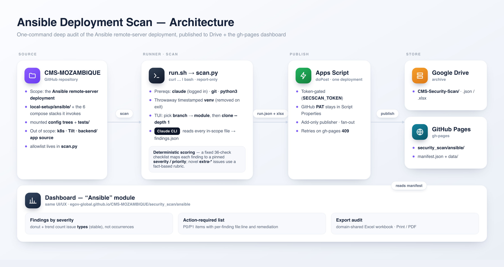
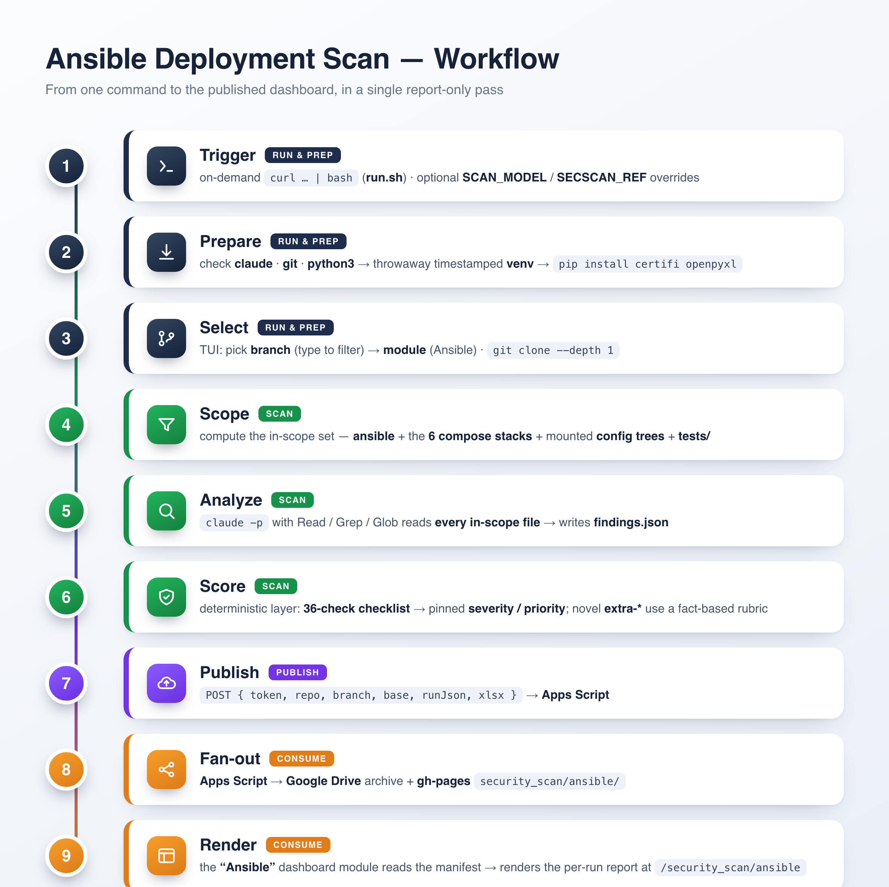

# Architecture & flow



## What this is

A self-contained, **per-repo** security scanner that lives inside the repo it audits. A runner
executes one command; it deep-scans the repo's **Ansible remote-server deployment** using the
**Claude CLI** as the analysis engine, scores findings deterministically, and publishes the
result to a dashboard on the repo's GitHub Pages.

It replaces the older Checkov/KICS/Gemini/Strix CI pipeline. Why: those pattern-scanners miss
application-level issues that require *understanding* the config (an OTP pinned to `123456`, a
root Jupyter with an empty token, anonymous-admin Grafana), produce noisy occurrence counts, and
mislabel severities. One deliberative Claude pass that reads and verifies every in-scope file is
far more accurate, and a deterministic scoring layer on top makes the labels reproducible.

## Components (all in `security_scan/ansible/`)

| File | Role |
| --- | --- |
| `run.sh` | `curl … \| bash` bootstrap: prerequisite checks, timestamped venv, fetch+run, teardown |
| `scan.py` | the scanner: TUI, clone, Claude scan, deterministic scoring, upload |
| `scripts/build_audit_xlsx.py` | builds the Excel audit workbook from a run |
| `requirements.txt` | `certifi`, `openpyxl` (installed into the throwaway venv) |
| `apps-script.gs` | upload endpoint → Google Drive **and** the repo's gh-pages dashboard |
| `dashboard-index.html` | the single-repo dashboard served from gh-pages |
| `README.md` | runner instructions |
| `SETUP.md` | one-time administrator setup |
| `docs/` | this documentation set |

## End-to-end flow



The same nine steps in detail:

```
 runner's terminal
   └─ curl … | bash  (run.sh)
        ├─ checks: claude (logged in), git, python3
        ├─ python venv  ~/.cache/cms-secscan/venv-<timestamp>   (removed on exit)
        ├─ pip install certifi + openpyxl
        └─ python scan.py  </dev/tty            ← TTY reattached so arrow keys work
              ├─ pick BRANCH (filter)  →  pick MODULE (Ansible)
              ├─ git clone --depth 1 <branch>
              ├─ compute in-scope file set  (scope allowlist: ansible + the 6 compose
              │     stacks + mounted config trees + tests)
              ├─ claude -p  (Write/Read/Grep/Glob)  → writes findings.json in the clone
              ├─ build_run(): deterministic scoring + grouping + summary
              ├─ build Excel via scripts/build_audit_xlsx.py
              └─ POST {token, repo, branch, base, runJson, xlsx}  →  Apps Script
                                                                        │
 Apps Script (administrator's Google account, one deployment)                  ▼
   doPost:
     ① Drive:  create  CMS-Security-Scan/<owner>/<repo>/<label>.{json,xlsx}
     ② gh-pages (GitHub Contents API, token in Script Properties):
          - PUT  security_scan/data/<label>.json
          - seed security_scan/index.html once (from this repo's dashboard-index.html)
          - read-modify-write security_scan/manifest.json  (retry on 409)
                                                                        │
 GitHub Pages                                                          ▼
   https://<org>.github.io/<repo>/security_scan/   ← the live dashboard
```

## Why the pieces are shaped this way

- **`curl … | bash` + `</dev/tty`.** A piped bash has the script on stdin, so the child Python
  would have no keyboard. `run.sh` runs `python scan.py </dev/tty` to reattach the real terminal.
- **Throwaway timestamped venv.** No dependency conflicts with the runner's system Python; removed
  on exit (EXIT/INT/TERM trap).
- **Claude writes `findings.json` to a file, not stdout.** Large results wrapped in prose/fences
  used to break stdout parsing; a file write is robust (a hardened text parser is the fallback).
- **The token is never committed.** The endpoint URL is public and harmless on its own; the
  `SECSCAN_TOKEN` gate is supplied at runtime by the runner (token model in `SETUP.md`).
- **Apps Script holds the GitHub write token.** Runners never touch it; the script only ever
  creates/updates under `security_scan/` and never deletes.

## The scan scope

Only files the Ansible deployment actually uses are audited — `local-setup/ansible/**`, the six
compose stacks the playbook invokes, the config trees they mount, and `tests/`. Out of scope:
`k8s/`, Tilt, the base/registry/deploy/db-migrations compose variants, and app source under
`backend/`. The allowlist lives in `scan.py` (`SCOPE_COMPOSE` / `SCOPE_SUBDIRS`).

See **`docs/CONSISTENCY.md`** for the scoring model and what is/ isn't reproducible, and
**`docs/ADDING-A-REPO.md`** to deploy this in another repo.
