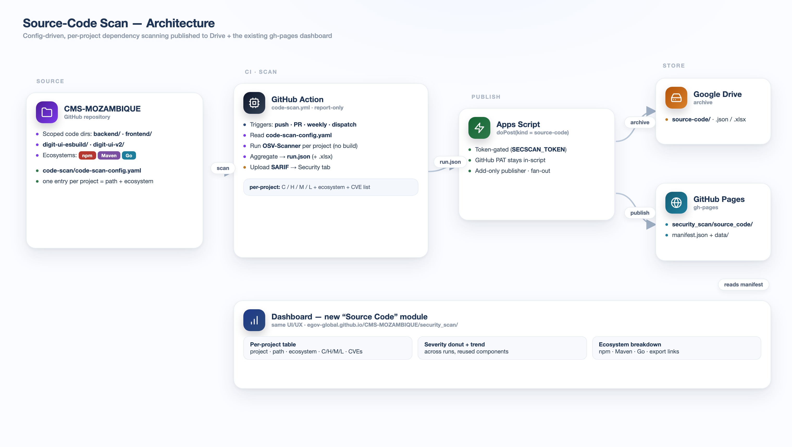

# Code Base module — Architecture

Config-driven, **per-project dependency vulnerability scanning** (OSV-Scanner) for the application
code directories, published to Google Drive + the gh-pages **Code Base** dashboard page
(`/security_scan/code`). Report-only.



## Components

| Piece | Role |
| --- | --- |
| `code-scan-config.yaml` | one entry per project (`path` + `ecosystem`). Adding a service = one line, no workflow change. |
| `scan.py` | reads the config, runs OSV-Scanner per project (Maven · npm · Go, **no build**), resolves a `file:line` reference for every finding, builds `run.json`, and POSTs it to the shared Apps Script with `kind: "source-code"`. |
| `requirements.txt` | `pyyaml`, `certifi`. |
| `../../apps-script.gs` | **shared** upload endpoint. Stores the run on Drive and publishes it to gh-pages under `security_scan/code/` (its own `manifest.json` + `data/`), a separate namespace from the Ansible module. |
| `../../dashboard-index.html` | **shared** dashboard app. The "Code Base" left-nav module renders the per-project report from `security_scan/code/`. |

## Scope

`backend/` · `frontend/` · `digit-ui-esbuild/` · `digit-ui-v2/` (extensible via the config). The
deployment / infra trees are intentionally out of scope — this is the code-base view.

## Data model (`run.json`)

```jsonc
{
  "meta":    { "repo", "branch", "sha", "kind": "source-code", "engine": "OSV-Scanner", ... },
  "summary": { "cve", "cveAll", "projects",
               "bySeverity": { "CRITICAL", "HIGH", "MEDIUM", "LOW" },
               "byEcosystem": { "npm": {...}, "Maven": {...}, "Go": {...} } },
  "projects": [ { "name", "path", "ecosystem", "cve", "bySeverity" } ],
  "findings": [ { "id", "severity", "summary", "ecosystem", "package", "count",
                  "locations": [ { "path", "line", "url" } ] } ]
}
```

## Why OSV-Scanner

It resolves Maven (`pom.xml`), npm (lockfiles) and Go (`go.mod`) directly with **no build step**, is
**directory-scoped**, and its data uses the **same OSV database as OpenSSF Scorecard** — so the counts
reconcile with the Scorecard `Vulnerabilities` check. Trivy is a viable alternative for broader
coverage (IaC misconfig, secrets, container images) but needs a Maven resolve step for Java.

See **[WORKFLOW.md](WORKFLOW.md)** for how the CI job runs it.
