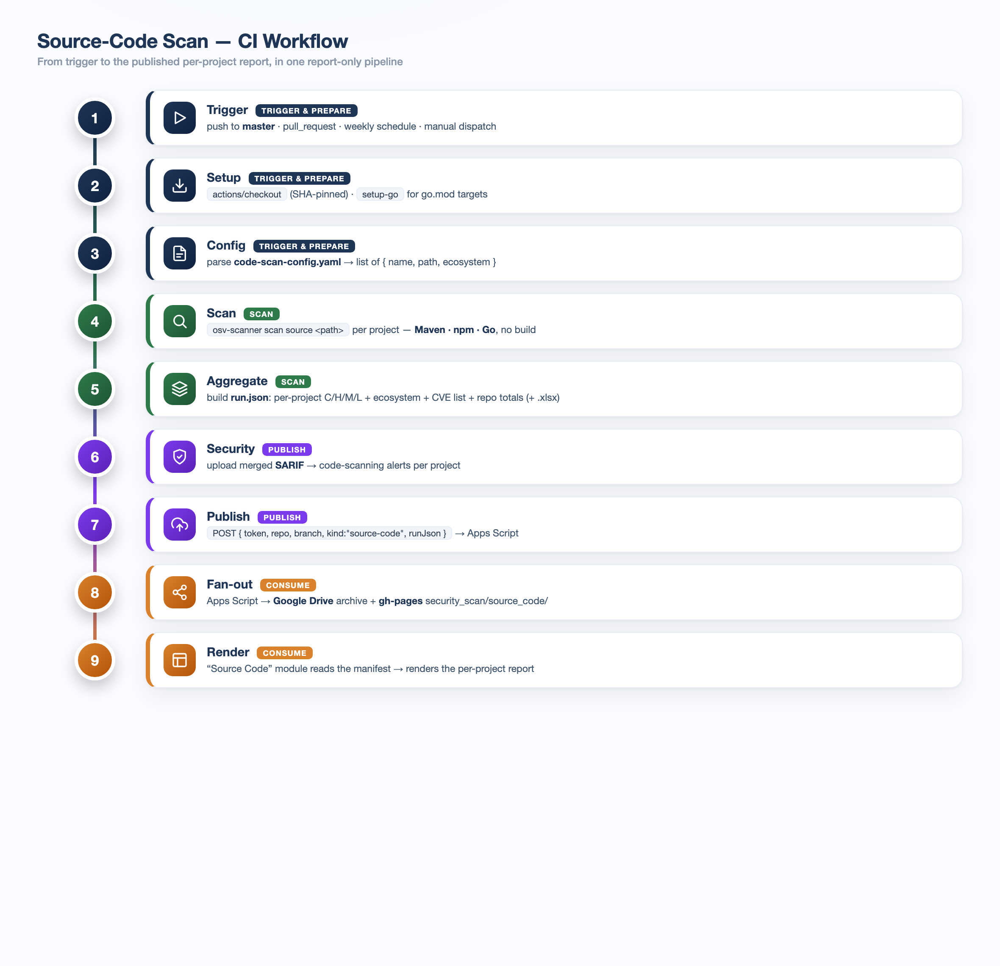

# Code Base module — CI Workflow

The Code Base scan runs entirely in CI as a GitHub Action — `.github/workflows/code-scan.yml`. It is
**report-only** (never fails a build) and needs no local run.

## Triggers

- **`push` to `master`** touching code paths — `backend/**`, `frontend/**`, `digit-ui-esbuild/**`,
  `digit-ui-v2/**`, `security_scan/code-base/**`, or the workflow file.
- **weekly `schedule`** (Monday 02:30 UTC) — catches newly disclosed CVEs even with no code change.
- **manual `workflow_dispatch`** — Actions → *Code-Base Security Scan* → **Run workflow**.

## Steps

1. **Checkout** + **`setup-go`** (for the `go.mod` targets) + **`setup-python`**.
2. **Install OSV-Scanner** (pinned `@v2.5.1`) and the Python deps.
3. **Run `security_scan/code-base/scan.py`**:
   - parse `code-scan-config.yaml` → the project list;
   - `osv-scanner scan source <path>` per project;
   - aggregate into `run.json` (per-project C/H/M/L + ecosystem + each finding's `file:line`).
4. **Publish** — `POST { token, repo, branch, kind: "source-code", runJson }` → the shared Apps Script
   (auth: the `SECSCAN_TOKEN` repo secret).
5. **Fan-out** — the Apps Script writes to Google Drive **and** gh-pages `security_scan/code/`.
6. **Render** — the "Code Base" dashboard module reads that manifest at `/security_scan/code`.

## Prerequisites

- **`SECSCAN_TOKEN` repo secret** (Settings → Secrets and variables → Actions) — the same shared token
  the Apps Script checks. Without it the scan runs but does not upload.
- The shared Apps Script must be deployed with a GitHub PAT that can write to this repo's `gh-pages`
  (see the common **[../../SETUP.md](../../SETUP.md)**).

## Permissions & safety

Top-level `permissions: contents: read` (least privilege). All actions are pinned to commit SHAs.
The scan performs no writes to the repo — it only reads code and posts a report to the shared endpoint.
